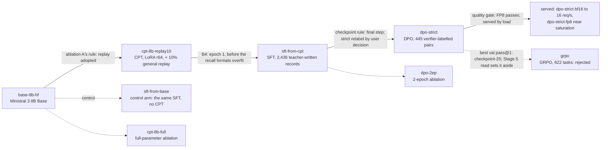

# struct-lm

> Independent project, using only public documents, open weights and open-source tools. Forge is
> described from Mistral AI's public announcement.

The post-training lifecycle a Forge engagement runs, at roughly 1% scale: Ministral 3 8B Base
adapted to US federal structural-engineering documents by continued pre-training, SFT, DPO and
GRPO, then quantized behind a pre-registered quality gate and served with vLLM on one H100.

## 1. Summary

**What was trained.** [`mistralai/Ministral-3-8B-Base-2512`](https://huggingface.co/mistralai/Ministral-3-8B-Base-2512)
on 246 public-domain manuals, reports and design examples from USACE, FEMA, FHWA, NIST and NASA
(20.6M tokens; CPT read the 19.4M-token train split once). Each stage of the shipped chain is a
LoRA adapter (r64) trained on one H100 and merged before the next; two Stage 2 ablations used 2
GPUs. The eval was built and reviewed before any training; its closed-book task was later grown
from 130 to 322 items to cut noise, and every row was rescored. Each read follows a rule written
before its data; those amended after their read are labelled as such, in the table at the top of
[`notes/decisions.md`](notes/decisions.md). A change counts only beyond its noise floor: the
larger of the gap between two seeds of the same run and the metric's standard error.

**The result in one sentence:** CPT put the corpus's facts into the model, SFT taught it to answer
from passages, cite them and decline, and the two later stages each traded some of that knowledge
for sharper sampling without clearing their own bars.

- **CPT's knowledge survives SFT.** On the 155 facts the SFT data never showed, the gold answer's
  tokens are 0.41 nats more probable in the CPT arm than in a control arm that skipped CPT
  (95% CI over items +0.23 to +0.60; two seeds per arm, so 1 df per arm and the margin is
  indicative).
- **SFT beats stock Instruct on the facts it trained on, not on the rest.** Strict closed-book
  accuracy is 28.7% against 11.4% on the 167 seen facts (paired 95% CI +10.8 to +24.6 points).
  - On the 155 unseen facts it is 11.6% against 7.7%. The gap clears the 2.6-point floor, but its
    paired CI (−1.3 to +9.0) includes 0, and the untrained base also scores 11.6%.
- **DPO and GRPO did not clear their primary lines.**
  - Each raised seen pass@1 (8 samples at T 0.7) by about 3 points: DPO by 3.5, in a line added
    after the fact, and GRPO by 3.1.
  - Each paid in calibration, measured on the gold answer's tokens: DPO 0.11 nats seen and 0.38
    unseen, GRPO 0.71 and 1.32.
  - GRPO's checkpoint was set aside. DPO's carried forward, as the SFT model within noise.

<!-- headline-summary:start -->
| run | what it is | closed-book seen (strict) | closed-book unseen (strict) | gold_lp answer, unseen | grounded_acc (judge) | halluc_rate ↓ | GSM8K (no BOS) |
|---|---|---|---|---|---|---|---|
| `base-8b-hf` | base [base format] | 12.6 | 11.6 | -6.36 | 84.3 | 89.5 | 79.3 |
| `instruct-8b` | stock Instruct | 11.4 | 7.7 | -7.71 | 89.8 | 1.3 | 85.5 |
| `sft-from-base` | SFT on the base (control) | 23.9 | 8.4 | -6.20 | 92.6 | 6.6 | 79.2 |
| `sft-from-cpt` | CPT → SFT | 28.7 | 11.6 | -5.89 | 90.7 | 5.3 | 81.4 |
| `dpo-strict` | → DPO: final, served | 30.5 | 11.0 | -6.27 | 92.6 | 4.0 | 80.9 |
| `grpo` | → GRPO (rejected) | 29.9 | 9.7 | -7.54 | 93.5 | 1.3 | 82.0 |
|  | *floor, chat rows: sft-from-cpt vs sft-from-cpt-seed1, or SE* | 3.5 | 2.6 | 0.21 | 2.8 | 3.9 | 2.2 |
<!-- headline-summary:end -->

**Knowledge went in once, at CPT.** CPT is the only stage that raised the probability of unseen
gold answers: +0.66 nats on the answer tokens in Stage 2. Every later stage that can be measured
lowered it, DPO by 0.38 and GRPO by 1.32. Each later stage bought behaviour with some of the
knowledge, and the sharper the optimiser, the larger the trade.

**Serving.** FP8 (W8A8) passed the pre-registered quality gate. bf16 serves up to the measured
16 req/s, with a faster first token; FP8 serves near saturation. At peak goodput one H100 costs
$0.035 per 1,000 requests with FP8 ($0.039 with bf16), against $0.127 for the same tokens through
Mistral Small 4's API. The GPU is the cheaper option above 8.7 sustained requests per second
([`DEPLOY.md`](DEPLOY.md)).

**Final checkpoint: `dpo-strict`** (stage5-final, served bf16 or FP8). The chain carries each
stage's checkpoint forward unless a rule sets it aside. `dpo-strict` is the SFT model within noise
on every primary line, at one measured cost: its unseen answer tokens are 0.38 nats less probable.

## 2. Lifecycle

Row names are the tables' `run` column. Each arrow is labelled with the rule that picked the
checkpoint; dashed arrows are ablations and controls, which inform the chain but don't feed it.

The stage write-ups, each with its curves, tables and what I'd do differently:
[0, the eval and baselines](docs/stage0.md) · [1, the corpus](docs/stage1.md) ·
[2, CPT](docs/stage2.md) · [3, SFT](docs/stage3.md) · [4, DPO](docs/stage4.md) ·
[5, GRPO](docs/stage5.md) · [6, serving](docs/stage6.md) · [every scored row](docs/results.md) ·
[verifiers and judges](docs/verifiers.md).

## 3. Results

Every stage and ablation, base first. How to read the tables:
- **Units:** rates are in %, and `gold_lp` is nats per gold answer (higher is better); ↓ marks
  lower is better.
- **Floors:** a difference counts only beyond the floor row of its format group. Base-format and
  chat-format `gold_lp` don't compare.
- **Scorers:** closed-book accuracy is scored by the strict checker. Judge columns are Mistral
  Large 3 at temperature 0, with rules deciding first. `cite_supported` is reported, not read
  ([why](docs/verifiers.md)).
- **No BOS:** lm-eval ran 5-shot without the chat template and, since Stage 0, without a BOS token.
  Comparisons between rows stand, but absolute scores don't compare with published ones.

Seen and unseen are fixed per fact before SFT. Half the eval's source passages may feed SFT
synthesis and half may not, so knowledge injection and transfer are read apart. This follows
Tülu 3's split between development and unseen evaluations.

**Knowledge (closed-book: no retrieval, no passage in the prompt)**

<!-- headline-knowledge:start -->
| run | what it is | closed-book seen (strict) | closed-book unseen (strict) | identifiers (strict) | gold_lp answer, seen | gold_lp answer, unseen | gold_lp end, seen | gold_lp end, unseen |
|---|---|---|---|---|---|---|---|---|
| `base-8b-hf` | Ministral 3 8B Base [base format] | 12.6 | 11.6 | 7.8 | -6.28 | -6.36 | -0.44 | -0.47 |
| `instruct-8b` | stock Instruct: the bar | 11.4 | 7.7 | 3.1 | -7.31 | -7.71 | -0.70 | -0.87 |
| `mistral-large-3` | frontier reference (API, closed-book only) | 26.4 | 25.8 | 40.6 |  |  |  |  |
| `cpt-8b` | CPT [base format] | 15.6 | 13.6 | 12.5 | -5.84 | -5.68 | -0.40 | -0.45 |
| `cpt-8b-seed1` | CPT, seed 1 [base format] | 13.2 | 12.9 | 12.5 | -5.84 | -5.70 | -0.40 | -0.45 |
| `cpt-8b-replay10` | CPT + 10% replay: the chain's [base format] | 15.0 | 11.0 | 12.5 | -5.93 | -5.70 | -0.43 | -0.46 |
| `sft-from-base` | SFT on the base: control arm | 23.9 | 8.4 | 10.9 | -4.97 | -6.20 | -0.44 | -0.58 |
| `sft-from-base-seed1` | control arm, seed 1 | 23.4 | 7.7 | 14.1 | -4.87 | -6.20 | -0.38 | -0.54 |
| `sft-from-cpt` | SFT on CPT: the chain's | 28.7 | 11.6 | 20.3 | -4.70 | -5.89 | -0.42 | -0.53 |
| `sft-from-cpt-seed1` | SFT on CPT, seed 1 | 25.8 | 11.0 | 23.4 | -4.52 | -5.68 | -0.35 | -0.48 |
| `dpo` | DPO, as-run labels | 30.5 | 11.6 | 20.3 | -4.70 | -6.16 | -0.30 | -0.38 |
| `dpo-seed1` | DPO, seed 1 | 28.7 | 11.0 | 17.2 | -4.85 | -6.28 | -0.35 | -0.45 |
| `dpo-2ep` | DPO 2 epochs (ablation, failed merge gate) | 25.8 | 12.9 | 14.1 | -7.82 | -10.57 | -0.20 | -0.28 |
| `dpo-strict` | DPO, strict labels: final, served bf16 | 30.5 | 11.0 | 18.8 | -4.81 | -6.27 | -0.32 | -0.42 |
| `grpo` | GRPO checkpoint-25 (rejected) | 29.9 | 9.7 | 20.3 | -5.52 | -7.54 | -0.27 | -0.41 |
| `grpo-seed1` | GRPO, seed 1 | 28.7 | 10.3 | 18.8 | -5.52 | -7.65 | -0.30 | -0.45 |
| `dpo-strict-fp8` | served FP8 (passed the gate) | 29.3 | 9.7 | 17.2 | -4.82 | -6.27 | -0.32 | -0.44 |
| `dpo-strict-fp8kv` | FP8 + FP8 KV cache (failed the gate) | 26.4 | 11.6 | 17.2 | -4.87 | -6.33 | -0.33 | -0.45 |
| `dpo-strict-w4a16` | INT4 W4A16 (failed the gate) | 27.5 | 8.4 | 10.9 | -5.12 | -6.70 | -0.30 | -0.36 |
|  | *floor, base-format rows: cpt-8b vs cpt-8b-seed1, or SE* | 2.8 | 2.7 | 4.1 | 0.03 | 0.03 | 0.01 | 0.01 |
|  | *floor, chat rows: sft-from-cpt vs sft-from-cpt-seed1, or SE* | 3.5 | 2.6 | 5.0 | 0.17 | 0.21 | 0.07 | 0.05 |

No numbers in this table: `cpt-8b-full`.
<!-- headline-knowledge:end -->

**Behaviour (with passages: grounded answers, citations, abstention, definitions)**

<!-- headline-behaviour:start -->
| run | what it is | grounded_acc (judge) | cite_valid | cite_supported (judge, reported) | halluc_rate ↓ | false_abstain ↓ | vocab_recall (judge) |
|---|---|---|---|---|---|---|---|
| `base-8b-hf` | Ministral 3 8B Base [base format] | 84.3 | 12.0 | 8.3 | 89.5 | 0.9 | 70.5 |
| `instruct-8b` | stock Instruct: the bar | 89.8 | 83.3 | 78.7 | 1.3 | 7.4 | 78.6 |
| `cpt-8b` | CPT [base format] | 83.3 | 14.8 | 7.4 | 90.8 | 0.0 | 71.0 |
| `cpt-8b-seed1` | CPT, seed 1 [base format] | 79.6 | 10.2 | 3.7 | 93.4 | 0.0 | 70.0 |
| `cpt-8b-replay10` | CPT + 10% replay: the chain's [base format] | 77.8 | 5.6 | 3.7 | 93.4 | 0.0 | 70.0 |
| `cpt-8b-full` | CPT full-parameter (ablation) [base format] | 88.9 | 14.8 | 10.2 | 92.1 | 0.0 | 74.3 |
| `sft-from-base` | SFT on the base: control arm | 92.6 | 100.0 | 87.0 | 6.6 | 0.0 | 83.3 |
| `sft-from-base-seed1` | control arm, seed 1 | 89.8 | 99.1 | 88.0 | 1.3 | 0.9 | 82.9 |
| `sft-from-cpt` | SFT on CPT: the chain's | 90.7 | 100.0 | 86.1 | 5.3 | 0.0 | 83.3 |
| `sft-from-cpt-seed1` | SFT on CPT, seed 1 | 93.5 | 98.2 | 88.0 | 1.3 | 0.9 | 85.7 |
| `dpo` | DPO, as-run labels | 91.7 | 100.0 | 87.0 | 1.3 | 0.0 | 83.8 |
| `dpo-seed1` | DPO, seed 1 | 90.7 | 100.0 | 88.0 | 2.6 | 0.0 | 84.8 |
| `dpo-2ep` | DPO 2 epochs (ablation, failed merge gate) | 90.7 | 100.0 | 85.2 | 1.3 | 0.0 | 85.2 |
| `dpo-strict` | DPO, strict labels: final, served bf16 | 92.6 | 100.0 | 86.1 | 4.0 | 0.0 | 82.4 |
| `grpo` | GRPO checkpoint-25 (rejected) | 93.5 | 100.0 | 88.0 | 1.3 | 0.0 | 84.3 |
| `grpo-seed1` | GRPO, seed 1 | 91.7 | 98.2 | 88.9 | 1.3 | 1.8 | 85.2 |
| `dpo-strict-fp8` | served FP8 (passed the gate) | 90.7 | 100.0 | 85.2 | 5.3 | 0.0 | 82.9 |
| `dpo-strict-fp8kv` | FP8 + FP8 KV cache (failed the gate) | 93.5 | 100.0 | 84.3 | 6.6 | 0.0 | 83.3 |
| `dpo-strict-w4a16` | INT4 W4A16 (failed the gate) | 89.8 | 100.0 | 84.3 | 4.0 | 0.0 | 77.6 |
|  | *floor, base-format rows: cpt-8b vs cpt-8b-seed1, or SE* | 3.7 | 4.6 | 3.7 | 3.3 | 0.0 | 3.1 |
|  | *floor, chat rows: sft-from-cpt vs sft-from-cpt-seed1, or SE* | 2.8 | 1.8 | 3.3 | 3.9 | 0.9 | 2.6 |

No numbers in this table: `mistral-large-3`.
<!-- headline-behaviour:end -->

**General capability and serving**

<!-- headline-general:start -->
| run | what it is | MMLU (no BOS) | GSM8K (no BOS) | HellaSwag (no BOS) | ppl domain val ↓ | ppl general val ↓ | TTFT p50 @1 (ms) | ITL p50 @1 (ms) | latency source |
|---|---|---|---|---|---|---|---|---|---|
| `base-8b-hf` | Ministral 3 8B Base [base format] | 76.7 | 79.3 | 80.1 | 6.88 | 8.15 | 15.3 | 6.60 | 1 sample, GPU not recorded |
| `instruct-8b` | stock Instruct: the bar | 76.1 | 85.5 | 80.1 |  |  | 17.7 | 6.60 | 1 sample, GPU not recorded |
| `cpt-8b` | CPT [base format] | 76.4 | 78.5 | 80.1 | 6.72 | 8.18 | 16.5 | 6.90 | 1 sample, GPU not recorded |
| `cpt-8b-seed1` | CPT, seed 1 [base format] | 76.5 | 78.6 | 80.0 | 6.72 | 8.17 |  |  |  |
| `cpt-8b-replay10` | CPT + 10% replay: the chain's [base format] | 76.6 | 79.1 | 80.0 | 6.72 | 7.97 |  |  |  |
| `cpt-8b-full` | CPT full-parameter (ablation) [base format] | 76.2 | 76.3 | 79.8 | 6.73 | 8.25 |  |  |  |
| `sft-from-base` | SFT on the base: control arm | 76.7 | 79.2 | 79.5 | 7.01 | 8.23 | 18.4 | 6.80 | 1 sample, GPU not recorded |
| `sft-from-base-seed1` | control arm, seed 1 | 76.8 | 79.0 | 79.9 | 7.01 | 8.25 | 17.6 | 6.80 | 1 sample, GPU not recorded |
| `sft-from-cpt` | SFT on CPT: the chain's | 76.6 | 81.4 | 79.4 | 6.87 | 8.06 | 17.8 | 6.80 | 1 sample, GPU not recorded |
| `sft-from-cpt-seed1` | SFT on CPT, seed 1 | 77.0 | 79.2 | 80.0 | 6.87 | 8.07 | 16.2 | 6.90 | 1 sample, GPU not recorded |
| `dpo` | DPO, as-run labels | 76.7 | 81.0 | 79.6 | 6.88 | 8.07 | 17.3 | 6.80 | 1 sample, GPU not recorded |
| `dpo-seed1` | DPO, seed 1 | 76.5 | 80.7 | 79.5 | 6.89 | 8.07 |  |  |  |
| `dpo-2ep` | DPO 2 epochs (ablation, failed merge gate) | 76.8 | 80.6 | 80.2 | 6.97 | 8.11 |  |  |  |
| `dpo-strict` | DPO, strict labels: final, served bf16 | 76.7 | 80.9 | 79.6 | 6.88 | 8.06 | 17.9 | 6.90 | H100, Stage 6 bench |
| `grpo` | GRPO checkpoint-25 (rejected) | 76.7 | 82.0 | 79.8 | 6.93 | 8.09 | 25.5 | 6.70 | 1 sample, GPU not recorded |
| `grpo-seed1` | GRPO, seed 1 | 76.7 | 80.2 | 79.8 | 6.93 | 8.09 |  |  |  |
| `dpo-strict-fp8` | served FP8 (passed the gate) |  |  |  |  |  | 35.2 | 4.70 | H100, Stage 6 bench |
|  | *floor, base-format rows: cpt-8b vs cpt-8b-seed1, or SE* | 0.3 | 1.1 | 0.4 | 0.02% | 0.23% |  |  |  |
|  | *floor, chat rows: sft-from-cpt vs sft-from-cpt-seed1, or SE* | 0.4 | 2.2 | 0.6 | 0.08% | 0.07% |  |  |  |

No numbers in this table: `mistral-large-3`, `dpo-strict-fp8kv`, `dpo-strict-w4a16`.
<!-- headline-general:end -->

The lenient scorer's columns, MMLU's four groups, the train-slice and 2026-report perplexities and
the Stage 0 `base-8b` row are in [`docs/results.md`](docs/results.md).

## 4. Decisions and trade-offs

- **LoRA, not full-parameter CPT.** Full-parameter on 2 GPUs memorised and forgot more for the same
  domain gain. Train-slice perplexity fell 22% (LoRA's fell 8%), general perplexity rose 1.19%
  against LoRA's 0.40%, and GSM8K lost 3.0 points against a 1.1 floor. LoRA isn't free either: its
  0.40% is past the 0.23% floor. Row: `cpt-8b-full`.
- **10% general replay, kept on thin evidence.** The adoption rule fired on MMLU +0.2 against a 0.1
  seed floor, inside MMLU's own 0.34 SE. Its −2.24% general perplexity is in-distribution (FineWeb-Edu
  is both the replay and the general val), and grounded accuracy fell 6.5 points against 3.7. It was
  kept because it is cheap (+10% tokens) and SFT restored the citations. Row: `cpt-8b-replay10`.
- **SFT data as teacher distillation, split by fact.** Mistral Large 3 wrote the questions and,
  with Medium 3.5, the completions, from the passages; every domain record was reviewed against its
  source. No training set holds Claude-written text, so the result measures the method and
  Mistral's teachers, not a third model's style. Rows: `sft-from-cpt` against `sft-from-base`.
- **DPO labels from verifiers, not a judge.** The judge caught 28% of grounded and 9% of
  definition defects against a 0.5 line, so pairs come from verifiers and rules. Relabelling with
  the strict checker (79 of 458 closed-book labels wrong) made `dpo-strict`. Row: `dpo-strict`.
- **GRPO on Magistral's recipe, whose brake never engaged.** DAPO loss, ε_high 0.28, no KL term,
  8 samples on 622 tasks the start solves 1-7 times in 8. With one update per batch the policy
  ratio stays at 1, so clip-higher never bound (`clip_ratio/high` 0 at every step), and entropy
  collapsed by steps 52 and 65. Row: `grpo`.
- **FP8 shipped on a gate, bf16 by load.** FP8 moved no gated line past its Stage 3 floor. FP8 with
  an FP8 KV cache failed on strict seen accuracy (−4.2 against 3.5), and INT4 failed broadly. bf16
  leads on first token up to 16 req/s (21-40 against 39-76 ms p50); FP8 leads at saturation (22%
  more requests per second at 64 concurrent). Row: `dpo-strict-fp8`.

## 5. What changes at Forge scale

Forge's announcement names the same stages in its own words: pre-training on internal data
(continued pre-training, CPT, here), post-training with SFT and DPO, and reinforcement learning,
measured by KPI-aligned evaluation and regression suites.

| | This repo, measured | [Forge](https://mistral.ai/news/forge/), as announced (17 March 2026) |
|---|---|---|
| Data | 246 public PDFs, 20.6M tokens after cleaning and deduplication | "large volumes of internal documentation, codebases, structured data, and operational records" |
| Pre-training | LoRA r64 on the 19.4M-token train split, read once, + 10% general replay | "build domain-aware models by learning from large internal datasets" |
| SFT | 2,436 teacher-written records, every domain record reviewed | "SFT and DPO to encode standards and preferences", with synthetic data generation |
| Preferences | 445 verifier-labelled DPO pairs | (as above) |
| RL | 622 verifiable tasks, synchronous GRPO, stopped by step 65 | RL to "align models and agents with internal policies, evaluation criteria"; RLHF with distillation |
| Evaluation | a frozen 716-item KPI eval, a regression suite, seed floors | "KPI-aligned evaluation", "regression suites", "drift detection" |
| Compute | one H100: 8.8 GPU-hours, $35 of training | not stated |

What the small version surfaced that gets harder at full scale:
1. **The judge comes back.** Here a judge that failed its benchmark could be replaced by verifiers,
   because the tasks had exact answers. Open-ended client tasks don't, so calibrating a judge
   against subject-matter experts' labels becomes the core work.
2. **Verifiers are adversarial objects.** Three holes surfaced in one day, and one was learned. At
   scale every reward needs its fixture suite and an audit of what it rewards before training.
3. **Synchronous GRPO has no brake.** Clip-higher acts on the gap that asynchronous generators open
   between the sampling and the trained policy. Without that gap it did nothing, and both runs
   collapsed.
4. **Replay needs lineage.** The replay data was a public mixture with its Claude-written subsets
   removed by hand. Once replay is client data, which records went into which run has to be
   tracked.
5. **The eval's seen/unseen split needs an owner.** Which facts training may see is a governance
   decision. Here one script enforced it, and a guard test checked it.
6. **Distributed full-parameter CPT is the part this repo didn't do.** It ran one 2-GPU run, at
   +11% tokens per second per GPU over one GPU, with the cause not isolated.

## 6. What went wrong, and what next

**Failures, the costliest first:**
1. **The judge failed its benchmark** (recall 0.28 grounded, 0.09 definition), so Stage 4's
   registered design, judge-labelled pairs, couldn't run.
2. **Three verifier holes:**
   - fragments, found by auditing the labeller's passes;
   - comma lists, found by reading the strict checker's code;
   - years within 2%, found by the hack audit, and the only one learned (10 of 16 late rollouts on
     one task).
3. **Two epochs of DPO displaced the chosen answers:** seen accuracy fell 4.8 points, and the gold
   answer's log-probability fell 3.0 nats seen and 4.3 unseen (`dpo-2ep`).
4. **GRPO collapsed** on entropy, with the imported clip inert (above).
5. **INT4 failed broadly:** GSM8K −6.1 and identifiers −7.8. GPTQ was calibrated on 512 domain
   records only; that this caused the failure is a hypothesis.
6. **lm-eval has sent no BOS since Stage 0,** found in Stage 6. Comparisons hold: GSM8K with one BOS
   is 1,067 of 1,319, the same as without.
7. **Generous scorers ran longer than they should have.** The substring labeller passed 79 wrong
   DPO chosen answers. The eval's lenient scorer read Stages 0 to 4; re-scored strict, rows moved
   0–1.6 points with no change in ordering.

The verifier story, end to end, with the fixtures, is in [`docs/verifiers.md`](docs/verifiers.md):
how the judge was benchmarked, how each hole was found, and the rule the repo ended with. Every
rule now gets an adversarial fixture suite before it becomes a reward. Its passes are read before
its scores are believed.

**Method lessons:**
- **Write stop rules on windows, not points.** One batch's entropy stopped `grpo-seed1` at step 34
  while its 10-step mean sat at 57% of the start.
- **Decompose a metric before comparing it.** `gold_lp`'s end token hid DPO's shift toward
  stopping inside an unchanged total.
- **Put the start's own seed gap into a two-arm floor.** Adding it moved Stage 4's hallucination
  and unseen `gold_lp` lines inside the noise. That amendment came after the read, and is
  labelled so.
- **Say "1 df per arm" out loud.** Two seeds per arm make any SD multiple indicative.
- **Fix the eval's primary metric before the first training run.** Stage 2's −20% perplexity
  target was set for the wrong data scale, and the seen/unseen split that makes Stage 3 readable
  arrived after Stage 2.

**Next, ranked:**
1. **Compute tasks for GRPO:** a formula from a passage, sampled inputs and a checked answer. That
   is a skill RL can sharpen and that transfers; closed-book recall can only be reweighted.
2. **Two updates per batch (μ = 2),** so clip-higher has a ratio to bind; then a KL term if needed.
3. **An NLL anchor on DPO's chosen answers (RPO)** before any longer preference training.
4. **A per-claim support check as the grounded judge,** benchmarked on the same labels first.
5. **INT4 with mixed calibration** (domain plus general records) or AWQ, through the same gate.
6. **A profiler trace of FP8's first token,** which costs 10-20 ms more per request at low load.
7. **A third seed per arm,** to turn indicative margins into intervals.
8. **More varied CPT exposure:** paraphrased restatements of the facts that matter, since one pass
   over 19.4M tokens moved probabilities more than answers.

## 7. Reproduce

[`docs/reproduce.md`](docs/reproduce.md) has one command chain per stage and pins the versions
and dataset hashes. It also says what lives in git, on the Modal volume and on Hugging Face.

| stage | command | training GPU-h | training $ | data (sha256 of its `SHA256SUMS`) |
|---|---|---|---|---|
| 0: the eval and baselines | `make reproduce-stage0` | | | `eval/tasks/` (committed, reviewed) |
| 1: the corpus | `make reproduce-stage1` | | | `data/processed`: 966d1e0c |
| 2: CPT | `make reproduce-stage2` | 5.40 | 21.32 | the corpus |
| 3: SFT | `make reproduce-stage3` | 1.97 | 7.76 | `data/sft`: 70f47740 |
| 4: DPO | `make reproduce-stage4` | 0.37 | 1.49 | `data/dpo/strict`: 5e3effaf |
| 5: GRPO | `make reproduce-stage5` | 1.08 | 4.28 | `data/grpo`: 4db8f7a6 |
| 6: serving | `make reproduce-stage6` | not totalled | | `serve/bench_manifest.json` |
| all training | | 8.82 | 34.85 | |

Dollars are at $3.95 per H100-hour (Modal's list price, checked 2026-10-09). Evals, sampling, the
Stage 6 bench and the Mistral API calls aren't totalled anywhere. Stages 2-6 launch Modal GPU
jobs. The bench pins `gpu="H100!"`, since a plain "H100" request can land on an H200.

**Checking the numbers needs no GPU and no API key.** Every row's generations, lm-eval outputs and
judge verdicts are committed. `make reproduce-score` rescores them, re-runs the strict checker and
pass@k, and regenerates every table and figure. `make audit` checks that each number in this
README's prose appears in a generated table or a named file.

## Who wrote what, and licences

**Who wrote the training data:**
- **SFT:** Mistral Large 3 (`mistral-large-2512`) wrote the questions. It wrote the completions
  with Mistral Medium 3.5 (`mistral-medium-2604`, 25% of them), except the abstain records' fixed
  refusal sentence. 500 general records come from the Tülu 3 SFT mixture, without its three
  Claude-written subsets.
- **DPO:** the pairs are `sft-from-cpt`'s own samples, labelled by verifiers and rules; no judge.
- **GRPO:** the policy's own rollouts, scored by rules.
- **Claude:** through Claude Code, it built the tooling and reviewed generated records against
  their source passages, with keep or drop verdicts only. No training record contains text Claude
  wrote. The hand-written answers in `tests/` are fixtures and are never trained on.

**Licences:**
- **Code:** Apache-2.0 ([`LICENSE`](LICENSE)).
- **Corpus:** works of the US federal government, in the public domain under 17 U.S.C. § 105. The
  PDFs aren't redistributed; [`data/sources.csv`](data/sources.csv) gives each one's URL and
  sha256. ASCE 7, the AISC manual and other copyrighted standards are excluded.
- **Base model:** Ministral 3 8B Base is Apache 2.0, per its model card.
- **Teacher outputs:** Mistral's Commercial Terms of Service assign API output to the customer
  (§3.1). The records are labelled as model-written, as §3.2 asks.
- **Tülu 3 SFT mixture** (Ai2, Lambert et al. 2024): the 500 records in `data/sft/` are ODC-BY-1.0
  as a collection, but its subsets carry their own licences and terms.
  - 8 records are from No Robots, CC-BY-NC-4.0, which is non-commercial.
  - 46 are from withdrawn math set, CC-BY-4.0, generated by another model, whose licence has terms
    for models trained on its outputs.
  - The per-subset counts are in [`docs/reproduce.md`](docs/reproduce.md).
- **FineWeb-Edu** (the CPT replay, ODC-By) isn't redistributed.
- **The fine-tuned weights** are on the Modal volume and not published.
