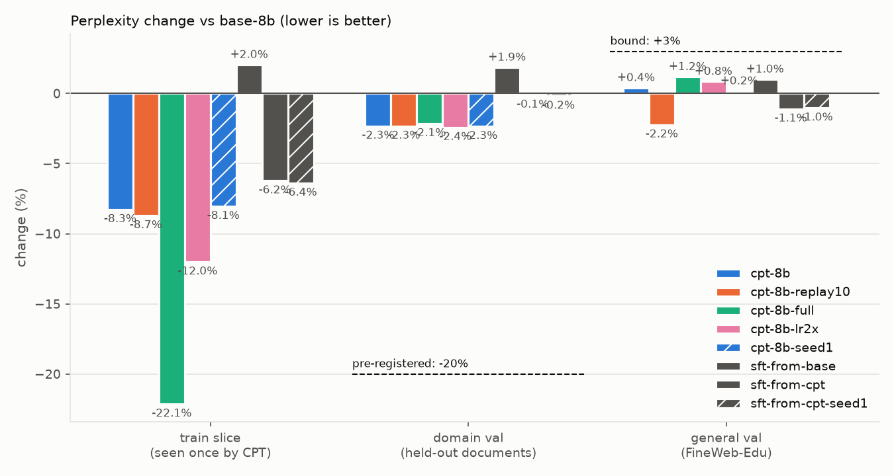

# struct-lm

> Independent project, using only public documents, open weights and open-source tools. Forge is
> described from Mistral AI's public announcement.

Domain adaptation of an open base LLM
([`mistralai/Ministral-3-8B-Base-2512`](https://huggingface.co/mistralai/Ministral-3-8B-Base-2512))
to structural and civil engineering through **CPT → SFT → DPO → GRPO**, with every stage
measured on the same KPI tasks and general-capability regression suite, then quantized
(AWQ) and served with vLLM.

> This README is the write-up. Numbers live in [`results/table.md`](results/table.md);
> the reasoning behind every choice lives in [`notes/decisions.md`](notes/decisions.md).

## The problem

Engineering organisations sit on decades of internal documents: design manuals, inspection
procedures, worked calculation examples, test reports. A general-purpose LLM has seen little of
it. Asked about those documents, it misses the specific values, clauses and vocabulary, invents
plausible answers, and can't point to the page it relied on. Retrieval helps with lookup, but it
doesn't teach the model the domain's language, and it doesn't change what the model does when the
answer isn't in front of it.

Mistral AI's Forge platform, as publicly announced, addresses this by training open-weight models
further on a client's own data across the whole lifecycle: continued pre-training on raw
proprietary text, synthetic data, SFT and preference optimisation, reinforcement learning, and
LoRA where lighter adaptation is enough, all measured against evals tied to the client's KPIs.
The default path starts from an existing checkpoint, not from scratch.

**This repo runs that lifecycle once, end to end, at roughly 1% scale.** Public-domain US federal
structural-engineering documents stand in for a client's private corpus: 246 manuals, reports and
design examples from USACE, FEMA, FHWA, NIST and NASA (20.6M Tekken tokens after cleaning; the KPI
eval tasks are sampled from the 234 training documents, at most 6 source passages per document per
task, and draw on 152 of them).
US federal works carry no licensing risk; copyrighted standards such as ASCE 7 and the AISC manual
are deliberately excluded. The starting checkpoint is Ministral 3 8B Base, from the same model
generation such engagements start from.

The two kinds of training do different jobs:

- **Continued pre-training (CPT)** on raw domain text (next-token loss) teaches knowledge and
  vocabulary. Its risk is forgetting general capability, which is managed by replaying general
  text and keeping the learning rate low.
- **Fine-tuning (SFT → DPO → GRPO)** on a few thousand curated examples teaches behaviour: answer
  from the passages given, cite them, decline when the answer isn't there, and get verifiable
  calculations right.

The goal is not a great model. It is a clean experiment with honest numbers and decisions that can
be defended, measured before and after every stage.

### How success is measured

The eval harness was built before any training, so it couldn't be fitted to a model. The same six
measurements run after every stage, with the base model and the off-the-shelf instruct model as
the first two rows.

| # | What it measures | Task | Metrics |
|---|---|---|---|
| 1 | Closed-book domain knowledge | 325 questions with exact or numeric answers from the corpus (130 until 2026-10-04) | `qa_acc`, by answer kind (`qa_num` / `qa_ident` / `qa_term`) and by SFT half (`qa_seen` / `qa_unseen`), plus the gold answer's log-probability (`gold_lp`) |
| 2 | Answering from given passages, with citations | 108 questions, 4 passages each (gold plus distractors) | `grounded_acc`, `cite_valid`, `cite_supported` |
| 3 | Domain vocabulary | 210 terms to define in one sentence | `vocab_recall` |
| 4 | Declining when the answer isn't there | 76 questions whose 3 passages don't contain the answer | `halluc_rate` (lower is better) |
| 5 | General capability, to catch forgetting | MMLU, GSM8K, HellaSwag, 5-shot | `mmlu`, `gsm8k`, `hellaswag` |
| 6 | Serving cost | vLLM at 1, 8 and 32 concurrent requests | time to first token, inter-token latency, throughput |

Every task item was reviewed against its source passages before any model was run on it: 524 of
1,176 generated items survived the first review (2026-09-27), and 219 of 1,174 the second (195 in
the set after the identifier cap), which grew the closed-book task to cut its noise (2026-10-04,
[`notes/eval_review_rubric.md`](notes/eval_review_rubric.md)). Layout locators (page, table and
figure numbers) are removed by rule, and identifiers are capped at 20% of the task. Items were rejected only for defects: a wrong or unsupported
gold answer, a correct answer the scorer would mark wrong, or a question that tests general
knowledge or trivia instead of the corpus. None was rejected for being hard. Tasks 2–4 are graded
by a pinned judge (Mistral Large 3,
temperature 0, cached verdicts), with anything a rule can decide (missing citations, empty answers,
the exact refusal phrase) decided by rule first.

### Where it starts

Row zero, from [`results/table.md`](results/table.md) (eval v2, 4 October 2026; the original
130-item scores are in [`results/table_v1.md`](results/table_v1.md)):

- **The base model** finds the right answer in the passages 85% of the time but cites correctly only
  10% of the time, and answers 88% of unanswerable questions with something invented.
- **The instruct model** has the behaviour (79% of answers correct and backed by their citations,
  99% of unanswerable questions declined), but it knows no more of the domain closed-book: 9.9%
  against the base model's 12.0% on the 325 questions (12% against 14% on the original 130). For
  scale, Mistral Large 3 answers 28% of them closed-book.
- **Closed-book domain accuracy is low for both.** That is the knowledge gap CPT is meant to close,
  while SFT and DPO bring citation and refusal behaviour up to the instruct model's level or beyond,
  and the general-capability columns stay flat.

### Scope

This is the same pipeline shape as a production engagement at roughly 1% scale. It leaves out the
two parts that make the real thing hard: distributed full-parameter training on billions of
tokens, and enterprise data readiness and governance.

| | This repo | Production engagement |
|---|---|---|
| Base model | Ministral 3 8B, open weights | tens to hundreds of billions of parameters, dense or MoE |
| Corpus | 20M tokens of cleaned public PDFs | billions of tokens: documents, code, databases, images; messy |
| Continued pre-training | LoRA on one GPU, hours | full-parameter, multi-node, days to weeks, replay mix, annealing |
| CPT data | documents concatenated and read once, 20M tokens | the same next-token objective with data engineering around it: rewrites of the facts that matter, per-source mixture and repetition, section-level boundaries |
| Post-training | a few thousand SFT examples, ~1k DPO pairs, a small GRPO run | 10k–100k+ examples reviewed with domain experts, RL with distillation |
| Evaluation | six-measurement harness plus regression suite | the same idea, built with domain experts, with audit lineage |
| Infrastructure | rented GPUs (Modal), open-source stack | isolated environments, data residency, versioned datasets and runs |

What transfers: the stages and their order, the failure modes, the eval design, and the recurring
decisions (how much general text to replay, LoRA versus full-parameter training, how far to trust a
judge). What doesn't: the engineering difficulty at scale.

## Pipeline

```
sources.csv ─ download ─ extract ─ filter ─ dedup ─ pii ─ split ──► CPT ─merge─► SFT ─merge─► DPO ─merge─► GRPO ─merge─► AWQ ─► vLLM
                            │                               │  replay (FineWeb-Edu)                                              │
                            │                               └─ tokenizer_coverage, stats    run_eval + run_lm_eval + bench  ◄────┘
                            └─ extract --chunks ─ make_tasks (eval/tasks/, frozen eval docs only)
```

| Stage | Script | Input data | Signal |
|-------|--------|-----------|--------|
| CPT  | `train/cpt.py`  | `data/processed/{train,val}.jsonl` (+ `replay.jsonl` for the replay ablation) | next-token on domain text |
| SFT  | `train/sft.py`  | `data/sft/{train,sft_val}.jsonl` `{"prompt": [...], "completion": [...]}` | completion-only loss |
| DPO  | `train/dpo.py`  | `data/dpo/{train,val}.jsonl` `{"prompt","chosen","rejected"}` | preference pairs |
| GRPO | `train/grpo.py` | `data/grpo/train.jsonl` `{"prompt","answer"}` | verifiable reward functions |

**Who wrote the training data.** The SFT questions and completions were written by Mistral Large 3
(`mistral-large-2512`) and Mistral Medium 3.5 (`mistral-medium-2604`, 25% of completions), apart from
the abstain records' fixed refusal sentence, and the 500 general replay records come from the Tülu 3
SFT mixture without its Claude-written subsets. Claude, through Claude Code, built the tooling and
reviewed the generated records against their source passages with keep/drop verdicts only: no
training record contains text Claude wrote.

Each stage trains a LoRA adapter; `train/merge.py` folds it into the weights, and the next
stage's `model.init_from` points at the merged directory.

## Quickstart

### Setup

```bash
uv sync --extra data --extra dev            # Mac: data prep, task generation, scoring
uv sync --extra data --extra train --extra eval --extra serve   # Linux GPU box
pre-commit install                          # ruff, uv-lock, shellcheck, file checks
export MISTRAL_API_KEY=...                  # task generation + judge (scripts don't read .env)
```

`quantize` (llm-compressor) conflicts with `serve`/`eval` (compressed-tensors pins), so it gets
its own env: `uv sync --extra quantize`. Modal needs two secrets: `huggingface` (`HF_TOKEN`) and
`mistral` (`MISTRAL_API_KEY`).

### Data and eval tasks

```bash
set -a; . ./.env; set +a                    # HF_TOKEN (tokenizers, FineWeb-Edu), MISTRAL_API_KEY
make data                                   # download → extract → filter → dedup → pii → split → replay → tokenizer_coverage → stats
python data/scripts/extract.py --chunks     # eval input: chunks.jsonl from the pool in eval/tasks/eval_docs.txt (frozen)
python eval/make_tasks.py                   # eval/tasks/*.jsonl + eval_chunk_ids.txt (Mistral Large 3)
```

`make data` writes the Stage 1 corpus to `data/processed/` on the Mac (CPU and network only).
Stage 2 uploads `train.jsonl`, `val.jsonl` and `replay.jsonl` to the Modal volume.
USACE, fema.gov and ROSA P block scripted downloads (Akamai 403). Those PDFs were fetched in a
browser (Chrome DevTools MCP): save them as `data/raw/<slug>.pdf` (or the URL's filename), then
re-run `download.py`, which records each file's sha256 and page count in `data/sources.csv`
(`stats.py` adds each document's final token count).
`chunks.jsonl` is built only from the documents pinned in `eval/tasks/eval_docs.txt`, so adding
sources never resamples the eval; never build SFT data from chunks in `eval/tasks/eval_chunk_ids.txt`,
except the seen half listed in `eval/tasks/sft_seen_chunks.txt` (rule 10, `data/scripts/sft_guard.py`).

### Train

Training runs on Modal (`train/modal_train.py`): one command trains, merges the adapter into the
base (fp32, with the vLLM YaRN fix in the config), and evaluates the merged checkpoint.

```bash
M=.venv/bin/modal
modal volume put --force struct-lm data/processed data/processed   # after any data change
# Stage 2, CPT: train -> merge -> perplexity + lm-eval + KPI generations (latency is opt-in: ,latency)
$M run --detach train/modal_train.py --config train/configs/cpt.yaml --run-name cpt-8b
$M run --detach train/modal_train.py --config train/configs/cpt_replay10.yaml --run-name cpt-8b-replay10
$M run --detach train/modal_train.py --config train/configs/cpt_8b_full.yaml --run-name cpt-8b-full --gpus 2
# the base, re-saved through merge.py so vLLM evaluates it exactly like a fine-tuned checkpoint
$M run --detach train/modal_train.py --model mistralai/Ministral-3-8B-Base-2512 --run-name base-8b-hf --steps merge,eval
# then pull and score locally (next section), and refresh the tables and figures:
.venv/bin/python train/report.py   # results/train_runs.md, results/curves/*.png, README blocks
```

SFT, DPO and GRPO (`train/sft.py`, `dpo.py`, `grpo.py`) are not wired into the Modal app yet.

### Evaluate (repeat per stage, including the base and instruct baselines)

Generation runs on a Modal H100; scoring (rules + Mistral judge) runs locally, off the GPU clock.

```bash
# 1. Modal: lm-eval (MMLU / GSM8K / HellaSwag, 5-shot) + KPI generations
modal run --detach eval/modal_app.py --model mistralai/Ministral-3-8B-Base-2512 \
  --run-name base-8b --generate-only
modal run --detach eval/modal_app.py --model mistralai/Ministral-3-8B-Instruct-2512-BF16 \
  --run-name instruct-8b --chat --generate-only

# 2. Pull the run's outputs off the Modal volume (not results/table.md: it's written locally)
modal volume get struct-lm results/runs/base-8b results/runs/
modal volume get struct-lm results/lm_eval/base-8b results/lm_eval/

# 3. Score locally; appends a row to results/table.md
python eval/run_eval.py --run-name base-8b --rescore --lm-eval-dir results/lm_eval \
  --model mistralai/Ministral-3-8B-Base-2512
```

`--chat` wraps the KPI prompts in the checkpoint's chat template; it is required for Instruct and
later chat checkpoints (SFT/DPO/GRPO), and base models run without it. lm-eval never uses a chat
template, for any checkpoint, so its columns compare across every row (see notes/decisions.md).
`--which lm|kpi` runs one half; `--limit 5 --no-judge --which kpi` is a smoke test.
On a GPU box without Modal, drop `--generate-only` and run `eval/run_eval.py` and
`eval/run_lm_eval.sh` directly (usage at the top of each file).

What each KPI task measures:

| Task | Context | Scoring | Metric |
|------|---------|---------|--------|
| `domain_qa` | closed-book, 3-shot | exact match / numeric ±2% | `qa_acc` |
| `vocab` | closed-book, 3-shot definitions | judge vs reference definition | `vocab_recall` |
| `grounded` | 4 passages (gold, neighbours, off-doc distractor) | citations are provided ids; judge checks support | `cite_valid`, `cite_supported` |
| `adversarial` | 3 related passages without the answer | exact abstain phrase, else judge | `halluc_rate` |

### Quantize, serve, benchmark

```bash
uv sync --extra quantize && bash serve/quantize.sh checkpoints/grpo-merged checkpoints/awq
uv sync --extra serve && bash serve/serve_vllm.sh checkpoints/awq &
python serve/bench_latency.py --label awq   # → results/bench/awq.json
```

On Modal, `--which latency` starts `serve_vllm.sh` in the container, waits for it, and runs the
benchmark (64 KPI prompts, seeded sample across all four tasks; concurrency 1 / 8 / 32):

```bash
modal run --detach eval/modal_app.py --which latency --model mistralai/Ministral-3-8B-Base-2512 --run-name base-8b
# → results/bench/base-8b.json on the volume
```

Override any config value from the CLI:
`python train/sft.py --config train/configs/sft.yaml --override training.learning_rate=1e-4`

## Layout

```
data/     sources.csv (every document: slug, publisher, title, url, sha256, pages, tokens),
          raw/ (PDFs, gitignored), scripts/ (one per step + common.py), processed/ (stats.json
          and tokenizer_coverage.md committed; docs_raw, docs, train/val/replay, dropped_samples,
          duplicates and the eval's chunks.jsonl gitignored)
eval/     make_tasks.py (task generation), tasks/*.jsonl (KPI tasks + rejects.jsonl hand-review
          list + eval_chunk_ids.txt), prompts.py, scorers.py, judge.py, run_eval.py,
          run_lm_eval.sh, modal_app.py (Modal H100 runner)
train/    one script per stage + common.py, merge.py, configs/*.yaml
serve/    quantize.sh (AWQ), serve_vllm.sh, bench_latency.py
results/  all committed: table.md (one row per run), runs/<run>/{generations,scored}.jsonl +
          metrics.json, judge_cache.jsonl, lm_eval/<run>/**/results_*.json, bench/, curves/.
          Anyone can re-score with `run_eval.py --rescore` without a GPU or API key.
notes/    decisions.md: dated log of every choice
checkpoints/  adapters and merged weights (gitignored)
```

## Write-up

### 1. Goal and KPIs
See [The problem](#the-problem) and [How success is measured](#how-success-is-measured) above.

### 2. Data
The corpus card in [`notes/decisions.md`](notes/decisions.md) ("Stage 1 corpus card") has every
number, generated from [`data/processed/stats.json`](data/processed/stats.json) by `stats.py`:
documents and pages per publisher, pages dropped, paragraphs dropped per filter rule, exact and
near-duplicate removal, PII replacements, tokenizer fertility, and the train/val split.

#### Tokenizer coverage

Does Tekken (131k vocabulary) fit this text, or does CPT need new tokens? Measured by
`data/scripts/tokenizer_coverage.py` on the clean corpus against ~1M tokens of FineWeb-Edu as
general English. The full report is
[`data/processed/tokenizer_coverage.md`](data/processed/tokenizer_coverage.md).

| text | tokens per word |
|---|---|
| domain corpus (20.6M tokens) | 1.44 |
| FineWeb-Edu | 1.34 |
| top-500 TF-IDF domain terms | 1.12 |
| the 303 terms in the vocab eval | 1.43 |
| 18 designations and units (`ASCE 7-22`, `kip-ft`, `A709 Grade 50W`, ...) | 3.21 |

- **No vocabulary extension.** The corpus costs only 1.08x the tokens per word of general
  English, and the words that mark the domain (shear, girder, flange, diaphragm) are mostly single
  tokens.
- **Designations fragment, not vocabulary.** Only 34 of 843 term words take 4+ tokens:
  - document numbers and digit strings (`EM 1110-2-2104` is 13 tokens, because Tekken gives every
    digit its own token by design);
  - parenthesised acronyms;
  - hyphenated compounds.

  New embeddings trained on 20M tokens would cost more than those save.
- **Base and Instruct encode identically** (a corpus sample and every term word), so data and
  evals tokenised once serve both checkpoints.

#### Replay slice

To limit forgetting, CPT can mix general text back in. `data/processed/replay.jsonl` is 1.9M Tekken
tokens (10% of train) from FineWeb-Edu, English web text filtered for educational quality, taken as
raw text from the head of its `sample-10BT` stream. Stage 2 runs CPT with and without it and
compares domain val perplexity with the MMLU, GSM8K and HellaSwag regression columns. It is ODC-By
web text, not public domain, so it is rebuilt from Hugging Face rather than committed, and nothing
in the eval comes from it. It is not a random sample (caveats in the corpus card). Its overlap with
the regression benchmarks was measured, below: none beyond stock phrases.

#### Contamination checks

`eval/contamination.py` (CPU, about a minute) measures token 13-gram overlap between what CPT trained
on and everything evaluated against it. The method is GPT-3's (appendix C), counted on Tekken tokens
as in Llama 2. Full tables are in [`results/contamination.md`](results/contamination.md).
- **What dedup already covers:** dedup keeps near-duplicate paragraphs off both sides of the
  document-level split, so this looks for sharing below the paragraph.
- **The matcher works on short items:** text cut from a training document and tokenised on its
  own, as a benchmark item is, comes back 99% matched.

| check | result |
|---|---|
| domain val vs train | 1.5% of val's 13-grams occur in train. A train document shares more with the other 233 (median 2.0%). Three val documents are above 5%, up to 20%, each next to a sibling in train (FHWA HIF-18-044 and -043, FEMA P-1100-2A and -2B, HIF-17-020 and -019). Without them the val gain is -2.33%, unchanged. |
| 2026 reports vs train | at most 1.35% per report, so none is a revision of a corpus document |
| MMLU / GSM8K / HellaSwag vs train and replay | GSM8K and HellaSwag: no 13-gram in either. MMLU: 21 of 14,042 items share one, all stock phrases ("in the 1960s and 1970s"), none half covered. |
| general val vs replay (both FineWeb-Edu) | 0.017% of tokens; disjoint |
| domain_qa few-shot vs the 325 scored items | no shot is a scored question, and the shots share no 13-gram with each other. Answer values recur only by coincidence ("4" in three unrelated items). Two shots come from the same passage as a scored item, qa-0003 and qa-0056, and ask a different fact. |

- **QA items from training documents are by design, not a leak.** The closed-book QA items come
  from training documents on purpose: they measure recall of what CPT read.
- **Why two scored items share a passage with the shots.** `make_tasks.py` takes the shots out of
  the item list, not the passage list. Neither shot gives away the answer:
  - 0.95 d_b in the shot, 75% scored;
  - 4 fiber elements in the shot, L/500 scored.

  The prompt is identical for every checkpoint, so no delta moves, and the frozen set keeps them.
  - **Tagged:** both carry `fewshot_passage_overlap: true` in `domain_qa.jsonl`, for per-item
    analyses to exclude.
  - **Fixed for the next rebuild:** `make_tasks.py --task-version 3` splits the shots off by
    passage. It keeps the v2 ids and only removes items: 322, the two plus one identifier under the
    20% cap.
  - **Guarded:** `tests/test_fewshot.py` fails if a new shared passage appears.

**Where the held-out gain sits.** The val and 2026 perplexity windows, binned by the share of their
tokens inside a 13-gram that also occurs in train (`cpt-8b-replay10` vs `base-8b-hf`; seed 1
agrees):

| tokens shared with train | val windows | val change | 2026 windows | 2026 change |
|---|---|---|---|---|
| under 1% | 157 | -1.70% | 56 | -0.11% |
| 1-5% | 86 | -2.54% | 21 | -0.90% |
| 5-20% | 44 | -3.56% | 5 | -2.00% |
| over 20% | 9 | -5.21% | 0 | |
| all | 296 | -2.33% | 82 | -0.43% |

- **Shared text is learned most, and the gradient is the shape of learning, not of a leak.**
  - The gain rises smoothly with overlap, from -1.70% on windows sharing under 1% of their tokens
    to -5.21% over 20% (Spearman -0.57 over the 296 val windows).
  - A leak would sit in a few copied windows instead.
  - Against that -1.70% floor, verbatim sharing carries about a quarter of the val gain.
  - This is an association: windows with more shared text are also more formulaic (base perplexity
    5.6 against 7.2).
- **It doesn't explain the gap to new documents.** On windows that share almost nothing, val still
  gains -1.70% [-2.25, -1.24] and the 2026 reports -0.11% [-0.46, +0.22]. That is 1.6 of the
  1.9-point gap.
  - The same holds at 8-grams, bin by bin.
  - So what val shares with train lies below copied strings: terms, notation, layout, a series'
    house style.

**Genre is not the explanation either.** The val documents are mostly manuals and the 2026 set is
mostly research reports, so "new documents" could have meant "a different genre". Each document was
labelled from the purpose stated in its front matter (`notes/decisions.md`), then the per-document
perplexity sums were pooled (`eval/ppl_compare.py --docs`; `cpt-8b-replay10`, `cpt-8b` and seed 1
agree within 0.15 points):

| | guidance: manuals, standards, design examples | research reports |
|---|---|---|
| val: the document's series is in train | -2.23% (10 documents) | -3.64% (2) |
| 2026: its series is not | -0.89% (2) | -0.32% (11) |

- **Neither genre explains it.** Val's research reports gain more than its manuals. The two new
  guidance documents (Army bridge load-rating guidance, an FHWA procurement guide) gain less than
  half of what val's manuals gain.
- **What separates the rows is the series.**
  - Every val document's series is in train: USACE EM, FEMA P, NIST GCR 917, FHWA HIF, NASA-STD.
  - None of the 2026 reports' series is: no NIST TN, ERDC or FHWA-HRT document is in train.
  - The two 2026 NIST GCRs are workshop reports from another programme; they gain -0.7% and -0.3%.

  So CPT transfers within a document series, across genre, and barely to a new series.
- **Small cells:** the val reports are two documents, and NIST GCR 12-917-21 is 92% of their tokens;
  HIF-18-047 alone gains -2.54%.

#### Corpus sources

All US federal works (public domain, 17 USC 105); documents carrying a third-party copyright notice
are excluded (`extract.py` flags them for a hand check). The full list is
[`data/sources.csv`](data/sources.csv): slug, publisher, title, URL, and the sha256 and page count
of the exact file processed. `download.py` reads it; each file lands at `data/raw/<slug>.pdf`.
USACE, fema.gov and ROSA P block scripted downloads (Akamai bot filter): get those in a browser,
save them under their slug or URL filename, and re-run `download.py` to hash them. Four FEMA
publications come from other hosts, recorded in the url column:
- P-695 from NIST's NEHRP clearinghouse (FEMA's copy is gone);
- P-751 from WBDG;
- P-58-4 and P-58-5 from ATC, their preparer (fema.gov serves them truncated).

### 3. Training

#### Stage 2: continued pre-training (CPT)

One epoch of plain next-token training on the 19.4M-token train split, starting from
`Ministral-3-8B-Base-2512`: LoRA r=64 (alpha 128) on all seven projections of the language model,
LR 1e-4 with a cosine schedule, 32 windows of 4,096 tokens per optimizer step, so 149 steps (the
"150-step rule"), on one H100. Every number and its reason, the pre-registered success rule and the
ablation rules are in [`notes/decisions.md`](notes/decisions.md); the rough edges hit on the way
(TRL packing that would have kept 5% of the corpus, an EOS token encoded as text, a tokenizer that
broke vLLM's processor) are in [`notes/contributions.md`](notes/contributions.md).

The runs vary one thing each against the main run (`cpt-8b`):

| run | what changes | question |
|---|---|---|
| `cpt-8b-lr2x` | LR 2e-4 | the pre-registered fix when domain perplexity "barely moves" |
| `cpt-8b-seed1` | seed 1 | the run-to-run noise floor every other delta is read against |
| A, `cpt-8b-replay10` | +10% FineWeb-Edu replay | does replay protect general ability, at what domain cost |
| B, `cpt-8b-full` | full-parameter on 2 x H100 (FSDP2) | LoRA vs full fine-tuning on the same model and tokens |
| C, `cpt-8b-fsdp2` | 2 x H100 (FSDP2), 100 steps | throughput scaling and loss agreement |




Generated by `train/report.py` from `results/runs/` and `results/ppl/` (regenerated whenever a
run lands):

<!-- stage2-tables:start -->
##### Training runs

| run | GPUs | steps | tokens | tokens/s | tokens/s/GPU | wall (h) | GPU-h | $ | final train loss | final eval loss |
|---|---|---|---|---|---|---|---|---|---|---|
| cpt-8b | 1 | 149 | 19.4M | 5,939 | 5,939 | 0.95 | 0.95 | 3.74 | 1.769 | 1.906 |
| cpt-8b-replay10 | 1 | 164 | 21.4M | 5,980 | 5,980 | 1.04 | 1.03 | 4.09 | 1.770 | 1.906 |
| cpt-8b-full | 2 | 149 | 19.4M | 13,226 | 6,613 | 0.45 | 0.91 | 3.59 | 1.725 | 1.902 |
| cpt-8b-fsdp2 | 2 | 100 | 13.1M | 13,221 | 6,610 | 0.30 | 0.59 | 2.34 | 1.741 |  |
| cpt-8b-lr2x | 1 | 149 | 19.4M | 5,963 | 5,963 | 0.95 | 0.95 | 3.74 | 1.756 | 1.904 |
| cpt-8b-seed1 | 1 | 149 | 19.4M | 5,914 | 5,914 | 0.97 | 0.97 | 3.82 | 1.753 | 1.906 |

- **cpt-8b-fsdp2 vs cpt-8b:** 2 GPUs give 2.23x the tokens/s (13,221 vs 5,939), so per GPU +11% at the same micro-batch and per-layer checkpointing (peak memory 43 vs 51 GB): the FSDP2 code path, not scaling (finding 6 below); per-step losses differ by 0.038% (median) / 0.171% (max) over 100 steps, the 10-step moving averages by 0.01% on average.

$ at 3.95 per GPU-hour (Modal's H100 list price as assumed, not checked against modal.com/pricing); wall time includes tokenising and model load.

##### Perplexity vs base-8b

| run | domain val | change | nats [95% CI, docs] | general val | change | nats [95% CI, docs] | train slice | change |
|---|---|---|---|---|---|---|---|---|
| base-8b | 6.880 |  |  | 8.151 |  |  | 6.185 |  |
| cpt-8b | 6.720 | -2.33% | -0.0236 [-0.0302, -0.0180] | 8.184 | +0.40% | +0.0040 [+0.0025, +0.0056] | 5.673 | -8.28% |
| cpt-8b-replay10 | 6.720 | -2.33% | -0.0236 [-0.0303, -0.0180] | 7.969 | -2.24% | -0.0226 [-0.0257, -0.0198] | 5.646 | -8.71% |
| cpt-8b-full | 6.732 | -2.15% | -0.0217 [-0.0357, -0.0104] | 8.248 | +1.19% | +0.0118 [+0.0091, +0.0143] | 4.815 | -22.15% |
| cpt-8b-lr2x | 6.713 | -2.42% | -0.0245 [-0.0335, -0.0172] | 8.220 | +0.85% | +0.0085 [+0.0068, +0.0102] | 5.442 | -12.01% |
| cpt-8b-seed1 | 6.718 | -2.35% | -0.0238 [-0.0307, -0.0180] | 8.165 | +0.17% | +0.0017 [+0.0002, +0.0030] | 5.687 | -8.05% |

##### Change vs base-8b-hf, next to the noise

| metric | base-8b-hf | cpt-8b | cpt-8b-seed1 | cpt-8b-replay10 | cpt-8b-full | noise |
|---|---|---|---|---|---|---|
| domain val perplexity | 6.88 | -2.33% | -2.35% | -2.33% | -2.15% | 0.02% |
| 2026-report perplexity | 6.21 |  | -0.51% | -0.43% |  |  |
| general val perplexity | 8.15 | +0.40% | +0.17% | -2.24% | +1.19% | 0.23% |
| train slice perplexity | 6.18 | -8.28% | -8.05% | -8.71% | -22.15% | 0.23% |
| MMLU | 0.767 | -0.4 | -0.2 | -0.1 | -0.5 | 0.3 |
| GSM8K | 0.793 | -0.8 | -0.7 | -0.2 | -3.0 | 1.1 |
| HellaSwag | 0.801 | +0.1 | -0.1 | -0.0 | -0.2 | 0.4 |
| closed-book gold-answer log-prob (nats) | -6.78 | +0.59 | +0.58 | +0.52 |  | 0.08 |
| closed-book qa_acc | 0.120 | +2.5 | +0.9 | +0.9 |  | 1.8 |
| grounded_acc (with passages) | 0.843 | -0.9 | -4.6 | -6.5 | +4.6 | 3.7 |
| vocab_recall | 0.705 | +0.5 | -0.5 | -0.5 | +3.8 | 3.1 |
| halluc_rate | 0.895 | +1.3 | +3.9 | +3.9 | +2.6 | 3.5 |

Perplexity in %, the gold-answer log-probability in nats per answer, the rest in points. noise = max(the seed gap cpt-8b vs cpt-8b-seed1, the metric's standard error: for base-8b-hf, or for the log-probability the paired per-item difference): a change smaller than it is not a result. QA rows are on the 325-item domain_qa (eval v2), so cpt-8b-full, whose weights were deleted, has none.
<!-- stage2-tables:end -->

**Bottom line.** At 20M tokens and one epoch, CPT learns the documents it reads (-8% perplexity) and
almost nothing that transfers to documents it hasn't seen (-0.4% on reports published in 2026).
It does make the facts in the documents it read more likely: closed-book gold answers become about
1.8x more probable (+0.59 nats per answer, both seeds), a gain pass/fail accuracy is too coarse to
resolve at this size.

- **Pushing harder doesn't help.** A higher learning rate and full-parameter training learn the
  documents harder, with 2-4x the forgetting and no held-out gain.
- **What goes forward.** LoRA with 10% replay is the carried-forward checkpoint. A pre-registered
  rule chose it, the rule fired at the edge of the noise, and that is recorded.
- **Why the eval harness matters.** It found a serving bug larger than any training effect.

Every delta below is against `base-8b-hf`, the base evaluated through the same vLLM path as the
fine-tuned checkpoints. Each is read against its noise: the larger of the seed gap (`cpt-8b` vs
`cpt-8b-seed1`) and the metric's standard error.

**Against the pre-registered rules** (`notes/decisions.md`, set before the main run):

| rule | cpt-8b (seed 1) | cpt-8b-lr2x | cpt-8b-full | verdict |
|---|---|---|---|---|
| domain val perplexity down at least 20% | -2.33% (-2.35%) | -2.42% | -2.15% | failed everywhere |
| train/val gap grows under ~10 points over base's 11.2% (over ~25 = memorising) | +7.2 (+6.9) | +12.1 | +28.6 | LoRA passes; lr2x fails; full is memorising |
| general val perplexity up under 3% | +0.40% (+0.17%) | +0.85% | +1.19% | passed everywhere |

**The target was set for the wrong data scale.** Held-out perplexity measures domain transfer, which
continued pre-training produces at the scale of billions of tokens. With a 20M-token client corpus
the realistic goal is knowledge of those documents. That is measured by closed-book QA after SFT,
and it needs repetition or augmentation to stick.

**What Stage 2 established:**
1. **The learnable signal is the documents and their series, not the domain.** A probe
   (`eval/memorization.py`) compared the 246 corpus documents with 13 federal reports published in
   2026, after the base model's release:

   | Documents | Spans the base continues for 32+ tokens verbatim | Base perplexity | Change after CPT (`cpt-8b-replay10`) |
   |---|---|---|---|
   | Train (read once in CPT) | 6 of 3,744, all in-document patterns | 6.00 | -8.3% [-8.6, -7.9] |
   | Val (held out, same series) | 0 of 192 | 5.47 | -4.2% [-5.5, -3.0] |
   | 2026 (never seen) | 0 of 208 | 6.27 | -0.4% [-0.8, 0.0] |

   **How the probe's perplexity is measured.** It is the median over documents of each document's
   first two 4,096-token windows, and the change is per document on the same windows. That is not
   the measurement in the tables above (pooled over all val windows, and a 49-window train slice),
   so only ratios within this table are comparable. On the probe's footing val comes out easier
   than train, the reverse of the main table.

   **What it shows:**
   - **Gain stays within the series.** Every held-out document improves, but the 2026 reports barely
     move, including the closest ones (bridge load rating -0.5%, corroded steel beams -0.4%). That
     roughly 10x ratio between within-series gain and new-document gain is the finding.
   - **What val measures.** The val documents are siblings of train documents (USACE EMs, FEMA
     P-series, NIST 917 briefs, FHWA HIF reports) and share their structure, boilerplate and
     phrasing. So domain val perplexity measures learning within those series; the 2026 set
     measures transfer.
   - **Measured, it isn't copied text or genre** ([contamination checks](#contamination-checks)).
     - Val shares 1.5% of its 13-grams with train, less than train documents share with each
       other.
     - Verbatim sharing carries about a quarter of the val gain.
     - On windows with almost no shared text, val still gains -1.70% against -0.11% for the 2026
       reports.
     - Val's research reports gain -3.6% and its manuals -2.2%, against -0.9% for new guidance
       documents.
     - So CPT transfers within a document series, across genre, and barely to a new series.
   - **Little domain-general structure left.** The base already models this register well (domain
     val 6.9 against 8.2 on web text), so there is little general structure left to learn at this
     scale.
   - **Confirmed over whole documents.** Measured like domain val (`ppl_postcutoff`, all 82
     windows of the 13 reports), CPT moves the 2026 set -0.43% (replay) and -0.51% (seed 1),
     against -2.3% on held-out val.
   - **Caveats:** 13 documents, mostly research reports rather than manuals. A genre split rules
     genre out as the explanation (the table under [contamination checks](#contamination-checks)).
2. **Pushing harder moves the wrong way.** The train slice fell -8% (`cpt-8b`), -12% (LR 2e-4) and
   -22% (full-parameter), while held-out stayed flat each time, between -2.15% and -2.42%.
   - **lr2x:** general-text perplexity rose about 2x as much as the main run's.
   - **Full-parameter:** about 3x the main run's general-text rise, and about 4x its GSM8K loss
     (-3.0 points against -0.7 to -0.8). That GSM8K drop is the one benchmark delta that clears the
     noise (1.1) by a wide margin.
   - **Full-parameter's task gains** on the 130-item eval v1 (`results/table_v1.md`): +3.1 qa_acc
     (noise 3.2) and +3.8 vocab (noise 3.1), at the noise edge. Every one of those items comes from
     a training document, so they are knowledge of what it read. Its weights were deleted before
     the QA task grew, so it has no 325-item QA scores.

   LoRA stays the default: "LoRA learns less and forgets less" (Biderman et al., 2024).
3. **The base hadn't memorised the corpus.** The six "recalled" spans continue patterns set up in
   the prompt, such as `Table D-11` followed by `D-12`. Corpus documents are no easier for the base
   than 2026 documents it cannot have seen: geometric-mean perplexity +3.0%, interval [-8.5, +17.0].
   So pretraining exposure doesn't explain the small gain. A single pass in pretraining can't be
   ruled out: one epoch of our own CPT moves verbatim recall by 0.13 tokens, less than this
   comparison resolves.
4. **Pass/fail scores can't see Stage 2; the gold answer's probability can.** On the 325-item
   closed-book task (eval v2), qa_acc moves +2.5, +0.9 and +0.9 points for the three LoRA runs,
   against a noise of 1.8. The log-probability of the gold answer (`gold_lp`, per item, paired
   against `base-8b-hf`) moves clearly:

   | Run | Change in `gold_lp`, nats per answer [95% CI] | Items more likely |
   |---|---|---|
   | `cpt-8b` | +0.59 [+0.45, +0.75] | 70% |
   | `cpt-8b-seed1` | +0.58 [+0.44, +0.74] | 71% |
   | `cpt-8b-replay10` | +0.52 [+0.38, +0.66] | 68% |

   - **The seeds agree:** the two seeds differ by 0.007 nats.
   - **Numbers move least.** Per answer token, CPT moves values +0.06 nats, identifiers +0.13 and
     terms +0.15.
   - **What it is:** every eval item comes from a document CPT read, so this is the closed-book
     counterpart of the -8% train-slice perplexity: knowledge of what it read, not transfer.
   - **The end-marker fix:** the answer is scored with the end token the prompt uses after every
     answer ("\n\n"). The first measurement used a lone "\n", which never follows an answer in
     the prompt and made CPT look worse (`notes/decisions.md`).
   - **The other task scores** (grounded, citations, hallucination) need instruction following,
     which a base model lacks, and swing 4-5 points between seeds; they are Stage 3 metrics.
5. **Replay was adopted on a rule that fired at one noise unit; it's kept.** Mixing in 10%
   FineWeb-Edu left domain perplexity identical and brought the MMLU dip to -0.1 from -0.4. That
   margin is about one noise unit (0.3), so the pre-registered rule fired on noise; the flaw is
   recorded in `notes/decisions.md`. Its general-text perplexity fell 2.2%, but that slice is also
   FineWeb-Edu, so it measures in-distribution training, not protection. The 6.5 grounded and 6.4
   cite_valid points it "cost" are probably not a real cost:
   - they measure a base model's citation formatting, which SFT overwrites completely;
   - one seed alone moved grounded accuracy by 4.6 points.
6. **C: two GPUs reproduce one-GPU training step for step, at 2.23x the tokens/s.** Per-step loss
   is within 0.04% (median), and both runs see the same batches. Per GPU that is 6,610 against
   5,939 tokens/s (+11%).
   - **Matched:** micro-batch 4, and every decoder layer checkpointed (non-reentrant).
   - **Not memory-bound:** the one-GPU run peaked at 51 GB of 80.
   - **Different, so the +11% is not isolated by a run:** the code path. FSDP2 casts parameters to
     bf16 and uses its own checkpoint wrapper; the one-GPU run uses the Trainer's.
   - **Full-parameter vs LoRA cost:** on two GPUs, full-parameter matched LoRA's GPU-hours (0.91 vs
     0.95) despite about 1.33x the FLOPs per token. At roughly 8N against 6N FLOPs per token with
     checkpointing (N ≈ 8B, attention ignored), that is about 43% of H100 bf16 peak for full against
     about 30% for LoRA. LoRA's FLOP saving doesn't turn into speed; it is plausibly lost to the
     adapters' many small kernels, which nobody has profiled.
7. **The eval harness found a bug larger than any training effect.** vLLM 0.29 runs any HF-format
   Ministral 3 checkpoint, which includes every fine-tuned one, at the wrong attention temperature.
   - **Mechanism:** its YaRN code drops the config's `mscale` / `mscale_all_dim` keys and scales
     attention by 1.28.
   - **Cost:** on untouched base weights, 4.8% perplexity, 3.1 MMLU points, 6.1 GSM8K points and
     19.5 grounded points. It first made CPT look like it had wrecked MMLU and grounding.
   - **Culprit:** vLLM's reading of the config, not transformers' re-save or `merge.py`. Mistral's
     own `config.json` ships those keys.
   - **Fix:** `merge.py` writes `apply_yarn_scaling: false`, which matches transformers and
     Mistral's native path to five decimals. The repro and the upstream fix are in
     [`notes/contributions.md`](notes/contributions.md); the issue is not filed yet.

#### What I would do differently

Written after Stage 2 and before Stage 3's training, ordered by how much each would have changed the
result. Most of it is knowledge Stage 2 produced. The evidence for each item, and the rule it became,
is in [`notes/decisions.md`](notes/decisions.md) (2026-10-05 retrospective).

1. **Build the sensitive metric before the intervention.** Stage 2 was first read on a 130-item
   pass/fail task with a 3-point standard error. Its real effect (+0.59 nats of gold-answer
   log-probability, 70% of items up) showed only once `gold_lp`, the seen/unseen halves and the
   325-item set existed. All three belonged in Stage 0, a day's work moved a week earlier, and the
   right pre-registered target was `gold_lp` on facts from the documents read, not a 20% drop in
   held-out perplexity.
2. **Run a no-op control through the eval path before any training.** The base re-saved through
   `merge.py` and evaluated like a fine-tuned checkpoint was built only after `cpt-8b` seemed to lose
   3.7 MMLU points, and it exposed the YaRN bug that outweighed every training effect. On day one it
   would have cost one eval pass (about half an H100-hour), because an instrument has to read zero
   before it measures.
3. **Augment the facts that matter instead of reading them once.** One pass gives each value about
   one exposure, and values moved least (+0.06 nats per token against +0.13-0.15). QA and paraphrase
   rewrites of the 197 eval-seen chunks mixed into the CPT stream were affordable (about 1,000 API
   calls) and would have made Stage 2 a knowledge-injection test; Stage 3 now does the
   instruction-data version.
4. **Ablate along the axis the goal lives on.** The goal was knowledge, but the ablations asked about
   forgetting (replay, predicted null and null) and parameterisation (full vs LoRA). Epochs (1 vs 3)
   and augmentation (0 vs K rewrites), at about one H100-hour per LoRA epoch, were the informative
   runs; full-parameter and the 2-GPU run taught the engineering, and replay answered a question the
   pre-registration had already answered.
5. **Judge CPT by the downstream number.** Whether CPT was worth doing is SFT-from-CPT against
   SFT-from-base, not perplexity. That comparison should have been written into Stage 2's decision,
   which had no branch for leaving CPT out and picked the checkpoint on perplexity and MMLU; it is
   now Stage 3's control.
6. **Put boundaries where the text has them.** One EOS per manual (234 in 19.4M tokens) is the
   likely reason `cpt-8b` runs to the 256-token cap where the base stops after ~28 tokens.
   Section-level units with their own EOS would have kept ends common at no GPU cost, and packing
   whole units would also stop windows from starting mid-sentence; it surfaced only in the latency
   table.
7. **Choose the "new documents" set before training, matched to the corpus.** The 2026 reports were
   sourced after Stage 2, and 11 of 13 are research reports against a corpus of manuals. A genre
   split made afterwards rules genre out, but rests on two documents. Post-cutoff manuals from the
   same publishers, with series both in and out of train, chosen before training, would have made
   the -0.4% unarguable.
8. **Hygiene rules from day one.** Adapters kept, no checkpoint with a table row deleted, a paced
   API client instead of retry-on-429, a judge-cache guard. Each was written after a loss: the
   full-parameter run's weights (and with them its 325-item QA scores), worker time asleep or
   retrying, and 50 re-judged items.
9. **Calibrate every judge rubric before it labels anything.** The grading judge was hand-checked at
   Stage 0, but the SFT judge, a new rubric labelling training data, went straight to 4,020
   examples. A full-passage audit then found 18% of what it kept defective, every defect a framing
   error it had passed; 40 items with known defects would have shown that first.

#### Stage 3: supervised fine-tuning (SFT)

_In progress: the runs and their reading follow the pre-registration in
[`notes/decisions.md`](notes/decisions.md) (2026-10-06, Stage 3b). Tables below are generated by
`train/report.py`._

<!-- stage3-tables:start -->
<!-- stage3-tables:end -->

### 4. Results

Every scored checkpoint, from [`results/table.md`](results/table.md) (copied here by
`train/report.py`), on eval v2: domain_qa has 325 items, the other tasks are unchanged. The
130-item tables are frozen in [`results/table_v1.md`](results/table_v1.md) (as published with
Stage 2) and [`results/table_v1.1.md`](results/table_v1.1.md) (current scorer). Stage 2 rows are
base models, scored without `--chat`.

**Reading the closed-book numbers.** The `qa_*` and `gold_lp` columns ask for facts from specific
pages of the manuals (a value, a document or article number, a term) with no retrieval and no
passage in the prompt.
- **The gap is the point.** With passages from the same documents in the prompt (the grounded
  task), the base model answers 84% correctly; closed-book, 12%. That gap is the knowledge the
  documents hold and the model doesn't, and these columns measure what training does to it.
- **For scale:** Mistral Large 3 answers 28% of the same 325 questions closed-book (row
  `mistral-large-3`, through the API, closed-book only): 45% of identifiers, 25% of values and 18%
  of terms. On SimpleQA, whose facts are far more common, frontier models score 30-40%.
- **The scores are knowledge, not scoring:** a hand audit of 169 wrong answers found 2 scoring
  errors, both fixed.
- **The column to watch is Stage 3's seen half.** SFT synthesis supplies exposures to those facts;
  the unseen half shows whether anything transfers.

- **Task scores** come from the frozen eval, with judge columns scored locally:
  - `qa_num`, `qa_ident` and `qa_term` split `qa_acc` by answer kind (`eval/qa_rules.py`):
    values, identifiers (document ids and article numbers) and terms, which include everything
    else. A hand audit of 169 misses found 2 scoring errors, both fixed, so the low scores are
    genuine.
  - The `_seen` / `_unseen` columns split `qa_acc` and `vocab_recall` by whether Stage 3's SFT
    synthesis may use the item's source chunk (`eval/sft_split.py`). Before Stage 3 nothing is
    seen, so the two halves (167 and 158 QA items) are a null check.
  - `cpt-8b-full` and the Stage 0 `base-8b` have no QA scores on v2. Full's weights were deleted
    before the task grew, and `base-8b-hf` supersedes the Stage 0 row.
- **Gold-answer log-probability** (`gold_lp`, nats per answer, higher is better,
  `eval/gold_lp.py`) is the continuous companion to `qa_acc` on the same items. Instruct is scored
  in its chat format, so its value isn't comparable to the base-format rows.
- **Benchmarks** are from lm-eval: 5-shot, never with the chat template.
- **Perplexity** is from `eval/perplexity.py` (lower is better). `ppl_postcutoff` covers the 13
  federal reports published after the base model.

<!-- results-table:start -->
Items per task: domain_qa 325, grounded 108, vocab 210, adversarial 76, qa_number 222, qa_identifier 65, qa_term 38.

**Closed-book knowledge: no retrieval, no passage in the prompt; questions about facts on specific pages of the manuals (gold_lp: nats per answer, higher is better)**

| run | gold_lp | gold_lp_seen | gold_lp_unseen | qa_acc | qa_num | qa_ident | qa_term | qa_seen | qa_unseen |
| --- | --- | --- | --- | --- | --- | --- | --- | --- | --- |
| base-8b-hf | -6.777 | -6.722 | -6.835 | 0.120 | 0.144 | 0.077 | 0.053 | 0.126 | 0.114 |
| instruct-8b | -8.271 | -8.008 | -8.549 | 0.099 | 0.126 | 0.031 | 0.053 | 0.114 | 0.082 |
| cpt-8b | -6.186 | -6.237 | -6.133 | 0.145 | 0.167 | 0.123 | 0.053 | 0.156 | 0.133 |
| cpt-8b-seed1 | -6.193 | -6.236 | -6.148 | 0.129 | 0.144 | 0.123 | 0.053 | 0.132 | 0.127 |
| cpt-8b-replay10 | -6.262 | -6.356 | -6.162 | 0.129 | 0.144 | 0.123 | 0.053 | 0.150 | 0.108 |
| mistral-large-3 |  |  |  | 0.280 | 0.248 | 0.446 | 0.184 | 0.275 | 0.285 |

**With the passages: grounded answers and citations (4 passages given), abstention when the passages lack the answer (halluc_rate, lower is better), and definitions**

| run | grounded_acc | cite_valid | cite_supported | halluc_rate | vocab_recall | vocab_seen | vocab_unseen |
| --- | --- | --- | --- | --- | --- | --- | --- |
| base-8b-hf | 0.843 | 0.120 | 0.083 | 0.895 | 0.705 | 0.713 | 0.697 |
| instruct-8b | 0.898 | 0.833 | 0.787 | 0.013 | 0.786 | 0.802 | 0.771 |
| cpt-8b | 0.833 | 0.148 | 0.074 | 0.908 | 0.710 | 0.693 | 0.725 |
| cpt-8b-seed1 | 0.796 | 0.102 | 0.037 | 0.934 | 0.700 | 0.713 | 0.688 |
| cpt-8b-replay10 | 0.778 | 0.056 | 0.037 | 0.934 | 0.700 | 0.713 | 0.688 |
| cpt-8b-full | 0.889 | 0.148 | 0.102 | 0.921 | 0.743 | 0.733 | 0.752 |
| base-8b | 0.852 | 0.130 | 0.102 | 0.882 | 0.719 | 0.723 | 0.716 |

**General benchmarks (5-shot, no chat template) and perplexity (lower is better)**

| run | mmlu | mmlu_stem | mmlu_hum | mmlu_soc | mmlu_other | gsm8k | hellaswag | ppl_train | ppl_domain_val | ppl_general_val | ppl_postcutoff |
| --- | --- | --- | --- | --- | --- | --- | --- | --- | --- | --- | --- |
| base-8b-hf | 0.767 | 0.733 | 0.704 | 0.862 | 0.803 | 0.793 | 0.801 | 6.18 | 6.88 | 8.15 | 6.21 |
| instruct-8b | 0.761 | 0.735 | 0.691 | 0.854 | 0.802 | 0.855 | 0.801 |  |  |  |  |
| cpt-8b | 0.764 | 0.729 | 0.699 | 0.857 | 0.804 | 0.785 | 0.801 | 5.67 | 6.72 | 8.18 |  |
| cpt-8b-seed1 | 0.765 | 0.727 | 0.699 | 0.861 | 0.809 | 0.786 | 0.800 | 5.69 | 6.72 | 8.17 | 6.17 |
| cpt-8b-replay10 | 0.766 | 0.730 | 0.707 | 0.856 | 0.806 | 0.791 | 0.800 | 5.65 | 6.72 | 7.97 | 6.18 |
| cpt-8b-full | 0.762 | 0.729 | 0.692 | 0.860 | 0.806 | 0.763 | 0.798 | 4.82 | 6.73 | 8.25 |  |
| base-8b | 0.768 | 0.732 | 0.707 | 0.862 | 0.805 | 0.794 | 0.801 | 6.18 | 6.88 | 8.15 |  |
<!-- results-table:end -->

**Stage 2 (CPT) earned little.**
- **Perplexity:** held-out perplexity fell 2.3%, and documents published in 2026 gained 0.4%.
- **Task scores:** no pass/fail score moved outside the noise.
- **Gold answers:** closed-book gold answers to facts from the documents it read became about 1.8x
  more probable (`gold_lp` +0.59 nats per answer), which SFT can build on.
- **Why `cpt-8b-replay10` goes forward:** LoRA with replay costs almost nothing in forgetting.

_Stage 3 onward: to follow._

### 5. Serving

vLLM on one H100, `serve/bench_latency.py` (64 streamed requests per concurrency level, 256 output
tokens max; generated by `train/report.py` from `results/bench/`). `base-8b` and `instruct-8b` run
Mistral's native vLLM path, `base-8b-hf` and `cpt-8b` the HF path with the YaRN fix:

<!-- serving-table:start -->
| run | TTFT p50 (ms) | ITL p50 (ms) | E2E p50 (ms) | tok/s @1 | tok/s @8 | tok/s @32 |
|---|---|---|---|---|---|---|
| base-8b | 17.7 | 6.6 | 187 | 143 | 875 | 1,922 |
| instruct-8b | 17.7 | 6.6 | 320 | 139 | 677 | 1,144 |
| base-8b-hf | 15.3 | 6.6 | 180 | 145 | 896 | 1,967 |
| cpt-8b | 16.5 | 6.9 | 1,753 | 141 | 922 | 2,166 |
<!-- serving-table:end -->

- **The two paths serve the base at the same speed** once the YaRN fix is in: per-token latency
  6.6 ms either way, end to end 180 vs 187 ms.
- **`cpt-8b`'s end-to-end time is not a latency result.** It decodes at the same 6.6-6.9 ms per
  token as the base. It runs to the 256-token cap, though, where the base stops after ~28 tokens,
  hence the ~10x end-to-end time and the higher throughput (more tokens per request).
  - **Cause:** the corpus holds one EOS per whole manual, 234 in 19.4M tokens. Section-level units
    would likely have avoided it (item 6 of
    [What I would do differently](#what-i-would-do-differently)).
  - **Fix:** SFT's short answers restore stopping, and Stage 3 checks output length.
  - **Use:** compare the row only with this note. Deployment latency is measured on the SFT'd
    checkpoint.
- _Stage 6 adds the AWQ checkpoint of the SFT'd model: its quality delta against bf16 and its
  latency at 1 and 32 concurrent requests._

### 6. What I'd do next

**From Stage 2:**
- **Split Stage 3's eval into seen and unseen halves.** Report `domain_qa` and `vocab` in two
  halves: items whose source chunk fed an SFT example (seen) and items whose chunk did not (unseen).
  Hold a deliberate share of the eval's source chunks out of SFT synthesis so the unseen half
  exists. Seen measures knowledge injection, unseen measures transfer. One pooled number would be
  as uninterpretable as Stage 2's single held-out perplexity.
- **The bar is `instruct-8b`:** grounded 0.898, cite_valid 0.833, cite_supported 0.787, halluc
  0.013, vocab 0.786, qa 0.099 (eval v2). Match it on grounding and beat it on both qa halves. Read
  halluc_rate next to grounded_acc, so a low hallucination rate means abstaining on unanswerable
  questions and not refusing across the board.
- **Knowledge of a 20M-token corpus needs repetition or augmentation,** such as paraphrased
  restatements or QA rewrites of each document, rather than one pass of next-token training.
- **Keep the 2026 set as the standing transfer measure.** It is `ppl_postcutoff`, now measured
  over whole documents. Grow it; FHWA's 2026 reports need a browser download.
- **Use fused or chunked cross-entropy for single-GPU training.** The 131k-vocab logits are the
  largest activation, and smaller logits memory allows larger micro-batches.
- **File the vLLM YaRN issue** with the repro in `notes/contributions.md`.

_Limitations from later stages (judge bias, eval set size, reward hacking in GRPO) follow as those
stages land._
