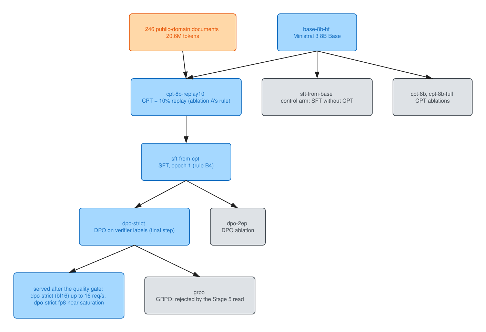
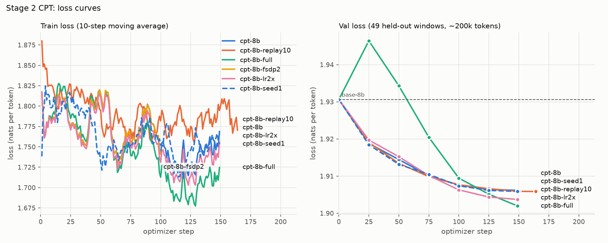
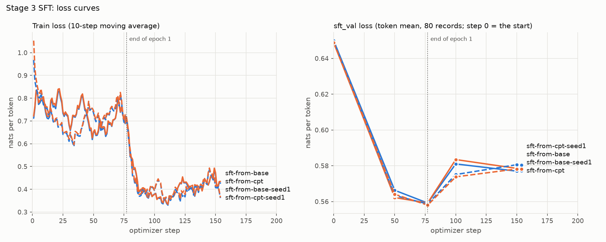
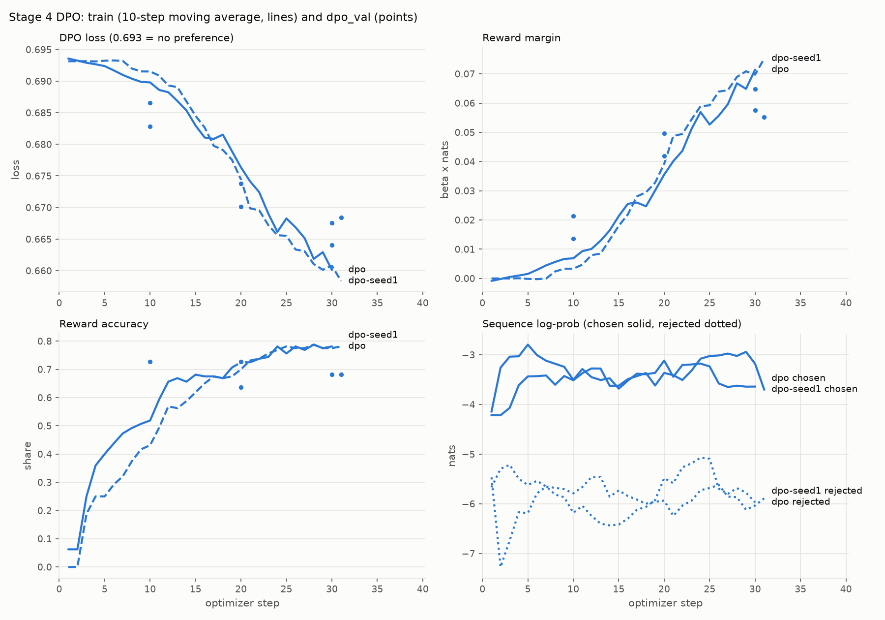
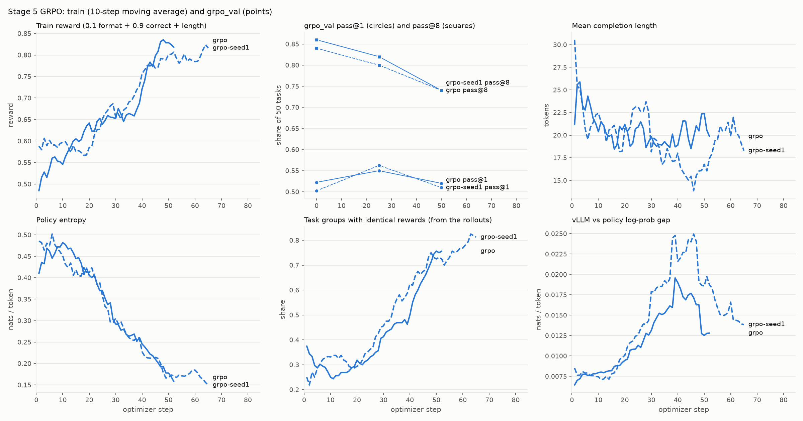

# struct-lm

> Independent project, using only public documents, open weights and open-source tools. Forge is
> described from Mistral AI's public announcement.

The post-training lifecycle a Forge engagement runs, at small scale (part 5): Ministral 3 8B Base
adapted to US federal structural-engineering documents by continued pre-training (CPT), SFT, DPO and
GRPO, then quantized behind a pre-registered quality gate and served with vLLM on one H100.

This README is the summary. Each stage's full write-up, with its loss curves, read tables and
checks, is `docs/stageN.md`, linked in [part 2](#2-lifecycle).

## 1. Summary

**The answer.** With the passages in the prompt, stock Ministral 3 8B Instruct was already about as
accurate as the shipped models (grounded, judge-scored: 89.8% against 90.7% after SFT and 92.6%
served, neither beyond the floor; single other runs reach 93.5%). What
fine-tuning bought is behaviour and the facts it trained on: every answer cites only the passages
it was given, in the required format (100% against Instruct's 83.3%), it refuses no answerable
question (Instruct refuses 7.4%), and closed-book recall of the facts SFT trained on rose to 28.7%
from Instruct's 11.4%. It bought no measurable recall of other facts, and CPT missed its
pre-registered target. DPO and GRPO met none of theirs.

**Scorecard.** Every target was registered before its data, and a change counts only beyond its
noise floor: the larger of a seed-pair gap and the metric's standard error, about one standard
deviation, so a screen rather than a significance test.

| stage | target, registered before the data | result | met |
|---|---|---|---|
| 2: CPT | domain validation perplexity down at least 20% | down 2.33% | no |
| 2: CPT | general validation perplexity up less than 3% | up 0.40% | yes |
| 3: SFT | CPT's gain survives SFT: unseen gold answers more probable than in the arm without CPT | +0.46 nats per answer [+0.28, +0.66] | yes |
| 3: SFT | beat Instruct on identifiers (closed-book, strict) | 20.3% against 3.1% | yes |
| 3: SFT | match Instruct on grounded answers (judge-scored) | 90.7% against 89.8% | yes |
| 3: SFT | decline over 80% of unanswerable questions; refuse under 5% of answerable ones | all but 4 of 76 declined; none refused | yes |
| 4: DPO | improve a primary metric against SFT: closed-book accuracy, gold-answer log-probability, hallucination, false refusals, citation format | none beyond the floor | no |
| 5: GRPO | raise seen closed-book accuracy (strict), expected by 3 to 8 points | down 1.2 points | no |
| 6: serving | quantized model inside every quality-gate floor | FP8 inside; FP8 KV cache and INT4 not | FP8 |

**Setup:**
- **Model and corpus:** [`mistralai/Ministral-3-8B-Base-2512`](https://huggingface.co/mistralai/Ministral-3-8B-Base-2512),
  trained on 246 public-domain manuals, reports and design examples from USACE, FEMA, FHWA, NIST
  and NASA (20.6M tokens).
- **Training:** each stage of the shipped pipeline is a LoRA adapter (r64) trained on one H100;
  two Stage 2 ablations used 2 GPUs.
- **Eval:** every stage is scored on the same 716-item eval, generated by Mistral Large 3 from the
  training documents and reviewed against its sources before any model was scored. Its closed-book
  task grew from 130 to 322 items after Stage 2, and every row was rescored.
- **Amended rules:** those changed after the analysis they govern are listed at the top of
  [`notes/decisions.md`](notes/decisions.md).

**Beyond the scorecard:**
- **CPT** made the corpus's text, gold answers included, more probable but not more recallable.
  - On the 155 facts SFT never showed, the answer tokens carry 0.41 nats of the scorecard's 0.46
    (95% CI +0.23 to +0.60; two seeds per arm, so 1 df per arm).
  - That is about what CPT's general rise on corpus text predicts ([`docs/results.md`](docs/results.md)).
  - The arms' accuracy on those facts differs by 3.2 points, which doesn't resolve at this size.
- **SFT on unseen facts:** its lead over Instruct (11.6% against 7.7%) clears the 2.6-point floor,
  but its paired CI (−1.3 to +9.0) includes 0, and the untrained base also scores 11.6%. On trained
  facts the paired CI is +10.8 to +24.6.
- **SFT's hallucination is worse than Instruct's,** 4 of 76 unanswerable questions against 1, but
  that 3-item gap equals its own two seeds' gap, so it is not beyond the floor.
- **DPO and GRPO** each raised seen pass@1 by about 3 points, a gain greedy serving doesn't use:
  - DPO by 3.5 [+1.2, +6.0], in a metric added after the fact;
  - GRPO by 3.1 [+1.3, +5.0], the mean of its two seeds.
- **Each lost probability on unseen gold answers:** DPO 0.38 nats, beyond its 0.21 floor (0.11 on
  seen facts, inside it); GRPO 1.32 over two seeds.
- **DPO's two runs on the original labels** cut hallucination past the floor as first written, not
  the stricter two-arm floor added after the analysis (part 6, method lessons).

The main rows (`gold_lp`: the gold answer's log-probability, nats per answer, higher is better):

<!-- headline-summary:start -->
| run | what it is | closed-book seen (strict) | closed-book unseen (strict) | gold_lp answer, unseen | grounded_acc (judge) | halluc_rate ↓ | GSM8K (no BOS) |
|---|---|---|---|---|---|---|---|
| `base-8b-hf` | base [base format] | 12.6 | 11.6 | -6.36 | 84.3 | 89.5 | 79.3 |
| `instruct-8b` | stock Instruct | 11.4 | 7.7 | -7.71 | 89.8 | 1.3 | 85.5 |
| `sft-from-base` | SFT on the base (control) | 23.9 | 8.4 | -6.20 | 92.6 | 6.6 | 79.2 |
| `sft-from-cpt` | CPT → SFT | 28.7 | 11.6 | -5.89 | 90.7 | 5.3 | 81.4 |
| `dpo-strict` | → DPO: final, served | 30.5 | 11.0 | -6.27 | 92.6 | 4.0 | 80.9 |
| `grpo` | → GRPO (rejected) | 29.9 | 9.7 | -7.54 | 93.5 | 1.3 | 82.0 |
|  | *floor, chat rows: sft-from-cpt vs sft-from-cpt-seed1, or SE* | 3.5 | 2.6 | 0.21 | 2.8 | 3.9 | 2.2 |
<!-- headline-summary:end -->

**Served: `dpo-strict`,** the SFT model within noise on every primary metric.
- **Why that checkpoint:** it carried forward because Stage 4's pre-registration had no fall-back
  to SFT, not on merit. `sft-from-cpt` is the better choice: it doesn't lose the 0.38 nats DPO lost
  on unseen answers. Switching needs its own FP8 quantization and gate, not yet run (part 6).
- **Precision:** FP8 (W8A8) passed the quality gate. bf16 serves up to 16 req/s, the highest
  open-loop rate measured; FP8 serves near saturation.
- **Bench numbers** are means of two runs; [`DEPLOY.md`](DEPLOY.md) has them, with the cost to serve.

**Intended use and limitations:**
- **Use it grounded:** to answer from retrieved passages, citing them, and decline when they don't
  hold the answer. In this safety-critical domain an engineer checks every value against its cited
  source before it informs a design.
- **Not closed-book:** without passages, the served model answers 30.5% of the facts it trained on
  and 11.0% of the others correctly (strict).
- **Retrieval is untested:** the grounded eval gives each question its gold passage among four, so
  it measures reading, not a retriever's misses.
- **Chat behaviour beyond the eval is untested:** the regression suite is base-style (5-shot, no
  chat template), so instruction-following, chat quality and safety weren't evaluated.
- **No domain experts:** Mistral Large 3 wrote the eval and the SFT data, which could favour SFT
  on trained facts, and Claude reviewed the eval items. No structural engineer saw items or outputs.
- **The eval was too small for the gains DPO and GRPO aimed at:** with 155 to 167 items per half and
  two seeds, the floors are 2.6 to 3.5 points and paired CIs on greedy accuracy are about ±5 to ±7
  points, so a 3-point gain can't resolve. No minimum detectable effect was set before the runs.

The [demo](#demo) shows a cited grounded answer and a declined unanswerable question.

## 2. Lifecycle

**Reading the diagram:**
- **Nodes** are the tables' `run` rows, each with the rule that picked it (ablation A: the replay
  ablation; B4: the SFT epoch rule).
- **Colours:** blue checkpoints, orange data, green steps, purple measurements, red the deciding
  rules, gray external models, controls and ablations.
- **Per stage:** each stage write-up opens with its own diagram:
  [0, the eval and baselines](docs/stage0.md) · [1, the corpus](docs/stage1.md) ·
  [2, CPT](docs/stage2.md) · [3, SFT](docs/stage3.md) · [4, DPO](docs/stage4.md) ·
  [5, GRPO](docs/stage5.md) · [6, serving](docs/stage6.md) · [every scored row](docs/results.md) ·
  [verifiers and judges](docs/verifiers.md).

## 3. Results

Every stage and ablation, base first. Rates are in %, `gold_lp` is in nats per gold answer (higher
is better), and ↓ marks lower is better.
- **Floors:** a difference counts only beyond its format group's floor row; base-format and
  chat-format `gold_lp` don't compare. Single-seed rows are read against the same floor.
  Item-bootstrap CIs condition on the trained runs, so run-to-run variance enters only through the
  floors.
- **Scorers:**
  - Closed-book accuracy is scored by the strict checker.
  - Judge columns use Mistral Large 3 at temperature 0, after rules. This pointwise judge was
    hand-checked, not benchmarked. The judge that failed its benchmark is a different one, the
    preference judge (part 4).
  - `cite_supported` is reported only: no verdict rests on it ([why](docs/verifiers.md)).
- **Seen and unseen** are fixed per fact before SFT. About half the eval's source passages may feed
  SFT synthesis; the rest may not. Every eval fact comes from a document CPT read, so unseen means
  unseen by SFT. This is Tülu 3's development/unseen split (§7), applied by fact.
- **Contamination:** 13-gram overlap (GPT-3's method) finds no GSM8K or HellaSwag item in the
  training text, and 21 of 14,042 MMLU items sharing one stock phrase. No eval question is copied
  into the SFT, DPO or GRPO data ([checks](docs/stage1.md#contamination-checks)).
- **lm-eval** ran 5-shot with no chat template and no BOS token. Rows compare with each other, not
  with published scores. Stage 6's GSM8K gate ran with one BOS. Latency compares only within one
  source.

**Knowledge (closed-book: no retrieval, no passage in the prompt)**

<!-- headline-knowledge:start -->
| run | what it is | closed-book seen (strict) | closed-book unseen (strict) | identifiers (strict) | gold_lp answer, seen | gold_lp answer, unseen | gold_lp end, seen | gold_lp end, unseen |
|---|---|---|---|---|---|---|---|---|
| `base-8b-hf` | Ministral 3 8B Base [base format] | 12.6 | 11.6 | 7.8 | -6.28 | -6.36 | -0.44 | -0.47 |
| `instruct-8b` | stock Instruct: the bar | 11.4 | 7.7 | 3.1 | -7.31 | -7.71 | -0.70 | -0.87 |
| `mistral-large-3` | frontier reference (API, closed-book only) | 26.4 | 25.8 | 40.6 |  |  |  |  |
| `cpt-8b` | CPT [base format] | 15.6 | 13.6 | 12.5 | -5.84 | -5.68 | -0.40 | -0.45 |
| `cpt-8b-seed1` | CPT, seed 1 [base format] | 13.2 | 12.9 | 12.5 | -5.84 | -5.70 | -0.40 | -0.45 |
| `cpt-8b-replay10` | CPT + 10% replay: shipped pipeline [base format] | 15.0 | 11.0 | 12.5 | -5.93 | -5.70 | -0.43 | -0.46 |
| `sft-from-base` | SFT on the base: control arm | 23.9 | 8.4 | 10.9 | -4.97 | -6.20 | -0.44 | -0.58 |
| `sft-from-base-seed1` | control arm, seed 1 | 23.4 | 7.7 | 14.1 | -4.87 | -6.20 | -0.38 | -0.54 |
| `sft-from-cpt` | SFT on CPT: shipped pipeline | 28.7 | 11.6 | 20.3 | -4.70 | -5.89 | -0.42 | -0.53 |
| `sft-from-cpt-seed1` | SFT on CPT, seed 1 | 25.8 | 11.0 | 23.4 | -4.52 | -5.68 | -0.35 | -0.48 |
| `dpo` | DPO, as-run labels | 30.5 | 11.6 | 20.3 | -4.70 | -6.16 | -0.30 | -0.38 |
| `dpo-seed1` | DPO, seed 1 | 28.7 | 11.0 | 17.2 | -4.85 | -6.28 | -0.35 | -0.45 |
| `dpo-2ep` | DPO 2 epochs (ablation, failed merge gate) | 25.8 | 12.9 | 14.1 | -7.82 | -10.57 | -0.20 | -0.28 |
| `dpo-strict` | DPO, strict labels: final, served bf16 | 30.5 | 11.0 | 18.8 | -4.81 | -6.27 | -0.32 | -0.42 |
| `grpo` | GRPO checkpoint-25 (rejected) | 29.9 | 9.7 | 20.3 | -5.52 | -7.54 | -0.27 | -0.41 |
| `grpo-seed1` | GRPO, seed 1 | 28.7 | 10.3 | 18.8 | -5.52 | -7.65 | -0.30 | -0.45 |
| `dpo-strict-fp8` | served FP8 (passed the gate) | 29.3 | 9.7 | 17.2 | -4.82 | -6.27 | -0.32 | -0.44 |
| `dpo-strict-fp8kv` | FP8 + FP8 KV cache (failed the gate) | 26.4 | 11.6 | 17.2 | -4.87 | -6.33 | -0.33 | -0.45 |
| `dpo-strict-w4a16` | INT4 W4A16 (failed the gate) | 27.5 | 8.4 | 10.9 | -5.12 | -6.70 | -0.30 | -0.36 |
|  | *floor, base-format rows: cpt-8b vs cpt-8b-seed1, or SE* | 2.8 | 2.7 | 4.1 | 0.03 | 0.03 | 0.01 | 0.01 |
|  | *floor, chat rows: sft-from-cpt vs sft-from-cpt-seed1, or SE* | 3.5 | 2.6 | 5.0 | 0.17 | 0.21 | 0.07 | 0.05 |

**Blank cells:**
- `cpt-8b-full` has no numbers: its weights were deleted before the closed-book task grew, and full-parameter weights can't be rebuilt from an adapter.
- `mistral-large-3` has no `gold_lp`, which is computed on the weights in the generation engine; Large 3 ran through the API.
<!-- headline-knowledge:end -->

**Behaviour (with passages: grounded answers, citations, abstention, definitions)**

<!-- headline-behaviour:start -->
| run | what it is | grounded_acc (judge) | cite_valid | cite_supported (judge, reported) | halluc_rate ↓ | false_abstain ↓ | vocab_recall (judge) |
|---|---|---|---|---|---|---|---|
| `base-8b-hf` | Ministral 3 8B Base [base format] | 84.3 | 12.0 | 8.3 | 89.5 | 0.9 | 70.5 |
| `instruct-8b` | stock Instruct: the bar | 89.8 | 83.3 | 78.7 | 1.3 | 7.4 | 78.6 |
| `cpt-8b` | CPT [base format] | 83.3 | 14.8 | 7.4 | 90.8 | 0.0 | 71.0 |
| `cpt-8b-seed1` | CPT, seed 1 [base format] | 79.6 | 10.2 | 3.7 | 93.4 | 0.0 | 70.0 |
| `cpt-8b-replay10` | CPT + 10% replay: shipped pipeline [base format] | 77.8 | 5.6 | 3.7 | 93.4 | 0.0 | 70.0 |
| `cpt-8b-full` | CPT full-parameter (ablation) [base format] | 88.9 | 14.8 | 10.2 | 92.1 | 0.0 | 74.3 |
| `sft-from-base` | SFT on the base: control arm | 92.6 | 100.0 | 87.0 | 6.6 | 0.0 | 83.3 |
| `sft-from-base-seed1` | control arm, seed 1 | 89.8 | 99.1 | 88.0 | 1.3 | 0.9 | 82.9 |
| `sft-from-cpt` | SFT on CPT: shipped pipeline | 90.7 | 100.0 | 86.1 | 5.3 | 0.0 | 83.3 |
| `sft-from-cpt-seed1` | SFT on CPT, seed 1 | 93.5 | 98.2 | 88.0 | 1.3 | 0.9 | 85.7 |
| `dpo` | DPO, as-run labels | 91.7 | 100.0 | 87.0 | 1.3 | 0.0 | 83.8 |
| `dpo-seed1` | DPO, seed 1 | 90.7 | 100.0 | 88.0 | 2.6 | 0.0 | 84.8 |
| `dpo-2ep` | DPO 2 epochs (ablation, failed merge gate) | 90.7 | 100.0 | 85.2 | 1.3 | 0.0 | 85.2 |
| `dpo-strict` | DPO, strict labels: final, served bf16 | 92.6 | 100.0 | 86.1 | 4.0 | 0.0 | 82.4 |
| `grpo` | GRPO checkpoint-25 (rejected) | 93.5 | 100.0 | 88.0 | 1.3 | 0.0 | 84.3 |
| `grpo-seed1` | GRPO, seed 1 | 91.7 | 98.2 | 88.9 | 1.3 | 1.8 | 85.2 |
| `dpo-strict-fp8` | served FP8 (passed the gate) | 90.7 | 100.0 | 85.2 | 5.3 | 0.0 | 82.9 |
| `dpo-strict-fp8kv` | FP8 + FP8 KV cache (failed the gate) | 93.5 | 100.0 | 84.3 | 6.6 | 0.0 | 83.3 |
| `dpo-strict-w4a16` | INT4 W4A16 (failed the gate) | 89.8 | 100.0 | 84.3 | 4.0 | 0.0 | 77.6 |
|  | *floor, base-format rows: cpt-8b vs cpt-8b-seed1, or SE* | 3.7 | 4.6 | 3.7 | 3.3 | 0.0 | 3.1 |
|  | *floor, chat rows: sft-from-cpt vs sft-from-cpt-seed1, or SE* | 2.8 | 1.8 | 3.3 | 3.9 | 0.9 | 2.6 |

**Blank cells:**
- `mistral-large-3` has no numbers: it is an API reference, run closed-book only.
<!-- headline-behaviour:end -->

**General capability and serving**

<!-- headline-general:start -->
| run | what it is | MMLU (no BOS) | GSM8K (no BOS) | HellaSwag (no BOS) | ppl domain val ↓ | ppl general val ↓ | TTFT p50 @1 (ms) | ITL p50 @1 (ms) | latency source |
|---|---|---|---|---|---|---|---|---|---|
| `base-8b-hf` | Ministral 3 8B Base [base format] | 76.7 | 79.3 | 80.1 | 6.88 | 8.15 | 15.3 | 6.60 | 1 sample, GPU not recorded |
| `instruct-8b` | stock Instruct: the bar | 76.1 | 85.5 | 80.1 |  |  | 17.7 | 6.60 | 1 sample, GPU not recorded |
| `cpt-8b` | CPT [base format] | 76.4 | 78.5 | 80.1 | 6.72 | 8.18 | 16.5 | 6.90 | 1 sample, GPU not recorded |
| `cpt-8b-seed1` | CPT, seed 1 [base format] | 76.5 | 78.6 | 80.0 | 6.72 | 8.17 |  |  |  |
| `cpt-8b-replay10` | CPT + 10% replay: shipped pipeline [base format] | 76.6 | 79.1 | 80.0 | 6.72 | 7.97 |  |  |  |
| `cpt-8b-full` | CPT full-parameter (ablation) [base format] | 76.2 | 76.3 | 79.8 | 6.73 | 8.25 |  |  |  |
| `sft-from-base` | SFT on the base: control arm | 76.7 | 79.2 | 79.5 | 7.01 | 8.23 | 18.4 | 6.80 | 1 sample, GPU not recorded |
| `sft-from-base-seed1` | control arm, seed 1 | 76.8 | 79.0 | 79.9 | 7.01 | 8.25 | 17.6 | 6.80 | 1 sample, GPU not recorded |
| `sft-from-cpt` | SFT on CPT: shipped pipeline | 76.6 | 81.4 | 79.4 | 6.87 | 8.06 | 17.8 | 6.80 | 1 sample, GPU not recorded |
| `sft-from-cpt-seed1` | SFT on CPT, seed 1 | 77.0 | 79.2 | 80.0 | 6.87 | 8.07 | 16.2 | 6.90 | 1 sample, GPU not recorded |
| `dpo` | DPO, as-run labels | 76.7 | 81.0 | 79.6 | 6.88 | 8.07 | 17.3 | 6.80 | 1 sample, GPU not recorded |
| `dpo-seed1` | DPO, seed 1 | 76.5 | 80.7 | 79.5 | 6.89 | 8.07 |  |  |  |
| `dpo-2ep` | DPO 2 epochs (ablation, failed merge gate) | 76.8 | 80.6 | 80.2 | 6.97 | 8.11 |  |  |  |
| `dpo-strict` | DPO, strict labels: final, served bf16 | 76.7 | 80.9 | 79.6 | 6.88 | 8.06 | 17.9 | 6.90 | H100, Stage 6 bench |
| `grpo` | GRPO checkpoint-25 (rejected) | 76.7 | 82.0 | 79.8 | 6.93 | 8.09 | 25.5 | 6.70 | 1 sample, GPU not recorded |
| `grpo-seed1` | GRPO, seed 1 | 76.7 | 80.2 | 79.8 | 6.93 | 8.09 |  |  |  |
| `dpo-strict-fp8` | served FP8 (passed the gate) |  |  |  |  |  | 35.2 | 4.70 | H100, Stage 6 bench |
|  | *floor, base-format rows: cpt-8b vs cpt-8b-seed1, or SE* | 0.3 | 1.1 | 0.4 | 0.02% | 0.23% |  |  |  |
|  | *floor, chat rows: sft-from-cpt vs sft-from-cpt-seed1, or SE* | 0.4 | 2.2 | 0.6 | 0.08% | 0.07% |  |  |  |

**Blank cells:**
- `mistral-large-3` has no numbers: it is an API reference, run closed-book only.
- `instruct-8b` has no perplexity: it wasn't measured.
- `dpo-strict-fp8`, `dpo-strict-fp8kv`, `dpo-strict-w4a16` have no lm-eval or perplexity run with the frozen flags; their gate GSM8K (one BOS) and perplexity are in [`docs/stage6.md`](docs/stage6.md).
- Latency is measured per deployed checkpoint, not per seed or ablation; FP8-KV's and INT4's bench rows weren't run (Modal spend limit).
<!-- headline-general:end -->

[`docs/results.md`](docs/results.md) also has:
- the lenient scorer's columns;
- MMLU's four groups;
- the train-slice and 2026-report perplexities;
- the Stage 0 `base-8b` row.

**Training curves:** train loss or reward as moving averages, validation at checkpoints.

*CPT: validation loss flattens by the end of the one epoch.*

*SFT: validation loss is lowest at the end of epoch 1 in all four runs.*

*DPO: two epochs fit the training pairs while validation loss stalls.*

*GRPO: reward climbs as entropy collapses and validation pass@8 falls.*

## 4. Decisions and trade-offs

Each decision, the alternative it beat, and that alternative's number:
- **10% general replay, kept on thin evidence.** Row: `cpt-8b-replay10`.
  - The adoption rule fired on MMLU +0.2 against a 0.1 seed floor, which is inside MMLU's own 0.34
    SE.
  - The −2.24% general perplexity is in-distribution: FineWeb-Edu is both the replay and the
    general val.
  - Grounded accuracy (judge-scored) fell 6.5 points, against a 3.7 floor.
  - It was kept because it costs only 10% more tokens and SFT restored the citations.
- **LoRA, not full-parameter CPT.** Full-parameter (`cpt-8b-full`, 2 GPUs, one run) memorised more
  for the same domain gain:
  - train-slice perplexity −22%, against LoRA's −8%;
  - general perplexity +1.19%, against +0.40% (itself past the 0.23% floor, so LoRA isn't free);
  - GSM8K −3.0, against a 1.1 floor, though full-parameter's grounded and vocabulary scores rose.
- **SFT stopped at epoch 1,** by the pre-registered epoch rule (B4). In epoch 2 the closed-book validation loss of
  `sft-from-cpt` rose from 1.17 to 1.30, and every one of the four runs overfit the same way.
- **DPO labels from verifiers, not the preference judge.** Row: `dpo-strict`.
  - The judge caught 28% of grounded defects and 9% of definition defects, against a 0.5 bar.
  - The strict checker later relabelled the closed-book pairs (failure 2 in part 6), and the
    relabelled set trained `dpo-strict`.
- **GRPO rejected.** Row: `grpo`. Its greedy accuracy didn't move (scorecard), and it cost 0.71
  nats on seen gold answers over two seeds, on top of the unseen loss. On Magistral's recipe with
  one update per batch, clip-higher never bound, and entropy collapsed in both runs.
- **FP8 (W8A8), not INT4 or an FP8 KV cache.** FP8 moved no gated metric past its floor. Row:
  `dpo-strict-fp8`.
  - FP8-KV failed strict seen accuracy (−4.2 against 3.5).
  - INT4 failed three gated metrics: GSM8K −6.1 against 2.2, and answer-token log-probability at
    about twice the floor.
  - bf16 stays the default at low load for its faster first token. FP8 serves 22% more requests
    per second at 64 concurrent, though that is raw throughput, not requests within the latency
    SLO.

## 5. What changes at Forge scale

| | This repo, measured | [Forge](https://mistral.ai/news/forge/), as announced (17 March 2026) |
|---|---|---|
| Data | 246 public PDFs, 20.6M tokens after cleaning and deduplication | "large volumes of internal documentation, codebases, structured data, and operational records" |
| Data licences | audited after training: 54 of the 2,516 SFT records under non-commercial or restrictive terms | not stated |
| Pre-training | LoRA r64 on the 19.4M-token train split, read once, + 10% general replay | "build domain-aware models by learning from large internal datasets" |
| Post-training | SFT on 2,436 records (1,778 teacher-written); DPO on 445 verifier-labelled pairs | "post-training methods allow teams to refine model behavior" |
| RL | 622 verifiable tasks, synchronous GRPO, stopped by step 65 | "align models and agents with internal policies, evaluation criteria" |
| Evaluation | a 716-item KPI eval (fixed from Stage 3), a regression suite, seed floors | "test models against internal benchmarks, compliance rules, and domain-specific tasks" |
| Compute | H100s, one per run except two 2-GPU ablations: 8.8 GPU-hours of training | not stated |

What the small version surfaced that gets harder at full scale:
1. **The judge comes back.** Exact answers let verifiers replace the failed judge here. Open-ended
   client tasks will need a judge calibrated against subject-matter experts.
2. **Rewards need fixture suites and audits before training,** as the verifier holes in part 6
   show.
3. **Synchronous GRPO had no working brake.** Clip-higher acts on the policy gap that asynchronous
   generators open, and that gap was zero here. Whether a brake would have stopped the collapse is
   untested.
4. **Data governance moves upstream:**
   - licences checked at intake, not after training as here;
   - which replay records went into which run, tracked;
   - the seen/unseen split given an owner, not only a guard script.
5. **Multi-node full-parameter CPT wasn't done.** There was one 2-GPU full-parameter run, and one
   2-GPU LoRA run that was 11% faster per GPU, with the cause not isolated.

## 6. What went wrong, and what next

**Failures:**
1. **The preference judge failed its benchmark** (part 4), so Stage 4's registered design couldn't
   run.
2. **The substring labeller passed wrong answers:** 80 of 458 closed-book chosen answers (17%) fail
   the strict rule, and 79 are wrong on reading.
   - The strict checker then re-scored every row. The 8B rows moved 0–1.6 points and Large 3 moved
     1.9.
   - Five pairs of rows less than a point apart swapped order. No registered analysis compares
     any of them.
3. **Three verifier holes:**
   - fragments, found by auditing the labeller's passes;
   - comma lists, found by reading the code;
   - years within 2%, found by the hack audit. Only this one was learned, on one task.

   Each fix has its fixture in [`docs/verifiers.md`](docs/verifiers.md).
4. **Four rules sat on point readings where a window was meant:** the merge gate, the step-1 loss
   band, the DPO checkpoint rule, and entropy on one batch. Three were amended, two of them after
   the analysis they govern (the index in `notes/decisions.md`).
5. **Two DPO epochs displaced the chosen answers** (`dpo-2ep`, one run). Against one epoch, strict
   seen accuracy fell 4.8 points, and the gold answer tokens fell 3.1 nats seen and 4.4 unseen.
6. **INT4 failed its gate** (part 4). Its calibration used 512 domain records only, which may be
   the cause.
7. **FP8 doubles first-token time at low load** (17.9 to 35.2 ms p50), still unexplained.
8. **Prefix caching cut grounded first-token time by 28.5%,** not the half predicted. Only the
   prompt-length part of first-token time is cacheable, and on FP8 that is about two fifths.
9. **lm-eval has sent no BOS since Stage 0.** Rows still compare with each other: GSM8K with one BOS
   scored the same 1,067 of 1,319 on `dpo-strict`.
10. **The licence audit ran after training,** so the weights can't be published ([Weights](#weights)).

**Method lessons:**
- **Stop rules on windows, not points.** One batch's entropy stopped `grpo-seed1` at step 34, while
  its steps 25-34 mean sat at 57% of the steps 1-5 mean. The rule was rewritten after it fired, and
  the run resumed to step 65.
- **Decompose a metric before comparing it.** `gold_lp`'s end token hid DPO's shift toward stopping.
- **Put the start's own seed gap in a two-arm floor,** and say "1 df per arm". The repo added it
  only after Stage 4's analysis, which moved two metrics inside the noise: DPO's drop in
  hallucination and its loss on unseen gold answers.
- **Fix the eval's primary metric before the first run.** Stage 2's perplexity target (summary) was
  set for the wrong data scale.

**Next, ranked:**
1. A licence-clean SFT set, then retraining and the weights ([Weights](#weights)).
2. Quantize and gate `sft-from-cpt`, and serve it if it passes.
3. Before any further training: a larger eval sized for a 3-point gain, items reviewed by domain
   experts, a real retriever in the grounded eval, and chat and safety evals.
4. Compute tasks for GRPO: a formula from a passage, sampled inputs, a checked answer.
5. Two updates per batch (μ = 2), so clip-higher can bind; then a KL term if needed.
6. An NLL anchor on DPO's chosen answers (RPO).
7. A per-claim support check as the grounded judge, benchmarked first.
8. FP8's first-token diagnosis, and Stage 6's unrun rows: FP8-KV's GSM8K and second seen metric,
   and n-gram speculative decoding.
9. INT4 with mixed calibration, or AWQ.
10. A third seed per arm.
11. Varied CPT exposure, such as paraphrased restatements of the facts.

## 7. Reproduce

[`docs/reproduce.md`](docs/reproduce.md) has every command chain, the pinned versions and the
dataset hashes.

<!-- reproduce-table:start -->
| stage | command | training GPU-h | data (sha256 of its `SHA256SUMS`) |
|---|---|---|---|
| 0: the eval and baselines | `make reproduce-stage0` |  | `eval/tasks/` (committed, reviewed) |
| 1: the corpus | `make reproduce-stage1` |  | `data/processed`: 966d1e0c |
| 2: CPT | `make reproduce-stage2` | 5.40 | the corpus |
| 3: SFT | `make reproduce-stage3` | 1.97 | `data/sft`: 70f47740 |
| 4: DPO | `make reproduce-stage4` | 0.37 | `data/dpo/strict`: 5e3effaf |
| 5: GRPO | `make reproduce-stage5` | 1.08 | `data/grpo`: 4db8f7a6 |
| 6: serving | `make reproduce-stage6` | not totalled | `serve/bench_manifest.json` |
| all training | | 8.82 | |
<!-- reproduce-table:end -->

- **GPU-hours** count training only; evals, sampling and the bench aren't totalled.
- **Checking the numbers needs no GPU and no API key:**
  - `make reproduce-score` rescores every row from the committed generations and judge verdicts,
    and regenerates every table and figure.
  - `make audit` traces every number in this README and the stage diagrams to a results or data
    file, a config or the code, or, for a registered rule or a reading ruling, the decision log.

## Who wrote the data, licences, weights

**Who wrote the data:**
- **The eval items:** Mistral Large 3. Each was reviewed against its source passage with keep or
  reject verdicts ([rubric](notes/eval_review_rubric.md)).
- **SFT:**
  - Large 3 wrote the domain questions.
  - Large 3 and Medium 3.5 wrote the completions; Medium 3.5 wrote 415 of the 1,778 train records.
  - The abstain records use one fixed sentence.
  - 500 general records come from the Tülu 3 mixture, minus its Claude-written subsets. That
    mixture's records were written by GPT-4o, GPT-3.5/4, Mixtral and people, except a math set
    since withdrawn (below).
- **DPO and GRPO:** the models' own samples and rollouts, labelled and scored by rules.
- **Claude**, through Claude Code, built the tooling and reviewed generated records with keep or
  drop verdicts only. No training set contains text Claude wrote. The hand-written answers in
  `tests/` are fixtures and are never trained on.

**Licences:**

| what | licence | here |
|---|---|---|
| code | Apache-2.0 ([`LICENSE`](LICENSE)) | all of it |
| the corpus: 246 US federal documents | public domain (17 U.S.C. § 105); 27 reproduce third-party material (photo credits, figures), each hand-checked; copyrighted standards excluded | URLs and sha256 of the 251 candidates in [`data/sources.csv`](data/sources.csv); no PDFs |
| FineWeb-Edu (CPT replay) | ODC-By | not redistributed |
| Mistral output (eval items, SFT) | the customer's under Mistral's Commercial Terms (§3.1); labelled model-written (§3.2) | committed |
| Tülu 3 mixture: 500 replay records, 50 probe prompts | ODC-BY-1.0; subsets below | row ids only (the withdrawn set's as sha256); `make sft-replay` rebuilds them |
| Ministral 3 8B Base | Apache 2.0 | not redistributed |

<!-- replay-licences:start -->
| subset | records | licence |
|---|---|---|
| Evol CodeAlpaca | 97 | Apache 2.0 |
| NuminaMath-TIR | 58 | Apache 2.0 |
| WildGuardMix | 46 | Apache 2.0 |
| OASST | 4 | Apache 2.0 |
| WildJailbreak | 46 | ODC-BY-1.0 |
| Persona GSM | 46 | ODC-BY-1.0 |
| WildChat (GPT-4) | 36 | ODC-BY-1.0 |
| Persona Algebra | 18 | ODC-BY-1.0 |
| CoCoNot | 10 | ODC-BY-1.0 |
| SciRIFF | 7 | ODC-BY-1.0 |
| TableGPT | 4 | MIT |
| FLAN v2 | 74 | not given on the card |
| Withdrawn math set | 46 | withdrawn after training: its licence restricts models trained on it |
| No Robots | 8 | CC-BY-NC-4.0 (non-commercial) |
<!-- replay-licences:end -->

### Weights

**Not published at v1.0.**
- **Why:** they were trained on the last two subset rows above.
  - No Robots is non-commercial.
  - The withdrawn math set's licence restricts how models trained on it may be named.
- **Further questions for a release:** FLAN v2's 74 records (no licence on the card) and the GPT-4
  and GPT-4o subsets (OpenAI's terms).
- **The fix:**
  - swap those 54 records: OASST1 for No Robots, and a math source with an unrestricted licence and no GSM8K test
    overlap;
  - retrain SFT, DPO and FP8;
  - rerun the gate.
- **Until then:** the checkpoints stay on the Modal volume.

### Demo

**How it was recorded:** a live run of `serve/demo.py` against the FP8 server
(`serve/modal_demo.py`), captured as it streamed and replayed with its real timing
(`serve/demo_render.py`). Both answers match the saved generations.

**How the two items were picked:** by hand.
- **`gr-0038`:** `dpo-strict` answered 93 grounded items correctly with judge-supported citations
  (92 in FP8). Of the three with the shortest passages, this one has the most concrete answer.
- **`adv-0050`:** the third-shortest of the 73 unanswerable items it declined (72 in FP8).

**What they pass,** in both the bf16 and the FP8 run:
- `gr-0038` cites only its gold passage, which is GRPO's strict grounded check.
- `adv-0050` gives the exact abstain sentence.
- The closed-book strict checker applies to neither.
