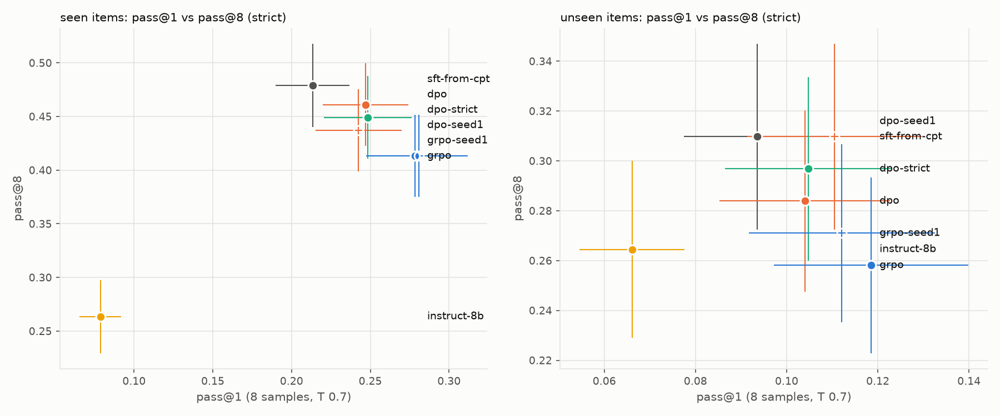
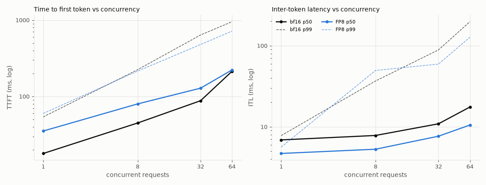
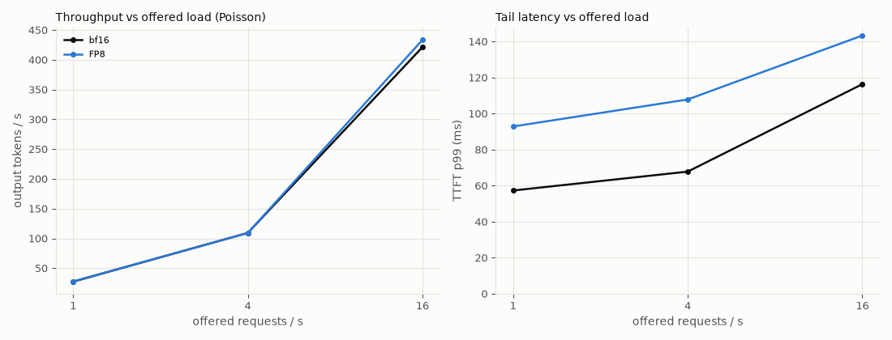

# struct-lm

> Independent project, using only public documents, open weights and open-source tools. Forge is
> described from Mistral AI's public announcement.

Domain adaptation of an open base LLM
([`mistralai/Ministral-3-8B-Base-2512`](https://huggingface.co/mistralai/Ministral-3-8B-Base-2512))
to structural and civil engineering through **CPT → SFT → DPO → GRPO**, with every stage
measured on the same KPI tasks and general-capability regression suite, then quantized
(FP8, INT4) behind a pre-registered quality gate and served with vLLM on one H100
([`DEPLOY.md`](DEPLOY.md)).

> This README is the write-up. Numbers live in [`results/table.md`](results/table.md);
> the reasoning behind every choice lives in [`notes/decisions.md`](notes/decisions.md).

## The problem

Engineering organisations sit on decades of internal documents: design manuals, inspection
procedures, worked calculation examples, test reports. A general-purpose LLM has seen little of
it. Asked about those documents, it misses the specific values, clauses and vocabulary, invents
plausible answers, and can't point to the page it relied on. Retrieval helps with lookup, but it
doesn't teach the model the domain's language, and it doesn't change what the model does when the
answer isn't in front of it.

Mistral AI's Forge platform, as publicly announced, addresses this by training open-weight models
further on a client's own data across the whole lifecycle: continued pre-training on raw
proprietary text, synthetic data, SFT and preference optimisation, reinforcement learning, and
LoRA where lighter adaptation is enough, all measured against evals tied to the client's KPIs.
The default path starts from an existing checkpoint, not from scratch.

**This repo runs that lifecycle once, end to end, at roughly 1% scale.** Public-domain US federal
structural-engineering documents stand in for a client's private corpus: 246 manuals, reports and
design examples from USACE, FEMA, FHWA, NIST and NASA (20.6M Tekken tokens after cleaning; the KPI
eval tasks are sampled from the 234 training documents, at most 6 source passages per document per
task, and draw on 152 of them).
US federal works carry no licensing risk; copyrighted standards such as ASCE 7 and the AISC manual
are deliberately excluded. The starting checkpoint is Ministral 3 8B Base, from the same model
generation such engagements start from.

The two kinds of training do different jobs:

- **Continued pre-training (CPT)** on raw domain text (next-token loss) teaches knowledge and
  vocabulary. Its risk is forgetting general capability, which is managed by replaying general
  text and keeping the learning rate low.
- **Fine-tuning (SFT → DPO → GRPO)** on a few thousand curated examples teaches behaviour: answer
  from the passages given, cite them, decline when the answer isn't there, and get verifiable
  calculations right.

The goal is not a great model. It is a clean experiment with honest numbers and decisions that can
be defended, measured before and after every stage.

### How success is measured

The eval harness was built before any training, so it couldn't be fitted to a model. The same six
measurements run after every stage, with the base model and the off-the-shelf instruct model as
the first two rows.

| # | What it measures | Task | Metrics |
|---|---|---|---|
| 1 | Closed-book domain knowledge | 322 questions with exact or numeric answers from the corpus (eval v3 from Stage 3; 325 in v2, 130 until 2026-10-04) | `qa_acc`, by answer kind (`qa_num` / `qa_ident` / `qa_term`) and by SFT half (`qa_seen` / `qa_unseen`), plus the gold answer's log-probability (`gold_lp`: the answer tokens plus the one end token after them, both parts shown from 2026-10-09). From 2026-10-09 each `qa_*` is shown strict (`scorers.qa_strict`: the whole gold, one candidate, units compared) and lenient (the original `qa_correct`). |
| 2 | Answering from given passages, with citations | 108 questions, 4 passages each (gold plus distractors) | `grounded_acc`, `cite_valid`, `cite_supported` |
| 3 | Domain vocabulary | 210 terms to define in one sentence | `vocab_recall` |
| 4 | Declining when the answer isn't there | 76 questions whose 3 passages don't contain the answer | `halluc_rate` (lower is better) |
| 5 | General capability, to catch forgetting | MMLU, GSM8K, HellaSwag, 5-shot, no chat template and no BOS token (the frozen lm-eval flags send none, found in Stage 6): comparisons between rows stand, absolute values aren't comparable with published scores | `mmlu`, `gsm8k`, `hellaswag` |
| 6 | Serving cost | vLLM on one H100: 1 / 8 / 32 / 64 concurrent requests, Poisson 1 / 4 / 16 req/s (Stage 6) | time to first token, inter-token latency, throughput, goodput, $ per 1,000 requests |

Every task item was reviewed against its source passages before any model was run on it: 524 of
1,176 generated items survived the first review (2026-09-27), and 219 of 1,174 the second (195 in
the set after the identifier cap), which grew the closed-book task to cut its noise (2026-10-04,
[`notes/eval_review_rubric.md`](notes/eval_review_rubric.md)). Layout locators (page, table and
figure numbers) are removed by rule, and identifiers are capped at 20% of the task. Items were rejected only for defects: a wrong or unsupported
gold answer, a correct answer the scorer would mark wrong, or a question that tests general
knowledge or trivia instead of the corpus. None was rejected for being hard. Tasks 2–4 are graded
by a pinned judge (Mistral Large 3,
temperature 0, cached verdicts), with anything a rule can decide (missing citations, empty answers,
the exact refusal phrase) decided by rule first.

### Where it starts

Row zero, from [`results/table_v2.md`](results/table_v2.md) (eval v2, 4 October 2026; the original
130-item scores are in [`results/table_v1.md`](results/table_v1.md), and every row is rescored on
v3's 322 items in [`results/table.md`](results/table.md)):

- **The base model** finds the right answer in the passages 85% of the time but cites correctly only
  10% of the time, and answers 88% of unanswerable questions with something invented.
- **The instruct model** has the behaviour (79% of answers correct and backed by their citations,
  99% of unanswerable questions declined), but it knows no more of the domain closed-book: 9.9%
  against the base model's 12.0% on the 325 questions (12% against 14% on the original 130). Those
  are the lenient scorer's numbers. On v3's 322 items with the strict checker of 2026-10-09 they
  are 9.6% against 12.1%. For scale, Mistral Large 3 answers 28% of them closed-book (26% strict).
- **Closed-book domain accuracy is low for both.** That is the knowledge gap CPT is meant to close,
  while SFT brings citation and refusal behaviour up to the instruct model's level or beyond (DPO,
  on verifier-labelled pairs, left it where SFT put it), and the general-capability columns stay
  flat.

**Why the instruct model is the bar.** `Ministral-3-8B-Instruct-2512` (the BF16 HF checkpoint) is
Mistral's own instruct post-trained version of the base trained on here (model card).
- **Same model, different post-training:** the same 8B dense architecture, Tekken tokenizer and
  vision tower, starting from the same base. Its weights differ by Mistral's post-training, as the
  SFT runs' differ by this repo's. So every difference between them comes from post-training data
  and method, not model size.
- **The business claim:** it is what a client would deploy off the shelf. So beating it is "an 8B
  tuned on your corpus beats the stock 8B on your questions".

**How it is scored: without its default system prompt.** Its HF chat template
(`chat_template.jinja`) inserts a default system prompt ("You are Ministral-3-8B-Instruct-2512, a
Large Language Model (LLM) created by Mistral AI...") when none is given. The eval doesn't use that
template.
- **The KPI eval** renders every chat model through the same `--chat` path: vLLM with
  `tokenizer_mode=mistral`, that is mistral-common's `encode_chat_completion` of one user turn.
  It renders `<s>[INST] prompt [/INST]` with no system prompt.
- **The serving benchmark** goes through the same rendering, and lm-eval uses no chat template at
  all (rule 2).
- **So the comparison is on the template the eval renders, the one the SFT models were trained in,
  not the template Mistral ships for the instruct model.** Its default system prompt might change
  its refusal and citation behaviour; that was not measured here.

### Scope

This is the same pipeline shape as a production engagement at roughly 1% scale. It leaves out the
two parts that make the real thing hard: distributed full-parameter training on billions of
tokens, and enterprise data readiness and governance.

| | This repo | Production engagement |
|---|---|---|
| Base model | Ministral 3 8B, open weights | tens to hundreds of billions of parameters, dense or MoE |
| Corpus | 20M tokens of cleaned public PDFs | billions of tokens: documents, code, databases, images; messy |
| Continued pre-training | LoRA on one GPU, hours | full-parameter, multi-node, days to weeks, replay mix, annealing |
| CPT data | documents concatenated and read once, 20M tokens | the same next-token objective with data engineering around it: rewrites of the facts that matter, per-source mixture and repetition, section-level boundaries |
| Post-training | a few thousand SFT examples, ~500 verifier-labelled DPO pairs, a small GRPO run | 10k–100k+ examples reviewed with domain experts, RL with distillation |
| Evaluation | six-measurement harness plus regression suite | the same idea, built with domain experts, with audit lineage |
| Infrastructure | rented GPUs (Modal), open-source stack | isolated environments, data residency, versioned datasets and runs |

What transfers: the stages and their order, the failure modes, the eval design, and the recurring
decisions (how much general text to replay, LoRA versus full-parameter training, how far to trust a
judge). What doesn't: the engineering difficulty at scale.

## Pipeline

```
sources.csv ─ download ─ extract ─ filter ─ dedup ─ pii ─ split ──► CPT ─merge─► SFT ─merge─► DPO ─merge─► GRPO ─merge─► FP8 ─► vLLM
                            │                               │  replay (FineWeb-Edu)                                              │
                            │                               └─ tokenizer_coverage, stats    run_eval + run_lm_eval + bench  ◄────┘
                            └─ extract --chunks ─ make_tasks (eval/tasks/, frozen eval docs only)
```

| Stage | Script | Input data | Signal |
|-------|--------|-----------|--------|
| CPT  | `train/cpt.py`  | `data/processed/{train,val}.jsonl` (+ `replay.jsonl` for the replay ablation) | next-token on domain text |
| SFT  | `train/sft.py`  | `data/sft/{train,sft_val}.jsonl` `{"prompt": [...], "completion": [...]}` | completion-only loss |
| DPO  | `train/dpo.py`  | `data/dpo/{train,val}.jsonl` `{"prompt","chosen","rejected"}` + token ids | verifiable preference pairs (sigmoid DPO) |
| GRPO | `train/grpo.py` | `data/grpo/{train,val}.jsonl` `{"prompt", "verifier", ...}` (Stage 4 pool prompts in the probe's window) | rule-based reward: format gate, strict correctness, length (`train/grpo_rewards.py`) |

**Who wrote the training data.** The SFT questions and completions were written by Mistral Large 3
(`mistral-large-2512`) and Mistral Medium 3.5 (`mistral-medium-2604`, 25% of completions), apart from
the abstain records' fixed refusal sentence, and the 500 general replay records come from the Tülu 3
SFT mixture without its Claude-written subsets. Claude, through Claude Code, built the tooling and
reviewed the generated records against their source passages with keep/drop verdicts only: no
training record contains text Claude wrote. The DPO pairs' chosen and rejected answers are
sft-from-cpt's own samples, labelled by verifiers and rules (no judge, no Claude verdicts);
`dpo-strict`'s are the same samples, relabelled by the strict checker. The GRPO completions are the
policy's own rollouts, scored by rules alone; its prompts are the Stage 4 pool's. The hand-written
completions in `tests/test_grpo_rewards.py` and `tests/test_qa_strict.py` are test fixtures and are
never trained on.

Each stage trains a LoRA adapter; `train/merge.py` folds it into the weights, and the next
stage's `model.init_from` points at the merged directory.

## Quickstart

### Setup

```bash
uv sync --extra data --extra dev            # Mac: data prep, task generation, scoring
uv sync --extra data --extra train --extra eval --extra serve   # Linux GPU box
pre-commit install                          # ruff, uv-lock, shellcheck, file checks
export MISTRAL_API_KEY=...                  # task generation + judge (scripts don't read .env)
```

`quantize` (llm-compressor) conflicts with `serve`/`eval` (compressed-tensors pins), so it gets
its own env: `uv sync --extra quantize` (Stage 6 runs it in its own Modal image). Modal needs two
secrets: `huggingface` (`HF_TOKEN`) and `mistral` (`MISTRAL_API_KEY`).

### Data and eval tasks

```bash
set -a; . ./.env; set +a                    # HF_TOKEN (tokenizers, FineWeb-Edu), MISTRAL_API_KEY
make data                                   # download → extract → filter → dedup → pii → split → replay → tokenizer_coverage → stats
python data/scripts/extract.py --chunks     # eval input: chunks.jsonl from the pool in eval/tasks/eval_docs.txt (frozen)
python eval/make_tasks.py                   # eval/tasks/*.jsonl + eval_chunk_ids.txt (Mistral Large 3)
```

`make data` writes the Stage 1 corpus to `data/processed/` on the Mac (CPU and network only).
Stage 2 uploads `train.jsonl`, `val.jsonl` and `replay.jsonl` to the Modal volume.
USACE, fema.gov and ROSA P block scripted downloads (Akamai 403). Those PDFs were fetched in a
browser (Chrome DevTools MCP): save them as `data/raw/<slug>.pdf` (or the URL's filename), then
re-run `download.py`, which records each file's sha256 and page count in `data/sources.csv`
(`stats.py` adds each document's final token count).
`chunks.jsonl` is built only from the documents pinned in `eval/tasks/eval_docs.txt`, so adding
sources never resamples the eval; never build SFT data from chunks in `eval/tasks/eval_chunk_ids.txt`,
except the seen half listed in `eval/tasks/sft_seen_chunks.txt` (rule 10, `data/scripts/sft_guard.py`).

### Train

Training runs on Modal (`train/modal_train.py`): one command trains, merges the adapter into the
base (fp32, with the vLLM YaRN fix in the config), and evaluates the merged checkpoint.

```bash
M=.venv/bin/modal
modal volume put --force struct-lm data/processed data/processed   # after any data change
# Stage 2, CPT: train -> merge -> perplexity + lm-eval + KPI generations (latency is opt-in: ,latency)
$M run --detach train/modal_train.py --config train/configs/cpt.yaml --run-name cpt-8b
$M run --detach train/modal_train.py --config train/configs/cpt_replay10.yaml --run-name cpt-8b-replay10
$M run --detach train/modal_train.py --config train/configs/cpt_8b_full.yaml --run-name cpt-8b-full --gpus 2
# the base, re-saved through merge.py so vLLM evaluates it exactly like a fine-tuned checkpoint
$M run --detach train/modal_train.py --model mistralai/Ministral-3-8B-Base-2512 --run-name base-8b-hf --steps merge,eval
# then pull and score locally (next section), and refresh the tables and figures:
.venv/bin/python train/report.py   # results/train_runs.md, results/curves/*.png, README blocks
```

SFT is wired (a config with `stage: sft`; `train/sft.py`, pre-tokenised by `train/sft_data.py`).
DPO is wired (`stage: dpo`, `train/dpo.py`); GRPO (`grpo.py`) is not yet.

```bash
# Stage 3: SFT (the set must match data/sft/SHA256SUMS on the volume), B4 and the merge gate run in
# the chain; chat checkpoints are evaluated with --chat
for f in train.jsonl sft_val.jsonl SHA256SUMS; do $M volume put --force struct-lm data/sft/$f data/sft/$f; done
$M run --detach train/modal_train.py --config train/configs/sft.yaml --run-name sft-from-cpt \
  --merge-from b4 --chat --steps train,merge,mergecheck,ppl,eval,latency,sample
# Stage 4: DPO on verifiable preferences. Pairs from the SFT model's own samples (make dpo-data,
# then the probe/benchmark/pool sampling jobs, then make dpo-pairs: CLAUDE.md, Stage 4); the set
# must match data/dpo/SHA256SUMS on the volume; the checkpoint rule (--merge-from rule) and the
# merge gate (on sft_val) run in the chain
for f in train.jsonl val.jsonl SHA256SUMS; do $M volume put --force struct-lm data/dpo/$f data/dpo/$f; done
$M run --detach train/modal_train.py --config train/configs/dpo.yaml --run-name dpo \
  --merge-from rule --chat --steps noop,train,merge,mergecheck,ppl,eval,latency,sample
.venv/bin/python eval/winrate.py dpo sft-from-cpt   # reported only: the judge failed its benchmark
```

### Evaluate (repeat per stage, including the base and instruct baselines)

Generation runs on a Modal H100; scoring (rules + Mistral judge) runs locally, off the GPU clock.

```bash
# 1. Modal: lm-eval (MMLU / GSM8K / HellaSwag, 5-shot) + KPI generations
modal run --detach eval/modal_app.py --model mistralai/Ministral-3-8B-Base-2512 \
  --run-name base-8b --generate-only
modal run --detach eval/modal_app.py --model mistralai/Ministral-3-8B-Instruct-2512-BF16 \
  --run-name instruct-8b --chat --generate-only

# 2. Pull the run's outputs off the Modal volume (not results/table.md: it's written locally)
modal volume get struct-lm results/runs/base-8b results/runs/
modal volume get struct-lm results/lm_eval/base-8b results/lm_eval/

# 3. Score locally; appends a row to results/table.md
python eval/run_eval.py --run-name base-8b --rescore --lm-eval-dir results/lm_eval \
  --model mistralai/Ministral-3-8B-Base-2512
```

`--chat` wraps the KPI prompts in the checkpoint's chat template; it is required for Instruct and
later chat checkpoints (SFT/DPO/GRPO), and base models run without it. lm-eval never uses a chat
template, for any checkpoint, so its columns compare across every row (see notes/decisions.md).
`--which lm|kpi` runs one half; `--limit 5 --no-judge --which kpi` is a smoke test.
On a GPU box without Modal, drop `--generate-only` and run `eval/run_eval.py` and
`eval/run_lm_eval.sh` directly (usage at the top of each file).

What each KPI task measures:

| Task | Context | Scoring | Metric |
|------|---------|---------|--------|
| `domain_qa` | closed-book, 3-shot | exact match / numeric ±2% (lenient); the whole gold, one candidate, units compared (strict, 2026-10-09) | `qa_acc`; strict via `eval/qa_strict.py` |
| `vocab` | closed-book, 3-shot definitions | judge vs reference definition | `vocab_recall` |
| `grounded` | 4 passages (gold, neighbours, off-doc distractor) | citations are provided ids; judge checks support | `cite_valid`, `cite_supported` |
| `adversarial` | 3 related passages without the answer | exact abstain phrase, else judge | `halluc_rate` |

### Quantize, gate, serve, benchmark (Stage 6)

```bash
python serve/bench_data.py      # the bench request sets from the eval prompts (pinned: serve/bench_manifest.json)
modal run serve/modal_serve.py --action quantize --scheme fp8          # -> checkpoints/dpo-strict-fp8
modal run --detach serve/modal_serve.py --action quantize --scheme w4a16   # GPTQ -> checkpoints/dpo-strict-w4a16
modal run --detach serve/modal_serve.py --action gate --variant fp8    # KPI, eos, perplexity, GSM8K
modal run --detach serve/modal_serve.py --action bench --variants bf16,fp8,fp8kv,w4a16 --spec   # one H100
bash serve/serve_vllm.sh checkpoints/dpo-strict-fp8   # serving it yourself: DEPLOY.md
```

The full sequence (pulls, scoring, report) is in `CLAUDE.md`, Stage 6. The earlier per-checkpoint
latency step (`--which latency`, `serve/bench_latency.py`) still exists; its rows are the
"GPU not recorded" table in [Serving](#5-serving-stage-6).

Override any config value from the CLI:
`python train/sft.py --config train/configs/sft.yaml --override training.learning_rate=1e-4`

## Layout

```
data/     sources.csv (every document: slug, publisher, title, url, sha256, pages, tokens),
          raw/ (PDFs, gitignored), scripts/ (one per step + common.py), processed/ (stats.json
          and tokenizer_coverage.md committed; docs_raw, docs, train/val/replay, dropped_samples,
          duplicates and the eval's chunks.jsonl gitignored)
eval/     make_tasks.py (task generation), tasks/*.jsonl (KPI tasks + rejects.jsonl hand-review
          list + eval_chunk_ids.txt), prompts.py, scorers.py, judge.py, run_eval.py,
          run_lm_eval.sh, modal_app.py (Modal H100 runner)
train/    one script per stage + common.py, merge.py, configs/*.yaml
serve/    serve_vllm.sh (the served config), quantize.py (FP8 / GPTQ W4A16), modal_serve.py
          (quantize, quality gate, H100 bench), bench_data.py + bench_manifest.json (request sets),
          served_check.py (template ids, served-vs-eval smoke), bench_latency.py (Stages 2-5)
results/  all committed: table.md (one row per run), runs/<run>/{generations,scored}.jsonl +
          metrics.json, judge_cache.jsonl, lm_eval/<run>/**/results_*.json, bench/, curves/.
          Anyone can re-score with `run_eval.py --rescore` without a GPU or API key.
notes/    decisions.md: dated log of every choice
checkpoints/  adapters and merged weights (gitignored)
```

## Write-up

### 1. Goal and KPIs
See [The problem](#the-problem) and [How success is measured](#how-success-is-measured) above.

### 2. Data
The corpus card in [`notes/decisions.md`](notes/decisions.md) ("Stage 1 corpus card") has every
number, generated from [`data/processed/stats.json`](data/processed/stats.json) by `stats.py`:
documents and pages per publisher, pages dropped, paragraphs dropped per filter rule, exact and
near-duplicate removal, PII replacements, tokenizer fertility, and the train/val split.

#### Tokenizer coverage

Does Tekken (131k vocabulary) fit this text, or does CPT need new tokens? Measured by
`data/scripts/tokenizer_coverage.py` on the clean corpus against ~1M tokens of FineWeb-Edu as
general English. The full report is
[`data/processed/tokenizer_coverage.md`](data/processed/tokenizer_coverage.md).

| text | tokens per word |
|---|---|
| domain corpus (20.6M tokens) | 1.44 |
| FineWeb-Edu | 1.34 |
| top-500 TF-IDF domain terms | 1.12 |
| the 303 terms in the vocab eval | 1.43 |
| 18 designations and units (`ASCE 7-22`, `kip-ft`, `A709 Grade 50W`, ...) | 3.21 |

- **No vocabulary extension.** The corpus costs only 1.08x the tokens per word of general
  English, and the words that mark the domain (shear, girder, flange, diaphragm) are mostly single
  tokens.
- **Designations fragment, not vocabulary.** Only 34 of 843 term words take 4+ tokens:
  - document numbers and digit strings (`EM 1110-2-2104` is 13 tokens, because Tekken gives every
    digit its own token by design);
  - parenthesised acronyms;
  - hyphenated compounds.

  New embeddings trained on 20M tokens would cost more than those save.
- **Base and Instruct encode identically** (a corpus sample and every term word), so data and
  evals tokenised once serve both checkpoints.

#### Replay slice

To limit forgetting, CPT can mix general text back in. `data/processed/replay.jsonl` is 1.9M Tekken
tokens (10% of train) from FineWeb-Edu, English web text filtered for educational quality, taken as
raw text from the head of its `sample-10BT` stream. Stage 2 runs CPT with and without it and
compares domain val perplexity with the MMLU, GSM8K and HellaSwag regression columns. It is ODC-By
web text, not public domain, so it is rebuilt from Hugging Face rather than committed, and nothing
in the eval comes from it. It is not a random sample (caveats in the corpus card). Its overlap with
the regression benchmarks was measured, below: none beyond stock phrases.

#### Contamination checks

`eval/contamination.py` (CPU, about a minute) measures token 13-gram overlap between what CPT trained
on and everything evaluated against it. The method is GPT-3's (appendix C), counted on Tekken tokens
as in Llama 2. Full tables are in [`results/contamination.md`](results/contamination.md).
- **What dedup already covers:** dedup keeps near-duplicate paragraphs off both sides of the
  document-level split, so this looks for sharing below the paragraph.
- **The matcher works on short items:** text cut from a training document and tokenised on its
  own, as a benchmark item is, comes back 99% matched.

| check | result |
|---|---|
| domain val vs train | 1.5% of val's 13-grams occur in train. A train document shares more with the other 233 (median 2.0%). Three val documents are above 5%, up to 20%, each next to a sibling in train (FHWA HIF-18-044 and -043, FEMA P-1100-2A and -2B, HIF-17-020 and -019). Without them the val gain is -2.33%, unchanged. |
| 2026 reports vs train | at most 1.35% per report, so none is a revision of a corpus document |
| MMLU / GSM8K / HellaSwag vs train and replay | GSM8K and HellaSwag: no 13-gram in either. MMLU: 21 of 14,042 items share one, all stock phrases ("in the 1960s and 1970s"), none half covered. |
| general val vs replay (both FineWeb-Edu) | 0.017% of tokens; disjoint |
| domain_qa few-shot vs the 325 scored items | no shot is a scored question, and the shots share no 13-gram with each other. Answer values recur only by coincidence ("4" in three unrelated items). Two shots come from the same passage as a scored item, qa-0003 and qa-0056, and ask a different fact. |

- **QA items from training documents are by design, not a leak.** The closed-book QA items come
  from training documents on purpose: they measure recall of what CPT read.
- **Why two scored items share a passage with the shots.** `make_tasks.py` takes the shots out of
  the item list, not the passage list. Neither shot gives away the answer:
  - 0.95 d_b in the shot, 75% scored;
  - 4 fiber elements in the shot, L/500 scored.

  The prompt is identical for every checkpoint, so no delta moves, and the frozen set keeps them.
  - **Tagged:** both carry `fewshot_passage_overlap: true` in `domain_qa.jsonl`, for per-item
    analyses to exclude.
  - **Fixed for the next rebuild:** `make_tasks.py --task-version 3` splits the shots off by
    passage. It keeps the v2 ids and only removes items: 322, the two plus one identifier under the
    20% cap.
  - **Guarded:** `tests/test_fewshot.py` fails if a new shared passage appears.

**Where the held-out gain sits.** The val and 2026 perplexity windows, binned by the share of their
tokens inside a 13-gram that also occurs in train (`cpt-8b-replay10` vs `base-8b-hf`; seed 1
agrees):

| tokens shared with train | val windows | val change | 2026 windows | 2026 change |
|---|---|---|---|---|
| under 1% | 157 | -1.70% | 56 | -0.11% |
| 1-5% | 86 | -2.54% | 21 | -0.90% |
| 5-20% | 44 | -3.56% | 5 | -2.00% |
| over 20% | 9 | -5.21% | 0 | |
| all | 296 | -2.33% | 82 | -0.43% |

- **Shared text is learned most, and the gradient is the shape of learning, not of a leak.**
  - The gain rises smoothly with overlap, from -1.70% on windows sharing under 1% of their tokens
    to -5.21% over 20% (Spearman -0.57 over the 296 val windows).
  - A leak would sit in a few copied windows instead.
  - Against that -1.70% floor, verbatim sharing carries about a quarter of the val gain.
  - This is an association: windows with more shared text are also more formulaic (base perplexity
    5.6 against 7.2).
- **It doesn't explain the gap to new documents.** On windows that share almost nothing, val still
  gains -1.70% [-2.25, -1.24] and the 2026 reports -0.11% [-0.46, +0.22]. That is 1.6 of the
  1.9-point gap.
  - The same holds at 8-grams, bin by bin.
  - So what val shares with train lies below copied strings: terms, notation, layout, a series'
    house style.

**Genre is not the explanation either.** The val documents are mostly manuals and the 2026 set is
mostly research reports, so "new documents" could have meant "a different genre". Each document was
labelled from the purpose stated in its front matter (`notes/decisions.md`), then the per-document
perplexity sums were pooled (`eval/ppl_compare.py --docs`; `cpt-8b-replay10`, `cpt-8b` and seed 1
agree within 0.15 points):

| | guidance: manuals, standards, design examples | research reports |
|---|---|---|
| val: the document's series is in train | -2.23% (10 documents) | -3.64% (2) |
| 2026: its series is not | -0.89% (2) | -0.32% (11) |

- **Neither genre explains it.** Val's research reports gain more than its manuals. The two new
  guidance documents (Army bridge load-rating guidance, an FHWA procurement guide) gain less than
  half of what val's manuals gain.
- **What separates the rows is the series.**
  - Every val document's series is in train: USACE EM, FEMA P, NIST GCR 917, FHWA HIF, NASA-STD.
  - None of the 2026 reports' series is: no NIST TN, ERDC or FHWA-HRT document is in train.
  - The two 2026 NIST GCRs are workshop reports from another programme; they gain -0.7% and -0.3%.

  So CPT transfers within a document series, across genre, and barely to a new series.
- **Small cells:** the val reports are two documents, and NIST GCR 12-917-21 is 92% of their tokens;
  HIF-18-047 alone gains -2.54%.

#### Corpus sources

All US federal works (public domain, 17 USC 105); documents carrying a third-party copyright notice
are excluded (`extract.py` flags them for a hand check). The full list is
[`data/sources.csv`](data/sources.csv): slug, publisher, title, URL, and the sha256 and page count
of the exact file processed. `download.py` reads it; each file lands at `data/raw/<slug>.pdf`.
USACE, fema.gov and ROSA P block scripted downloads (Akamai bot filter): get those in a browser,
save them under their slug or URL filename, and re-run `download.py` to hash them. Four FEMA
publications come from other hosts, recorded in the url column:
- P-695 from NIST's NEHRP clearinghouse (FEMA's copy is gone);
- P-751 from WBDG;
- P-58-4 and P-58-5 from ATC, their preparer (fema.gov serves them truncated).

### 3. Training

#### Stage 2: continued pre-training (CPT)

One epoch of plain next-token training on the 19.4M-token train split, starting from
`Ministral-3-8B-Base-2512`: LoRA r=64 (alpha 128) on all seven projections of the language model,
LR 1e-4 with a cosine schedule, 32 windows of 4,096 tokens per optimizer step, so 149 steps (the
"150-step rule"), on one H100. Every number and its reason, the pre-registered success rule and the
ablation rules are in [`notes/decisions.md`](notes/decisions.md); the rough edges hit on the way
(TRL packing that would have kept 5% of the corpus, an EOS token encoded as text, a tokenizer that
broke vLLM's processor) are in [`notes/contributions.md`](notes/contributions.md).

The runs vary one thing each against the main run (`cpt-8b`):

| run | what changes | question |
|---|---|---|
| `cpt-8b-lr2x` | LR 2e-4 | the pre-registered fix when domain perplexity "barely moves" |
| `cpt-8b-seed1` | seed 1 | the run-to-run noise floor every other delta is read against |
| A, `cpt-8b-replay10` | +10% FineWeb-Edu replay | does replay protect general ability, at what domain cost |
| B, `cpt-8b-full` | full-parameter on 2 x H100 (FSDP2) | LoRA vs full fine-tuning on the same model and tokens |
| C, `cpt-8b-fsdp2` | 2 x H100 (FSDP2), 100 steps | throughput scaling and loss agreement |


Generated by `train/report.py` from `results/runs/` and `results/ppl/` (regenerated whenever a
run lands):

<!-- stage2-tables:start -->
##### Training runs

| run | GPUs | steps | tokens | tokens/s | tokens/s/GPU | wall (h) | GPU-h | $ | final train loss | final eval loss |
|---|---|---|---|---|---|---|---|---|---|---|
| cpt-8b | 1 | 149 | 19.4M | 5,939 | 5,939 | 0.95 | 0.95 | 3.74 | 1.769 | 1.906 |
| cpt-8b-replay10 | 1 | 164 | 21.4M | 5,980 | 5,980 | 1.04 | 1.03 | 4.09 | 1.770 | 1.906 |
| cpt-8b-full | 2 | 149 | 19.4M | 13,226 | 6,613 | 0.45 | 0.91 | 3.59 | 1.725 | 1.902 |
| cpt-8b-fsdp2 | 2 | 100 | 13.1M | 13,221 | 6,610 | 0.30 | 0.59 | 2.34 | 1.741 |  |
| cpt-8b-lr2x | 1 | 149 | 19.4M | 5,963 | 5,963 | 0.95 | 0.95 | 3.74 | 1.756 | 1.904 |
| cpt-8b-seed1 | 1 | 149 | 19.4M | 5,914 | 5,914 | 0.97 | 0.97 | 3.82 | 1.753 | 1.906 |

- **cpt-8b-fsdp2 vs cpt-8b:** 2 GPUs give 2.23x the tokens/s (13,221 vs 5,939), so per GPU +11% at the same micro-batch and per-layer checkpointing (peak memory 43 vs 51 GB): the FSDP2 code path, not scaling (finding 6 below); per-step losses differ by 0.038% (median) / 0.171% (max) over 100 steps, the 10-step moving averages by 0.01% on average.

$ at 3.95 per GPU-hour (Modal's H100 SXM5 list price, checked 2026-10-09); wall time includes tokenising and model load.

##### Perplexity vs base-8b

| run | domain val | change | nats [95% CI, docs] | general val | change | nats [95% CI, docs] | train slice | change |
|---|---|---|---|---|---|---|---|---|
| base-8b | 6.880 |  |  | 8.151 |  |  | 6.185 |  |
| cpt-8b | 6.720 | -2.33% | -0.0236 [-0.0302, -0.0180] | 8.184 | +0.40% | +0.0040 [+0.0025, +0.0056] | 5.673 | -8.28% |
| cpt-8b-replay10 | 6.720 | -2.33% | -0.0236 [-0.0303, -0.0180] | 7.969 | -2.24% | -0.0226 [-0.0257, -0.0198] | 5.646 | -8.71% |
| cpt-8b-full | 6.732 | -2.15% | -0.0217 [-0.0357, -0.0104] | 8.248 | +1.19% | +0.0118 [+0.0091, +0.0143] | 4.815 | -22.15% |
| cpt-8b-lr2x | 6.713 | -2.42% | -0.0245 [-0.0335, -0.0172] | 8.220 | +0.85% | +0.0085 [+0.0068, +0.0102] | 5.442 | -12.01% |
| cpt-8b-seed1 | 6.718 | -2.35% | -0.0238 [-0.0307, -0.0180] | 8.165 | +0.17% | +0.0017 [+0.0002, +0.0030] | 5.687 | -8.05% |
| dpo | 6.882 | +0.03% | +0.0003 [-0.0053, +0.0064] | 8.066 | -1.05% | -0.0105 [-0.0138, -0.0075] | 5.805 | -6.14% |
| dpo-2ep | 6.971 | +1.32% | +0.0131 [+0.0085, +0.0188] | 8.109 | -0.52% | -0.0053 [-0.0085, -0.0022] | 5.894 | -4.70% |
| dpo-seed1 | 6.885 | +0.08% | +0.0008 [-0.0049, +0.0069] | 8.067 | -1.03% | -0.0104 [-0.0137, -0.0073] | 5.808 | -6.10% |
| dpo-strict | 6.883 | +0.05% | +0.0005 [-0.0052, +0.0066] | 8.064 | -1.07% | -0.0107 [-0.0140, -0.0077] | 5.805 | -6.14% |
| grpo | 6.927 | +0.69% | +0.0068 [+0.0019, +0.0127] | 8.086 | -0.80% | -0.0080 [-0.0113, -0.0049] | 5.843 | -5.53% |
| grpo-seed1 | 6.928 | +0.70% | +0.0070 [+0.0020, +0.0129] | 8.088 | -0.77% | -0.0077 [-0.0111, -0.0046] | 5.843 | -5.52% |
| sft-from-base | 7.008 | +1.86% | +0.0184 [+0.0166, +0.0211] | 8.234 | +1.01% | +0.0100 [+0.0091, +0.0110] | 6.311 | +2.05% |
| sft-from-base-seed1 | 7.010 | +1.89% | +0.0187 [+0.0169, +0.0214] | 8.251 | +1.22% | +0.0121 [+0.0110, +0.0133] | 6.316 | +2.13% |
| sft-from-cpt | 6.872 | -0.11% | -0.0011 [-0.0071, +0.0051] | 8.061 | -1.11% | -0.0111 [-0.0144, -0.0081] | 5.800 | -6.23% |
| sft-from-cpt-seed1 | 6.867 | -0.20% | -0.0020 [-0.0078, +0.0044] | 8.066 | -1.04% | -0.0105 [-0.0138, -0.0074] | 5.789 | -6.39% |

##### Change vs base-8b-hf, next to the noise

| metric | base-8b-hf | cpt-8b | cpt-8b-seed1 | cpt-8b-replay10 | cpt-8b-full | noise |
|---|---|---|---|---|---|---|
| domain val perplexity | 6.88 | -2.33% | -2.35% | -2.33% | -2.15% | 0.02% |
| 2026-report perplexity | 6.21 |  | -0.51% | -0.43% |  |  |
| general val perplexity | 8.15 | +0.40% | +0.17% | -2.24% | +1.19% | 0.23% |
| train slice perplexity | 6.18 | -8.28% | -8.05% | -8.71% | -22.15% | 0.23% |
| MMLU | 0.767 | -0.4 | -0.2 | -0.1 | -0.5 | 0.3 |
| GSM8K | 0.793 | -0.8 | -0.7 | -0.2 | -3.0 | 1.1 |
| HellaSwag | 0.801 | +0.1 | -0.1 | -0.0 | -0.2 | 0.4 |
| closed-book gold-answer log-prob (nats) | -6.77 | +0.59 | +0.58 | +0.51 |  | 0.08 |
|   of it, the answer tokens | -6.32 | +0.56 | +0.55 | +0.50 |  | 0.07 |
|   of it, the end token | -0.45 | +0.03 | +0.03 | +0.01 |  | 0.01 |
| closed-book qa_strict | 0.121 | +2.5 | +0.9 | +0.9 |  | 1.8 |
| closed-book qa_acc (lenient) | 0.121 | +2.5 | +0.9 | +0.9 |  | 1.8 |
| grounded_acc (with passages) | 0.843 | -0.9 | -4.6 | -6.5 | +4.6 | 3.7 |
| vocab_recall | 0.705 | +0.5 | -0.5 | -0.5 | +3.8 | 3.1 |
| halluc_rate | 0.895 | +1.3 | +3.9 | +3.9 | +2.6 | 3.5 |

lm-eval rows run 5-shot without a BOS token (the frozen flags send none, found in Stage 6): the changes stand, absolute values aren't comparable with published scores. Perplexity in %, the gold-answer log-probability in nats per answer, the rest in points. noise = max(the seed gap cpt-8b vs cpt-8b-seed1, the metric's standard error: for base-8b-hf, or for the log-probability the paired per-item difference): a change smaller than it is not a result. QA rows are on the 322-item domain_qa (eval v3; Stage 2 was first read on v2's 325, results/table_v2.md), so cpt-8b-full, whose weights were deleted, has none.
<!-- stage2-tables:end -->

**Bottom line.** At 20M tokens and one epoch, CPT learns the documents it reads (-8% perplexity) and
almost nothing that transfers to documents it hasn't seen (-0.4% on reports published in 2026).
It does make the facts in the documents it read more likely: closed-book gold answers become about
1.8x more probable (+0.59 nats per answer, both seeds; +0.56 of it in the answer tokens, +0.03 in the end token), a gain pass/fail accuracy is too coarse to
resolve at this size.

- **Pushing harder doesn't help.** A higher learning rate and full-parameter training learn the
  documents harder, with 2-4x the forgetting and no held-out gain.
- **What goes forward.** LoRA with 10% replay is the carried-forward checkpoint. A pre-registered
  rule chose it, the rule fired at the edge of the noise, and that is recorded.
- **Why the eval harness matters.** It found a serving bug larger than any training effect.

Every delta below is against `base-8b-hf`, the base evaluated through the same vLLM path as the
fine-tuned checkpoints. Each is read against its noise: the larger of the seed gap (`cpt-8b` vs
`cpt-8b-seed1`) and the metric's standard error.

**Against the pre-registered rules** (`notes/decisions.md`, set before the main run):

| rule | cpt-8b (seed 1) | cpt-8b-lr2x | cpt-8b-full | verdict |
|---|---|---|---|---|
| domain val perplexity down at least 20% | -2.33% (-2.35%) | -2.42% | -2.15% | failed everywhere |
| train/val gap grows under ~10 points over base's 11.2% (over ~25 = memorising) | +7.2 (+6.9) | +12.1 | +28.6 | LoRA passes; lr2x fails; full is memorising |
| general val perplexity up under 3% | +0.40% (+0.17%) | +0.85% | +1.19% | passed everywhere |

**The target was set for the wrong data scale.** Held-out perplexity measures domain transfer, which
continued pre-training produces at the scale of billions of tokens. With a 20M-token client corpus
the realistic goal is knowledge of those documents. That is measured by closed-book QA after SFT,
and it needs repetition or augmentation to stick.

**What Stage 2 established:**
1. **The learnable signal is the documents and their series, not the domain.** A probe
   (`eval/memorization.py`) compared the 246 corpus documents with 13 federal reports published in
   2026, after the base model's release:

   | Documents | Spans the base continues for 32+ tokens verbatim | Base perplexity | Change after CPT (`cpt-8b-replay10`) |
   |---|---|---|---|
   | Train (read once in CPT) | 6 of 3,744, all in-document patterns | 6.00 | -8.3% [-8.6, -7.9] |
   | Val (held out, same series) | 0 of 192 | 5.47 | -4.2% [-5.5, -3.0] |
   | 2026 (never seen) | 0 of 208 | 6.27 | -0.4% [-0.8, 0.0] |

   **How the probe's perplexity is measured.** It is the median over documents of each document's
   first two 4,096-token windows, and the change is per document on the same windows. That is not
   the measurement in the tables above (pooled over all val windows, and a 49-window train slice),
   so only ratios within this table are comparable. On the probe's footing val comes out easier
   than train, the reverse of the main table.

   **What it shows:**
   - **Gain stays within the series.** Every held-out document improves, but the 2026 reports barely
     move, including the closest ones (bridge load rating -0.5%, corroded steel beams -0.4%). That
     roughly 10x ratio between within-series gain and new-document gain is the finding.
   - **What val measures.** The val documents are siblings of train documents (USACE EMs, FEMA
     P-series, NIST 917 briefs, FHWA HIF reports) and share their structure, boilerplate and
     phrasing. So domain val perplexity measures learning within those series; the 2026 set
     measures transfer.
   - **Measured, it isn't copied text or genre** ([contamination checks](#contamination-checks)).
     - Val shares 1.5% of its 13-grams with train, less than train documents share with each
       other.
     - Verbatim sharing carries about a quarter of the val gain.
     - On windows with almost no shared text, val still gains -1.70% against -0.11% for the 2026
       reports.
     - Val's research reports gain -3.6% and its manuals -2.2%, against -0.9% for new guidance
       documents.
     - So CPT transfers within a document series, across genre, and barely to a new series.
   - **Little domain-general structure left.** The base already models this register well (domain
     val 6.9 against 8.2 on web text), so there is little general structure left to learn at this
     scale.
   - **Confirmed over whole documents.** Measured like domain val (`ppl_postcutoff`, all 82
     windows of the 13 reports), CPT moves the 2026 set -0.43% (replay) and -0.51% (seed 1),
     against -2.3% on held-out val.
   - **Caveats:** 13 documents, mostly research reports rather than manuals. A genre split rules
     genre out as the explanation (the table under [contamination checks](#contamination-checks)).
2. **Pushing harder moves the wrong way.** The train slice fell -8% (`cpt-8b`), -12% (LR 2e-4) and
   -22% (full-parameter), while held-out stayed flat each time, between -2.15% and -2.42%.
   - **lr2x:** general-text perplexity rose about 2x as much as the main run's.
   - **Full-parameter:** about 3x the main run's general-text rise, and about 4x its GSM8K loss
     (-3.0 points against -0.7 to -0.8). That GSM8K drop is the one benchmark delta that clears the
     noise (1.1) by a wide margin.
   - **Full-parameter's task gains** on the 130-item eval v1 (`results/table_v1.md`, lenient scorer): +3.1 qa_acc
     (noise 3.2) and +3.8 vocab (noise 3.1), at the noise edge. Every one of those items comes from
     a training document, so they are knowledge of what it read. Its weights were deleted before
     the QA task grew, so it has no 325-item QA scores.

   LoRA stays the default: "LoRA learns less and forgets less" (Biderman et al., 2024).
3. **The base hadn't memorised the corpus.** The six "recalled" spans continue patterns set up in
   the prompt, such as `Table D-11` followed by `D-12`. Corpus documents are no easier for the base
   than 2026 documents it cannot have seen: geometric-mean perplexity +3.0%, interval [-8.5, +17.0].
   So pretraining exposure doesn't explain the small gain. A single pass in pretraining can't be
   ruled out: one epoch of our own CPT moves verbatim recall by 0.13 tokens, less than this
   comparison resolves.
4. **Pass/fail scores can't see Stage 2; the gold answer's probability can.** On the 325-item
   closed-book task (eval v2), qa_acc moves +2.5, +0.9 and +0.9 points for the three LoRA runs (strict and lenient alike),
   against a noise of 1.8. The log-probability of the gold answer (`gold_lp`, per item, paired
   against `base-8b-hf`) moves clearly:

   | Run | Change in `gold_lp`, nats per answer [95% CI] | Items more likely |
   |---|---|---|
   | `cpt-8b` | +0.59 [+0.45, +0.75] | 70% |
   | `cpt-8b-seed1` | +0.58 [+0.44, +0.74] | 71% |
   | `cpt-8b-replay10` | +0.52 [+0.38, +0.66] | 68% |

   - **The seeds agree:** the two seeds differ by 0.007 nats.
   - **Numbers move least.** Per answer token, CPT moves values +0.06 nats, identifiers +0.13 and
     terms +0.15.
   - **What it is:** every eval item comes from a document CPT read, so this is the closed-book
     counterpart of the -8% train-slice perplexity: knowledge of what it read, not transfer.
   - **The end-marker fix:** the answer is scored with the end token the prompt uses after every
     answer ("\n\n"). The first measurement used a lone "\n", which never follows an answer in
     the prompt and made CPT look worse (`notes/decisions.md`).
   - **The other task scores** (grounded, citations, hallucination) need instruction following,
     which a base model lacks, and swing 4-5 points between seeds; they are Stage 3 metrics.
5. **Replay was adopted on a rule that fired at one noise unit; it's kept.** Mixing in 10%
   FineWeb-Edu left domain perplexity identical and brought the MMLU dip to -0.1 from -0.4. That
   margin is about one noise unit (0.3), so the pre-registered rule fired on noise; the flaw is
   recorded in `notes/decisions.md`. Its general-text perplexity fell 2.2%, but that slice is also
   FineWeb-Edu, so it measures in-distribution training, not protection. The 6.5 grounded and 6.4
   cite_valid points it "cost" are probably not a real cost:
   - they measure a base model's citation formatting, which SFT overwrites completely;
   - one seed alone moved grounded accuracy by 4.6 points.

   _Re-read after Stage 3:_ the grounded cost was real and the citation one formatting.
   - **Grounded:** replay10's grounded_acc (0.843 → 0.778) is 1.8x the 3.7-point noise. Raw-text CPT
     eroding few-shot instruction behaviour is a known cost, and this is a clean instance of it.
   - **Both are repairable:** SFT took both arms to grounded 0.90-0.94 and cite_valid 0.98-1.00.
6. **C: two GPUs reproduce one-GPU training step for step, at 2.23x the tokens/s.** Per-step loss
   is within 0.04% (median), and both runs see the same batches. Per GPU that is 6,610 against
   5,939 tokens/s (+11%).
   - **Matched:** micro-batch 4, and every decoder layer checkpointed (non-reentrant).
   - **Not memory-bound:** the one-GPU run peaked at 51 GB of 80.
   - **Different, so the +11% is not isolated by a run:** the code path. FSDP2 casts parameters to
     bf16 and uses its own checkpoint wrapper; the one-GPU run uses the Trainer's.
   - **Full-parameter vs LoRA cost:** on two GPUs, full-parameter matched LoRA's GPU-hours (0.91 vs
     0.95) despite about 1.33x the FLOPs per token. At roughly 8N against 6N FLOPs per token with
     checkpointing (N ≈ 8B, attention ignored), that is about 43% of H100 bf16 peak for full against
     about 30% for LoRA. LoRA's FLOP saving doesn't turn into speed; it is plausibly lost to the
     adapters' many small kernels, which nobody has profiled.
7. **The eval harness found a bug larger than any training effect.** vLLM 0.29 runs any HF-format
   Ministral 3 checkpoint, which includes every fine-tuned one, at the wrong attention temperature.
   - **Mechanism:** its YaRN code drops the config's `mscale` / `mscale_all_dim` keys and scales
     attention by 1.28.
   - **Cost:** on untouched base weights, 4.8% perplexity, 3.1 MMLU points, 6.1 GSM8K points and
     19.5 grounded points. It first made CPT look like it had wrecked MMLU and grounding.
   - **Culprit:** vLLM's reading of the config, not transformers' re-save or `merge.py`. Mistral's
     own `config.json` ships those keys.
   - **Fix:** `merge.py` writes `apply_yarn_scaling: false`, which matches transformers and
     Mistral's native path to five decimals. The repro and the upstream fix are in
     [`notes/contributions.md`](notes/contributions.md); the issue is not filed yet.

#### What I would do differently

Written after Stage 2 and before Stage 3's training, ordered by how much each would have changed the
result. Most of it is knowledge Stage 2 produced. The evidence for each item, and the rule it became,
is in [`notes/decisions.md`](notes/decisions.md) (2026-10-05 retrospective).

1. **Build the sensitive metric before the intervention.** Stage 2 was first read on a 130-item
   pass/fail task with a 3-point standard error. Its real effect (+0.59 nats of gold-answer
   log-probability, 70% of items up) showed only once `gold_lp`, the seen/unseen halves and the
   325-item set existed. All three belonged in Stage 0, a day's work moved a week earlier, and the
   right pre-registered target was `gold_lp` on facts from the documents read, not a 20% drop in
   held-out perplexity.
2. **Run a no-op control through the eval path before any training.** The base re-saved through
   `merge.py` and evaluated like a fine-tuned checkpoint was built only after `cpt-8b` seemed to lose
   3.7 MMLU points, and it exposed the YaRN bug that outweighed every training effect. On day one it
   would have cost one eval pass (about half an H100-hour), because an instrument has to read zero
   before it measures.
3. **Augment the facts that matter instead of reading them once.** One pass gives each value about
   one exposure, and values moved least (+0.06 nats per token against +0.13-0.15). QA and paraphrase
   rewrites of the 197 eval-seen chunks mixed into the CPT stream were affordable (about 1,000 API
   calls) and would have made Stage 2 a knowledge-injection test; Stage 3 now does the
   instruction-data version.
4. **Ablate along the axis the goal lives on.** The goal was knowledge, but the ablations asked about
   forgetting (replay, predicted null and null) and parameterisation (full vs LoRA). Epochs (1 vs 3)
   and augmentation (0 vs K rewrites), at about one H100-hour per LoRA epoch, were the informative
   runs; full-parameter and the 2-GPU run taught the engineering, and replay answered a question the
   pre-registration had already answered.
5. **Judge CPT by the downstream number.** Whether CPT was worth doing is SFT-from-CPT against
   SFT-from-base, not perplexity. That comparison should have been written into Stage 2's decision,
   which had no branch for leaving CPT out and picked the checkpoint on perplexity and MMLU; it is
   now Stage 3's control.
6. **Put boundaries where the text has them.** One EOS per manual (234 in 19.4M tokens) is the
   likely reason `cpt-8b` runs to the 256-token cap where the base stops after ~28 tokens.
   Section-level units with their own EOS would have kept ends common at no GPU cost, and packing
   whole units would also stop windows from starting mid-sentence; it surfaced only in the latency
   table.
7. **Choose the "new documents" set before training, matched to the corpus.** The 2026 reports were
   sourced after Stage 2, and 11 of 13 are research reports against a corpus of manuals. A genre
   split made afterwards rules genre out, but rests on two documents. Post-cutoff manuals from the
   same publishers, with series both in and out of train, chosen before training, would have made
   the -0.4% unarguable.
8. **Hygiene rules from day one.** Adapters kept, no checkpoint with a table row deleted, a paced
   API client instead of retry-on-429, a judge-cache guard. Each was written after a loss: the
   full-parameter run's weights (and with them its 325-item QA scores), worker time asleep or
   retrying, and 50 re-judged items.
   - One more from Stage 5: TRL's `frac_reward_zero_std` sounds per group, but under the non-default
     `scale_rewards="batch"` it measured the batch and read 0 at every step.
   - Curves that drive stop rules are now recomputed from the raw rollouts, not read from the
     trainer.
9. **Calibrate every judge rubric before it labels anything.** The grading judge was hand-checked at
   Stage 0, but the SFT judge, a new rubric labelling training data, went straight to 4,020
   examples. A full-passage audit then found 18% of what it kept defective, every defect a framing
   error it had passed; 40 items with known defects would have shown that first.

#### Stage 3: supervised fine-tuning (SFT)

Supervised fine-tuning on a synthetic, fully read instruction set: the CPT checkpoint
(`cpt-8b-replay10`) and, as the control for what CPT bought, the base (`base-8b-hf`), each with
the same set, config and data order, and each run twice (seeds 0 and 1) so the noise floor is
measured on both arms.
Everything below was fixed before training, including the checkpoint rule, the merge gate and how
the results are read. It is in [`notes/decisions.md`](notes/decisions.md) (2026-10-06, Stage 3b),
with the two amendments made after the smoke run and the merge gate's, all before the evals they
govern.

**The data:** SFT set v1, 2,516 records (train 2,436, sft_val 80), dataset hash `70f47740`
(`data/sft/SHA256SUMS`).

| format | records | from eval-seen chunks | completion written by | read in full against the passages |
|---|---|---|---|---|
| closed-book | 1,144 | 892 | Mistral Large 3 869, Mistral Medium 3.5 275 | every record |
| definition | 276 | 266 | Large 213, Medium 63 | every record |
| grounded (4 passages, cited) | 401 | | Large 307, Medium 94 | every record |
| abstain (4 passages, no answer) | 195 | | the fixed sentence "Not in the provided passages." | the 53 hard negatives; 0 defects in 40 of the rest |
| replay (Tulu 3 SFT mixture) | 500 | | Tulu 3's sources: GPT-4o, GPT-3.5/4, Mixtral, people | sampled, not read |

- **Questions:** Mistral Large 3 wrote every domain question; half use the eval's exact
  instruction text and half are paraphrased.
- **Claude's part:** Claude built the tooling and read records against their passages,
  returning keep-or-drop verdicts only. No training record holds text Claude wrote, and the three
  Tulu 3 Persona subsets with Claude-written answers are excluded (rule 13).
- **sft_val** is the loss curve only, not a metric.

**The training run** (`train/configs/sft.yaml`; reasons in the pre-registration):

| item | value |
|---|---|
| starts | `cpt-8b-replay10` (sft-from-cpt) and `base-8b-hf` (sft-from-base, the control for what CPT bought) |
| format | Mistral chat, `<s>[INST] prompt [/INST] answer </s>`, no system prompt, pre-tokenised by mistral-common exactly as the eval's `--chat` path renders it; loss on the answer and its `</s>` only |
| LoRA | r 64, alpha 128, dropout 0.05, all seven projections of the language model (178M trainable) |
| optimiser and schedule | AdamW, LR 1e-4 linear to 0, 3% warmup, 32 sequences per step, 2 epochs (154 steps), one H100 |
| checkpoint rule | epoch 2 unless the closed-book or definition sft_val loss rose from epoch 1 to epoch 2 |
| gradient weight by format | token-weighted loss: replay 75%, grounded 16%, closed-book 4.6%, definition 4.3%, abstain 0.7% of the 179k completion tokens |

The training loss is token-weighted, so the 500 replay answers (general Tulu 3 instructions, long
completions) carry 75% of the gradient weight. Grounded answers carry 16%, and the recall formats
(closed-book and definition) 9%. Per-format loss weighting goes in next steps, not now.


Generated by `train/report.py` from `results/runs/`, `results/noop/` and `results/diversity/`:

<!-- stage3-tables:start -->
##### Training runs

| run | start | steps | tokens trained | tokens/s | wall (h) | GPU-h | $ | peak GB | final train loss | val_loss epoch 1 / 2 | closed-book 1 / 2 | definition 1 / 2 | B4 picks |
|---|---|---|---|---|---|---|---|---|---|---|---|---|---|
| sft-from-cpt | cpt-8b-replay10 | 154 | 2.70M | 1,790 | 0.50 | 0.50 | 1.96 | 55 | 0.427 | 0.5592 / 0.5771 | 1.1655 / 1.3040 | 1.9832 / 2.0341 | epoch 1 |
| sft-from-base | base-8b-hf | 154 | 2.70M | 1,834 | 0.48 | 0.48 | 1.89 | 55 | 0.435 | 0.5592 / 0.5790 | 1.2134 / 1.3765 | 2.0178 / 2.0723 | epoch 1 |
| sft-from-cpt-seed1 | cpt-8b-replay10 | 154 | 2.70M | 1,737 | 0.54 | 0.54 | 2.12 | 55 | 0.362 | 0.5586 / 0.5804 | 1.1696 / 1.3126 | 1.8940 / 2.1049 | epoch 1 |
| sft-from-base-seed1 | base-8b-hf | 154 | 2.70M | 2,022 | 0.45 | 0.45 | 1.79 | 55 | 0.364 | 0.5580 / 0.5782 | 1.2347 / 1.3453 | 1.9116 / 2.0432 | epoch 1 |

B4 (pre-registered, amended before training): epoch 2 unless the closed-book or the definition sft_val loss (token mean) rose from epoch 1 to epoch 2. The overall val_loss is 83% replay tokens, so it is shown, not used. $ at 3.95 per GPU-hour (Modal's H100 SXM5 list price, checked 2026-10-09).

##### Results next to the noise

| metric | instruct-8b | base-8b-hf | sft-from-base | sft-from-base-seed1 | cpt-8b-replay10 | sft-from-cpt | sft-from-cpt-seed1 | noise (Stage 3) | noise (Stage 2) |
|---|---|---|---|---|---|---|---|---|---|
| unseen gold-answer log-prob (nats) | -8.581 | -6.822 | -6.780 | -6.741 | -6.157 | -6.426 | -6.168 | 0.258 | 0.033 |
|   of it, the answer tokens | -7.709 | -6.356 | -6.197 | -6.199 | -5.697 | -5.895 | -5.684 | 0.210 | 0.033 |
|   of it, the end token | -0.872 | -0.466 | -0.583 | -0.542 | -0.460 | -0.531 | -0.484 | 0.048 | 0.005 |
| seen gold-answer log-prob (nats) | -8.008 | -6.722 | -5.409 | -5.249 | -6.356 | -5.120 | -4.873 | 0.247 | 0.032 |
|   of it, the answer tokens | -7.313 | -6.278 | -4.973 | -4.869 | -5.931 | -4.697 | -4.524 | 0.173 | 0.032 |
|   of it, the end token | -0.695 | -0.444 | -0.436 | -0.380 | -0.425 | -0.423 | -0.349 | 0.074 | 0.005 |
| qa_strict unseen | 0.077 | 0.116 | 0.084 | 0.077 | 0.110 | 0.116 | 0.110 | 2.6 | 2.7 |
| qa_unseen (lenient) | 0.084 | 0.116 | 0.110 | 0.097 | 0.110 | 0.136 | 0.129 | 2.7 | 2.7 |
| qa_strict seen | 0.114 | 0.126 | 0.239 | 0.234 | 0.150 | 0.287 | 0.258 | 3.5 | 2.8 |
| qa_seen (lenient) | 0.114 | 0.126 | 0.245 | 0.234 | 0.150 | 0.281 | 0.270 | 3.5 | 2.8 |
| qa_strict identifiers | 0.031 | 0.078 | 0.109 | 0.141 | 0.125 | 0.203 | 0.234 | 5.0 | 4.1 |
| qa_ident (lenient) | 0.031 | 0.078 | 0.125 | 0.141 | 0.125 | 0.203 | 0.234 | 5.0 | 4.1 |
| grounded_acc | 0.898 | 0.843 | 0.926 | 0.898 | 0.778 | 0.907 | 0.935 | 2.8 | 3.7 |
| cite_supported | 0.787 | 0.083 | 0.870 | 0.880 | 0.037 | 0.861 | 0.880 | 3.3 | 3.7 |
| halluc_rate (lower is better) | 0.013 | 0.895 | 0.066 | 0.013 | 0.934 | 0.053 | 0.013 | 3.9 | 3.3 |
| false_abstain (lower is better) | 0.074 | 0.009 | 0.000 | 0.009 | 0.000 | 0.000 | 0.009 | 0.9 | 0.0 |
| vocab_seen | 0.802 | 0.713 | 0.911 | 0.911 | 0.713 | 0.891 | 0.901 | 3.1 | 4.6 |
| vocab_unseen | 0.771 | 0.697 | 0.761 | 0.752 | 0.688 | 0.780 | 0.817 | 4.0 | 4.3 |
| MMLU | 0.761 | 0.767 | 0.767 | 0.768 | 0.766 | 0.766 | 0.770 | 0.4 | 0.3 |
| GSM8K | 0.855 | 0.793 | 0.792 | 0.790 | 0.791 | 0.814 | 0.792 | 2.2 | 1.1 |
| HellaSwag | 0.801 | 0.801 | 0.795 | 0.799 | 0.800 | 0.794 | 0.799 | 0.6 | 0.4 |

Values as fractions (gold_lp in nats per answer); noise in points (gold_lp in nats). Noise = max(the seed gap, the SE): Stage 3 for sft-from-cpt vs sft-from-cpt-seed1, Stage 2 for cpt-8b vs cpt-8b-seed1. The SE is binomial on the metric's items, lm-eval's stderr, or for gold_lp the paired per-item SE of the twins on that half. Starts: sft-from-cpt from cpt-8b-replay10, sft-from-base from base-8b-hf; instruct-8b is the bar.

##### B7's first line: what CPT bought, measured after SFT

- **unseen gold_lp, mean of 2 CPT-arm runs - mean of 2 base-arm runs:** +0.464 nats per answer [95% CI over items +0.276, +0.660; 155 items, 68% up]; noise 0.130 (run-variance SD 0.130 from seed gaps 0.258 (CPT arm) and 0.039 (base arm), paired SE 0.099; the difference is 3.6 run SD, indicative only: each arm's SD rests on one seed pair (1 df). Single-run pairs +0.355, +0.315, +0.612, +0.573; every CPT-arm run above every base-arm run, an ordering with exact one-sided permutation probability 1 in 6): beyond the noise: CPT bought something that survives SFT. Of it, the answer tokens +0.409 [+0.227, +0.602] and the end token +0.055 [+0.021, +0.099]. The item CI conditions on these training runs; run variance enters only through the noise.
- **seen gold_lp, mean of 2 CPT-arm runs - mean of 2 base-arm runs:** +0.332 nats per answer [95% CI over items +0.191, +0.482; 167 items, 66% up]; noise 0.147 (run-variance SD 0.147 from seed gaps 0.247 (CPT arm) and 0.160 (base arm), paired SE 0.074; the difference is 2.3 run SD, indicative only: each arm's SD rests on one seed pair (1 df). Single-run pairs +0.289, +0.129, +0.536, +0.376; every CPT-arm run above every base-arm run, an ordering with exact one-sided permutation probability 1 in 6): beyond the noise: CPT bought something that survives SFT. Of it, the answer tokens +0.311 [+0.173, +0.456] and the end token +0.022 [+0.003, +0.039]. The item CI conditions on these training runs; run variance enters only through the noise.

##### Checks

No-op control (an untrained adapter, merged, against its start):

| start | tensors | differ | max abs diff | passed |
|---|---|---|---|---|
| base-8b-hf | 531 | 0 | 0.0 | yes |
| cpt-8b-replay10 | 531 | 0 | 0.0 | yes |

Merge gate (B5, amended): over all 11,351 sft_val completion positions against an fp32 reference, the argmax flips the merge adds over the unmerged bf16 model's own, and its mean |delta log-prob| relative to the unmerged model's (max 1.5); val loss within 0.5%. Merged-vs-unmerged agreement and the 3-probe mean merge-error ratio are reported, not gated; sha256 of the merged checkpoint's file list:

| run | flips added | \|dlp\| ratio | val loss diff | merged vs unmerged top-1 | probe error ratio | checkpoint sha256 | passed |
|---|---|---|---|---|---|---|---|
| sft-from-cpt | 5 of 11 | 1.005 | 0.03% | 99.60% | 0.0516 | `db8ddabfc9a8` | yes |
| sft-from-base | 1 of 11 | 0.965 | 0.02% | 99.67% | 0.046 | `7c6458a78404` | yes |
| sft-from-cpt-seed1 | -8 of 11 | 0.978 | 0.02% | 99.54% | 0.0427 | `5f805f85ed59` | yes |
| sft-from-base-seed1 | 11 of 11 | 0.984 | 0.02% | 99.53% | 0.0466 | `272cbcb28872` | yes |

Diversity (100 prompts at T 0.7: 50 general, 50 domain; distinct-4 and entropy over output tokens) and </s> on sampled answers (the eos job: 4 Stage 4 pool prompts per format x 4 at T 0.8; 20 prompts while the pool held replay, 16 after, 2026-10-08):

| run | distinct-4 | entropy (bits) | mean length | distinct-4 general | distinct-4 domain | stopped (T 0.7) | stopped (eos job) |
|---|---|---|---|---|---|---|---|
| instruct-8b | 0.8104 | 9.7998 | 343.2 | 0.8099 | 0.817 | 0.82 |  |
| sft-from-cpt | 0.7724 | 9.0197 | 163.4 | 0.7567 | 0.8646 | 0.98 | 98.8% of 80 |
| sft-from-base | 0.79 | 9.3114 | 185.3 | 0.7765 | 0.8847 | 0.95 | 98.8% of 80 |
| sft-from-cpt-seed1 | 0.7799 | 9.1733 | 196.4 | 0.7719 | 0.837 | 0.97 | 98.8% of 80 |
| sft-from-base-seed1 | 0.8026 | 9.3672 | 190.8 | 0.7955 | 0.8533 | 1.0 | 98.8% of 80 |
<!-- stage3-tables:end -->

**What holds.**
1. **At 2,436 records, the recall formats overfit in the second epoch, in all four runs.**
   - Closed-book and definition val loss bottomed at the end of epoch 1 and rose through epoch 2,
     while train loss kept falling: the set was being memorised.
   - The pre-registered rule (amended before training to read those formats, not the mixture mean)
     caught it on every run and took epoch 1.
   - For a domain SFT set this size, one epoch is the budget, and the recall formats are where to
     watch for overfitting.
2. **It stops.**
   - Every KPI answer, 98.75% of sampled answers and 100% of bench requests end on `</s>`.
   - End-to-end latency at one request is 159 ms, against the CPT checkpoint's 1,753 ms: it stops
     instead of running to the cap (Serving).
3. **It cites and it doesn't over-refuse.**
   - Cited answers backed by the cited passages: 86.1% against Instruct's 78.7%.
   - False refusals on answerable grounded questions: 0% against Instruct's 7.4%.
   - Grounded accuracy matches Instruct (90.7% vs 89.8%).
4. **General ability is intact.** MMLU, GSM8K and HellaSwag are within noise of each start.
5. **SFT repaired the passage reading that CPT eroded.**
   - Raw-text CPT cost few-shot passage reading: grounded_acc went from 0.843 for the base to 0.778
     for `cpt-8b-replay10`, 1.8x the 3.7-point noise. Eroded instruction behaviour is a known cost
     of continued pre-training.
   - SFT took both arms to 0.90-0.94 (one run, sft-from-base-seed1, at 0.898, level with
     Instruct), so the cost didn't carry into the chain.
6. **CPT's contribution survives SFT.**
   - **The rule:** it passes the pre-registered rule.
   - **Consistency:** it holds in all four pairings of a CPT-start run with a base-start run, and
     on both halves.
   - **The seed-matched pairs are the cleanest comparisons.** Each seed used the same data order and
     LoRA init in both arms. At seed 0 the difference is +0.355; at seed 1 it is +0.573. The
     difference of the arm means is +0.464.
   - **The per-item CI:** [+0.276, +0.660] nats per answer on the unseen half.
   - **The run-variance estimate rests on one seed pair per arm,** so the SD multiple is indicative.
     A third seed per arm is what would turn it into a test.

   | unseen-half `gold_lp`, CPT arm − base arm (2 seeds each) | value |
   |---|---|
   | difference of arm means (nats per answer) | +0.464 |
   | per-item 95% CI | [+0.276, +0.660], 68% of items up |
   | the four single-run pairs | +0.355, +0.315, +0.612, +0.573 |
   | run-variance floor from both seed gaps (0.258, 0.039) | 0.130, so 3.6 SD |
   | the same with the CPT arm's gap on both arms | 0.182, so 2.5 SD |
   | seen half, difference of arm means | +0.332 (2.3 SD) |

   - **The SD multiples aren't sigmas.** They rest on 1 degree of freedom per arm, so read them as
     indicative, not as a p-value.
   - **The robust statement is the rank one.** Every CPT run beats every base run, and the smallest
     of the four pair differences (+0.32) exceeds the CPT arm's own seed gap (0.258). With 2 runs
     per arm, that ordering has an exact permutation probability of 1 in 6.
   - **Pass/fail:** unseen qa_acc is 11.3% against 8.1% between the arm means on the strict
     checker (13.2% against 10.3% lenient), inside the binomial noise: reported, not argued. The effect lives in the probabilities, as Stage 2's did.
   - **Identifiers are the line that holds across stages.**
     - Stage 2's CPT moved them most per answer. Per token (+0.127 nats) they were second to terms
       (+0.147, a wide interval on 38 items); per answer they lead because they are the longest
       answers.
     - After SFT, the CPT arm leads the base arm on qa_ident by +9.4 points on the strict checker
       (0.219 vs 0.125; +8.6 lenient, 0.219 vs 0.133). That is on 64 items, with a standard error
       of about 5 points per run.
   - **The design is blocked by seed, and the seed shows.**
     - Seed 1 beats seed 0 in both arms: on seen `gold_lp` (−5.25 vs −5.41 base, −4.87 vs −5.12
       CPT), on unseen `gold_lp` (−6.74 vs −6.78, −6.17 vs −6.43), on qa_ident (strict and lenient), and on final train
       loss (0.36 vs 0.43 in both arms).
     - Hallucinations follow the same line: 5 and 4 at seed 0, 1 and 1 at seed 1.
     - In a one-epoch run, data order is a hyperparameter, and the "seed gap" here is LoRA init
       plus data order, inseparable. This is observed, on two blocks; nothing more is claimed.
   - **What can't be computed here: how much of CPT's own gain survives SFT.** CPT's `gold_lp`
     (−6.16 unseen) is scored in base format and the SFT rows' in chat format, so the two columns
     can't be subtracted. The comparison that has a number is the one above: SFT from CPT against
     SFT from the base, both in chat format.

**What is weaker than a summary would make it.**
1. **The gain over Instruct on closed-book facts is retention, not capability.** The seen half's
   facts were in the training set by design; the unseen half's were not.

   | closed-book | seen half, strict: retention of trained facts | unseen half, strict: transfer | seen / unseen, lenient |
   |---|---|---|---|
   | instruct-8b | 19/167 (11.4%) | 12/155 (7.7%) | 19 / 13 |
   | cpt-8b-replay10 (start) | 25/167 (15.0%) | 17/155 (11.0%) | 25 / 17 |
   | sft-from-base | 40/167 (24.0%) | 13/155 (8.4%) | 41 / 17 |
   | **sft-from-cpt** | **48/167 (28.7%)** | **18/155 (11.6%)** | 47 / 21 |
   | identifiers, instruct-8b | 2/30 | 0/34 | 2 / 0 |
   | identifiers, sft-from-cpt | 10/30 | 3/34 (its CPT start: 3/34) | 10 / 3 |

   Strict is the checker written for Stage 5's reward (`scorers.qa_strict`, 2026-10-09). The
   lenient counts are what this section first reported (`qa_correct`): ranges, fraction first
   numbers and child sections pass there. No ordering changes.

   - **Terms are 38 items, so read them as counts.** Correct answers are 2 for instruct-8b, base and
     CPT, 0 and 2 for sft-from-base s0/s1, 1 and 4 for sft-from-cpt s0/s1, and 7 for Large 3. As a
     rate (0.000-0.105) the column invites a reading it can't support: one item is 2.6 points.

   - **Seen half:** a client wants the model to know their documents, and SFT delivers that here,
     about 2.5x Instruct (strict: 28.7% against 11.4%). It matches Mistral Large 3's 26.3% on the
     same items (lenient: 28.1% against 27.5%). These are facts that were in the training set, and
     Large 3 never saw them.
   - **Unseen half:** 11.6% against Instruct's 7.7% (strict; lenient 13.5% against 8.4%) sits inside
     the noise floor. Every unseen identifier it gets right, its CPT start already had.
2. **Replay carried the gradient.**
   - 500 general Tulu 3 answers are 20% of the records, but their long completions are 75% of the
     token-weighted loss. The closed-book and definition records the seen half measures are 9%.
   - The run was mostly general instruction tuning with a domain component.
3. **Hallucination on unanswerable questions is 4 of 76 against Instruct's 1 of 76** (5.3% vs 1.3%).
   The seed twin also has 1 of 76, so the difference is a few items, at the edge of the run-to-run
   spread. Both are inside the pre-registered target (< 20%).
4. **Diversity passes its line on length-confounded numbers.**
   - **The numbers:** distinct-4 −4.7% and entropy −8.0% against Instruct, inside the
     pre-registered 10%.
   - **The confound:** answers are half Instruct's length, a style the teacher's short completions
     taught. Pooled entropy and distinct-4 move with length.
   - **Why it matters for Stage 4:** if 4 samples per prompt at T 0.7 come out near-identical, DPO
     pairs have no margin. It is checked on the first 20 prompts before sampling the pool.
5. **Two gates were amended before the evals they govern** (both recorded in `decisions.md`).
   - **The step-1 loss band** assumed recall answers. It is now read per format.
   - **The merge gate's 3 probes** (295 positions) put a 99% line 2 flips from failing. The CPT
     run's merge failed on 4 flips of near-tie noise. The amended gate compares the merge against an
     fp32 reference over all 11,351 positions: it adds 5 flips to bf16's own 74. Every gated
     checkpoint's sha256 matches the one evaluated.
   - **sft-from-base-seed1's merge** passed the amended gate at its line: exactly 11 added flips of 11
     allowed, with log-prob error 0.98x and val loss within 0.02%.

**Scored against its pre-registered targets:** every B7 target passes. Two rows below aren't B7
targets and are marked as such.

| target (B7, fixed before training, unless marked) | result | verdict |
|---|---|---|
| CPT's advantage survives SFT (unseen `gold_lp` beyond the floor) | +0.46 nats, all four pairings positive | pass; the SD multiple rests on one seed pair per arm |
| beat Instruct on identifiers | 0.203 vs 0.031 (strict and lenient agree) | pass |
| beat Instruct on vocab | 0.833 vs 0.786 | pass, narrowly (1.5x the noise) |
| match Instruct on grounded and citation | grounded 0.907 vs 0.898; cite_supported 0.861 vs 0.787 | pass; beats on citation |
| guards: no half below its start by more than the noise; MMLU and GSM8K within noise + 1 point | lenient (as scored then): all four runs (the base arm's unseen half 0.110 / 0.097 against its start's 0.116). Strict (2026-10-09): the CPT arm passes, but the base arm's unseen half is 0.084 / 0.077 against 0.116, 3.2-3.9 points down against a 2.7-point noise | pass as scored then; under the strict checker it fails for the base arm, the control (its unseen hedges, above), not for the chain |
| abstain: > 80% on unanswerable, < 5% false refusals | 94.7%; 0% | pass |
| diversity within 10% of Instruct | distinct-4 −4.7%, entropy −8.0% | pass, length-confounded |
| stops before the cap; latency (B5/B6 checks, not B7) | 100%; 159 ms vs 1,753 ms | pass |
| hallucination against Instruct (not a target: B7 listed Instruct's 0.013 as a reference, and its abstain target is above) | 4 of 76 vs 1 of 76 | worse, inside the run-to-run spread (the seed twin has 1 of 76) |

**The guard that fails under the strict checker is a second line of evidence for what CPT bought.**
- **The base arm hedged:** SFT from the base lost 3 to 4 points of unseen strict accuracy, and its
  lenient-only passes were hedges, ranges and fractions where the gold was one number.
- **The CPT arm did not.**
- **That is Gekhman et al. (2024) in miniature:** SFT on facts the model doesn't hold teaches it to
  hedge or invent, and the CPT arm held them. It sits beside unseen `gold_lp` (+0.41 nats on the
  answer tokens) as evidence for CPT.
- **Caveat:** one seed pair per arm (1 df).

**What SFT did, and what it didn't.** SFT did its job, behaviour and the facts it was shown, and
it did not erase CPT's knowledge. It did not generalise to unseen facts, which was never a
target.
- **Behaviour is SFT's own, and the deliverable.** Answer form, citations that are valid and
  supported, abstaining without over-refusing, and stopping. This is where it beats Instruct
  outright.
- **The facts it was shown are SFT's own too.** The seen half doubled in both arms: 0.150 → 0.281
  from CPT and 0.126 → 0.245 from the base. Most of that gain is SFT teaching the facts in its
  data, not CPT's knowledge surfacing.
- **What is CPT-specific is the arm difference.** SFT preserved CPT's knowledge and made it usable
  in chat form. Starting from CPT rather than the base is worth +0.46 nats on unseen `gold_lp` (+0.41 of it in the answer tokens [+0.23, +0.60], +0.06 in the end token),
  +3.6 points on the seen half and +8.6 on identifiers (about 1.7 SE). It is real by the rule and
  smaller than the seen-half gain.
  - Unseen accuracy differs by +3.2 points between the arms on the strict checker (0.113 vs 0.081;
    +2.9 lenient, 0.133 vs 0.104). That is inside the binomial noise, so it isn't the evidence;
    `gold_lp` is.
  - Whether this is "the same" knowledge CPT added (+0.66 nats over the base, in base format; +0.66 in the answer tokens)
    can't be computed across the format split. The arm difference is consistent with it.
- **SFT added no unseen knowledge in either arm.**
  - Unseen accuracy moved 0.110 → 0.113 for the CPT arm (strict; 0.133 lenient), inside the noise.
  - **The base arm's unseen accuracy fell 0.116 → 0.081 on the strict checker** (0.104 lenient), which
    is beyond the noise.
    - Its lenient-only passes on unseen items were hedges: two ranges ("12 to 18 inches" for "12
      in.", "10 to 12 feet" for "10 feet"), a fraction read as its first number ("1/2 inch" for "1
      in.") and a child section.
    - The control arm learned to hedge where it didn't know, and the lenient scorer credited it.
  - The only unseen effect in the whole table is CPT's. The unseen half is bounded by what the
    weights knew before SFT: pretraining plus 19M tokens of CPT.
  - This is the textbook division of labour. Continued pre-training puts knowledge in;
    fine-tuning teaches behaviour and makes stored facts extractable.
    - QA fine-tuning extracts facts only when pre-training exposed them with enough variety
      (Allen-Zhu & Li 2023, "Physics of Language Models, Part 3.1").
    - Fine-tuning on facts a model doesn't know is learned slowly and raises hallucination rather
      than knowledge (Gekhman et al. 2024).
- **The lever for the unseen half is upstream.**
  - Only more, and more varied, CPT exposure acts on unseen facts here: paraphrased and
    restructured corpus text, not one pass over concatenated documents (Stage 2's "what I would
    do differently", item 3). DPO and GRPO shape behaviour on prompts, as SFT does, and won't move
    it.
  - Mistral Large 3 answers 28.4% of the same unseen questions, so the questions are answerable.
    The ceiling here is how much the weights know.

#### What I would do differently (Stage 3)

1. **Look at the gradient shares before freezing the loss.**
   - Replay's long answers carry 75% of the token-weighted loss, and the recall formats the seen
     half measures 9%, so the run was mostly Tulu training.
   - It surfaced only after the smoke run, from a number misread on the smoke batch.
   - Per-record or per-format weighting, or a replay token cap, decided with the data, would have
     aimed the gradient at the facts.
2. **Give both arms of the control a seed twin from the start.** "What CPT bought" was first read
   against a noise floor from one arm, at 1.4 SD. The base arm's twin (0.5 GPU-h) put it at an
   indicative 3.6 SD (one seed pair per arm). It should have been in the plan, not added after the
   read.
3. **Size a gate's sample for its threshold, and reference it to the exact function.**
   - A 99% agreement line on 295 positions is two flips from failing.
   - Comparing two bf16 models measures bf16's own near-tie noise.
   - The fp32-referenced, full-set comparison costs a few GPU minutes and should have been the gate
     from the start.
4. **Pre-register sanity bands per format.** A mixture's token mean hides the formats that matter,
   and the step-1 band failed for that reason, not for a bug.
5. **Find the minimum, don't bracket it.** All four runs overfit in epoch 2. An eval every ~15
   steps on the recall formats would locate the best step, rather than choosing between two epoch
   ends.

#### Stage 4: DPO on verifiable preferences

**Result: one epoch of DPO on 484 verifier-labelled pairs is indistinguishable from its SFT start
on every pre-registered line; two epochs fit the pairs and displaced the chosen answers.** The
stage's two findings are that displacement curve, measured end to end with no judge noise to
blame, and the judge's failure, which is why every pair carries a verifier or rule label.

**Amended 2026-10-09, post hoc and labelled: sampled accuracy moved.**
- The pre-registered lines were greedy accuracy, gold log-probability and the guards, and they are
  unchanged.
- Sampled accuracy (pass@k, 8 samples at T 0.7) was not measured in Stage 4. Measured in Stage 5
  as a reported line added after the fact, it moved:
  - seen pass@1 +3.1 points [+1.0, +5.5] for `dpo` and `dpo-seed1`, and +3.5 [+1.2, +6.0] for
    `dpo-strict`;
  - pass@8 flat (−3.0, inside the noise).
- DPO sharpened sampled accuracy at almost no cost to the gold answer's log-probability.

**Amended 2026-10-09: 79 of the 458 closed-book chosen labels were wrong.** The audit was made when
the closed-book verifier was about to become Stage 5's reward. Retrained on strict labels
(`dpo-strict`, 445 pairs), DPO is still indistinguishable from SFT on seen accuracy and
hallucination, so label noise was not why it didn't move. `dpo-strict` is now Stage 4's
checkpoint ([below](#the-label-audit-and-dpo-strict)).

Direct preference optimisation from the Stage 3 checkpoint (sft-from-cpt, epoch 1), on pairs the
SFT model wrote itself: every chosen and every rejected answer is one of its own samples, and a
verifier or a rule decides which is which. It was planned with a Mistral Large 3 judge labelling
grounded and definition answers. The judge failed its pre-registered benchmark (below), so it
labels nothing, and the stage became DPO on verifiable preferences (the RLHF Book's ch. 11 case;
Tülu 3's IF-constraint pairs are built the same way). The plan, the benchmark rule and the
amendment, made after the benchmark and before any pool sample, are in
[`notes/decisions.md`](notes/decisions.md) (2026-10-08).

**The prompts:** 2,506 (`data/dpo/prompts.jsonl`, sha256 `a44cb6b3`): the SFT set's domain prompts
(no replay) and the 562 definitions the Stage 3 cap cut, never trained on. 100 are held out for
the win rate and 125 for dpo_val.

**The samples:** sft-from-cpt at T 0.7, 4 per closed-book prompt and 8 per grounded, definition
and abstain prompt: 14,912, all ending on `</s>`. No collapse in the pre-registered probe (0 of 18
non-abstain prompts).

##### The judge failed its benchmark

This is the strongest evidence in the repo for why the chain ends with verifiers only. Before any
pair was labelled, the judge was measured on 166 SFT-builder answers whose defects a full-passage
read had found or cleared (the 2026-10-05 rule). The A5 judge had passed every one of them one at
a time. Here each was judged as it would be in the pool: listed with three of the student's own
answers to the same prompt, all graded in one call.

| format | prompt variant | defects caught (recall) | clean answers passed | AUROC |
|---|---|---|---|---|
| grounded (60 defects, 60 clean) | rubric as is | **0.28** | 0.92 | 0.66 |
| | quote the supporting sentence first | 0.18 | 0.95 | 0.67 |
| | full page instead of the chunk | 0.22 | 0.92 | 0.67 |
| definition (23 defects, 23 clean) | rubric as is | **0.09** | 0.87 | 0.54 |
| | quote first | 0.09 | 0.83 | 0.51 |
| | full page | 0.04 | 0.83 | 0.50 |

- **The line was recall ≥ 0.5 at ok-pass ≥ 0.8.** Neither format passed, and no prompt variant
  helped.
- **What it misses is the audit's kind of defect:** a dropped caveat, a gap in an OCR'd passage
  filled in, one example generalised into a rule. In several misses the judge's own reasoning
  names the flaw and the score is still 5 ("inaccurately expands PUD to 'Probable Ultimate
  Demand', which is not explicitly defined in the passage").
- **Why a ~25% catch rate can't label pairs:** with ~10% defect prevalence, a judge "fail" at
  this recall and ok-pass is a true defect only about a quarter of the time, so the rejected side
  of judged pairs would be mostly good answers.
- **Three biases, measured:**
  - **list position:** the mean score falls about 0.5 point from the first answer to the fourth;
  - **self-preference:** the student's answers score 0.8 (grounded) and 2.1 (definition) points
    below Large 3's own answers, defective ones included;
  - **pairwise order:** as the win-rate judge (below), it agreed with itself across the two answer
    orders on 43-54% of prompts, a coin flip.
- **The KPI eval's judge is a different prompt:** `grounded_acc` and `cite_supported` use the same
  model (Large 3) with strict binary prompts that name the gold passage and list the parsed
  citations (`eval/judge.py`). The Stage 0 hand-check found that prompt errs strict, but this
  benchmark did not test it.
- **Next step for a judge:** a per-claim support check (split the answer into claims, check each
  against its cited passage), benchmarked on the same labels before it labels anything.

The listwise prompt (`data/scripts/sft_judge.py`, `judge_list`), with the format's A5 rubric
inserted and each grade scored as the SFT builder's judge scores one:

```text
You are grading {n} answers to the same question, for a model that answers questions
about US federal structural engineering documents. Grade strictly against the rubric. Grade every
answer on its own: decide each rule for each answer separately; the other answers are not a
reference, and their order means nothing.

Source the answers must rest on:
{passages, labelled [P1]-[P4]}

Question:
{question}

Answers to grade:
[Answer 1]
...

Rubric:
{hard rules, principles with weights, pitfalls}

Return JSON with one grade per answer, in answer order, each with its reasoning first:
{"grades": [{"answer": 1, "reasoning": "...", "hard": {...}, "principles": {...},
  "optional": {...}, "pitfalls": {...}}, ...]}
```

##### The pairs

Every label is a verifier or a rule (`data/scripts/dpo_score.py`, `dpo_pairs.py`):

- **Closed-book:** the answer states the gold fact (the SFT builder's verifier, `same_fact`); the
  chosen answer also passes a form check. `same_fact` was too lenient: it passed any piece of the
  gold and judged multi-number golds on their first number, and 79 of the 458 closed-book chosen
  labels fail the strict checker that replaced it ([the label audit](#the-label-audit-and-dpo-strict)).
- **Abstain:** declining on an unanswerable prompt over answering it.
- **Grounded:** a rule-passing answer over one that cites an id it wasn't given, doesn't cite the
  passage the question came from, or refuses an answerable question.
- **Definition:** no pairs, since no verifier knows a definition's quality.

| | closed-book | grounded | abstain | total |
|---|---|---|---|---|
| as registered (closed-book capped at half) | 57 | 51 | 6 | **114** |
| as trained (cap lifted, judge out) | 458 | 42 | 6 | **506** |
| strict rebuild (`dpo-strict`, 2026-10-09) | 415 | 42 | 6 | **463** |

- **Composition: DPO on seen facts.**
  - 458 of the 506 pairs are closed-book: one-line answers to prompts SFT already trained on.
  - Chosen and rejected share everything but the value: a median 5-token answer differing in a
    median 3 tokens ("48 months" against "36 months").
  - Seen qa_acc didn't move beyond the noise even there (below), strict or lenient.
- **Size:** 506 pairs (train 484, dpo_val 22), dataset hash `a899f7d2` (`data/dpo/SHA256SUMS`).
  That is under smol's 1,000-pair floor for domain DPO; Tülu 3 used ~270k.
- **The cap was a mix rule, not a validity rule.** Lifting it is a post-hoc amendment of the mix,
  recorded as one.
- **Abstain:** 6 pairs, because the student answered only 2% of unanswerable samples.
- **Self-preference:** chosen and rejected share a generator, so self-preference can't bias which
  answer is chosen.

**The training run** (`train/configs/dpo.yaml`): TRL 0.29.1 `DPOTrainer`, sigmoid loss, β 0.1;
LoRA r 64 / α 128 on the language model; LR 1e-5 linear, 10% warmup; 16 pairs per step, one
epoch (31 steps); the reference is the SFT checkpoint with the adapter off, precomputed. Seeds 0
(`dpo`) and 1 (`dpo-seed1`). Two changes to TRL:
- **Pre-tokenised pairs:** the trainer gets vLLM's sampled token ids, the exact tokens the policy
  produced.
- **Log-probabilities in fp32:** TRL sums them in bf16, which rounds a sequence log-probability to
  0.5-1 nat, more than the early policy/reference gap.

The checks around it:
- **Checkpoint rule:** the final step unless the dpo_val loss at the end is above its value at the
  save nearest the midpoint. It kept the final step on both runs.
- **Merge gate:** run on sft_val (11,351 positions), because dpo_val is 22 pairs and 665 positions,
  too few for the 0.1% flip line. Both runs passed (4 and 1 added flips of 11).


##### The read: one epoch is indistinguishable from the start

The table below reads every pre-registered line two ways. **The verdict uses the Stage 3 way**, as
for the CPT-vs-base read: the start is one run of a noisy stage, so its own seed gap
(sft-from-cpt against its twin) belongs in the floor.

- **The rule as written** (max of the DPO seed gap and the start's SE) reads two lines as beyond
  the noise:
  - hallucination −3.3 pt against 2.6 (1.3×);
  - unseen gold-answer log-probability −0.21 nats against 0.19 (1.1×).
- **The split, measured after the fact (2026-10-09, post hoc):** DPO moved the answer's format as
  well as its likelihood.
  - **The end token rose:** +0.10 nats on seen facts and +0.12 on unseen, both beyond the noise.
    DPO made stopping after the gold more likely.
  - **The answer tokens fell:** −0.08 on seen facts (inside the noise) and −0.33 [−0.45, −0.22] on
    unseen, which is beyond the Stage 3-way floor (0.21).
  - **The composite hid it:** it netted the two, which is why it read as inside the noise.
- **With the start's seed gap in the floor, both fall inside:** −3.3 against 3.9 pt, −0.21
  against 0.258 nats. No other primary line moves either way.
- **Hallucination carries no headline:** 4 of 76 → 1 and 2, resting on 6 abstain pairs, and the
  SFT start's own twin already sits at 1 of 76.
- **Facts:** qa_seen +1.8 pt and qa_unseen −0.3 pt (the lenient scorer, as registered; strict
  +0.9 and −0.3), inside the noise. That includes the seen facts the pairs were made of.
- **Unchanged:** false abstain (0 of 108), `cite_valid` (1.000), MMLU, GSM8K, answer length (−21%
  to +3%).
- **The policy barely moved:** train loss 0.693 → 0.654, dpo_val margin 0.06, `rewards/chosen`
  near zero.
  - 58 of 100 greedy answers are byte-identical to SFT's.
  - 82 of 100 win-rate comparisons are ties.
  - The win rate itself is 0.52 and 0.515 (SE 0.05), reported only.
- **Serving:** not read here. The Stage 2-5 latency cells are single samples on an unrecorded GPU;
  Stage 6 measures serving.

##### The finding: the displacement curve

`dpo-2ep` is the same data, seed and recipe for two epochs (62 steps, linear schedule over both,
epoch 2 evaluated). It is an ablation, not a candidate, added post hoc because the one-epoch loss
ended at 0.654 with the margin still rising.

- **At 31 steps the policy barely moved:** dpo_val margin 0.06, `rewards/chosen` near zero.
- **At 62 it fit the pairs and displaced the chosen answers:**
  - train reward accuracy reaches 0.95, while dpo_val stays flat at 0.68;
  - the chosen answers lost about 2.3 nats on dpo_val (`rewards/chosen` −0.23 at β 0.1) and the
    rejected about 6.1, so the margin grew by pushing both down;
  - gold-answer log-probability fell 3.0 nats on seen facts and 4.3 on unseen (CIs
    [−3.5, −2.5] and [−5.0, −3.7]), in the answer tokens, on 80% of items;
  - seen qa_acc fell 4.8 points against one epoch (lenient 0.311 → 0.264, strict 0.305 → 0.258),
    below the SFT start (0.281 lenient, 0.287 strict).
- **Unchanged even then:** hallucination, false abstain, `cite_valid`, qa_unseen (strict and lenient), MMLU, GSM8K.
- **What it is:** the preference displacement of the RLHF Book's ch. 8, measured end to end on a
  verifier-labelled set.
- **Why the window is so narrow here:** with 484 near-duplicate pairs (chosen and rejected share
  everything but the value), the usable window between "no effect" and "displacement" is too
  narrow to land in. Two fixes, which are next steps 1 and 2:
  1. **an NLL anchor on the chosen answer:** RPO, `rpo_alpha` in the DPO literature (ch. 15),
     `loss_type: [sigmoid, sft]` in TRL 0.29.1;
  2. **pairs at a scale where one epoch is many steps.**
- **The checkpoint rule picked wrong.** It read the dpo_val DPO loss, which kept falling (0.647 at
  step 30 → 0.571) while dpo_val accuracy sat at 0.68 and `rewards/chosen` went negative. For DPO
  the selector should be `rewards/chosen` ≥ 0 or val accuracy, never the loss. (No dpo_val eval
  landed at step 31; step 30 stood in.)
- **Its merge gate is flagged:**
  - The val-loss criterion read 0.58% against 0.5%: merged 0.5663 against unmerged 0.5696 nats on
    sft_val, 0.0033 apart.
  - The merge-isolating criteria pass: the merge adds 5 argmax flips against fp32 (11 allowed),
    and its |Δlp| is 1.43× the adapter's own (line 1.5).
  - The merge error's tail is longer than one epoch's (max 4.18 nats against 0.55), consistent
    with a bigger adapter delta cast to bf16.
  - Evaluated under the rule fixed before the diagnosis (`notes/decisions.md`, 2026-10-09).

##### The label audit and dpo-strict

**The verifier was audited before it became an RL reward.** The closed-book verifier that
labelled these pairs was about to become Stage 5's reward, so its passes were read before
anything optimised against it: the RLHF Book's ch. 14 lesson (an optimiser finds a proxy's
slack) applied before the optimiser could.

**What the audit found:** `same_fact` passed any piece of the gold ("Section" for
"Section 17.8.2") and judged multi-number golds on their first number ("class 8" for "8 x 19").
The strict checker that replaced it (`eval/scorers.qa_strict`, 88 fixtures in
`tests/test_qa_strict.py`) works as follows:
- **Values:** every gold number must be present, in a compatible unit, with no conflicting value.
- **Identifiers:** the whole gold must be present, ending on its numbered token. A named document
  passes ("AASHTO LRFD Article 6.5.4.2" for "6.5.4.2"); a fragment, or a parent or child section,
  fails.
- **Terms:** the whole phrase, with up to three words of context.
- **Every answer:** one candidate. An "or", or a range the gold lacks, fails, and so does a
  phrase answer that splits into several candidates on a comma, semicolon, slash, "or" or "and",
  unless it is the gold exactly.
- **Read before use:** every changed verdict was read against its gold first (rule 8).

**Verifiers are adversarial objects once they become rewards. The repo found that out three times
in one day:**
1. **The substring checker was caught by auditing its passes.** `same_fact` labelled the Stage 4
   pairs, and reading what it accepted found the fragment hole before it became a reward.
2. **The strict checker was caught by reading its code against its own one-answer rule.**
   - It caught "or", ";" and ranges but not commas, so "cripple wall, shear wall" and "17.8.3,
     Section 17.8.2" earned full credit.
   - It was found with both GRPO runs at step ~30 and fixed. Neither run had learned the hole:
     answer lines with more than one candidate stayed at the start's own rate (2.8% and 2.3%,
     against 2.77% in the probe) and fell with training. The 16 that were rewarded are terms
     with a symbol appended ("polar moment of inertia, J"), not lists of guesses.
   - So the runs went on, and every eval row (none changed), the calibration window (672 → 671
     tasks) and the `grpo_val` curves are scored with the fixed rule.
   - The hack audit gained a flag that doesn't use the checker: the raw separator count and the
     answer line's token length.
3. **The relative tolerance on years was caught by the hack audit**, which reads the top-reward
   rollouts. It is the cleanest reward-hacking example in the repo.
   - **The task:** "When did AASHTO initially include language in its standards that permits cold
     bending to create camber in rolled beams used for highway bridges? Reply with just the value
     or name, no explanation." The gold is 2010.
   - **What the reward accepted:** between steps 30 and 49, `grpo` was rewarded in full for
     answering "1988", "1989", "1990", "1994", "1996", "2004", "2014" and "2020". 2% of a year is
     40 years, so only "1941" and "1965" scored 0.
   - **It was learned, on one task of 622:** 10 of 16 late rollouts were rewarded for a wrong year.
   - **The fix:** a year gold now needs the exact year. No eval item has one.
4. **All three are fixtures now** (`tests/test_qa_strict.py`).

**The labels:** 79 of the 458 closed-book chosen labels are wrong under it. The final rule rejects
an 80th, a right answer that adds a noun to a gold holding "or".
- 36 state a wrong value, range, unit or section, or hedge.
- 24 give a fragment of a phrase gold ("Collapse" for "low likelihood of collapse").
- 10 give the right section without the document the gold names.
- 9 name a different edition.
- No pair is inverted (chosen wrong, rejected right).
- On the whole pool, closed-book sample accuracy falls from 34.4% to 30.1%.

**The eval's scorer** (`qa_correct`) is a different function, so it never had the fragment hole.
It is lenient elsewhere: a range for a point value passes, the first number of a fraction counts,
units are never compared, and a child section passes by containment.
- Every row's stored answers were re-scored ([`results/qa_strict/evals.md`](results/qa_strict/evals.md)).
- 16 distinct verdicts change; 14 strict verdicts are right and 2 are arguable (both Large 3's).
- `qa_acc` drops 0 to 1.6 points per 8B row (lenient → strict) and 1.9 for Large 3, and no ordering changes, Stage
  3's Instruct comparison included.
- `gold_lp` never depended on a string match.

**`dpo-strict` is the same recipe on strict labels:**
- 463 pairs (train 445), seed 0, 28 steps, the same checkpoint rule (final step).
- Merge gate passed (−5 added flips).
- It ran below the registered 500-pair floor. That floor was a stop rule for whether the first set
  was worth training at all, a question the 506-pair run and `dpo-2ep` had answered. The override
  covers this rerun only (`notes/decisions.md`, 2026-10-09).

Against `sft-from-cpt`, read the Stage 3 way. No strict twin was run, so the floor uses the
lenient `dpo` pair's seed gap.

| line | sft-from-cpt | dpo-strict | change | floor | beyond |
|---|---|---|---|---|---|
| qa_seen, strict | 0.287 | 0.305 | +1.8 pt | 3.5 pt | no |
| qa_seen, lenient | 0.281 | 0.299 | +1.8 pt | 3.5 pt | no |
| hallucination | 4 of 76 | 3 of 76 | −1.3 pt | 3.9 pt | no |
| seen gold-answer log-prob | −5.120 | −5.130 | −0.01 [−0.10, +0.08] nats | 0.258 | no |
| of it, the answer tokens | −4.697 | −4.811 | −0.11 [−0.20, −0.03] nats | 0.173 | no |
| of it, the end token | −0.423 | −0.319 | +0.10 [+0.08, +0.13] nats | 0.074 | yes |
| unseen gold-answer log-prob | −6.426 | −6.695 | −0.27 [−0.40, −0.16] nats | 0.258 | at the floor |
| of it, the answer tokens | −5.895 | −6.274 | −0.38 [−0.50, −0.27] nats | 0.210 | yes |
| of it, the end token | −0.531 | −0.421 | +0.11 [+0.08, +0.14] nats | 0.066 | yes |
| MMLU (guard) | 0.766 | 0.767 | +0.1 pt | 0.35 pt | no |
| GSM8K (guard) | 0.814 | 0.809 | −0.5 pt | 2.2 pt | no |

- **The expectation, written before it reported, held.** It moved the policy even less than `dpo`
  (dpo_val margin 0.05, win rate 0.54 with 84 of 100 ties and 60 byte-identical answers). Seen
  accuracy and hallucination sit inside the noise: label noise was not why DPO didn't move.
- **Unseen gold-answer log-probability fell 0.27 nats,** just past the 0.258 floor on one run. It
  is the same direction as `dpo`'s −0.21 and is named as a cost, not argued.
- **Split after the fact, the cost is in the answer tokens:** −0.38 nats unseen, beyond the floor,
  and −0.11 seen, inside it. The end token rose +0.10 to +0.11, as for `dpo`: DPO made stopping
  after the gold more likely, and the composite netted that against the cost.
- **Stage 4's checkpoint is `dpo-strict`.** Every stage from here reads "reward = the strict
  verifier". `dpo` and `dpo-seed1` stay in the tables as the as-run rows.

**The rerun triggers:**
- **Displacement and over-shooting** didn't fire on the one-epoch runs.
- **Under-training:** its first clause read the win rate, which the judge's failure demoted, so
  "not fired as written" is a clause that can no longer be evaluated, not evidence against it.
- **The registered rerun, length-normalised `dpo-lnorm`,** was skipped because its time condition
  was unmet. With verifier-labelled, length-capped, one-line pairs it would also have answered
  nothing.
- **Preemption:** `dpo` was preempted on Modal mid-training and restarted (`notes/decisions.md`);
  the seed twin ran clean.

**Stage 4 final and the chain:** `checkpoints/dpo-strict` (seed 0, strict labels, merged sha256
`e686ca7b`), replacing the registered `checkpoints/dpo` after the label audit. It is the SFT
checkpoint within noise, so GRPO starts from a policy that is effectively the SFT checkpoint.
That makes Stage 5 the clean comparison: the same strict verifier, offline pairs (DPO) against
on-policy groups (GRPO). Stage 4 as first run was lenient (79 of 458 closed-book chosen labels
wrong under the strict rule); `dpo-strict` and Stage 5 are strict.

<!-- stage4-tables:start -->
##### Training runs

| run | start | pairs | steps | tokens/s | wall (h) | GPU-h | $ | peak GB | final train loss | dpo_val loss | dpo_val reward accuracy | dpo_val margin | rule picks |
|---|---|---|---|---|---|---|---|---|---|---|---|---|---|
| dpo | sft-from-cpt | 484 | 31 |  | 0.04 | 0.04 | 0.18 | 29 | 0.654 | 0.665 | 0.682 | 0.062 | step 31 (final): 0.6654 vs 0.6701 at 20 |
| dpo-seed1 | sft-from-cpt | 484 | 31 | 1,867 | 0.12 | 0.12 | 0.47 | 37 | 0.658 | 0.668 | 0.682 | 0.055 | step 31 (final): 0.6684 vs 0.6738 at 20 |
| dpo-2ep | sft-from-cpt | 484 | 62 | 2,297 | 0.13 | 0.13 | 0.52 | 37 | 0.382 | 0.571 | 0.682 | 0.378 | step 62 (final): 0.5711 vs 0.6471 at 30 |
| dpo-strict | sft-from-cpt | 445 | 28 | 2,589 | 0.08 | 0.08 | 0.32 | 37 | 0.662 | 0.670 | 0.556 | 0.051 | step 28 (final): 0.6696 vs 0.6839 at 10 |

The checkpoint rule (pre-registered): the final step unless the dpo_val loss at the end is above its value at step 50 (runs under 100 steps: the save nearest the midpoint). dpo_val values at the last evaluation. $ at 3.95 per GPU-hour (Modal's H100 SXM5 list price, checked 2026-10-09).

##### The read: change against sft-from-cpt, next to the noise

| metric | read | sft-from-cpt | dpo | dpo-seed1 | change (mean of 2) | noise as written | beyond (as written) | floor with the start's seed gap | beyond (Stage 3 way) |
|---|---|---|---|---|---|---|---|---|---|
| halluc_rate (lower is better) | primary | 0.053 | 0.013 | 0.026 | -3.3 pt | 2.6 pt | yes | 3.9 pt | no |
| false_abstain (lower is better) | primary | 0.000 | 0.000 | 0.000 | +0.0 pt | 0.0 pt | no | 0.9 pt | no |
| cite_valid | primary | 1.000 | 1.000 | 1.000 | +0.0 pt | 0.0 pt | no | 1.8 pt | no |
| qa_seen (lenient, as registered) | primary | 0.281 | 0.311 | 0.287 | +1.8 pt | 3.5 pt | no | 3.5 pt | no |
| qa_unseen (lenient, as registered) | primary | 0.136 | 0.136 | 0.129 | -0.3 pt | 2.7 pt | no | 2.7 pt | no |
| qa_strict seen | reported | 0.287 | 0.305 | 0.287 | +0.9 pt | 3.5 pt | no | 3.5 pt | no |
| qa_strict unseen | reported | 0.116 | 0.116 | 0.110 | -0.3 pt | 2.6 pt | no | 2.6 pt | no |
| seen gold-answer log-prob (nats) | primary | -5.120 | -5.003 | -5.196 | +0.021 [-0.072, +0.113] | 0.193 | no | 0.247 | no |
|   of it, the answer tokens | reported | -4.697 | -4.705 | -4.848 | -0.079 [-0.168, +0.008] | 0.143 | no | 0.173 | no |
|   of it, the end token | reported | -0.423 | -0.298 | -0.348 | +0.100 [+0.079, +0.123] | 0.050 | yes | 0.074 | yes |
| unseen gold-answer log-prob (nats) | primary | -6.426 | -6.544 | -6.731 | -0.212 [-0.335, -0.097] | 0.187 | yes | 0.258 | no |
|   of it, the answer tokens | reported | -5.895 | -6.161 | -6.282 | -0.327 [-0.445, -0.218] | 0.121 | yes | 0.210 | yes |
|   of it, the end token | reported | -0.531 | -0.383 | -0.449 | +0.115 [+0.090, +0.143] | 0.066 | yes | 0.066 | yes |
| MMLU | guard | 0.766 | 0.767 | 0.765 | -0.0 pt | 0.3 pt | no | 0.4 pt | no |
| GSM8K | guard | 0.814 | 0.810 | 0.807 | -0.6 pt | 1.1 pt | no | 2.2 pt | no |
| grounded_acc (judge) | reported | 0.907 | 0.917 | 0.907 | +0.5 pt | 2.8 pt | no | 2.8 pt | no |
| cite_supported (judge) | reported | 0.861 | 0.870 | 0.880 | +1.4 pt | 3.3 pt | no | 3.3 pt | no |
| vocab_recall (judge) | reported | 0.833 | 0.838 | 0.848 | +1.0 pt | 2.6 pt | no | 2.6 pt | no |

Rows marked primary are the amended read (2026-10-08, fixed before launch); guards must stay within the noise; judge-scored rows are reported, not read. As written: max(the DPO seed gap, the start's SE). The Stage 3 way also takes the start's own seed gap (sft-from-cpt vs sft-from-cpt-seed1): the start is one run. One seed pair each (1 df). The verdict uses the Stage 3 way.

##### More training: dpo-2ep against dpo (ablation, not a candidate)

| metric | read | dpo (1 epoch) | dpo-2ep (2 epochs) | change | floor | beyond floor |
|---|---|---|---|---|---|---|
| halluc_rate (lower is better) | primary | 0.013 | 0.013 | +0.0 pt | 1.3 pt | no |
| false_abstain (lower is better) | primary | 0.000 | 0.000 | +0.0 pt | 0.0 pt | no |
| cite_valid | primary | 1.000 | 1.000 | +0.0 pt | 0.0 pt | no |
| qa_seen (lenient, as registered) | primary | 0.311 | 0.264 | -4.8 pt | 3.6 pt | yes |
| qa_unseen (lenient, as registered) | primary | 0.136 | 0.129 | -0.7 pt | 2.7 pt | no |
| qa_strict seen | reported | 0.305 | 0.258 | -4.8 pt | 3.6 pt | yes |
| qa_strict unseen | reported | 0.116 | 0.129 | +1.3 pt | 2.6 pt | no |
| seen gold-answer log-prob (nats) | primary | -5.003 | -8.012 | -3.010 [-3.522, -2.514] | 0.193 | yes |
|   of it, the answer tokens | reported | -4.705 | -7.816 | -3.112 [-3.618, -2.622] | 0.143 | yes |
|   of it, the end token | reported | -0.298 | -0.196 | +0.102 [+0.067, +0.140] | 0.050 | yes |
| unseen gold-answer log-prob (nats) | primary | -6.544 | -10.845 | -4.301 [-4.999, -3.653] | 0.187 | yes |
|   of it, the answer tokens | reported | -6.161 | -10.570 | -4.408 [-5.101, -3.759] | 0.121 | yes |
|   of it, the end token | reported | -0.383 | -0.276 | +0.107 [+0.062, +0.154] | 0.066 | yes |
| MMLU | guard | 0.767 | 0.767 | +0.0 pt | 0.3 pt | no |
| GSM8K | guard | 0.810 | 0.806 | -0.4 pt | 1.1 pt | no |
| grounded_acc (judge) | reported | 0.917 | 0.907 | -0.9 pt | 2.7 pt | no |
| cite_supported (judge) | reported | 0.870 | 0.852 | -1.8 pt | 3.2 pt | no |
| vocab_recall (judge) | reported | 0.838 | 0.852 | +1.4 pt | 2.5 pt | no |

Same data, seed and recipe; two epochs, epoch 2 evaluated. Floor: max(the dpo / dpo-seed1 seed gap, dpo's SE), one seed pair.

##### Win rate against sft-from-cpt (reported, not read)

| run | win rate | SE | ties | identical greedy answers | n | position consistency |
|---|---|---|---|---|---|---|
| dpo | 0.520 | 0.050 | 82 | 58 | 100 | 0.43 |
| dpo-seed1 | 0.515 | 0.050 | 79 | 60 | 100 | 0.53 |
| dpo-2ep | 0.520 | 0.050 | 64 | 33 | 100 | 0.54 |
| dpo-strict | 0.540 | 0.050 | 84 | 60 | 100 | 0.40 |

##### Checks

No-op control (an untrained adapter, merged, against its start):

| start | tensors | differ | max abs diff | passed |
|---|---|---|---|---|
| sft-from-cpt | 531 | 0 | 0.0 | yes |

Merge gate (B5, amended): over every sft_val completion position (11,351; dpo_val's 665 are too few for the 0.1% line, 2026-10-08 freeze) against an fp32 reference, the argmax flips the merge adds over the unmerged bf16 model's own (at most 0.1% of positions), and its mean |delta log-prob| relative to the unmerged model's (max 1.5); val loss within 0.5%. Merged-vs-unmerged agreement and the 3-probe mean merge-error ratio are reported, not gated; sha256 of the merged checkpoint's file list:

| run | flips added | \|dlp\| ratio | val loss diff | merged vs unmerged top-1 | probe error ratio | checkpoint sha256 | passed |
|---|---|---|---|---|---|---|---|
| dpo | 4 of 11 | 1.084 | 0.06% | 99.44% | 0.3635 | `bf9a01c704d3` | yes |
| dpo-seed1 | 1 of 11 | 1.089 | 0.04% | 99.56% | 0.3944 | `24405b930436` | yes |
| dpo-2ep | 5 of 11 | 1.427 | 0.58% | 99.46% | 0.2455 | `b7606d2350fd` | NO |
| dpo-strict | -5 of 11 | 1.083 | 0.08% | 99.50% | 0.418 | `e686ca7bf11e` | yes |

Diversity (100 prompts at T 0.7: 50 general, 50 domain; distinct-4 and entropy over output tokens) and </s> on sampled answers (the eos job: 4 Stage 4 pool prompts per format x 4 at T 0.8; 20 prompts while the pool held replay, 16 after, 2026-10-08):

| run | distinct-4 | entropy (bits) | mean length | distinct-4 general | distinct-4 domain | stopped (T 0.7) | stopped (eos job) |
|---|---|---|---|---|---|---|---|
| sft-from-cpt | 0.7724 | 9.0197 | 163.4 | 0.7567 | 0.8646 | 0.98 | 98.8% of 80 |
| dpo | 0.7963 | 9.2183 | 167.6 | 0.7846 | 0.8729 | 1.0 | 100.0% of 64 |
| dpo-seed1 | 0.7797 | 9.1358 | 171.5 | 0.7643 | 0.8791 | 0.97 | 100.0% of 64 |
| dpo-2ep | 0.7992 | 9.2158 | 164.8 | 0.8022 | 0.7855 | 0.99 | 100.0% of 64 |
| dpo-strict | 0.7575 | 9.0924 | 172.4 | 0.7394 | 0.8671 | 0.96 | 100.0% of 64 |

- **dpo-2ep: merge gate flagged.** Val-loss criterion 0.58% against 0.5% (merged 0.5663, unmerged 0.5696 nats on sft_val). The merge-isolating criteria pass in `merge_diagnose`: 5 added flips of 11, |dlp| ratio 1.43 against 1.5. Evaluated under the rule fixed before the diagnosis (notes/decisions.md, 2026-10-09).
<!-- stage4-tables:end -->

#### What I would do differently (Stage 4)

1. **Select DPO checkpoints on `rewards/chosen` ≥ 0 or val accuracy, never the loss.** The rule
   was built for SFT, where the val loss is the model's likelihood. In DPO the loss kept falling
   (0.647 → 0.571) while val accuracy sat at 0.68 and the chosen answers lost 2.3 nats, and the
   rule picked the displaced checkpoint.
2. **Benchmark the judge before planning around it.**
   - The plan counted on ~300 judged grounded and ~300 judged definition pairs.
   - The 2026-10-06 dry run had already shown the judge scoring every grounded sample 5.0.
   - A benchmark first would have put the verifier design on day one, not at 20:30.
3. **Size the steps from the set, before training.** 484 near-duplicate pairs at 16 per step is 31
   steps. One epoch barely moved the policy and two displaced it, so the step count and the NLL
   anchor belonged in the pre-registration, fixed from the pair count.
4. **A trigger needs a val set that can carry it.** dpo_val ended at 22 pairs (accuracy SE about
   0.1), because it was held out by prompt before the pair yield was known. Hold out pairs, at
   least ~100, after the set is built.
5. **Make training restarts exclusive.** A Modal preemption restarted `dpo` while the first
   attempt was still writing. An attempt lock in the output directory would have kept one writer.
6. **Watch failed chains, not just finished ones.** `dpo-2ep`'s merge gate stopped its chain at
   22:38, and it was noticed at 00:28: the wait looked for a completion line a failed run never
   prints. Waiting on the process's exit status would have shown it at once.
7. **Audit a verifier's passes before it labels anything.**
   - `same_fact` was written for the SFT builder, where a lenient check cost little.
   - It labelled 458 DPO pairs before anyone read what it accepted.
   - Reading its passes took an hour and found 79 wrong chosen labels.
   - That read belonged before the pairs, not before the RL reward.

#### Stage 5: GRPO with verifiable rewards

**Result: GRPO sharpened what the model already answered and added no knowledge.**
- **Both seeds collapsed and stopped early.** They stopped on entropy collapse (steps 52 and 65:
  entropy under a third of its start while the train reward climbed from 0.5 to 0.83), and the
  pre-registered rule kept step 25 of each.
- **Against `dpo-strict`:**
  - greedy closed-book accuracy is unchanged (strict, seen −1.2 points, floor 3.6);
  - sampled pass@1 rose 3.1 points on seen items (paired CI [+1.3, +5.0]) while pass@8 fell 3.6,
    inside the noise. That is DeepSeekMath's sharpening signature;
  - the gold answer's log-probability fell 0.67 nats on seen facts and 1.33 on unseen (−0.71 and
    −1.32 on the answer tokens; the end token barely moved), beyond the
    floor: the cost of that sharpening;
  - hallucination 3 → 1 of 76 is noise: the SFT twins sit at 4 and 1, the DPO twins at 1 and 2.
- **The expected +3 to +8 points on seen accuracy (strict) did not happen,** so `stage5-final` stays
  `dpo-strict`, as the rule requires.
- **Serving is greedy, so GRPO's only gain is one serving doesn't use.** That gain is sampled
  accuracy at T 0.7, and it cost calibration on every fact.
- **The chain's verdict:** CPT and SFT delivered; DPO and GRPO at this scale did not clear the
  floor on the primary lines, and the pre-registered rules rejected both.
  - Both sharpened sampled accuracy by about 3 points. DPO did so at a small calibration cost (0.11
    / 0.38 nats on the answer tokens), GRPO at a large one (0.71 / 1.32).
  - The chain ends on `dpo-strict`, which is the SFT model within noise.

Group Relative Policy Optimization from `dpo-strict`, with a fresh LoRA, on tasks the start
sometimes solves. The policy writes every completion, rules score it, and no judge or reference
model is involved. The plan, its corrections and the read were fixed before training
([`notes/decisions.md`](notes/decisions.md), 2026-10-09).

##### The tasks

- **Candidates** (`data/scripts/grpo_tasks.py`): 1,619 prompts, every closed-book, grounded and
  abstain prompt of the Stage 4 pool outside its win-rate split (1,084 / 359 / 176), each with its
  verifier.
  - No alias lists exist, so closed-book answers are checked against the one gold string with the
    strict checker.
  - Compute tasks (formula + sampled inputs) were not built.
- **Contamination** (`eval/contamination.py --only grpo`):
  - 0 leaked eval chunks, 0 copied eval questions;
  - positive control 40 of 40;
  - the remaining overlaps are the shared document designations Stage 4 listed.
- **The calibration probe:** 8 samples per task from `dpo-strict` at T 1.0 and 256 tokens (the
  rollout's settings), scored by the reward itself.
  - Sample accuracy: closed-book 29.2%, grounded 93.2%, abstain 96.9%.
  - A task enters the window when 1 to 7 of its 8 samples are correct (a group whose samples all
    score the same has zero advantage).

| | closed-book value | identifier | term | grounded | abstain | total |
|---|---|---|---|---|---|---|
| in the window | 346 | 151 | 31 | 121 | 23 | **672** |
| `grpo_val` (held out by fact) | 26 | 11 | 2 | 9 | 2 | **50** |

- **Grounded:** 38 of the 121 grounded tasks are in the window only through the "at most two
  passages" rule. About a third of the grounded signal is therefore "cite at most two", which is
  the teacher's norm (371 of 374).
- **Train:** 622 tasks, dataset hash `4db8f7a6` (`data/grpo/SHA256SUMS`).

##### The reward

`train/grpo_rewards.py`, one function per part, so TRL logs each one:

- **Format (0.1, a gate: fail it and correctness is not read):**
  - every kind must end on `</s>`;
  - closed-book: exactly one line holding one candidate. The prompts ask for a bare value, so the
    gate is not an "Answer:" line;
  - grounded: every bracket is one of the four chunk ids;
  - abstain: the sentence, or a grounded-form answer.
- **Correctness (0.9):**
  - closed-book by the strict checker;
  - grounded: cites the gold passage, at most two passages, and doesn't abstain;
  - abstain: exactly the sentence.
- **Length (0 to −0.1):** zero to 192 tokens, then linear to −0.1 at the 256 cap.
- **Tested before any sampling:** 41 reward fixtures, every hack case among them (two answers, an
  answer then a contradiction, a range, a wrong unit, a piece of the gold, citing all four
  passages, a stray bracket).
- **Pinned on the Stage 4 pool:** the reward passes 1,305 of its 4,336 closed-book samples,
  exactly the `dpo-strict` labels.

##### The training run

`train/configs/grpo.yaml`, TRL 0.29.1 `GRPOTrainer`:

| Item | Value | Why |
|---|---|---|
| Group | 8 completions per task, 16 tasks (128 completions) per step, used once | on-policy (RLHF Book ch. 6) |
| Loss | `dapo` token-level, advantages scaled by the batch std, clip 0.2 / 0.28, no KL | Magistral, DAPO, Dr. GRPO |
| Sampling | T 1.0, top-p 1.0, 256 tokens; truncated completions out of the loss | Magistral |
| Optimiser | LoRA r 64 / α 128, LR 1e-5 constant after 10 warmup steps, 150 steps | RL runs are not decayed |
| Rollouts | vLLM 0.30 colocated, 35% of the GPU, the repo's engine settings and the run's seed | rule 3 |
| Precision | bf16, fp32 log-probs; truncated importance sampling against vLLM's log-probs | train/inference mismatch (ch. 6) |
| Held out | `grpo_val` pass@1 and pass@8 at step 0 and every 25 steps, 8 samples per task | the checkpoint rule's input |

Three corrections the code forced on the plan:
- **TRL builds the rollout engine without the repo's tokenizer, config and image settings.** It is
  wrapped to add them, along with the run's seed (TRL seeds every run's sampler with 0).
- **No sleep mode.** TRL reloads the weights from disk when it wakes a sleeping engine, which would
  have discarded each step's LoRA sync and sampled from the start every step.
- **The engine takes 35% of the GPU, not 25%.** Its own bf16 weight copy alone is 17.8 GB.

The smoke run checked the sync:
- step 1's importance-sampling ratio was 0.9997;
- after updates at 10× the learning rate, the ratio stayed at 1.00 and the vLLM-vs-policy log-prob
  gap didn't grow.

**Checkpoint rule:** the best `grpo_val` pass@1 among the saves at or before any stop. A save
within one SE of the best counts as a tie, and ties go to the earliest.

**Stop rules:**
- groups with zero reward spread above 80% for 10 steps;
- entropy below a third of its start;
- no new best `grpo_val` in two evaluations while the train reward rises.


##### The read: sharpening, not knowledge

Pre-registered in `notes/decisions.md` (2026-10-09). The tables are below the figures. The floor is
max(the GRPO seed gap, the start's SE, the start's own seed gap); `dpo-strict` has no twin, so the
start's gap is the lenient `dpo` pair's. One seed pair each (1 df).

1. **Primary:**
   - Seen strict accuracy: 0.305 → 0.299 / 0.287, −1.2 points against a 3.6-point floor. No
     change.
   - Seen gold-answer log-probability: −0.67 nats [−0.86, −0.49]; −0.71 [−0.89, −0.53] of it on the
     answer tokens and +0.04 on the end token, so a calibration cost, not a format change. Beyond the floor in the wrong
     direction.
   - The expected +3 to +8 points did not come.
2. **pass@1 against pass@8** (322 closed-book items, 8 samples at T 0.7, the strict scorer, paired
   per item):
   - Seen: pass@1 +3.1 points [+1.3, +5.0], pass@8 −3.6 [−8.1, +0.9], maj@8 +0.6.
   - Unseen: pass@1 +1.0 [−0.1, +2.2], pass@8 −3.2 [−7.7, +1.3].
   - Sampled accuracy rose while coverage stayed within the noise and leaned down.
   - **The mechanism** (DeepSeekMath §5.2.2: RL sharpens the output distribution rather than
     adding capability):
     - sharpening moves mass onto the answer the model already ranks first;
     - greedy accuracy cannot move, because the argmax doesn't change;
     - sampled pass@1 rises, because sampling lands on the argmax more often;
     - pass@8 trends down, because fewer distinct answers get drawn;
     - when the top answer is wrong, the gold loses mass. On unseen items `dpo-strict`'s top
       answer is wrong 87% of the time (`qa_unseen` 0.129 lenient; 89% strict), so the unseen gold log-probability
       falls hardest.
3. **Unseen:** strict accuracy −1.0 point (inside the noise). Gold-answer log-probability −1.33
   nats [−1.61, −1.08]: −1.32 on the answer tokens, −0.01 on the end token. A cost, named as one,
   through the mechanism above.
4. **Guards:**
   - MMLU (0.767 / 0.767) and GSM8K are within the noise.
   - Hallucination is 1 of 76 in both seeds. It carries no headline: the start sat at 3, the SFT
     twins at 4 and 1 and the DPO twins at 1 and 2. A 2-item move is inside what reseeding does.
   - Length is −3% and 0%.
   - The hack audit read 1 and 0 of 50: the one is the year hole above.
   - `grpo-seed1` misses two absolute lines by one item each: false abstain 2 of 108 (line ≤ 1) and
     `cite_valid` 0.982 (line 1.000). Both are inside the noise floor and equal to
     `sft-from-cpt-seed1`'s own values.
   - `grpo` meets every line.
5. **Same verifier, two algorithms**, each measured from its own start:

   | | seen pass@1 | seen pass@8 | seen gold_lp, answer tokens | unseen gold_lp, answer tokens | end token (seen / unseen) |
   |---|---|---|---|---|---|
   | DPO (from SFT) | +3.5 [+1.2, +6.0] | −3.0, inside the noise | −0.11 [−0.20, −0.03] | −0.38 [−0.50, −0.27] | +0.10 / +0.11 |
   | GRPO (from DPO) | +3.1 [+1.3, +5.0] | −3.6 [−8.1, +0.9] | −0.71 [−0.89, −0.53] | −1.32 [−1.58, −1.08] | +0.04 / −0.01 |

   The full table, with the unseen pass@k lines and the chain's cumulative change from SFT, is
   below the figures.
   - **Same gain, different price.** From their own starts, the two algorithms sharpened sampled
     accuracy by the same amount, about 3 points. What separates them is the price on the gold
     answer's tokens: DPO paid 0.11 nats on seen facts and 0.38 on unseen; GRPO paid 0.71 and 1.32.
   - **DPO's composite looked near zero on seen facts** because DPO also made the end token more
     likely (+0.10). It shifted the format toward stopping, and the composite netted that against
     the cost. GRPO's end token barely moved, so its composite and its answer-token cost agree.
   - **At this scale offline DPO was the gentler optimiser.** GRPO's extra cost is what running
     without a brake in the objective looks like (item 6).
   - **Cumulative from SFT:** the chain reaches +6.6 points on seen pass@1 [+3.6, +9.8] with pass@8
     at −6.6 [−12.3, −0.9]. Greedy accuracy moved in neither stage, and neither added a fact.
   - **Win rate:** not run for these rows. The judge failed its benchmark and its two orders agreed
     at coin-flip, so the column stays empty.
6. **Why it collapsed so fast: the repo imported Magistral's hyperparameters without the system
   that makes them act.**
   - **Where the ratio comes from:** Magistral's brake is a clip on the ratio between the
     trainer's policy and the generator's. That ratio departs from 1 because its generators run
     asynchronously, on stale weights.
   - **Here the ratio is always 1:** the colocated loop is synchronous, with one update per
     generation batch (μ = 1). The generator is the policy, so the ratio is identically 1 up to
     vLLM numerics.
     - `clip_ratio/high_mean` read 0 at every step.
     - ε_high 0.28 was inert by construction and gets no credit.
   - **Nothing bounded each step's change:** β was also 0, so only the learning rate and the stop
     rule limited it, and both runs collapsed inside 65 steps.
   - **It fit the set without transfer:** the train reward rose on tasks it had already seen (about
     1.3 visits each by step 52) while `grpo_val` stayed flat.
   - **The recipe transfers only with its off-policy degree.** Any one of three fixes gives the
     objective a brake:
     - μ = 2, so the clip has a ratio to bind;
     - β = 0.05 (Tülu 3's choice under PPO);
     - an off-policy lag.



#### What I would do differently (Stage 5)

1. **Write every stop rule on a moving window from the start.**
   - The entropy rule read one batch, and one batch tracks its task mix.
   - It stopped `grpo-seed1` at step 34 (0.14 against a 0.159 line) while the 10-step mean sat at
     57% of the start.
   - It is the fourth pre-registered threshold set on a point reading where a window was meant.
2. **Import the system with the hyperparameters.**
   - Magistral's ε_high acts on the gap its asynchronous generators open. In a synchronous loop
     with one update per batch it is inert, and with β 0 nothing in the objective bounded a step.
   - μ = 2 (the clip then has a ratio to bind), β = 0.05, or an off-policy lag would each have
     braked the collapse that ended both runs within 65 steps.
3. **Give RL something to improve, not only something to recall.**
   - Closed-book facts are either in the model or not, and on-policy sampling can only reweight
     what it already produces.
   - Compute tasks (a formula from a passage, sampled inputs, a Python-checked answer) would have
     offered a skill GRPO can sharpen and that transfers to held-out items.
4. **Make chain retries exclusive.** A Modal retry re-ran `grpo-seed1`'s training on a warm GPU
   still holding the first run's engine, which failed for lack of memory. A pipeline that never
   re-enters the train step after it returns would have saved a relaunch.

<!-- stage5-tables:start -->
##### Training runs

| run | start | tasks | steps | stop | rule picks | grpo_val pass@1 / pass@8 at the pick | final train reward | final entropy | mean length | base drift | wall (h) | GPU-h | $ | peak GB |
|---|---|---|---|---|---|---|---|---|---|---|---|---|---|---|
| grpo | dpo-strict | 622 | 52 | step 52: entropy's 10-step mean under a third of its steps 1-10 mean | step 25 (best 25) | 0.550 / 0.820 | 0.8179 | 0.158 | 19.857 | 2.4e-04 | 0.50 | 0.50 | 1.98 | 77 |
| grpo-seed1 | dpo-strict | 622 | 65 | step 65: entropy's 10-step mean under a third of its steps 1-10 mean | step 25 (best 25) | 0.562 / 0.800 | 0.8162 | 0.1499 | 18.2883 | 1.2e-04 | 0.58 | 0.58 | 2.30 | 76 |

The checkpoint rule (pre-registered): the best grpo_val pass@1 among the saves at or before any stop, ties within one SE to the earliest. grpo_val: 50 held-out tasks x 8 samples at T 1.0. $ at 3.95 per GPU-hour (Modal's H100 SXM5 list price, checked 2026-10-09).

##### The read: change against dpo-strict, next to the noise

| metric | read | dpo-strict | grpo | grpo-seed1 | change (mean of 2) | floor | beyond |
|---|---|---|---|---|---|---|---|
| qa_strict seen (the reward's rule) | primary | 0.305 | 0.299 | 0.287 | -1.2 pt | 3.6 pt | no |
| seen gold-answer log-prob (nats) | primary | -5.130 | -5.784 | -5.819 | -0.671 [-0.858, -0.492] | 0.193 | yes |
|   of it, the answer tokens | reported | -4.811 | -5.517 | -5.519 | -0.707 [-0.888, -0.531] | 0.143 | yes |
|   of it, the end token | reported | -0.319 | -0.267 | -0.299 | +0.036 [+0.012, +0.059] | 0.050 | no |
| qa_acc seen (lenient) | reported | 0.299 | 0.293 | 0.281 | -1.2 pt | 3.6 pt | no |
| qa_strict unseen | reported | 0.110 | 0.097 | 0.103 | -1.0 pt | 2.6 pt | no |
| qa_acc unseen (lenient) | reported | 0.129 | 0.110 | 0.110 | -1.9 pt | 2.7 pt | no |
| unseen gold-answer log-prob (nats) | reported | -6.695 | -7.956 | -8.101 | -1.333 [-1.608, -1.076] | 0.187 | yes |
|   of it, the answer tokens | reported | -6.274 | -7.541 | -7.647 | -1.319 [-1.583, -1.078] | 0.121 | yes |
|   of it, the end token | reported | -0.421 | -0.415 | -0.454 | -0.013 [-0.068, +0.031] | 0.066 | no |
| halluc_rate (lower is better) | guard | 0.040 | 0.013 | 0.013 | -2.6 pt | 2.2 pt | yes |
| false_abstain (lower is better) | guard | 0.000 | 0.000 | 0.018 | +0.9 pt | 1.8 pt | no |
| cite_valid | guard | 1.000 | 1.000 | 0.982 | -0.9 pt | 1.8 pt | no |
| MMLU | guard | 0.767 | 0.767 | 0.767 | -0.0 pt | 0.3 pt | no |
| GSM8K | guard | 0.809 | 0.820 | 0.802 | +0.2 pt | 1.7 pt | no |
| grounded_acc (judge) | reported | 0.926 | 0.935 | 0.917 | +0.0 pt | 2.7 pt | no |
| cite_supported (judge) | reported | 0.861 | 0.880 | 0.889 | +2.3 pt | 3.3 pt | no |
| pass@1 seen (sampled) | reported | 0.249 | 0.278 | 0.281 | +3.1 pt [+1.3, +5.0] | 0.4 pt | yes |
| pass@8 seen | reported | 0.449 | 0.413 | 0.413 | -3.6 pt [-8.1, +0.9] | 2.4 pt | no |
| pass@1 unseen (sampled) | reported | 0.105 | 0.119 | 0.112 | +1.0 pt [-0.1, +2.2] | 0.6 pt | no |
| pass@8 unseen | reported | 0.297 | 0.258 | 0.271 | -3.2 pt [-7.7, +1.0] | 2.6 pt | no |

Rows marked primary are the pre-registered read (2026-10-09); guards must stay within the noise and their absolute lines; reported rows are not argued. Floor: max(the GRPO seed gap, the start's SE, the start's own seed gap: dpo-strict has no twin, so the lenient dpo / dpo-seed1 gap). One seed pair each (1 df).

##### Same verifier, two algorithms: each from its own start, and the chain's cumulative change from sft-from-cpt

| metric | sft-from-cpt | DPO from its own start (sft-from-cpt) | beyond (floor) | GRPO from its own start (dpo-strict) | beyond (floor) | cumulative from sft-from-cpt (grpo) | beyond (floor) |
|---|---|---|---|---|---|---|---|
| qa_strict seen (the reward's rule) | 0.287 | +1.8 pt | no (3.6 pt) | -1.2 pt | no (3.6 pt) | +0.6 pt | no (3.5 pt) |
| seen gold-answer log-prob (nats) | -5.120 | -0.010 [-0.102, +0.080] | no (0.247) | -0.671 [-0.858, -0.492] | yes (0.193) | -0.681 [-0.938, -0.436] | yes (0.247) |
|   of it, the answer tokens | -4.697 | -0.114 [-0.203, -0.028] | no (0.173) | -0.707 [-0.888, -0.531] | yes (0.143) | -0.821 [-1.072, -0.579] | yes (0.173) |
|   of it, the end token | -0.423 | +0.104 [+0.084, +0.127] | yes (0.074) | +0.036 [+0.012, +0.059] | no (0.050) | +0.140 [+0.110, +0.171] | yes (0.074) |
| qa_strict unseen | 0.116 | -0.6 pt | no (2.6 pt) | -1.0 pt | no (2.6 pt) | -1.6 pt | no (2.6 pt) |
| unseen gold-answer log-prob (nats) | -6.426 | -0.270 [-0.396, -0.157] | yes (0.258) | -1.333 [-1.608, -1.076] | yes (0.187) | -1.603 [-1.975, -1.256] | yes (0.258) |
|   of it, the answer tokens | -5.895 | -0.380 [-0.504, -0.267] | yes (0.210) | -1.319 [-1.583, -1.078] | yes (0.121) | -1.699 [-2.063, -1.363] | yes (0.210) |
|   of it, the end token | -0.531 | +0.110 [+0.084, +0.138] | yes (0.066) | -0.013 [-0.068, +0.031] | no (0.066) | +0.097 [+0.052, +0.136] | yes (0.048) |
| halluc_rate (lower is better) | 0.053 | -1.3 pt | no (3.9 pt) | -2.6 pt | yes (2.2 pt) | -3.9 pt | no (3.9 pt) |
| MMLU | 0.766 | +0.1 pt | no (0.4 pt) | -0.0 pt | no (0.3 pt) | +0.1 pt | no (0.4 pt) |
| GSM8K | 0.814 | -0.5 pt | no (2.2 pt) | +0.2 pt | no (1.7 pt) | -0.3 pt | no (2.2 pt) |
| pass@1 seen (sampled) | 0.213 | +3.5 pt [+1.2, +6.0] | yes (0.4 pt) | +3.1 pt [+1.3, +5.0] | yes (0.4 pt) | +6.6 pt [+3.6, +9.8] | yes (0.2 pt) |
| pass@8 seen | 0.479 | -3.0 pt [-7.8, +1.2] | no (2.4 pt) | -3.6 pt [-8.1, +0.9] | no (2.4 pt) | -6.6 pt [-12.3, -0.9] | yes (0.0 pt) |
| pass@1 unseen (sampled) | 0.094 | +1.1 pt [+0.0, +2.4] | no (0.6 pt) | +1.0 pt [-0.1, +2.2] | no (0.6 pt) | +2.2 pt [+0.4, +4.0] | yes (0.6 pt) |
| pass@8 unseen | 0.310 | -1.3 pt [-5.2, +2.6] | no (2.6 pt) | -3.2 pt [-7.7, +1.0] | no (2.6 pt) | -4.5 pt [-9.7, +0.3] | no (1.3 pt) |

dpo-strict: 445 offline pairs from the SFT model's samples, labelled by the strict checker, one run. grpo: on-policy groups scored by the same checker, two seeds. Each floor also takes sft-from-cpt's own seed gap. pass@k lines: paired per item (8 samples at T 0.7, the strict scorer), floor = the seed gaps sampled (grpo's pair; the lenient dpo pair for dpo-strict); sft-from-cpt's twin was not sampled. Win rate: not run for these rows: the judge failed its benchmark and its two orders agreed at coin-flip.

##### pass@k on the closed-book eval (strict scorer)

| run | seen pass@1 | seen maj@8 | seen pass@8 | unseen pass@1 | unseen maj@8 | unseen pass@8 |
|---|---|---|---|---|---|---|
| sft-from-cpt | 0.213 ± 0.024 | 0.264 ± 0.034 | 0.479 ± 0.039 | 0.093 ± 0.016 | 0.110 ± 0.025 | 0.310 ± 0.037 |
| dpo | 0.247 ± 0.027 | 0.270 ± 0.034 | 0.461 ± 0.039 | 0.104 ± 0.019 | 0.103 ± 0.025 | 0.284 ± 0.036 |
| dpo-seed1 | 0.242 ± 0.027 | 0.258 ± 0.034 | 0.437 ± 0.038 | 0.111 ± 0.019 | 0.103 ± 0.025 | 0.310 ± 0.037 |
| dpo-strict | 0.248 ± 0.028 | 0.264 ± 0.034 | 0.449 ± 0.039 | 0.105 ± 0.018 | 0.116 ± 0.026 | 0.297 ± 0.037 |
| grpo | 0.278 ± 0.031 | 0.275 ± 0.035 | 0.413 ± 0.038 | 0.118 ± 0.021 | 0.136 ± 0.028 | 0.258 ± 0.035 |
| grpo-seed1 | 0.281 ± 0.031 | 0.264 ± 0.034 | 0.413 ± 0.038 | 0.112 ± 0.020 | 0.103 ± 0.025 | 0.271 ± 0.036 |
| instruct-8b | 0.079 ± 0.013 | 0.096 ± 0.023 | 0.264 ± 0.034 | 0.066 ± 0.011 | 0.077 ± 0.021 | 0.265 ± 0.035 |

8 samples per item at T 0.7 (eval/passk.py); ± is the SE over items.

##### Checks


Merge gate (B5, amended): over every sft_val completion position (11,351) against an fp32 reference, the argmax flips the merge adds over the unmerged bf16 model's own (at most 0.1% of positions), and its mean |delta log-prob| relative to the unmerged model's (max 1.5); val loss within 0.5%. Merged-vs-unmerged agreement and the 3-probe mean merge-error ratio are reported, not gated; sha256 of the merged checkpoint's file list:

| run | flips added | \|dlp\| ratio | val loss diff | merged vs unmerged top-1 | probe error ratio | checkpoint sha256 | passed |
|---|---|---|---|---|---|---|---|
| grpo | 3 of 11 | 1.079 | 0.08% | 99.53% | 0.2662 | `9f09e4aa569d` | yes |
| grpo-seed1 | -1 of 11 | 1.185 | 0.15% | 99.52% | 0.4027 | `66c2092e0783` | yes |

Diversity (100 prompts at T 0.7: 50 general, 50 domain; distinct-4 and entropy over output tokens) and </s> on sampled answers (the eos job: 4 Stage 4 pool prompts per format x 4 at T 0.8; 20 prompts while the pool held replay, 16 after, 2026-10-08):

| run | distinct-4 | entropy (bits) | mean length | distinct-4 general | distinct-4 domain | stopped (T 0.7) | stopped (eos job) |
|---|---|---|---|---|---|---|---|
| dpo-strict | 0.7575 | 9.0924 | 172.4 | 0.7394 | 0.8671 | 0.96 | 100.0% of 64 |
| grpo | 0.7805 | 9.1367 | 167.0 | 0.7654 | 0.8756 | 0.98 | 100.0% of 64 |
| grpo-seed1 | 0.7741 | 9.0967 | 171.9 | 0.7694 | 0.8038 | 0.98 | 100.0% of 64 |
<!-- stage5-tables:end -->

### 4. Results

Every scored checkpoint, from [`results/table.md`](results/table.md) (copied here by
`train/report.py`), on eval v3: domain_qa has 322 items (v2's 325 minus the three that shared a
few-shot item's passage), the other tasks are unchanged. Every row was rescored on v3 from its
saved generations. The earlier tables are frozen:
- [`results/table_v2.md`](results/table_v2.md): the 325-item set, as Stage 2 was first read;
- [`results/table_v1.md`](results/table_v1.md) and [`results/table_v1.1.md`](results/table_v1.1.md):
  the 130-item set.

Stage 2 rows are base models, scored without `--chat`; Instruct and the SFT rows are chat models,
scored with it. `qa_term` covers 38 items (2.6 points each), so read it as counts (Stage 3's
section gives them).

**Reading the closed-book numbers.** The `qa_*` and `gold_lp` columns ask for facts from specific
pages of the manuals (a value, a document or article number, a term) with no retrieval and no
passage in the prompt.
- **The gap is the point.** With passages from the same documents in the prompt (the grounded
  task), the base model answers 84% correctly; closed-book, 12%. That gap is the knowledge the
  documents hold and the model doesn't, and these columns measure what training does to it.
- **For scale:** Mistral Large 3 answers 28% of the same 322 questions closed-book (row
  `mistral-large-3`, through the API, closed-book only): 45% of identifiers, 25% of values and 18%
  of terms. On SimpleQA, whose facts are far more common, frontier models score 30-40%.
- **The scores are knowledge, not scoring:** a hand audit of 169 wrong answers found 2 scoring
  errors, both fixed.
- **The strict re-score (2026-10-09):** `qa_acc`'s scorer passes a few wrong answers: a range for a
  point value, a fraction read as its first number, a child section by containment.
  - Re-scored with the strict checker written for Stage 5's reward, each 8B row drops 0 to 1.6
    points and Large 3 1.9 ([`results/qa_strict/evals.md`](results/qa_strict/evals.md)).
  - No ordering changes, so the table keeps `qa_acc`; Stage 5's read uses the strict column.
- **The column to watch is Stage 3's seen half.** SFT synthesis supplies exposures to those facts;
  the unseen half shows whether anything transfers.

- **Task scores** come from the frozen eval, with judge columns scored locally:
  - **Two scorers:** every `qa_*` column is shown lenient (`scorers.qa_correct`, what
    `results/table.md` stores) and strict (`scorers.qa_strict`, 2026-10-09, re-scored from the saved
    generations by `eval/qa_strict.py`). The strict column is the read from Stage 5 on.
  - `qa_num`, `qa_ident` and `qa_term` split `qa_acc` by answer kind (`eval/qa_rules.py`):
    values, identifiers (document ids and article numbers) and terms, which include everything
    else. A hand audit of 169 misses found 2 scoring errors, both fixed, so the low scores are
    genuine.
  - The `_seen` / `_unseen` columns split `qa_acc` and `vocab_recall` by whether Stage 3's SFT
    synthesis may use the item's source chunk (`eval/sft_split.py`). Before Stage 3 nothing is
    seen, so the two halves (167 and 155 QA items) are a null check.
  - `false_abstain` is the share of grounded answers that use the abstain phrase although the
    passages hold the answer: the cost side of a low `halluc_rate`.
  - `cpt-8b-full` and the Stage 0 `base-8b` have no QA scores on v2 or v3. Full's weights were deleted
    before the task grew, and `base-8b-hf` supersedes the Stage 0 row.
- **Gold-answer log-probability** (`gold_lp`, nats per answer, higher is better,
  `eval/gold_lp.py`) is the continuous companion to `qa_acc` on the same items. Instruct and the
  SFT rows are scored in their chat format, so their values compare with each other, not with the
  base-format rows.
  - It is the sum of two parts: the answer tokens, and the one end token the prompt expects after an
    answer.
  - From 2026-10-09 every `gold_lp` row shows both parts, because a stage can change the answer's
    format (whether the model stops after the gold) without changing the fact.
  - The composite was the right single number in Stage 3, where stopping was the failure measured.
- **Benchmarks** are from lm-eval: 5-shot, never with the chat template, and without a BOS token.
  The frozen flags send none, as Stage 6 found (`eval/bos_probe.py`). Every row since Stage 0 ran
  the same way, so every comparison between rows stands, but no absolute MMLU, GSM8K or HellaSwag
  number here is comparable with a published one.
- **The Stage 6 rows** (`dpo-strict-fp8`, `-fp8kv`, `-w4a16`) are the quantized serving variants of
  `dpo-strict`. They have no lm-eval or perplexity columns; their GSM8K (with one BOS) and vLLM
  perplexity lines are in the Stage 6 gate under [Serving](#5-serving-stage-6).
- **Perplexity** is from `eval/perplexity.py` (lower is better). `ppl_postcutoff` covers the 13
  federal reports published after the base model.

<!-- results-table:start -->
Items per task: domain_qa 322, grounded 108, vocab 210, adversarial 76, qa_number 220, qa_identifier 64, qa_term 38.

**Closed-book knowledge: no retrieval, no passage in the prompt; questions about facts on specific pages of the manuals (gold_lp: nats per answer, higher is better)**

| run | gold_lp | gold_lp_seen | gold_lp_unseen | qa_acc (lenient) | qa_num (lenient) | qa_ident (lenient) | qa_term (lenient) | qa_seen (lenient) | qa_unseen (lenient) | qa_acc (strict) | qa_seen (strict) | qa_unseen (strict) |
| --- | --- | --- | --- | --- | --- | --- | --- | --- | --- | --- | --- | --- |
| base-8b-hf | -6.770 | -6.722 | -6.822 | 0.121 | 0.145 | 0.078 | 0.053 | 0.126 | 0.116 | 0.121 | 0.126 | 0.116 |
| instruct-8b | -8.284 | -8.008 | -8.581 | 0.099 | 0.127 | 0.031 | 0.053 | 0.114 | 0.084 | 0.096 | 0.114 | 0.077 |
| cpt-8b | -6.184 | -6.237 | -6.128 | 0.146 | 0.168 | 0.125 | 0.053 | 0.156 | 0.136 | 0.146 | 0.156 | 0.136 |
| cpt-8b-seed1 | -6.192 | -6.236 | -6.145 | 0.130 | 0.145 | 0.125 | 0.053 | 0.132 | 0.129 | 0.130 | 0.132 | 0.129 |
| cpt-8b-replay10 | -6.260 | -6.356 | -6.157 | 0.130 | 0.145 | 0.125 | 0.053 | 0.150 | 0.110 | 0.130 | 0.150 | 0.110 |
| mistral-large-3 |  |  |  | 0.280 | 0.245 | 0.453 | 0.184 | 0.275 | 0.284 | 0.261 | 0.264 | 0.258 |
| sft-from-base | -6.069 | -5.409 | -6.780 | 0.180 | 0.227 | 0.125 | 0.000 | 0.245 | 0.110 | 0.165 | 0.239 | 0.084 |
| sft-from-cpt-seed1 | -5.497 | -4.873 | -6.168 | 0.202 | 0.209 | 0.234 | 0.105 | 0.270 | 0.129 | 0.186 | 0.258 | 0.110 |
| sft-from-cpt | -5.749 | -5.120 | -6.426 | 0.211 | 0.245 | 0.203 | 0.026 | 0.281 | 0.136 | 0.205 | 0.287 | 0.116 |
| sft-from-base-seed1 | -5.967 | -5.249 | -6.741 | 0.168 | 0.196 | 0.141 | 0.053 | 0.234 | 0.097 | 0.158 | 0.234 | 0.077 |
| dpo-seed1 | -5.935 | -5.196 | -6.731 | 0.211 | 0.250 | 0.172 | 0.053 | 0.287 | 0.129 | 0.202 | 0.287 | 0.110 |
| dpo | -5.745 | -5.003 | -6.544 | 0.227 | 0.264 | 0.203 | 0.053 | 0.311 | 0.136 | 0.214 | 0.305 | 0.116 |
| dpo-2ep | -9.376 | -8.012 | -10.845 | 0.199 | 0.236 | 0.141 | 0.079 | 0.264 | 0.129 | 0.196 | 0.258 | 0.129 |
| dpo-strict | -5.883 | -5.130 | -6.695 | 0.217 | 0.255 | 0.188 | 0.053 | 0.299 | 0.129 | 0.211 | 0.305 | 0.110 |
| grpo | -6.829 | -5.784 | -7.956 | 0.205 | 0.227 | 0.203 | 0.079 | 0.293 | 0.110 | 0.202 | 0.299 | 0.097 |
| grpo-seed1 | -6.917 | -5.819 | -8.101 | 0.199 | 0.223 | 0.188 | 0.079 | 0.281 | 0.110 | 0.199 | 0.287 | 0.103 |
| dpo-strict-fp8 | -5.898 | -5.141 | -6.715 | 0.208 | 0.241 | 0.172 | 0.079 | 0.293 | 0.116 | 0.199 | 0.293 | 0.097 |
| dpo-strict-fp8kv | -5.957 | -5.194 | -6.780 | 0.202 | 0.236 | 0.172 | 0.053 | 0.264 | 0.136 | 0.193 | 0.264 | 0.116 |
| dpo-strict-w4a16 | -6.211 | -5.421 | -7.061 | 0.183 | 0.223 | 0.109 | 0.079 | 0.270 | 0.090 | 0.183 | 0.275 | 0.084 |

**With the passages: grounded answers and citations (4 passages given), abstention when the passages lack the answer (halluc_rate, lower is better), and definitions**

| run | grounded_acc | cite_valid | cite_supported | halluc_rate | false_abstain | vocab_recall | vocab_seen | vocab_unseen |
| --- | --- | --- | --- | --- | --- | --- | --- | --- |
| base-8b-hf | 0.843 | 0.120 | 0.083 | 0.895 | 0.009 | 0.705 | 0.713 | 0.697 |
| instruct-8b | 0.898 | 0.833 | 0.787 | 0.013 | 0.074 | 0.786 | 0.802 | 0.771 |
| cpt-8b | 0.833 | 0.148 | 0.074 | 0.908 | 0.000 | 0.710 | 0.693 | 0.725 |
| cpt-8b-seed1 | 0.796 | 0.102 | 0.037 | 0.934 | 0.000 | 0.700 | 0.713 | 0.688 |
| cpt-8b-replay10 | 0.778 | 0.056 | 0.037 | 0.934 | 0.000 | 0.700 | 0.713 | 0.688 |
| cpt-8b-full | 0.889 | 0.148 | 0.102 | 0.921 | 0.000 | 0.743 | 0.733 | 0.752 |
| base-8b | 0.852 | 0.130 | 0.102 | 0.882 | 0.009 | 0.719 | 0.723 | 0.716 |
| sft-from-base | 0.926 | 1.000 | 0.870 | 0.066 | 0.000 | 0.833 | 0.911 | 0.761 |
| sft-from-cpt-seed1 | 0.935 | 0.982 | 0.880 | 0.013 | 0.009 | 0.857 | 0.901 | 0.817 |
| sft-from-cpt | 0.907 | 1.000 | 0.861 | 0.053 | 0.000 | 0.833 | 0.891 | 0.780 |
| sft-from-base-seed1 | 0.898 | 0.991 | 0.880 | 0.013 | 0.009 | 0.829 | 0.911 | 0.752 |
| dpo-seed1 | 0.907 | 1.000 | 0.880 | 0.026 | 0.000 | 0.848 | 0.891 | 0.807 |
| dpo | 0.917 | 1.000 | 0.870 | 0.013 | 0.000 | 0.838 | 0.891 | 0.789 |
| dpo-2ep | 0.907 | 1.000 | 0.852 | 0.013 | 0.000 | 0.852 | 0.921 | 0.789 |
| dpo-strict | 0.926 | 1.000 | 0.861 | 0.040 | 0.000 | 0.824 | 0.861 | 0.789 |
| grpo | 0.935 | 1.000 | 0.880 | 0.013 | 0.000 | 0.843 | 0.881 | 0.807 |
| grpo-seed1 | 0.917 | 0.982 | 0.889 | 0.013 | 0.018 | 0.852 | 0.881 | 0.826 |
| dpo-strict-fp8 | 0.907 | 1.000 | 0.852 | 0.053 | 0.000 | 0.829 | 0.881 | 0.780 |
| dpo-strict-fp8kv | 0.935 | 1.000 | 0.843 | 0.066 | 0.000 | 0.833 | 0.881 | 0.789 |
| dpo-strict-w4a16 | 0.898 | 1.000 | 0.843 | 0.040 | 0.000 | 0.776 | 0.881 | 0.679 |

**General benchmarks (5-shot, no chat template) and perplexity (lower is better)**

| run | mmlu | mmlu_stem | mmlu_hum | mmlu_soc | mmlu_other | gsm8k | hellaswag | ppl_train | ppl_domain_val | ppl_general_val | ppl_postcutoff |
| --- | --- | --- | --- | --- | --- | --- | --- | --- | --- | --- | --- |
| base-8b-hf | 0.767 | 0.733 | 0.704 | 0.862 | 0.803 | 0.793 | 0.801 | 6.18 | 6.88 | 8.15 | 6.21 |
| instruct-8b | 0.761 | 0.735 | 0.691 | 0.854 | 0.802 | 0.855 | 0.801 |  |  |  |  |
| cpt-8b | 0.764 | 0.729 | 0.699 | 0.857 | 0.804 | 0.785 | 0.801 | 5.67 | 6.72 | 8.18 |  |
| cpt-8b-seed1 | 0.765 | 0.727 | 0.699 | 0.861 | 0.809 | 0.786 | 0.800 | 5.69 | 6.72 | 8.17 | 6.17 |
| cpt-8b-replay10 | 0.766 | 0.730 | 0.707 | 0.856 | 0.806 | 0.791 | 0.800 | 5.65 | 6.72 | 7.97 | 6.18 |
| cpt-8b-full | 0.762 | 0.729 | 0.692 | 0.860 | 0.806 | 0.763 | 0.798 | 4.82 | 6.73 | 8.25 |  |
| base-8b | 0.768 | 0.732 | 0.707 | 0.862 | 0.805 | 0.794 | 0.801 | 6.18 | 6.88 | 8.15 |  |
| sft-from-base | 0.767 | 0.729 | 0.700 | 0.862 | 0.811 | 0.792 | 0.795 | 6.31 | 7.01 | 8.23 | 6.31 |
| sft-from-cpt-seed1 | 0.770 | 0.727 | 0.710 | 0.861 | 0.814 | 0.792 | 0.799 | 5.79 | 6.87 | 8.07 | 6.27 |
| sft-from-cpt | 0.766 | 0.730 | 0.701 | 0.859 | 0.812 | 0.814 | 0.794 | 5.80 | 6.87 | 8.06 | 6.29 |
| sft-from-base-seed1 | 0.768 | 0.732 | 0.706 | 0.857 | 0.813 | 0.790 | 0.799 | 6.32 | 7.01 | 8.25 | 6.31 |
| dpo-seed1 | 0.765 | 0.726 | 0.701 | 0.858 | 0.811 | 0.807 | 0.795 | 5.81 | 6.89 | 8.07 | 6.30 |
| dpo | 0.767 | 0.729 | 0.703 | 0.859 | 0.814 | 0.810 | 0.796 | 5.80 | 6.88 | 8.07 | 6.30 |
| dpo-2ep | 0.767 | 0.730 | 0.701 | 0.862 | 0.812 | 0.806 | 0.802 | 5.89 | 6.97 | 8.11 | 6.38 |
| dpo-strict | 0.767 | 0.730 | 0.701 | 0.861 | 0.813 | 0.809 | 0.796 | 5.81 | 6.88 | 8.06 | 6.30 |
| grpo | 0.767 | 0.728 | 0.703 | 0.859 | 0.814 | 0.820 | 0.798 | 5.84 | 6.93 | 8.09 | 6.34 |
| grpo-seed1 | 0.767 | 0.728 | 0.702 | 0.859 | 0.813 | 0.802 | 0.798 | 5.84 | 6.93 | 8.09 | 6.34 |

qa_* (lenient) is `scorers.qa_correct`, the column `results/table.md` stores; qa_* (strict) is `scorers.qa_strict` (2026-10-09, the GRPO reward's rule: the whole gold, one candidate, units compared), re-scored from every row's saved generations by `eval/qa_strict.py`. No ordering changes between the two.
<!-- results-table:end -->

**Stage 2 (CPT) earned little.**
- **Perplexity:** held-out perplexity fell 2.3%, and documents published in 2026 gained 0.4%.
- **Task scores:** no pass/fail score moved outside the noise.
- **Gold answers:** closed-book gold answers to facts from the documents it read became about 1.8x
  more probable (`gold_lp` +0.59 nats per answer, +0.56 of it in the answer tokens), which SFT can
  build on.
- **Why `cpt-8b-replay10` goes forward:** LoRA with replay costs almost nothing in forgetting.

**Stage 3 (SFT):**
- **Holds:**
  - The model stops: 159 ms against 1,753 ms end to end.
  - It cites better than Instruct and never refuses an answerable question.
  - The recall formats overfit in epoch 2, which the pre-registered rule caught on every run.
- **Retention, not capability:**
  - The seen half's closed-book score is retention: 28.7% from 15.0% on the strict checker, on
    facts that were in the training set.
  - The unseen half moved inside the noise.

  | closed-book, strict checker | seen half (167) | unseen half (155) | identifiers (64) |
  |---|---|---|---|
  | instruct-8b | 11.4% | 7.7% | 3.1% |
  | sft-from-cpt | 28.7% | 11.6% | 20.3% |

  (Lenient, as first reported: 11.4% / 8.4% / 3.1% and 28.1% / 13.5% / 20.3%; identifiers don't
  change under the strict rule. No ordering changes.)
- **Attribution:** SFT did its job, behaviour and the facts it was shown, and did not erase CPT's
  knowledge. It did not generalise to unseen facts, which was never a target; only more varied CPT
  exposure acts on those.
- **CPT's contribution survives SFT:**
  - unseen-half `gold_lp` is +0.46 nats over the SFT-only control (arm means of two seeds each),
    +0.41 of it in the answer tokens: knowledge, not format;
  - every CPT-arm run is above every base-arm run (1 in 6 by permutation);
  - the 3.6 SD multiple is indicative: each arm's run variance rests on one seed pair (1 df per
    arm);
  - pass/fail closed-book accuracy doesn't resolve it, strict or lenient.
- **Going forward:** `sft-from-cpt` (epoch 1) is the Stage 3 checkpoint; `train/configs/dpo.yaml`
  starts from it.

**Stage 4 (DPO on verifiable preferences):**
- **One epoch is indistinguishable from the SFT start** on every pre-registered line, with the
  start's own seed gap in the floor.
  - Sampled accuracy, measured after the fact (a reported line): seen pass@1 +3.1 points, pass@8
    flat.
  - Split after the fact: on the answer tokens the unseen cost is −0.33 nats, beyond the floor; the
    end token rose +0.12 (a format shift the composite netted against it).
  - Read as written, hallucination (4 → 1-2 of 76) and unseen gold_lp (−0.21 nats) cleared the
    noise at 1.3× and 1.1×.
  - 58 of 100 greedy answers are byte-identical to SFT's.
- **Two epochs (`dpo-2ep`, ablation) fit the pairs and displaced the chosen answers.**
  - seen qa_acc −4.8 points against one epoch (strict and lenient alike);
  - gold-answer log-probability −3.0 nats (seen) and −4.3 nats (unseen);
  - dpo_val `rewards/chosen` −0.23.
  - That is the RLHF Book's ch. 8 preference displacement, measured on verifier-labelled pairs.
- **The judge failed its benchmark:** recall 0.28 (grounded) and 0.09 (definition), position and
  self-preference biases, pairwise order agreement at chance. Every pair is verifier- or
  rule-labelled: 506, against 114 as registered, 458 of them closed-book.
- **The label audit (2026-10-09):**
  - 79 of the 458 closed-book chosen labels were wrong under the strict checker written before
    Stage 5's reward.
  - Retrained on strict labels, `dpo-strict` is still SFT within noise on seen accuracy and
    hallucination. Label noise was not why DPO didn't move.
  - Its unseen gold-answer log-probability fell 0.27 nats, at the floor. Split after the fact, that
    is −0.38 on the answer tokens (beyond the floor) behind an end-token gain of +0.11: DPO also
    shifted the format toward stopping.
- **Going forward:** `dpo-strict` (seed 0, strict labels) is the Stage 4 checkpoint and
  `train/configs/grpo.yaml` starts from it. Stage 5 compares offline pairs against on-policy groups
  on the same strict verifier.

**Stage 5 (GRPO with verifiable rewards):**
- **Training:** 622 in-window tasks with a rule-based reward. Both seeds collapsed (stopped at 52
  and 65) and kept step 25.
- **Sharpening, not knowledge** (against `dpo-strict`):
  - greedy accuracy unchanged;
  - sampled pass@1 +3.1 points on seen items, with pass@8 −3.6 (inside the noise);
  - gold-answer log-probability −0.67 nats seen and −1.33 unseen, all in the answer tokens;
  - hallucination 3 → 1 of 76 is inside what reseeding does.
- **Why it collapsed:** the colocated loop is synchronous with one update per batch, so
  Magistral's clip-higher had no ratio to bind, and β was 0.
- **Three verifier holes caught in one day:**
  - fragments, by auditing the checker's passes;
  - comma lists, by reading its code;
  - years within 2%, by the hack audit.
  - Only the last was learned, on one task.
- **Going forward:** `stage5-final` stays `dpo-strict`.
  - CPT and SFT delivered; DPO and GRPO at this scale did not clear the floor on the primary lines,
    and the pre-registered rules rejected both.
  - Both sharpened sampled accuracy by about 3 points from their own starts; DPO did so at
    a small calibration cost (0.11 / 0.38 nats on the answer tokens), GRPO at a large one (0.71 /
    1.32).
  - Stage 6 serves `dpo-strict`, the SFT model within noise, in bf16 or FP8 (W8A8) by load: FP8
    passed the pre-registered quality gate on every line; INT4 and an FP8 KV cache did not
    ([Serving](#5-serving-stage-6)).

**What the whole chain shows: knowledge went in once, at CPT.** Every number in this paragraph is
on the gold answer's tokens alone (the end token excluded), unseen half, with item-bootstrap 95%
CIs.
- **CPT is the only stage that raised the probability of unseen gold answers:**
  - +0.66 nats in Stage 2 (`cpt-8b-replay10`, the chain's CPT, [+0.45, +0.90]; +0.56 over all
    items for `cpt-8b`);
  - +0.41 [+0.23, +0.60] across the Stage 3 arms, CPT's knowledge surviving SFT.
- **Every stage after it that can be measured lowered them:**
  - DPO by 0.38 [0.27, 0.50];
  - GRPO by 1.32 [1.08, 1.58].
  - SFT's own change can't be read, since it moves the model from base format to chat format.
- **The trade:** each later stage bought behaviour with a little of the knowledge, and the sharper
  the optimiser, the larger the trade.

### 5. Serving (Stage 6)

`stage5-final` = `dpo-strict`, served by vLLM 0.29 on one H100 80GB HBM3 in three precisions, with
a quality gate registered before any quantized checkpoint existed (`notes/decisions.md`,
2026-10-09). The deployment reference, with the serve commands, the request contract and the
memory budget, is [`DEPLOY.md`](DEPLOY.md).

- **FP8 (W8A8) passes the gate; FP8 with an FP8 KV cache and INT4 (W4A16, GPTQ) don't.**
  - **FP8:** every gated line sits inside its Stage 3 floor. The answer-token log-probability
    doesn't move (+0.000 / −0.007 nats), GSM8K −0.2, perplexity +0.33%.
  - **FP8 + FP8 KV:** fails on one line, strict closed-book on the seen half (−4.2 against a
    3.5-pt floor: 7 items of 167), with its log-probabilities well inside.
  - **INT4:** fails broadly, not only on identifiers as expected. Answer-token log-probability
    −0.42 / −0.31 nats (about twice the floor), GSM8K −6.1, identifiers −7.8.
  - **Served by load** ([`DEPLOY.md`](DEPLOY.md); user decision after the open-loop read):
    - **bf16 up to the measured 16 req/s of open arrivals:** faster first token (21-40 against
      39-76 ms p50), and at 16 req/s E2EL p99 1,298 against 1,399 ms and goodput 98.8% against
      95.6%.
    - **FP8 near saturation or when the KV cache binds.**
    - **Unmeasured:** where between 16 req/s and saturation the crossover lies.
- **What FP8 buys on one H100:**
  - Decode at one request is 32% faster: 6.90 → 4.70 ms per token, both above the bandwidth floor
    (4.75 / 2.5 ms).
  - At 64 concurrent requests: 22% more requests per second and 40% lower ITL.
  - At 32 concurrent requests, where both serve the most requests inside the SLO (TTFT ≤ 500 ms,
    TPOT ≤ 25 ms), goodput is 12% higher (31.5 vs 28.1 req/s).
- **What FP8 costs, which the sources didn't predict:** time to first token roughly doubles at low
  load (17.9 → 35.2 ms p50 at one request).
  - It is a near-constant 10-20 ms per request whatever the prompt length: the signature of a
    per-request cost in the prefill path, not of bandwidth.
  - **Hypothesis, untested:** the dynamic per-token activation quantization adds kernels that cost
    the same for short and long prompts.
  - **Ruled out:** the slow GEMM paths vLLM's FP8 docs name, since DeepGEMM isn't importable in the
    image and vLLM already selected the CUTLASS kernel.
  - It vanishes into queueing by 64 requests.
- **Two of the stage's predictions failed:**
  - **Prefix caching was predicted to cut grounded TTFT by half or more.** A retrieval deployment
    that reuses one context across 4 questions raised the hit rate from 6% to 75% but cut FP8's
    grounded TTFT by 29% (p50, 8 concurrent requests).
    - Only the part of TTFT that grows with the prompt can be cached. At one request that part is
      62% of grounded TTFT on bf16 (28.7 of 46.1 ms) but 40% on FP8 (22.4 of 56.6 ms).
    - The rest is a fixed per-request cost (scheduling, the first decode step, and FP8's extra
      prefill time above), which the cache can't touch. The question suffix and queueing at 8
      requests take the measured gain under FP8's 40% ceiling.
    - On bf16 the prediction was within reach; it was measured on FP8.
  - **INT4 was predicted to lose a point or two on identifiers.** It failed broadly (GSM8K −6.1,
    answer-token log-probability about twice the floor).
    - **Hypothesis:** GPTQ was calibrated on 512 domain records only, a narrow distribution for a
      4-bit model, and general reasoning paid for it.
- **Cost:**
  - At their goodput maximum (32 concurrent requests), one H100 costs $0.035 per 1,000 requests
    with FP8 and $0.039 with bf16, against $0.127 for the same tokens through Mistral Small 4's
    API.
  - The GPU is cheaper only above 8.7 sustained requests/s; Small 4 self-hosted needs at least four
    H100s.
  - The tuned 8B's case is the customer's facts on one GPU (Stage 3: the CPT arm against the base
    arm). On general capability, Small 4 (119B MoE) is the likelier winner; that isn't measured
    here.
- **Not measured:** the FP8-KV, INT4 and speculative-decoding bench rows and FP8-KV's GSM8K line.
  Modal stopped the workspace at its spend limit mid-run (`notes/decisions.md`, Stage 6 outcome).
- **The served path is the trained one:** the prompt ids from `/v1/chat/completions` equal the
  trainer's in every variant (one BOS, no system prompt, answers ending on `</s>`).
  - Greedy serving isn't bit-reproducible across server starts on different hosts: one of 20 smoke
    items diverged at a 0.125-nat near-tie in one start and was identical in the other.
  - Also found on the way: the frozen lm-eval flags have sent no BOS since Stage 0 (deltas
    unaffected).





Up to 16 requests/s of Poisson arrivals neither variant saturates (throughput follows the offered
load; the concurrency sweep saturates near 44 req/s for bf16 and 53 for FP8). FP8's slower prefill
shows in the tail: TTFT p99 93 against 57 ms at 1 req/s, 143 against 116 at 16.

<!-- stage6-tables:start -->
##### Quality gate (pre-registered): change against bf16, next to the Stage 3 floor

| line | bf16 | FP8 − bf16 | FP8 + FP8 KV − bf16 | INT4 W4A16 − bf16 | floor |
|---|---|---|---|---|---|
| qa_strict unseen | 0.110 | -1.3 | +0.6 | -2.6 | 2.6 pt |
| qa_strict seen | 0.305 | -1.2 | **-4.2** | -3.0 | 3.5 pt |
| gold_lp answer tokens, unseen (nats) | -6.274 | +0.000 | -0.055 | **-0.424** | 0.210 |
| gold_lp answer tokens, seen (nats) | -4.811 | -0.007 | -0.056 | **-0.307** | 0.173 |
| gold_lp end token, unseen (nats) | -0.421 | -0.020 | -0.029 | **+0.059** | 0.048 |
| gold_lp end token, seen (nats) | -0.319 | -0.004 | -0.008 | +0.015 | 0.074 |
| grounded_acc | 0.926 | -1.8 | +0.9 | -2.8 | 2.8 pt |
| cite_valid | 1.000 | +0.0 | +0.0 | +0.0 | 1.85 pt |
| halluc_rate | 0.040 | +1.3 | +2.6 | +0.0 | 3.9 pt |
| false_abstain | 0.000 | +0.0 | +0.0 | +0.0 | 0.9 pt |
| GSM8K (all 1,319, add_bos_token) | 0.809 | -0.2 |  | **-6.1** | 2.2 pt |
| qa_strict identifiers (reported) | 0.188 | -1.6 | -1.6 | **-7.8** | 5 pt |
| answers ending on </s> (eos job) | 1.00 | 1.00 | 1.00 | 1.00 | >= 0.95 |
| vLLM val-slice perplexity (reported) | 6.894 | +0.33% | +0.58% | +3.53% |  |
| **verdict** |  | **ships** | **fails** | **fails** |  |

A variant ships if every gated line is within its floor (bold: beyond it) and the eos job ends >= 95% of answers on </s> (notes/decisions.md, 2026-10-09). The floor is the sft-from-cpt seed gap or the SE, whichever is larger: a cost under it is invisible to every other comparison here, which is what ships means, not that it costs nothing. GSM8K is the gate's own run (all 1,319, 5-shot, add_bos_token=True, bf16 rerun under the same flags), not the table's frozen-flag row.

##### Serving memory (vLLM's own accounting at start-up)

| variant | GPU | weights (vLLM, GiB) | KV cache (GiB) | KV cache tokens | 8,192-token sequences: vLLM / Step 0 estimate |
|---|---|---|---|---|---|
| bf16 | NVIDIA H100 80GB HBM3 (driver 610.57.04, vLLM 0.29.0) | 15.94 | 52.75 | 406,688 | 49.6 / 44 |
| FP8 | NVIDIA H100 80GB HBM3 (driver 610.57.04, vLLM 0.29.0) | 9.01 | 60.61 | 467,296 | 57.0 / 50 |
| FP8 + FP8 KV | NVIDIA H100 80GB HBM3 (driver 610.57.04, vLLM 0.29.0) | 9.01 | 60.61 | 934,608 | 114.1 / 100 |

##### Latency and throughput vs concurrency (`unique`: 360 eval requests, 60 / 30 / 10)

| variant | concurrency | TTFT p50 / p99 (ms) | ITL p50 / p99 (ms) | E2EL p50 / p99 (ms) | req/s | output tok/s | goodput share | run pair spread |
|---|---|---|---|---|---|---|---|---|
| bf16 | 1 | 17.9 / 54.0 | 6.90 / 7.80 | 71 / 964 | 4.78 | 130 | 100% | 0% |
| bf16 | 8 | 44.9 / 224.1 | 7.83 / 36.74 | 111 / 1,512 | 23.88 | 655 | 100% | 1% |
| bf16 | 32 | 87.9 / 638.4 | 10.90 / 88.83 | 286 / 3,058 | 40.28 | 1,096 | 70% | 0% |
| bf16 | 64 | 213.4 / 952.5 | 17.54 / 197.57 | 635 / 5,411 | 43.67 | 1,189 | 24% | 0% |
| FP8 | 1 | 35.2 / 59.9 | 4.70 / 5.63 | 71 / 804 | 5.94 | 164 | 100% | 0% |
| FP8 | 8 | 79.8 / 214.6 | 5.30 / 49.55 | 149 / 1,688 | 21.20 | 580 | 99% | 2% |
| FP8 | 32 | 128.3 / 478.6 | 7.66 / 59.36 | 290 / 3,172 | 40.75 | 1,117 | 77% | 4% |
| FP8 | 64 | 222.5 / 717.2 | 10.53 / 127.30 | 575 / 4,434 | 53.08 | 1,461 | 30% | 1% |

Means of two runs per config, prefix cache reset before each; goodput share = requests with TTFT <= 500 ms and TPOT <= 25 ms. ITL at concurrency 1 under the decode floor (weight bytes / 3.35 TB/s: bf16 4.75, FP8 2.5, INT4 1.5 ms) would mean the run wasn't on an H100.

##### Latency under load (Poisson arrivals, `unique`)

| variant | offered req/s | achieved req/s | TTFT p50 / p99 (ms) | E2EL p99 (ms) | goodput share |
|---|---|---|---|---|---|
| bf16 | 1 | 1.00 | 21.1 / 57.3 | 1,028 | 100% |
| bf16 | 4 | 4.00 | 25.7 / 67.8 | 1,031 | 100% |
| bf16 | 16 | 15.42 | 40.1 / 116.4 | 1,298 | 99% |
| FP8 | 1 | 1.00 | 39.0 / 92.9 | 857 | 100% |
| FP8 | 4 | 4.00 | 55.7 / 107.9 | 795 | 100% |
| FP8 | 16 | 15.65 | 75.8 / 143.3 | 1,399 | 96% |

##### Prefix caching: shared retrieval context (FP8, concurrency 8)

| run | TTFT p50 (ms) | TTFT p99 (ms) | prefix-cache hit rate | E2EL p50 (ms) |
|---|---|---|---|---|
| grounded, passages as evaluated (none shared) | 62.4 | 257.4 | 6% | 633 |
| grounded, 4 questions per shared context (rag) | 44.6 | 256.4 | 75% | 523 |

Same 108 questions in the same order; rag prompts are ~9% longer (gold passages run long), which counts against rag. TTFT is the comparison; output lengths differ.

##### Cost

| variant | gate | best concurrency | goodput (req/s) | $ / 1k requests (1 H100) | API $ / 1k requests (Small 4 prices) | break-even sustained req/s |
|---|---|---|---|---|---|---|
| bf16 | reference | 32 | 28.1 | 0.0390 | 0.1266 | 8.7 |
| FP8 | ships | 32 | 31.5 | 0.0348 | 0.1267 | 8.7 |

One H100 at $3.95/h (Modal's H100 SXM5 list price, $0.001097/s, checked 2026-10-09); Small 4's API at $0.15 / $0.6 per million input / output tokens and its self-hosting minimum of 4 H100s ($15.80/h before any request), both from Mistral's Small 4 announcement. Tokens per request are the bench mix's measured means. The break-even is the sustained load above which the GPU is cheaper than the API; below it, an idle GPU costs the same per hour.
<!-- stage6-tables:end -->

#### Stages 2-5: latency columns (single samples, GPU not recorded)

These rows came from `serve/bench_latency.py` (64 streamed requests per concurrency level, 256
output tokens max), one sample each. The GPU wasn't recorded, and Modal may run an "H100" request
on an H200, so they support one claim only: SFT fixed stopping (1,753 ms to ~150 ms end to end is
not a bandwidth effect). Stage 6's tables above are the serving numbers.
- **Paths:** `base-8b` and `instruct-8b` run Mistral's native vLLM path. The rest run the HF path
  with the YaRN fix.
- **New columns from Stage 3:** stop before cap and mean output tokens, at one request.
- **Prompts:** the SFT rows' prompt sample differs slightly from earlier rows'. Prompts are drawn
  from the eval tasks, which lost three items in v3.

<!-- serving-table:start -->
| run | TTFT p50 (ms) | ITL p50 (ms) | E2E p50 (ms) | stop before cap | mean output tokens | tok/s @1 | tok/s @8 | tok/s @32 |
|---|---|---|---|---|---|---|---|---|
| base-8b | 17.7 | 6.6 | 187 |  |  | 143 | 875 | 1,922 |
| instruct-8b | 17.7 | 6.6 | 320 |  |  | 139 | 677 | 1,144 |
| base-8b-hf | 15.3 | 6.6 | 180 |  |  | 145 | 896 | 1,967 |
| cpt-8b | 16.5 | 6.9 | 1,753 |  |  | 141 | 922 | 2,166 |
| sft-from-cpt | 17.8 | 6.8 | 159 | 100% | 23 | 122 | 297 | 783 |
| sft-from-base | 18.4 | 6.8 | 154 | 100% | 24 | 127 | 509 | 829 |
| sft-from-cpt-seed1 | 16.2 | 6.9 | 153 | 100% | 24 | 127 | 563 | 788 |
| sft-from-base-seed1 | 17.6 | 6.8 | 147 | 100% | 23 | 126 | 558 | 816 |
| dpo | 17.3 | 6.8 | 140 | 100% | 22 | 125 | 496 | 784 |
<!-- serving-table:end -->

- **The one claim these rows support: SFT fixed stopping.** `cpt-8b` runs every request to the
  256-token cap, where the base stops after ~28 tokens, hence its 1,753 ms end to end.
  - **Cause:** the corpus holds one EOS per whole manual, 234 in 19.4M tokens. Section-level units
    would likely have avoided it (item 6 of
    [What I would do differently](#what-i-would-do-differently)).
  - **Fix, confirmed by Stage 3:** after SFT every request stops before the cap (mean 23 output
    tokens), and end to end at one request is ~150 ms against 1,753 ms. A tenfold change in tokens
    generated is not a hardware effect, whatever GPU ran the rows.
- **Not read from these rows any more:** path parity, throughput differences between checkpoints,
  and single cells (the 297 tok/s one). Each is one unrecorded-GPU sample.

### 6. What I'd do next

**From Stage 6:**
1. **Measure the crossover:** open-loop 24 and 32 req/s for bf16 and FP8, where the default
   switches from one to the other.
2. **Locate FP8's per-request prefill cost** (+10-20 ms at low load): one closed-book request on
   bf16 and FP8 under vLLM's torch profiler, and FP8 with `--enforce-eager`, three server starts at
   concurrency 1. The docs' FP8 switches (`VLLM_USE_DEEP_GEMM=0`, the CUTLASS backend) are already
   the state of these runs.
3. **INT4 again, calibrated wider:** domain records mixed with the general replay slice, or AWQ,
   through the same gate.
4. **A TTFT breakdown before promising cache gains:** the fixed and prompt-length parts per variant
   (as above) set the ceiling a prefix cache can reach.
5. **Log per-item GSM8K outcomes**, so a comparison like BOS on and off (1,067 of 1,319 both
   ways) can be read paired.

**From Stage 5:**
1. **μ = 2 with ε_high 0.28, first.** Two optimisation passes per generation batch give the
   policy ratio room to leave 1, so the imported clip-higher does what it is for. Then β = 0.05,
   or an off-policy lag, if that isn't enough.
2. **Compute tasks:** a formula from a passage, sampled inputs and a Python-checked answer. This is
   a skill on-policy RL can sharpen and that transfers to held-out items; closed-book recall can
   only be reweighted.
3. **Refilter the task set on the new policy and run a second round:** Magistral's curriculum in
   miniature, once the objective has a brake.

**From Stage 4:**
1. **An NLL anchor on the chosen answer before any longer preference training:** RPO,
   `loss_type: [sigmoid, sft]` with `loss_weights: [1.0, 1.0]` in TRL 0.29.1. Two epochs without
   it cost 3-4 nats of gold-answer log-probability and 4.8 points of seen accuracy (strict and lenient).
2. **Pairs at a scale where one epoch is many steps.** 484 near-duplicate pairs leave no usable
   window between no effect (31 steps) and displacement (62).
3. **A per-claim support check as the judge:** split each answer into claims and check each against
   its cited passage. Benchmark it on the same full-passage labels; the listwise rubric caught
   28% / 9%.
4. **More abstain pairs:** the student answered only 2% of unanswerable samples, so 6 pairs.
   Harder unanswerable prompts (near-miss passages) would give the abstain preference real weight.
5. **One yardstick for the merge gate's loss criterion at every stage:** the sft_val NLL, CPT to
   GRPO (DPO moved onto it at its freeze), stated in nats next to the relative line. `dpo-2ep`
   missed 0.5% by an absolute 0.0033 nats while the fp32-referenced criteria passed.

**From Stage 3:**
- **Check sample diversity before building DPO pairs:** 4 samples per prompt at T 0.7 on the first
  20 prompts. Near-identical samples give pairs with no margin. *Done in Stage 4: 0 of 18
  non-abstain prompts collapsed.*
- **Weight the loss per format.** SFT's token-weighted loss gives the 500 replay answers 75% of the
  gradient and the closed-book and definition records, the ones the seen half measures, 9%.
  Normalising per record or per format, or capping replay's share, would aim the gradient at the
  domain facts. It wasn't changed for Stage 3, whose set and loss were frozen before training.
- **Padding-free batches with FlashAttention-2.** SFT trained at about 1.8k tokens/s against
  Stage 2's 5.9k. That is the cost of no packing: each micro-batch is padded to its longest record,
  and SDPA computes on the padding. `padding_free` with FA2 (a flash-attn build in the image)
  recovers it. It belongs with the per-format loss weighting, since both change the batch.

**From Stage 2:**
- **Split Stage 3's eval into seen and unseen halves.** Report `domain_qa` and `vocab` in two
  halves: items whose source chunk fed an SFT example (seen) and items whose chunk did not (unseen).
  Hold a deliberate share of the eval's source chunks out of SFT synthesis so the unseen half
  exists. Seen measures knowledge injection, unseen measures transfer. One pooled number would be
  as uninterpretable as Stage 2's single held-out perplexity.
- **The bar is `instruct-8b`:** grounded 0.898, cite_valid 0.833, cite_supported 0.787, halluc
  0.013, vocab 0.786, qa 0.099 (eval v2). Match it on grounding and beat it on both qa halves. Read
  halluc_rate next to grounded_acc, so a low hallucination rate means abstaining on unanswerable
  questions and not refusing across the board.
- **Knowledge of a 20M-token corpus needs repetition or augmentation,** such as paraphrased
  restatements or QA rewrites of each document, rather than one pass of next-token training.
- **Keep the 2026 set as the standing transfer measure.** It is `ppl_postcutoff`, now measured
  over whole documents. Grow it; FHWA's 2026 reports need a browser download.
- **Use fused or chunked cross-entropy for single-GPU training.** The 131k-vocab logits are the
  largest activation, and smaller logits memory allows larger micro-batches.
- **File the vLLM YaRN issue** with the repro in `notes/contributions.md`.

_Limitations from later stages (judge bias, eval set size, reward hacking in GRPO) follow as those
stages land._
