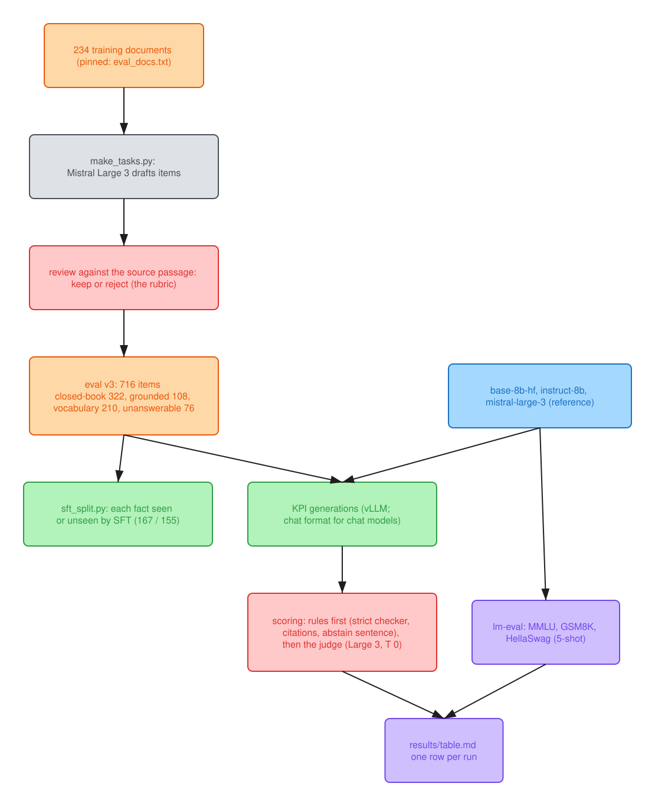

# Stage 0: the problem, the eval and the baselines

Colours: blue, checkpoints; orange, data; green, steps; purple, measurements; red, the rules
and gates that decided; gray, external models, controls and ablations.

**Result: the eval every later stage is read against, and the bar it sets.**
- **The eval:** 716 items in four tasks (closed-book questions, grounded answers with citations,
  definitions, unanswerable questions), written by Mistral Large 3 from the training documents and
  reviewed against their sources before any model was scored.
- **The base model** finds grounded answers but neither cites nor declines: it cites correctly 10%
  of the time and answers 88% of unanswerable questions with something invented (Stage 0's row, on
  eval v2).
- **Stock Instruct, the bar,** has that behaviour but no more domain knowledge: 9.6% closed-book
  against the base's 12.1% (strict, 322 items; Mistral Large 3 scores 26%).
- **So** closed-book knowledge is the gap CPT was meant to close, and SFT had to bring citation and
  refusal at least to Instruct's level ([where it starts](#where-it-starts)).

## The problem

Engineering organisations sit on decades of internal documents: design manuals, inspection
procedures, worked calculation examples, test reports. A general-purpose LLM has seen little of
it. Asked about those documents, it misses the specific values, clauses and vocabulary, invents
plausible answers, and can't point to the page it relied on. Retrieval helps with lookup, but it
doesn't teach the model the domain's language, and it doesn't change what the model does when the
answer isn't in front of it.

Mistral AI's Forge platform, as publicly announced, addresses this by training open-weight models
further on a client's own data across the whole lifecycle: continued pre-training on raw
proprietary text, synthetic data, SFT and preference optimisation, reinforcement learning, and
LoRA where lighter adaptation is enough, all measured against evals tied to the client's KPIs.
The default path starts from an existing checkpoint, not from scratch.

**This repo runs that lifecycle once, end to end, at roughly 1% scale.** Public-domain US federal
structural-engineering documents stand in for a client's private corpus: 246 manuals, reports and
design examples from USACE, FEMA, FHWA, NIST and NASA (20.6M Tekken tokens after cleaning; the KPI
eval tasks are sampled from the 234 training documents, at most 6 source passages per document per
task, and draw on 152 of them).
US federal works carry no licensing risk; copyrighted standards such as ASCE 7 and the AISC manual
are deliberately excluded. The starting checkpoint is Ministral 3 8B Base, from the same model
generation such engagements start from.

The two kinds of training do different jobs:

- **Continued pre-training (CPT)** on raw domain text (next-token loss) teaches knowledge and
  vocabulary. Its risk is forgetting general capability, which is managed by replaying general
  text and keeping the learning rate low.
- **Fine-tuning (SFT → DPO → GRPO)** on a few thousand curated examples teaches behaviour: answer
  from the passages given, cite them, decline when the answer isn't there, and get verifiable
  calculations right.

The goal is not a great model. It is a clean experiment with honest numbers and decisions that can
be defended, measured before and after every stage.

## How success is measured

The eval harness was built before any training, so it couldn't be fitted to a model. The same six
measurements run after every stage, with the base model and the off-the-shelf instruct model as
the first two rows.

| # | What it measures | Task | Metrics |
|---|---|---|---|
| 1 | Closed-book domain knowledge | 322 questions with exact or numeric answers from the corpus (eval v3 from Stage 3; 325 in v2, 130 until 2026-10-04) | `qa_acc`, by answer kind (`qa_num` / `qa_ident` / `qa_term`) and by SFT half (`qa_seen` / `qa_unseen`), plus the gold answer's log-probability (`gold_lp`: the answer tokens plus the one end token after them, both parts shown from 2026-10-09). From 2026-10-09 each `qa_*` is shown strict (`scorers.qa_strict`: the whole gold, one candidate, units compared) and lenient (the original `qa_correct`). |
| 2 | Answering from given passages, with citations | 108 questions, 4 passages each (gold plus distractors) | `grounded_acc`, `cite_valid`, `cite_supported` |
| 3 | Domain vocabulary | 210 terms to define in one sentence | `vocab_recall` |
| 4 | Declining when the answer isn't there | 76 questions whose 3 passages don't contain the answer | `halluc_rate` (lower is better) |
| 5 | General capability, to catch forgetting | MMLU, GSM8K, HellaSwag, 5-shot, no chat template and no BOS token (the frozen lm-eval flags send none, found in Stage 6): comparisons between rows stand, absolute values aren't comparable with published scores | `mmlu`, `gsm8k`, `hellaswag` |
| 6 | Serving cost | vLLM on one H100: 1 / 8 / 32 / 64 concurrent requests, Poisson 1 / 4 / 16 req/s (Stage 6) | time to first token, inter-token latency, throughput, goodput, $ per 1,000 requests |

Every task item was reviewed against its source passages before any model was run on it: 524 of
1,176 generated items survived the first review (2026-09-27), and 219 of 1,174 the second (195 in
the set after the identifier cap), which grew the closed-book task to cut its noise (2026-10-04,
[`notes/eval_review_rubric.md`](../notes/eval_review_rubric.md)). Layout locators (page, table and
figure numbers) are removed by rule, and identifiers are capped at 20% of the task. Items were rejected only for defects: a wrong or unsupported
gold answer, a correct answer the scorer would mark wrong, or a question that tests general
knowledge or trivia instead of the corpus. None was rejected for being hard. Tasks 2–4 are graded
by a pinned judge (Mistral Large 3,
temperature 0, cached verdicts), with anything a rule can decide (missing citations, empty answers,
the exact refusal phrase) decided by rule first.

## Where it starts

Row zero, from [`results/table_v2.md`](../results/table_v2.md) (eval v2, 4 October 2026; the original
130-item scores are in [`results/table_v1.md`](../results/table_v1.md), and every row is rescored on
v3's 322 items in [`results/table.md`](../results/table.md)):

- **The base model** finds the right answer in the passages 85% of the time but cites correctly only
  10% of the time, and answers 88% of unanswerable questions with something invented.
- **The instruct model** has the behaviour (79% of answers correct and backed by their citations,
  99% of unanswerable questions declined), but it knows no more of the domain closed-book: 9.9%
  against the base model's 12.0% on the 325 questions (12% against 14% on the original 130). Those
  are the lenient scorer's numbers. On v3's 322 items with the strict checker of 2026-10-09 they
  are 9.6% against 12.1%. For scale, Mistral Large 3 answers 28% of them closed-book (26% strict).
- **Closed-book domain accuracy is low for both.** That is the knowledge gap CPT is meant to close,
  while SFT brings citation and refusal behaviour up to the instruct model's level or beyond (DPO,
  on verifier-labelled pairs, left it where SFT put it), and the general-capability columns stay
  flat.

**Why the instruct model is the bar.** `Ministral-3-8B-Instruct-2512` (the BF16 HF checkpoint) is
Mistral's own instruct post-trained version of the base trained on here (model card).
- **Same model, different post-training:** the same 8B dense architecture, Tekken tokenizer and
  vision tower, starting from the same base. Its weights differ by Mistral's post-training, as the
  SFT runs' differ by this repo's. So every difference between them comes from post-training data
  and method, not model size.
- **The business claim:** it is what a client would deploy off the shelf. So beating it is "an 8B
  tuned on your corpus beats the stock 8B on your questions".

**How it is scored: without its default system prompt.** Its HF chat template
(`chat_template.jinja`) inserts a default system prompt ("You are Ministral-3-8B-Instruct-2512, a
Large Language Model (LLM) created by Mistral AI...") when none is given. The eval doesn't use that
template.
- **The KPI eval** renders every chat model through the same `--chat` path: vLLM with
  `tokenizer_mode=mistral`, that is mistral-common's `encode_chat_completion` of one user turn.
  It renders `<s>[INST] prompt [/INST]` with no system prompt.
- **The serving benchmark** goes through the same rendering, and lm-eval uses no chat template at
  all (rule 2).
- **So the comparison is on the template the eval renders, the one the SFT models were trained in,
  not the template Mistral ships for the instruct model.** Its default system prompt might change
  its refusal and citation behaviour; that was not measured here.

## Scope

This is the same pipeline shape as a production engagement at roughly 1% scale. It leaves out the
two parts that make the real thing hard: distributed full-parameter training on billions of
tokens, and enterprise data readiness and governance.

| | This repo | Production engagement |
|---|---|---|
| Base model | Ministral 3 8B, open weights | tens to hundreds of billions of parameters, dense or MoE |
| Corpus | 20M tokens of cleaned public PDFs | billions of tokens: documents, code, databases, images; messy |
| Continued pre-training | LoRA on one GPU, hours | full-parameter, multi-node, days to weeks, replay mix, annealing |
| CPT data | documents concatenated and read once, 20M tokens | the same next-token objective with data engineering around it: rewrites of the facts that matter, per-source mixture and repetition, section-level boundaries |
| Post-training | a few thousand SFT examples, ~500 verifier-labelled DPO pairs, a small GRPO run | 10k–100k+ examples reviewed with domain experts, RL with distillation |
| Evaluation | six-measurement harness plus regression suite | the same idea, built with domain experts, with audit lineage |
| Infrastructure | rented GPUs (Modal), open-source stack | isolated environments, data residency, versioned datasets and runs |

What transfers: the stages and their order, the failure modes, the eval design, and the recurring
decisions (how much general text to replay, LoRA versus full-parameter training, how far to trust a
judge). What doesn't: the engineering difficulty at scale.
