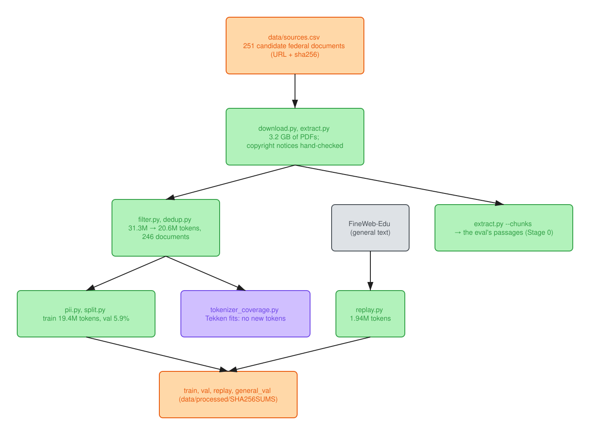

# Stage 1: the corpus

Colours: blue, checkpoints; orange, data; green, steps; purple, measurements; red, the rules
and gates that decided; gray, external models, controls and ablations.

**Result: 246 public-domain documents, 20.6M tokens after cleaning and deduplication (19.4M in the
train split), plus a FineWeb-Edu replay slice, and no benchmark leak.**
- **Benchmarks:** no GSM8K or HellaSwag item shares a 13-gram with the training text; 21 of 14,042
  MMLU items share one stock phrase.
- **Domain val** shares 1.5% of its 13-grams with train, less than a train document shares with the
  rest (median 2.0%). No 2026 report is a revision of a corpus document.
- **By design,** the closed-book eval items come from training documents: they measure recall of
  what CPT read ([contamination checks](#contamination-checks)).

The corpus card in [`notes/decisions.md`](../notes/decisions.md) ("Stage 1 corpus card") has every
number, generated from [`data/processed/stats.json`](../data/processed/stats.json) by `stats.py`:
documents and pages per publisher, pages dropped, paragraphs dropped per filter rule, exact and
near-duplicate removal, PII replacements, tokenizer fertility, and the train/val split.

## Tokenizer coverage

Does Tekken (131k vocabulary) fit this text, or does CPT need new tokens? Measured by
`data/scripts/tokenizer_coverage.py` on the clean corpus against ~1M tokens of FineWeb-Edu as
general English. The full report is
[`data/processed/tokenizer_coverage.md`](../data/processed/tokenizer_coverage.md).

| text | tokens per word |
|---|---|
| domain corpus (20.6M tokens) | 1.44 |
| FineWeb-Edu | 1.34 |
| top-500 TF-IDF domain terms | 1.12 |
| the 303 terms in the vocab eval | 1.43 |
| 18 designations and units (`ASCE 7-22`, `kip-ft`, `A709 Grade 50W`, ...) | 3.21 |

- **No vocabulary extension.** The corpus costs only 1.08x the tokens per word of general
  English, and the words that mark the domain (shear, girder, flange, diaphragm) are mostly single
  tokens.
- **Designations fragment, not vocabulary.** Only 34 of 843 term words take 4+ tokens:
  - document numbers and digit strings (`EM 1110-2-2104` is 13 tokens, because Tekken gives every
    digit its own token by design);
  - parenthesised acronyms;
  - hyphenated compounds.

  New embeddings trained on 20M tokens would cost more than those save.
- **Base and Instruct encode identically** (a corpus sample and every term word), so data and
  evals tokenised once serve both checkpoints.

## Replay slice

To limit forgetting, CPT can mix general text back in. `data/processed/replay.jsonl` is 1.9M Tekken
tokens (10% of train) from FineWeb-Edu, English web text filtered for educational quality, taken as
raw text from the head of its `sample-10BT` stream. Stage 2 runs CPT with and without it and
compares domain val perplexity with the MMLU, GSM8K and HellaSwag regression columns. It is ODC-By
web text, not public domain, so it is rebuilt from Hugging Face rather than committed, and nothing
in the eval comes from it. It is not a random sample (caveats in the corpus card). Its overlap with
the regression benchmarks was measured, below: none beyond stock phrases.

## Contamination checks

`eval/contamination.py` (CPU, about a minute) measures token 13-gram overlap between what CPT trained
on and everything evaluated against it. The method is GPT-3's (appendix C), counted on Tekken tokens
as in Llama 2. Full tables are in [`results/contamination.md`](../results/contamination.md).
- **What dedup already covers:** dedup keeps near-duplicate paragraphs off both sides of the
  document-level split, so this looks for sharing below the paragraph.
- **The matcher works on short items:** text cut from a training document and tokenised on its
  own, as a benchmark item is, comes back 99% matched.

| check | result |
|---|---|
| domain val vs train | 1.5% of val's 13-grams occur in train. A train document shares more with the other 233 (median 2.0%). Three val documents are above 5%, up to 20%, each next to a sibling in train (FHWA HIF-18-044 and -043, FEMA P-1100-2A and -2B, HIF-17-020 and -019). Without them the val gain is -2.33%, unchanged. |
| 2026 reports vs train | at most 1.35% per report, so none is a revision of a corpus document |
| MMLU / GSM8K / HellaSwag vs train and replay | GSM8K and HellaSwag: no 13-gram in either. MMLU: 21 of 14,042 items share one, all stock phrases ("in the 1960s and 1970s"), none half covered. |
| general val vs replay (both FineWeb-Edu) | 0.017% of tokens; disjoint |
| domain_qa few-shot vs the 325 scored items | no shot is a scored question, and the shots share no 13-gram with each other. Answer values recur only by coincidence ("4" in three unrelated items). Two shots come from the same passage as a scored item, qa-0003 and qa-0056, and ask a different fact. |

- **QA items from training documents are by design, not a leak.** The closed-book QA items come
  from training documents on purpose: they measure recall of what CPT read.
- **Why two scored items share a passage with the shots.** `make_tasks.py` takes the shots out of
  the item list, not the passage list. Neither shot gives away the answer:
  - 0.95 d_b in the shot, 75% scored;
  - 4 fiber elements in the shot, L/500 scored.

  The prompt is identical for every checkpoint, so no delta moves, and the frozen set keeps them.
  - **Tagged:** both carry `fewshot_passage_overlap: true` in `domain_qa.jsonl`, for per-item
    analyses to exclude.
  - **Fixed for the next rebuild:** `make_tasks.py --task-version 3` splits the shots off by
    passage. It keeps the v2 ids and only removes items: 322, the two plus one identifier under the
    20% cap.
  - **Guarded:** `tests/test_fewshot.py` fails if a new shared passage appears.

**Where the held-out gain sits.** The val and 2026 perplexity windows, binned by the share of their
tokens inside a 13-gram that also occurs in train (`cpt-8b-replay10` vs `base-8b-hf`; seed 1
agrees):

| tokens shared with train | val windows | val change | 2026 windows | 2026 change |
|---|---|---|---|---|
| under 1% | 157 | -1.70% | 56 | -0.11% |
| 1-5% | 86 | -2.54% | 21 | -0.90% |
| 5-20% | 44 | -3.56% | 5 | -2.00% |
| over 20% | 9 | -5.21% | 0 | |
| all | 296 | -2.33% | 82 | -0.43% |

- **Shared text is learned most, and the gradient is the shape of learning, not of a leak.**
  - The gain rises smoothly with overlap, from -1.70% on windows sharing under 1% of their tokens
    to -5.21% over 20% (Spearman -0.57 over the 296 val windows).
  - A leak would sit in a few copied windows instead.
  - Against that -1.70% floor, verbatim sharing carries about a quarter of the val gain.
  - This is an association: windows with more shared text are also more formulaic (base perplexity
    5.6 against 7.2).
- **It doesn't explain the gap to new documents.** On windows that share almost nothing, val still
  gains -1.70% [-2.25, -1.24] and the 2026 reports -0.11% [-0.46, +0.22]. That is 1.6 of the
  1.9-point gap.
  - The same holds at 8-grams, bin by bin.
  - So what val shares with train lies below copied strings: terms, notation, layout, a series'
    house style.

**Genre is not the explanation either.** The val documents are mostly manuals and the 2026 set is
mostly research reports, so "new documents" could have meant "a different genre". Each document was
labelled from the purpose stated in its front matter (`notes/decisions.md`), then the per-document
perplexity sums were pooled (`eval/ppl_compare.py --docs`; `cpt-8b-replay10`, `cpt-8b` and seed 1
agree within 0.15 points):

| | guidance: manuals, standards, design examples | research reports |
|---|---|---|
| val: the document's series is in train | -2.23% (10 documents) | -3.64% (2) |
| 2026: its series is not | -0.89% (2) | -0.32% (11) |

- **Neither genre explains it.** Val's research reports gain more than its manuals. The two new
  guidance documents (Army bridge load-rating guidance, an FHWA procurement guide) gain less than
  half of what val's manuals gain.
- **What separates the rows is the series.**
  - Every val document's series is in train: USACE EM, FEMA P, NIST GCR 917, FHWA HIF, NASA-STD.
  - None of the 2026 reports' series is: no NIST TN, ERDC or FHWA-HRT document is in train.
  - The two 2026 NIST GCRs are workshop reports from another programme; they gain -0.7% and -0.3%.

  So CPT transfers within a document series, across genre, and barely to a new series.
- **Small cells:** the val reports are two documents, and NIST GCR 12-917-21 is 92% of their tokens;
  HIF-18-047 alone gains -2.54%.

## Corpus sources

All US federal works (public domain, 17 USC 105); documents carrying a third-party copyright notice
are excluded (`extract.py` flags them for a hand check). The full list is
[`data/sources.csv`](../data/sources.csv): slug, publisher, title, URL, and the sha256 and page count
of the exact file processed. `download.py` reads it; each file lands at `data/raw/<slug>.pdf`.
USACE, fema.gov and ROSA P block scripted downloads (Akamai bot filter): get those in a browser,
save them under their slug or URL filename, and re-run `download.py` to hash them. Four FEMA
publications come from other hosts, recorded in the url column:
- P-695 from NIST's NEHRP clearinghouse (FEMA's copy is gone);
- P-751 from WBDG;
- P-58-4 and P-58-5 from ATC, their preparer (fema.gov serves them truncated).
