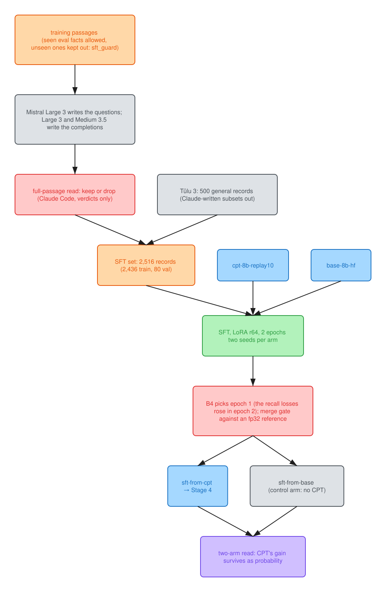
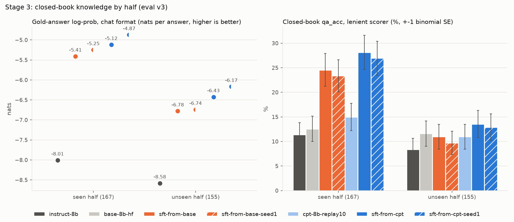

# Stage 3: supervised fine-tuning (SFT)

Colours: blue, checkpoints; orange, data; green, steps; purple, measurements; red, the rules
and gates that decided; gray, external models, controls and ablations.

Supervised fine-tuning on a synthetic, fully read instruction set: the CPT checkpoint
(`cpt-8b-replay10`) and, as the control for what CPT bought, the base (`base-8b-hf`), each with
the same set, config and data order, and each run twice (seeds 0 and 1) so the noise floor is
measured on both arms.
Everything below was fixed before training, including the checkpoint rule, the merge gate and how
the results are read. It is in [`notes/decisions.md`](../notes/decisions.md) (2026-10-06, Stage 3b),
with the two amendments made after the smoke run and the merge gate's, all before the evals they
govern.

**The data:** SFT set v1, 2,516 records (train 2,436, sft_val 80), dataset hash `70f47740`
(`data/sft/SHA256SUMS`).

| format | records | from eval-seen chunks | completion written by | read in full against the passages |
|---|---|---|---|---|
| closed-book | 1,144 | 892 | Mistral Large 3 869, Mistral Medium 3.5 275 | every record |
| definition | 276 | 266 | Large 213, Medium 63 | every record |
| grounded (4 passages, cited) | 401 | | Large 307, Medium 94 | every record |
| abstain (4 passages, no answer) | 195 | | the fixed sentence "Not in the provided passages." | the 53 hard negatives; 0 defects in 40 of the rest |
| replay (Tulu 3 SFT mixture) | 500 | | Tulu 3's sources: GPT-4o, GPT-3.5/4, Mixtral, people | sampled, not read |

- **Questions:** Mistral Large 3 wrote every domain question; half use the eval's exact
  instruction text and half are paraphrased.
- **Claude's part:** Claude built the tooling and read records against their passages,
  returning keep-or-drop verdicts only. No training record holds text Claude wrote, and the three
  Tulu 3 Persona subsets with Claude-written answers are excluded (rule 13).
- **sft_val** is the loss curve only, not a metric.

**The training run** (`train/configs/sft.yaml`; reasons in the pre-registration):

| item | value |
|---|---|
| starts | `cpt-8b-replay10` (sft-from-cpt) and `base-8b-hf` (sft-from-base, the control for what CPT bought) |
| format | Mistral chat, `<s>[INST] prompt [/INST] answer </s>`, no system prompt, pre-tokenised by mistral-common exactly as the eval's `--chat` path renders it; loss on the answer and its `</s>` only |
| LoRA | r 64, alpha 128, dropout 0.05, all seven projections of the language model (178M trainable) |
| optimiser and schedule | AdamW, LR 1e-4 linear to 0, 3% warmup, 32 sequences per step, 2 epochs (154 steps), one H100 |
| checkpoint rule | epoch 2 unless the closed-book or definition sft_val loss rose from epoch 1 to epoch 2 |
| gradient weight by format | token-weighted loss: replay 75%, grounded 16%, closed-book 4.6%, definition 4.3%, abstain 0.7% of the 179k completion tokens |

The training loss is token-weighted, so the 500 replay answers (general Tulu 3 instructions, long
completions) carry 75% of the gradient weight. Grounded answers carry 16%, and the recall formats
(closed-book and definition) 9%. Per-format loss weighting goes in next steps, not now.

Generated by `train/report.py` from `results/runs/`, `results/noop/` and `results/diversity/`:

<!-- stage3-tables:start -->
## Training runs

| run | start | steps | tokens trained | tokens/s | wall (h) | GPU-h | $ | peak GB | final train loss | val_loss epoch 1 / 2 | closed-book 1 / 2 | definition 1 / 2 | B4 picks |
|---|---|---|---|---|---|---|---|---|---|---|---|---|---|
| sft-from-cpt | cpt-8b-replay10 | 154 | 2.70M | 1,790 | 0.50 | 0.50 | 1.96 | 55 | 0.427 | 0.5592 / 0.5771 | 1.1655 / 1.3040 | 1.9832 / 2.0341 | epoch 1 |
| sft-from-base | base-8b-hf | 154 | 2.70M | 1,834 | 0.48 | 0.48 | 1.89 | 55 | 0.435 | 0.5592 / 0.5790 | 1.2134 / 1.3765 | 2.0178 / 2.0723 | epoch 1 |
| sft-from-cpt-seed1 | cpt-8b-replay10 | 154 | 2.70M | 1,737 | 0.54 | 0.54 | 2.12 | 55 | 0.362 | 0.5586 / 0.5804 | 1.1696 / 1.3126 | 1.8940 / 2.1049 | epoch 1 |
| sft-from-base-seed1 | base-8b-hf | 154 | 2.70M | 2,022 | 0.45 | 0.45 | 1.79 | 55 | 0.364 | 0.5580 / 0.5782 | 1.2347 / 1.3453 | 1.9116 / 2.0432 | epoch 1 |

B4 (pre-registered, amended before training): epoch 2 unless the closed-book or the definition sft_val loss (token mean) rose from epoch 1 to epoch 2. The overall val_loss is 83% replay tokens, so it is shown, not used. $ at 3.95 per GPU-hour (Modal's H100 SXM5 list price, checked 2026-10-09).

## Results next to the noise

| metric | instruct-8b | base-8b-hf | sft-from-base | sft-from-base-seed1 | cpt-8b-replay10 | sft-from-cpt | sft-from-cpt-seed1 | noise (Stage 3) | noise (Stage 2) |
|---|---|---|---|---|---|---|---|---|---|
| unseen gold-answer log-prob (nats) | -8.581 | -6.822 | -6.780 | -6.741 | -6.157 | -6.426 | -6.168 | 0.258 | 0.033 |
|   of it, the answer tokens | -7.709 | -6.356 | -6.197 | -6.199 | -5.697 | -5.895 | -5.684 | 0.210 | 0.033 |
|   of it, the end token | -0.872 | -0.466 | -0.583 | -0.542 | -0.460 | -0.531 | -0.484 | 0.048 | 0.005 |
| seen gold-answer log-prob (nats) | -8.008 | -6.722 | -5.409 | -5.249 | -6.356 | -5.120 | -4.873 | 0.247 | 0.032 |
|   of it, the answer tokens | -7.313 | -6.278 | -4.973 | -4.869 | -5.931 | -4.697 | -4.524 | 0.173 | 0.032 |
|   of it, the end token | -0.695 | -0.444 | -0.436 | -0.380 | -0.425 | -0.423 | -0.349 | 0.074 | 0.005 |
| qa_strict unseen | 0.077 | 0.116 | 0.084 | 0.077 | 0.110 | 0.116 | 0.110 | 2.6 | 2.7 |
| qa_unseen (lenient) | 0.084 | 0.116 | 0.110 | 0.097 | 0.110 | 0.136 | 0.129 | 2.7 | 2.7 |
| qa_strict seen | 0.114 | 0.126 | 0.239 | 0.234 | 0.150 | 0.287 | 0.258 | 3.5 | 2.8 |
| qa_seen (lenient) | 0.114 | 0.126 | 0.245 | 0.234 | 0.150 | 0.281 | 0.270 | 3.5 | 2.8 |
| qa_strict identifiers | 0.031 | 0.078 | 0.109 | 0.141 | 0.125 | 0.203 | 0.234 | 5.0 | 4.1 |
| qa_ident (lenient) | 0.031 | 0.078 | 0.125 | 0.141 | 0.125 | 0.203 | 0.234 | 5.0 | 4.1 |
| grounded_acc | 0.898 | 0.843 | 0.926 | 0.898 | 0.778 | 0.907 | 0.935 | 2.8 | 3.7 |
| cite_supported | 0.787 | 0.083 | 0.870 | 0.880 | 0.037 | 0.861 | 0.880 | 3.3 | 3.7 |
| halluc_rate (lower is better) | 0.013 | 0.895 | 0.066 | 0.013 | 0.934 | 0.053 | 0.013 | 3.9 | 3.3 |
| false_abstain (lower is better) | 0.074 | 0.009 | 0.000 | 0.009 | 0.000 | 0.000 | 0.009 | 0.9 | 0.0 |
| vocab_seen | 0.802 | 0.713 | 0.911 | 0.911 | 0.713 | 0.891 | 0.901 | 3.1 | 4.6 |
| vocab_unseen | 0.771 | 0.697 | 0.761 | 0.752 | 0.688 | 0.780 | 0.817 | 4.0 | 4.3 |
| MMLU | 0.761 | 0.767 | 0.767 | 0.768 | 0.766 | 0.766 | 0.770 | 0.4 | 0.3 |
| GSM8K | 0.855 | 0.793 | 0.792 | 0.790 | 0.791 | 0.814 | 0.792 | 2.2 | 1.1 |
| HellaSwag | 0.801 | 0.801 | 0.795 | 0.799 | 0.800 | 0.794 | 0.799 | 0.6 | 0.4 |

Values as fractions (gold_lp in nats per answer); noise in points (gold_lp in nats). Noise = max(the seed gap, the SE): Stage 3 for sft-from-cpt vs sft-from-cpt-seed1, Stage 2 for cpt-8b vs cpt-8b-seed1. The SE is binomial on the metric's items, lm-eval's stderr, or for gold_lp the paired per-item SE of the twins on that half. Starts: sft-from-cpt from cpt-8b-replay10, sft-from-base from base-8b-hf; instruct-8b is the bar.

## B7's first line: what CPT bought, measured after SFT

- **unseen gold_lp, mean of 2 CPT-arm runs - mean of 2 base-arm runs:** +0.464 nats per answer [95% CI over items +0.276, +0.660; 155 items, 68% up]; noise 0.130 (run-variance SD 0.130 from seed gaps 0.258 (CPT arm) and 0.039 (base arm), paired SE 0.099; the difference is 3.6 run SD, indicative only: each arm's SD rests on one seed pair (1 df). Single-run pairs +0.355, +0.315, +0.612, +0.573; every CPT-arm run above every base-arm run, an ordering with exact one-sided permutation probability 1 in 6): beyond the noise: CPT bought something that survives SFT. Of it, the answer tokens +0.409 [+0.227, +0.602] and the end token +0.055 [+0.021, +0.099]. The item CI conditions on these training runs; run variance enters only through the noise.
- **seen gold_lp, mean of 2 CPT-arm runs - mean of 2 base-arm runs:** +0.332 nats per answer [95% CI over items +0.191, +0.482; 167 items, 66% up]; noise 0.147 (run-variance SD 0.147 from seed gaps 0.247 (CPT arm) and 0.160 (base arm), paired SE 0.074; the difference is 2.3 run SD, indicative only: each arm's SD rests on one seed pair (1 df). Single-run pairs +0.289, +0.129, +0.536, +0.376; every CPT-arm run above every base-arm run, an ordering with exact one-sided permutation probability 1 in 6): beyond the noise: CPT bought something that survives SFT. Of it, the answer tokens +0.311 [+0.173, +0.456] and the end token +0.022 [+0.003, +0.039]. The item CI conditions on these training runs; run variance enters only through the noise.

## Checks

No-op control (an untrained adapter, merged, against its start):

| start | tensors | differ | max abs diff | passed |
|---|---|---|---|---|
| base-8b-hf | 531 | 0 | 0.0 | yes |
| cpt-8b-replay10 | 531 | 0 | 0.0 | yes |

Merge gate (B5, amended): over all 11,351 sft_val completion positions against an fp32 reference, the argmax flips the merge adds over the unmerged bf16 model's own, and its mean |delta log-prob| relative to the unmerged model's (max 1.5); val loss within 0.5%. Merged-vs-unmerged agreement and the 3-probe mean merge-error ratio are reported, not gated; sha256 of the merged checkpoint's file list:

| run | flips added | \|dlp\| ratio | val loss diff | merged vs unmerged top-1 | probe error ratio | checkpoint sha256 | passed |
|---|---|---|---|---|---|---|---|
| sft-from-cpt | 5 of 11 | 1.005 | 0.03% | 99.60% | 0.0516 | `db8ddabfc9a8` | yes |
| sft-from-base | 1 of 11 | 0.965 | 0.02% | 99.67% | 0.046 | `7c6458a78404` | yes |
| sft-from-cpt-seed1 | -8 of 11 | 0.978 | 0.02% | 99.54% | 0.0427 | `5f805f85ed59` | yes |
| sft-from-base-seed1 | 11 of 11 | 0.984 | 0.02% | 99.53% | 0.0466 | `272cbcb28872` | yes |

Diversity (100 prompts at T 0.7: 50 general, 50 domain; distinct-4 and entropy over output tokens) and </s> on sampled answers (the eos job: 4 Stage 4 pool prompts per format x 4 at T 0.8; 20 prompts while the pool held replay, 16 after, 2026-10-08):

| run | distinct-4 | entropy (bits) | mean length | distinct-4 general | distinct-4 domain | stopped (T 0.7) | stopped (eos job) |
|---|---|---|---|---|---|---|---|
| instruct-8b | 0.8104 | 9.7998 | 343.2 | 0.8099 | 0.817 | 0.82 |  |
| sft-from-cpt | 0.7724 | 9.0197 | 163.4 | 0.7567 | 0.8646 | 0.98 | 98.8% of 80 |
| sft-from-base | 0.79 | 9.3114 | 185.3 | 0.7765 | 0.8847 | 0.95 | 98.8% of 80 |
| sft-from-cpt-seed1 | 0.7799 | 9.1733 | 196.4 | 0.7719 | 0.837 | 0.97 | 98.8% of 80 |
| sft-from-base-seed1 | 0.8026 | 9.3672 | 190.8 | 0.7955 | 0.8533 | 1.0 | 98.8% of 80 |
<!-- stage3-tables:end -->

**What holds.**
1. **At 2,436 records, the recall formats overfit in the second epoch, in all four runs.**
   - Closed-book and definition val loss bottomed at the end of epoch 1 and rose through epoch 2,
     while train loss kept falling: the set was being memorised.
   - The pre-registered rule (amended before training to read those formats, not the mixture mean)
     caught it on every run and took epoch 1.
   - For a domain SFT set this size, one epoch is the budget, and the recall formats are where to
     watch for overfitting.
2. **It stops.**
   - Every KPI answer, 98.75% of sampled answers and 100% of bench requests end on `</s>`.
   - End-to-end latency at one request is 159 ms, against the CPT checkpoint's 1,753 ms: it stops
     instead of running to the cap (Serving).
3. **It cites and it doesn't over-refuse.**
   - Cited answers backed by the cited passages: 86.1% against Instruct's 78.7%.
   - False refusals on answerable grounded questions: 0% against Instruct's 7.4%.
   - Grounded accuracy matches Instruct (90.7% vs 89.8%).
4. **General ability is intact.** MMLU, GSM8K and HellaSwag are within noise of each start.
5. **SFT repaired the passage reading that CPT eroded.**
   - Raw-text CPT cost few-shot passage reading: grounded_acc went from 0.843 for the base to 0.778
     for `cpt-8b-replay10`, 1.8x the 3.7-point noise. Eroded instruction behaviour is a known cost
     of continued pre-training.
   - SFT took both arms to 0.90-0.94 (one run, sft-from-base-seed1, at 0.898, level with
     Instruct), so the cost didn't carry into the chain.
6. **CPT's contribution survives SFT.**
   - **The rule:** it passes the pre-registered rule.
   - **Consistency:** it holds in all four pairings of a CPT-start run with a base-start run, and
     on both halves.
   - **The seed-matched pairs are the cleanest comparisons.** Each seed used the same data order and
     LoRA init in both arms. At seed 0 the difference is +0.355; at seed 1 it is +0.573. The
     difference of the arm means is +0.464.
   - **The per-item CI:** [+0.276, +0.660] nats per answer on the unseen half.
   - **The run-variance estimate rests on one seed pair per arm,** so the SD multiple is indicative.
     A third seed per arm is what would turn it into a test.

   | unseen-half `gold_lp`, CPT arm − base arm (2 seeds each) | value |
   |---|---|
   | difference of arm means (nats per answer) | +0.464 |
   | per-item 95% CI | [+0.276, +0.660], 68% of items up |
   | the four single-run pairs | +0.355, +0.315, +0.612, +0.573 |
   | run-variance floor from both seed gaps (0.258, 0.039) | 0.130, so 3.6 SD |
   | the same with the CPT arm's gap on both arms | 0.182, so 2.5 SD |
   | seen half, difference of arm means | +0.332 (2.3 SD) |

   - **The SD multiples aren't sigmas.** They rest on 1 degree of freedom per arm, so read them as
     indicative, not as a p-value.
   - **The robust statement is the rank one.** Every CPT run beats every base run, and the smallest
     of the four pair differences (+0.32) exceeds the CPT arm's own seed gap (0.258). With 2 runs
     per arm, that ordering has an exact permutation probability of 1 in 6.
   - **Pass/fail:** unseen qa_acc is 11.3% against 8.1% between the arm means on the strict
     checker (13.2% against 10.3% lenient), inside the binomial noise: reported, not argued. The effect lives in the probabilities, as Stage 2's did.
   - **Identifiers are the line that holds across stages.**
     - Stage 2's CPT moved them most per answer. Per token (+0.127 nats) they were second to terms
       (+0.147, a wide interval on 38 items); per answer they lead because they are the longest
       answers.
     - After SFT, the CPT arm leads the base arm on qa_ident by +9.4 points on the strict checker
       (0.219 vs 0.125; +8.6 lenient, 0.219 vs 0.133). That is on 64 items, with a standard error
       of about 5 points per run.
   - **The design is blocked by seed, and the seed shows.**
     - Seed 1 beats seed 0 in both arms: on seen `gold_lp` (−5.25 vs −5.41 base, −4.87 vs −5.12
       CPT), on unseen `gold_lp` (−6.74 vs −6.78, −6.17 vs −6.43), on qa_ident (strict and lenient), and on final train
       loss (0.36 vs 0.43 in both arms).
     - Hallucinations follow the same line: 5 and 4 at seed 0, 1 and 1 at seed 1.
     - In a one-epoch run, data order is a hyperparameter, and the "seed gap" here is LoRA init
       plus data order, inseparable. This is observed, on two blocks; nothing more is claimed.
   - **What can't be computed here: how much of CPT's own gain survives SFT.** CPT's `gold_lp`
     (−6.16 unseen) is scored in base format and the SFT rows' in chat format, so the two columns
     can't be subtracted. The comparison that has a number is the one above: SFT from CPT against
     SFT from the base, both in chat format.

**What is weaker than a summary would make it.**
1. **The gain over Instruct on closed-book facts is retention, not capability.** The seen half's
   facts were in the training set by design; the unseen half's were not.

   | closed-book | seen half, strict: retention of trained facts | unseen half, strict: transfer | seen / unseen, lenient |
   |---|---|---|---|
   | instruct-8b | 19/167 (11.4%) | 12/155 (7.7%) | 19 / 13 |
   | cpt-8b-replay10 (start) | 25/167 (15.0%) | 17/155 (11.0%) | 25 / 17 |
   | sft-from-base | 40/167 (24.0%) | 13/155 (8.4%) | 41 / 17 |
   | **sft-from-cpt** | **48/167 (28.7%)** | **18/155 (11.6%)** | 47 / 21 |
   | identifiers, instruct-8b | 2/30 | 0/34 | 2 / 0 |
   | identifiers, sft-from-cpt | 10/30 | 3/34 (its CPT start: 3/34) | 10 / 3 |

   Strict is the checker written for Stage 5's reward (`scorers.qa_strict`, 2026-10-09). The
   lenient counts are what this section first reported (`qa_correct`): ranges, fraction first
   numbers and child sections pass there. No ordering changes.

   - **Terms are 38 items, so read them as counts.** Correct answers are 2 for instruct-8b, base and
     CPT, 0 and 2 for sft-from-base s0/s1, 1 and 4 for sft-from-cpt s0/s1, and 7 for Large 3. As a
     rate (0.000-0.105) the column invites a reading it can't support: one item is 2.6 points.

   - **Seen half:** a client wants the model to know their documents, and SFT delivers that here,
     about 2.5x Instruct (strict: 28.7% against 11.4%). It matches Mistral Large 3's 26.3% on the
     same items (lenient: 28.1% against 27.5%). These are facts that were in the training set, and
     Large 3 never saw them.
   - **Unseen half:** 11.6% against Instruct's 7.7% (strict, 18 against 12 of 155; lenient 13.5%
     against 8.4%). The +3.9 points clear the Stage 3 floor (2.6), but the paired item-bootstrap
     95% CI, [−1.3, +9.0], includes 0, and the untrained `base-8b-hf` also gets 18 of 155. The lead
     is Instruct's deficit, not something training added. Every unseen identifier it gets right,
     its CPT start already had. *(Corrected 2026-10-10: this line read "sits inside the noise
     floor" and named no test.)*
2. **Replay carried the gradient.**
   - 500 general Tulu 3 answers are 20% of the records, but their long completions are 75% of the
     token-weighted loss. The closed-book and definition records the seen half measures are 9%.
   - The run was mostly general instruction tuning with a domain component.
3. **Hallucination on unanswerable questions is 4 of 76 against Instruct's 1 of 76** (5.3% vs 1.3%).
   The seed twin also has 1 of 76, so the difference is a few items, at the edge of the run-to-run
   spread. Both are inside the pre-registered target (< 20%).
4. **Diversity passes its line on length-confounded numbers.**
   - **The numbers:** distinct-4 −4.7% and entropy −8.0% against Instruct, inside the
     pre-registered 10%.
   - **The confound:** answers are half Instruct's length, a style the teacher's short completions
     taught. Pooled entropy and distinct-4 move with length.
   - **Why it matters for Stage 4:** if 4 samples per prompt at T 0.7 come out near-identical, DPO
     pairs have no margin. It is checked on the first 20 prompts before sampling the pool.
5. **Two gates were amended before the evals they govern** (both recorded in `decisions.md`).
   - **The step-1 loss band** assumed recall answers. It is now read per format.
   - **The merge gate's 3 probes** (295 positions) put a 99% line 2 flips from failing. The CPT
     run's merge failed on 4 flips of near-tie noise. The amended gate compares the merge against an
     fp32 reference over all 11,351 positions: it adds 5 flips to bf16's own 74. Every gated
     checkpoint's sha256 matches the one evaluated.
   - **sft-from-base-seed1's merge** passed the amended gate at its line: exactly 11 added flips of 11
     allowed, with log-prob error 0.98x and val loss within 0.02%.

**Scored against its pre-registered targets:** every B7 target passes. Two rows below aren't B7
targets and are marked as such.

| target (B7, fixed before training, unless marked) | result | verdict |
|---|---|---|
| CPT's advantage survives SFT (unseen `gold_lp` beyond the floor) | +0.46 nats, all four pairings positive | pass; the SD multiple rests on one seed pair per arm |
| beat Instruct on identifiers | 0.203 vs 0.031 (strict and lenient agree) | pass |
| beat Instruct on vocab | 0.833 vs 0.786 | pass, narrowly (1.5x the noise) |
| match Instruct on grounded and citation | grounded 0.907 vs 0.898; cite_supported 0.861 vs 0.787 | pass; beats on citation |
| guards: no half below its start by more than the noise; MMLU and GSM8K within noise + 1 point | lenient (as scored then): all four runs (the base arm's unseen half 0.110 / 0.097 against its start's 0.116). Strict (2026-10-09): the CPT arm passes, but the base arm's unseen half is 0.084 / 0.077 against 0.116, 3.2-3.9 points down against a 2.7-point noise | pass as scored then; under the strict checker it fails for the base arm, the control (its unseen hedges, above), not for the chain |
| abstain: > 80% on unanswerable, < 5% false refusals | 94.7%; 0% | pass |
| diversity within 10% of Instruct | distinct-4 −4.7%, entropy −8.0% | pass, length-confounded |
| stops before the cap; latency (B5/B6 checks, not B7) | 100%; 159 ms vs 1,753 ms | pass |
| hallucination against Instruct (not a target: B7 listed Instruct's 0.013 as a reference, and its abstain target is above) | 4 of 76 vs 1 of 76 | worse, inside the run-to-run spread (the seed twin has 1 of 76) |

**The guard that fails under the strict checker is a second line of evidence for what CPT bought.**
- **The base arm hedged:** SFT from the base lost 3 to 4 points of unseen strict accuracy, and its
  lenient-only passes were hedges, ranges and fractions where the gold was one number.
- **The CPT arm did not.**
- **That is Gekhman et al. (2024) in miniature:** SFT on facts the model doesn't hold teaches it to
  hedge or invent, and the CPT arm held them. It sits beside unseen `gold_lp` (+0.41 nats on the
  answer tokens) as evidence for CPT.
- **Caveat:** one seed pair per arm (1 df).

**What SFT did, and what it didn't.** SFT did its job, behaviour and the facts it was shown, and
it did not erase CPT's knowledge. It did not generalise to unseen facts, which was never a
target.
- **Behaviour is SFT's own, and the deliverable.** Answer form, citations that are valid and
  supported, abstaining without over-refusing, and stopping. This is where it beats Instruct
  outright.
- **The facts it was shown are SFT's own too.** The seen half doubled in both arms: 0.150 → 0.281
  from CPT and 0.126 → 0.245 from the base. Most of that gain is SFT teaching the facts in its
  data, not CPT's knowledge surfacing.
- **What is CPT-specific is the arm difference.** SFT preserved CPT's knowledge and made it usable
  in chat form. Starting from CPT rather than the base is worth +0.46 nats on unseen `gold_lp` (+0.41 of it in the answer tokens [+0.23, +0.60], +0.06 in the end token),
  +3.6 points on the seen half and +8.6 on identifiers (about 1.7 SE). It is real by the rule and
  smaller than the seen-half gain.
  - Unseen accuracy differs by +3.2 points between the arms on the strict checker (0.113 vs 0.081;
    +2.9 lenient, 0.133 vs 0.104). That is inside the binomial noise, so it isn't the evidence;
    `gold_lp` is.
  - Whether this is "the same" knowledge CPT added (+0.66 nats over the base, in base format; +0.66 in the answer tokens)
    can't be computed across the format split. The arm difference is consistent with it.
- **SFT added no unseen knowledge in either arm.**
  - Unseen accuracy moved 0.110 → 0.113 for the CPT arm (strict; 0.133 lenient), inside the noise.
  - **The base arm's unseen accuracy fell 0.116 → 0.081 on the strict checker** (0.104 lenient), which
    is beyond the noise.
    - Its lenient-only passes on unseen items were hedges: two ranges ("12 to 18 inches" for "12
      in.", "10 to 12 feet" for "10 feet"), a fraction read as its first number ("1/2 inch" for "1
      in.") and a child section.
    - The control arm learned to hedge where it didn't know, and the lenient scorer credited it.
  - The only unseen effect in the whole table is CPT's. The unseen half is bounded by what the
    weights knew before SFT: pretraining plus 19M tokens of CPT.
  - This is the textbook division of labour. Continued pre-training puts knowledge in;
    fine-tuning teaches behaviour and makes stored facts extractable.
    - QA fine-tuning extracts facts only when pre-training exposed them with enough variety
      (Allen-Zhu & Li 2023, "Physics of Language Models, Part 3.1").
    - Fine-tuning on facts a model doesn't know is learned slowly and raises hallucination rather
      than knowledge (Gekhman et al. 2024).
- **The lever for the unseen half is upstream.**
  - Only more, and more varied, CPT exposure acts on unseen facts here: paraphrased and
    restructured corpus text, not one pass over concatenated documents (Stage 2's "what I would
    do differently", item 3). DPO and GRPO shape behaviour on prompts, as SFT does, and won't move
    it.
  - Mistral Large 3 answers 28.4% of the same unseen questions, so the questions are answerable.
    The ceiling here is how much the weights know.

## What I would do differently (Stage 3)

1. **Look at the gradient shares before freezing the loss.**
   - Replay's long answers carry 75% of the token-weighted loss, and the recall formats the seen
     half measures 9%, so the run was mostly Tulu training.
   - It surfaced only after the smoke run, from a number misread on the smoke batch.
   - Per-record or per-format weighting, or a replay token cap, decided with the data, would have
     aimed the gradient at the facts.
2. **Give both arms of the control a seed twin from the start.** "What CPT bought" was first read
   against a noise floor from one arm, at 1.4 SD. The base arm's twin (0.5 GPU-h) put it at an
   indicative 3.6 SD (one seed pair per arm). It should have been in the plan, not added after the
   read.
3. **Size a gate's sample for its threshold, and reference it to the exact function.**
   - A 99% agreement line on 295 positions is two flips from failing.
   - Comparing two bf16 models measures bf16's own near-tie noise.
   - The fp32-referenced, full-set comparison costs a few GPU minutes and should have been the gate
     from the start.
4. **Pre-register sanity bands per format.** A mixture's token mean hides the formats that matter,
   and the step-1 band failed for that reason, not for a bug.
5. **Find the minimum, don't bracket it.** All four runs overfit in epoch 2. An eval every ~15
   steps on the recall formats would locate the best step, rather than choosing between two epoch
   ends.

## What I'd do next

**From Stage 3:**
- **Check sample diversity before building DPO pairs:** 4 samples per prompt at T 0.7 on the first
  20 prompts. Near-identical samples give pairs with no margin. *Done in Stage 4: 0 of 18
  non-abstain prompts collapsed.*
- **Weight the loss per format.** SFT's token-weighted loss gives the 500 replay answers 75% of the
  gradient and the closed-book and definition records, the ones the seen half measures, 9%.
  Normalising per record or per format, or capping replay's share, would aim the gradient at the
  domain facts. It wasn't changed for Stage 3, whose set and loss were frozen before training.
- **Padding-free batches with FlashAttention-2.** SFT trained at about 1.8k tokens/s against
  Stage 2's 5.9k. That is the cost of no packing: each micro-batch is padded to its longest record,
  and SDPA computes on the padding. `padding_free` with FA2 (a flash-attn build in the image)
  recovers it. It belongs with the per-format loss weighting, since both change the batch.
