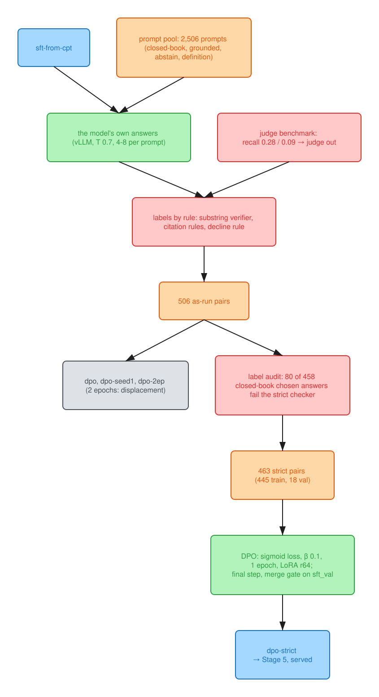

# Stage 4: DPO on verifiable preferences



Colours: blue, checkpoints; orange, data; green, steps; purple, measurements; red, the rules
and gates that decided; gray, external models, controls and ablations.

**Result: one epoch of DPO on 484 verifier-labelled pairs is indistinguishable from its SFT start
on every pre-registered line; two epochs fit the pairs and displaced the chosen answers.** The
stage's two findings are that displacement curve, measured end to end with no judge noise to
blame, and the judge's failure, which is why every pair carries a verifier or rule label.

**Amended 2026-10-09, post hoc and labelled: sampled accuracy moved.**
- The pre-registered lines were greedy accuracy, gold log-probability and the guards, and they are
  unchanged.
- Sampled accuracy (pass@k, 8 samples at T 0.7) was not measured in Stage 4. Measured in Stage 5
  as a reported line added after the fact, it moved:
  - seen pass@1 +3.1 points [+1.0, +5.5] for `dpo` and `dpo-seed1`, and +3.5 [+1.2, +6.0] for
    `dpo-strict`;
  - pass@8 flat (−3.0, inside the noise).
- DPO sharpened sampled accuracy at a small calibration cost: `dpo-strict`'s gold-answer tokens
  fell 0.11 nats seen (inside the floor) and 0.38 unseen (beyond its 0.210 floor), while the end
  token rose about 0.10, which the composite netted out. *(Corrected 2026-10-10: this line read
  "almost no cost", written before `gold_lp` was split, `notes/decisions.md` 2026-10-09.)*

**Amended 2026-10-09: 79 of the 458 closed-book chosen labels were wrong.** The audit was made when
the closed-book verifier was about to become Stage 5's reward. Retrained on strict labels
(`dpo-strict`, 445 pairs), DPO is still indistinguishable from SFT on seen accuracy and
hallucination, so label noise was not why it didn't move. `dpo-strict` is now Stage 4's
checkpoint ([below](#the-label-audit-and-dpo-strict)).

Direct preference optimisation from the Stage 3 checkpoint (sft-from-cpt, epoch 1), on pairs the
SFT model wrote itself: every chosen and every rejected answer is one of its own samples, and a
verifier or a rule decides which is which. It was planned with a Mistral Large 3 judge labelling
grounded and definition answers. The judge failed its pre-registered benchmark (below), so it
labels nothing, and the stage became DPO on verifiable preferences (the RLHF Book's ch. 11 case;
Tülu 3's IF-constraint pairs are built the same way). The plan, the benchmark rule and the
amendment, made after the benchmark and before any pool sample, are in
[`notes/decisions.md`](../notes/decisions.md) (2026-10-08).

**The prompts:** 2,506 (`data/dpo/prompts.jsonl`, sha256 `a44cb6b3`): the SFT set's domain prompts
(no replay) and the 562 definitions the Stage 3 cap cut, never trained on. 100 are held out for
the win rate and 125 for dpo_val.

**The samples:** sft-from-cpt at T 0.7, 4 per closed-book prompt and 8 per grounded, definition
and abstain prompt: 14,912, all ending on `</s>`. No collapse in the pre-registered probe (0 of 18
non-abstain prompts).

## The judge failed its benchmark

This is the strongest evidence in the repo for why the chain ends with verifiers only. Before any
pair was labelled, the judge was measured on 166 SFT-builder answers whose defects a full-passage
read had found or cleared (the 2026-10-05 rule). The A5 judge had passed every one of them one at
a time. Here each was judged as it would be in the pool: listed with three of the student's own
answers to the same prompt, all graded in one call.

| format | prompt variant | defects caught (recall) | clean answers passed | AUROC |
|---|---|---|---|---|
| grounded (60 defects, 60 clean) | rubric as is | **0.28** | 0.92 | 0.66 |
| | quote the supporting sentence first | 0.18 | 0.95 | 0.67 |
| | full page instead of the chunk | 0.22 | 0.92 | 0.67 |
| definition (23 defects, 23 clean) | rubric as is | **0.09** | 0.87 | 0.54 |
| | quote first | 0.09 | 0.83 | 0.51 |
| | full page | 0.04 | 0.83 | 0.50 |

- **The line was recall ≥ 0.5 at ok-pass ≥ 0.8.** Neither format passed, and no prompt variant
  helped.
- **What it misses is the audit's kind of defect:** a dropped caveat, a gap in an OCR'd passage
  filled in, one example generalised into a rule. In several misses the judge's own reasoning
  names the flaw and the score is still 5 ("inaccurately expands PUD to 'Probable Ultimate
  Demand', which is not explicitly defined in the passage").
- **Why a ~25% catch rate can't label pairs:** with ~10% defect prevalence, a judge "fail" at
  this recall and ok-pass is a true defect only about a quarter of the time, so the rejected side
  of judged pairs would be mostly good answers.
- **Three biases, measured:**
  - **list position:** the mean score falls about 0.5 point from the first answer to the fourth;
  - **self-preference:** the student's answers score 0.8 (grounded) and 2.1 (definition) points
    below Large 3's own answers, defective ones included;
  - **pairwise order:** as the win-rate judge (below), it agreed with itself across the two answer
    orders on 43-54% of prompts, a coin flip.
- **The KPI eval's judge is a different prompt:** `grounded_acc` and `cite_supported` use the same
  model (Large 3) with strict binary prompts that name the gold passage and list the parsed
  citations (`eval/judge.py`). The Stage 0 hand-check found that prompt errs strict, but this
  benchmark did not test it.
- **Next step for a judge:** a per-claim support check (split the answer into claims, check each
  against its cited passage), benchmarked on the same labels before it labels anything.

The listwise prompt (`data/scripts/sft_judge.py`, `judge_list`), with the format's A5 rubric
inserted and each grade scored as the SFT builder's judge scores one:

```text
You are grading {n} answers to the same question, for a model that answers questions
about US federal structural engineering documents. Grade strictly against the rubric. Grade every
answer on its own: decide each rule for each answer separately; the other answers are not a
reference, and their order means nothing.

Source the answers must rest on:
{passages, labelled [P1]-[P4]}

Question:
{question}

Answers to grade:
[Answer 1]
...

Rubric:
{hard rules, principles with weights, pitfalls}

Return JSON with one grade per answer, in answer order, each with its reasoning first:
{"grades": [{"answer": 1, "reasoning": "...", "hard": {...}, "principles": {...},
  "optional": {...}, "pitfalls": {...}}, ...]}
```

## The pairs

Every label is a verifier or a rule (`data/scripts/dpo_score.py`, `dpo_pairs.py`):

- **Closed-book:** the answer states the gold fact (the SFT builder's verifier, `same_fact`); the
  chosen answer also passes a form check. `same_fact` was too lenient: it passed any piece of the
  gold and judged multi-number golds on their first number, and 79 of the 458 closed-book chosen
  labels fail the strict checker that replaced it ([the label audit](#the-label-audit-and-dpo-strict)).
- **Abstain:** declining on an unanswerable prompt over answering it.
- **Grounded:** a rule-passing answer over one that cites an id it wasn't given, doesn't cite the
  passage the question came from, or refuses an answerable question.
- **Definition:** no pairs, since no verifier knows a definition's quality.

| | closed-book | grounded | abstain | total |
|---|---|---|---|---|
| as registered (closed-book capped at half) | 57 | 51 | 6 | **114** |
| as trained (cap lifted, judge out) | 458 | 42 | 6 | **506** |
| strict rebuild (`dpo-strict`, 2026-10-09) | 415 | 42 | 6 | **463** |

- **Composition: DPO on seen facts.**
  - 458 of the 506 pairs are closed-book: one-line answers to prompts SFT already trained on.
  - Chosen and rejected share everything but the value: a median 5-token answer differing in a
    median 3 tokens ("48 months" against "36 months").
  - Seen qa_acc didn't move beyond the noise even there (below), strict or lenient.
- **Size:** 506 pairs (train 484, dpo_val 22), dataset hash `a899f7d2` (`data/dpo/SHA256SUMS`).
  That is under smol's 1,000-pair floor for domain DPO; Tülu 3 used ~270k.
- **The cap was a mix rule, not a validity rule.** Lifting it is a post-hoc amendment of the mix,
  recorded as one.
- **Abstain:** 6 pairs, because the student answered only 2% of unanswerable samples.
- **Self-preference:** chosen and rejected share a generator, so self-preference can't bias which
  answer is chosen.

**The training run** (`train/configs/dpo.yaml`): TRL 0.29.1 `DPOTrainer`, sigmoid loss, β 0.1;
LoRA r 64 / α 128 on the language model; LR 1e-5 linear, 10% warmup; 16 pairs per step, one
epoch (31 steps); the reference is the SFT checkpoint with the adapter off, precomputed. Seeds 0
(`dpo`) and 1 (`dpo-seed1`). Two changes to TRL:
- **Pre-tokenised pairs:** the trainer gets vLLM's sampled token ids, the exact tokens the policy
  produced.
- **Log-probabilities in fp32:** TRL sums them in bf16, which rounds a sequence log-probability to
  0.5-1 nat, more than the early policy/reference gap.

The checks around it:
- **Checkpoint rule:** the final step unless the dpo_val loss at the end is above its value at the
  save nearest the midpoint. It kept the final step on both runs.
- **Merge gate:** run on sft_val (11,351 positions), because dpo_val is 22 pairs and 665 positions,
  too few for the 0.1% flip line. Both runs passed (4 and 1 added flips of 11).


## The read: one epoch is indistinguishable from the start

The table below reads every pre-registered line two ways. **The verdict uses the Stage 3 way**, as
for the CPT-vs-base read: the start is one run of a noisy stage, so its own seed gap
(sft-from-cpt against its twin) belongs in the floor.

- **The rule as written** (max of the DPO seed gap and the start's SE) reads two lines as beyond
  the noise:
  - hallucination −3.3 pt against 2.6 (1.3×);
  - unseen gold-answer log-probability −0.21 nats against 0.19 (1.1×).
- **The split, measured after the fact (2026-10-09, post hoc):** DPO moved the answer's format as
  well as its likelihood.
  - **The end token rose:** +0.10 nats on seen facts and +0.12 on unseen, both beyond the noise.
    DPO made stopping after the gold more likely.
  - **The answer tokens fell:** −0.08 on seen facts (inside the noise) and −0.33 [−0.45, −0.22] on
    unseen, which is beyond the Stage 3-way floor (0.21).
  - **The composite hid it:** it netted the two, which is why it read as inside the noise.
- **With the start's seed gap in the floor, both fall inside:** −3.3 against 3.9 pt, −0.21
  against 0.258 nats. No other primary line moves either way.
- **Hallucination carries no headline:** 4 of 76 → 1 and 2, resting on 6 abstain pairs, and the
  SFT start's own twin already sits at 1 of 76.
- **Facts:** qa_seen +1.8 pt and qa_unseen −0.3 pt (the lenient scorer, as registered; strict
  +0.9 and −0.3), inside the noise. That includes the seen facts the pairs were made of.
- **Unchanged:** false abstain (0 of 108), `cite_valid` (1.000), MMLU, GSM8K, answer length (−21%
  to +3%).
- **The policy barely moved:** train loss 0.693 → 0.654, dpo_val margin 0.06, `rewards/chosen`
  near zero.
  - 58 of 100 greedy answers are byte-identical to SFT's.
  - 82 of 100 win-rate comparisons are ties.
  - The win rate itself is 0.52 and 0.515 (SE 0.05), reported only.
- **Serving:** not read here. The Stage 2-5 latency cells are single samples on an unrecorded GPU;
  Stage 6 measures serving.

## The finding: the displacement curve

`dpo-2ep` is the same data, seed and recipe for two epochs (62 steps, linear schedule over both,
epoch 2 evaluated). It is an ablation, not a candidate, added post hoc because the one-epoch loss
ended at 0.654 with the margin still rising.

- **At 31 steps the policy barely moved:** dpo_val margin 0.06, `rewards/chosen` near zero.
- **At 62 it fit the pairs and displaced the chosen answers:**
  - train reward accuracy reaches 0.95, while dpo_val stays flat at 0.68;
  - the chosen answers lost about 2.3 nats on dpo_val (`rewards/chosen` −0.23 at β 0.1) and the
    rejected about 6.1, so the margin grew by pushing both down;
  - gold-answer log-probability fell 3.0 nats on seen facts and 4.3 on unseen (CIs
    [−3.5, −2.5] and [−5.0, −3.7]), in the answer tokens, on 80% of items;
  - seen qa_acc fell 4.8 points against one epoch (lenient 0.311 → 0.264, strict 0.305 → 0.258),
    below the SFT start (0.281 lenient, 0.287 strict).
- **Unchanged even then:** hallucination, false abstain, `cite_valid`, qa_unseen (strict and lenient), MMLU, GSM8K.
- **What it is:** the preference displacement of the RLHF Book's ch. 8, measured end to end on a
  verifier-labelled set.
- **Why the window is so narrow here:** with 484 near-duplicate pairs (chosen and rejected share
  everything but the value), the usable window between "no effect" and "displacement" is too
  narrow to land in. Two fixes, which are next steps 1 and 2:
  1. **an NLL anchor on the chosen answer:** RPO, `rpo_alpha` in the DPO literature (ch. 15),
     `loss_type: [sigmoid, sft]` in TRL 0.29.1;
  2. **pairs at a scale where one epoch is many steps.**
- **The checkpoint rule picked wrong.** It read the dpo_val DPO loss, which kept falling (0.647 at
  step 30 → 0.571) while dpo_val accuracy sat at 0.68 and `rewards/chosen` went negative. For DPO
  the selector should be `rewards/chosen` ≥ 0 or val accuracy, never the loss. (No dpo_val eval
  landed at step 31; step 30 stood in.)
- **Its merge gate is flagged:**
  - The val-loss criterion read 0.58% against 0.5%: merged 0.5663 against unmerged 0.5696 nats on
    sft_val, 0.0033 apart.
  - The merge-isolating criteria pass: the merge adds 5 argmax flips against fp32 (11 allowed),
    and its |Δlp| is 1.43× the adapter's own (line 1.5).
  - The merge error's tail is longer than one epoch's (max 4.18 nats against 0.55), consistent
    with a bigger adapter delta cast to bf16.
  - Evaluated under the rule fixed before the diagnosis (`notes/decisions.md`, 2026-10-09).

## The label audit and dpo-strict

**The verifier was audited before it became an RL reward.** The closed-book verifier that
labelled these pairs was about to become Stage 5's reward, so its passes were read before
anything optimised against it: the RLHF Book's ch. 14 lesson (an optimiser finds a proxy's
slack) applied before the optimiser could.

**What the audit found:** `same_fact` passed any piece of the gold ("Section" for
"Section 17.8.2") and judged multi-number golds on their first number ("class 8" for "8 x 19").
The strict checker that replaced it (`eval/scorers.qa_strict`, 88 fixtures in
`tests/test_qa_strict.py`) works as follows:
- **Values:** every gold number must be present, in a compatible unit, with no conflicting value.
- **Identifiers:** the whole gold must be present, ending on its numbered token. A named document
  passes ("AASHTO LRFD Article 6.5.4.2" for "6.5.4.2"); a fragment, or a parent or child section,
  fails.
- **Terms:** the whole phrase, with up to three words of context.
- **Every answer:** one candidate. An "or", or a range the gold lacks, fails, and so does a
  phrase answer that splits into several candidates on a comma, semicolon, slash, "or" or "and",
  unless it is the gold exactly.
- **Read before use:** every changed verdict was read against its gold first (rule 8).

**Verifiers are adversarial objects once they become rewards. The repo found that out three times
in one day:**
1. **The substring checker was caught by auditing its passes.** `same_fact` labelled the Stage 4
   pairs, and reading what it accepted found the fragment hole before it became a reward.
2. **The strict checker was caught by reading its code against its own one-answer rule.**
   - It caught "or", ";" and ranges but not commas, so "cripple wall, shear wall" and "17.8.3,
     Section 17.8.2" earned full credit.
   - It was found with both GRPO runs at step ~30 and fixed. Neither run had learned the hole:
     answer lines with more than one candidate stayed at the start's own rate (2.8% and 2.3%,
     against 2.77% in the probe) and fell with training. The 16 that were rewarded are terms
     with a symbol appended ("polar moment of inertia, J"), not lists of guesses.
   - So the runs went on, and every eval row (none changed), the calibration window (672 → 671
     tasks) and the `grpo_val` curves are scored with the fixed rule.
   - The hack audit gained a flag that doesn't use the checker: the raw separator count and the
     answer line's token length.
3. **The relative tolerance on years was caught by the hack audit**, which reads the top-reward
   rollouts. It is the cleanest reward-hacking example in the repo.
   - **The task:** "When did AASHTO initially include language in its standards that permits cold
     bending to create camber in rolled beams used for highway bridges? Reply with just the value
     or name, no explanation." The gold is 2010.
   - **What the reward accepted:** between steps 30 and 49, `grpo` was rewarded in full for
     answering "1988", "1989", "1990", "1994", "1996", "2004", "2014" and "2020". 2% of a year is
     40 years, so only "1941" and "1965" scored 0.
   - **It was learned, on one task of 622:** 10 of 16 late rollouts were rewarded for a wrong year.
   - **The fix:** a year gold now needs the exact year. No eval item has one.
4. **All three are fixtures now** (`tests/test_qa_strict.py`).

**The labels:** 79 of the 458 closed-book chosen labels are wrong under it. The final rule rejects
an 80th, a right answer that adds a noun to a gold holding "or".
- 36 state a wrong value, range, unit or section, or hedge.
- 24 give a fragment of a phrase gold ("Collapse" for "low likelihood of collapse").
- 10 give the right section without the document the gold names.
- 9 name a different edition.
- No pair is inverted (chosen wrong, rejected right).
- On the whole pool, closed-book sample accuracy falls from 34.4% to 30.1%.

**The eval's scorer** (`qa_correct`) is a different function, so it never had the fragment hole.
It is lenient elsewhere: a range for a point value passes, the first number of a fraction counts,
units are never compared, and a child section passes by containment.
- Every row's stored answers were re-scored ([`results/qa_strict/evals.md`](../results/qa_strict/evals.md)).
- 16 distinct verdicts change; 14 strict verdicts are right and 2 are arguable (both Large 3's).
- `qa_acc` drops 0 to 1.6 points per 8B row (lenient → strict) and 1.9 for Large 3, and no ordering changes, Stage
  3's Instruct comparison included.
- `gold_lp` never depended on a string match.

**`dpo-strict` is the same recipe on strict labels:**
- 463 pairs (train 445), seed 0, 28 steps, the same checkpoint rule (final step).
- Merge gate passed (−5 added flips).
- It ran below the registered 500-pair floor. That floor was a stop rule for whether the first set
  was worth training at all, a question the 506-pair run and `dpo-2ep` had answered. The override
  covers this rerun only (`notes/decisions.md`, 2026-10-09).

Against `sft-from-cpt`, read the Stage 3 way. No strict twin was run, so the floor uses the
lenient `dpo` pair's seed gap.

| line | sft-from-cpt | dpo-strict | change | floor | beyond |
|---|---|---|---|---|---|
| qa_seen, strict | 0.287 | 0.305 | +1.8 pt | 3.5 pt | no |
| qa_seen, lenient | 0.281 | 0.299 | +1.8 pt | 3.5 pt | no |
| hallucination | 4 of 76 | 3 of 76 | −1.3 pt | 3.9 pt | no |
| seen gold-answer log-prob | −5.120 | −5.130 | −0.01 [−0.10, +0.08] nats | 0.258 | no |
| of it, the answer tokens | −4.697 | −4.811 | −0.11 [−0.20, −0.03] nats | 0.173 | no |
| of it, the end token | −0.423 | −0.319 | +0.10 [+0.08, +0.13] nats | 0.074 | yes |
| unseen gold-answer log-prob | −6.426 | −6.695 | −0.27 [−0.40, −0.16] nats | 0.258 | at the floor |
| of it, the answer tokens | −5.895 | −6.274 | −0.38 [−0.50, −0.27] nats | 0.210 | yes |
| of it, the end token | −0.531 | −0.421 | +0.11 [+0.08, +0.14] nats | 0.066 | yes |
| MMLU (guard) | 0.766 | 0.767 | +0.1 pt | 0.35 pt | no |
| GSM8K (guard) | 0.814 | 0.809 | −0.5 pt | 2.2 pt | no |

- **The expectation, written before it reported, held.** It moved the policy even less than `dpo`
  (dpo_val margin 0.05, win rate 0.54 with 84 of 100 ties and 60 byte-identical answers). Seen
  accuracy and hallucination sit inside the noise: label noise was not why DPO didn't move.
- **Unseen gold-answer log-probability fell 0.27 nats,** just past the 0.258 floor on one run. It
  is the same direction as `dpo`'s −0.21 and is named as a cost, not argued.
- **Split after the fact, the cost is in the answer tokens:** −0.38 nats unseen, beyond the floor,
  and −0.11 seen, inside it. The end token rose +0.10 to +0.11, as for `dpo`: DPO made stopping
  after the gold more likely, and the composite netted that against the cost.
- **Stage 4's checkpoint is `dpo-strict`.** Every stage from here reads "reward = the strict
  verifier". `dpo` and `dpo-seed1` stay in the tables as the as-run rows.

**The rerun triggers:**
- **Displacement and over-shooting** didn't fire on the one-epoch runs.
- **Under-training:** its first clause read the win rate, which the judge's failure demoted, so
  "not fired as written" is a clause that can no longer be evaluated, not evidence against it.
- **The registered rerun, length-normalised `dpo-lnorm`,** was skipped because its time condition
  was unmet. With verifier-labelled, length-capped, one-line pairs it would also have answered
  nothing.
- **Preemption:** `dpo` was preempted on Modal mid-training and restarted (`notes/decisions.md`);
  the seed twin ran clean.

**Stage 4 final and the chain:** `checkpoints/dpo-strict` (seed 0, strict labels, merged sha256
`e686ca7b`), replacing the registered `checkpoints/dpo` after the label audit. It is the SFT
checkpoint within noise, so GRPO starts from a policy that is effectively the SFT checkpoint.
That makes Stage 5 the clean comparison: the same strict verifier, offline pairs (DPO) against
on-policy groups (GRPO). Stage 4 as first run was lenient (79 of 458 closed-book chosen labels
wrong under the strict rule); `dpo-strict` and Stage 5 are strict.

<!-- stage4-tables:start -->
## Training runs

| run | start | pairs | steps | tokens/s | wall (h) | GPU-h | $ | peak GB | final train loss | dpo_val loss | dpo_val reward accuracy | dpo_val margin | rule picks |
|---|---|---|---|---|---|---|---|---|---|---|---|---|---|
| dpo | sft-from-cpt | 484 | 31 |  | 0.04 | 0.04 | 0.18 | 29 | 0.654 | 0.665 | 0.682 | 0.062 | step 31 (final): 0.6654 vs 0.6701 at 20 |
| dpo-seed1 | sft-from-cpt | 484 | 31 | 1,867 | 0.12 | 0.12 | 0.47 | 37 | 0.658 | 0.668 | 0.682 | 0.055 | step 31 (final): 0.6684 vs 0.6738 at 20 |
| dpo-2ep | sft-from-cpt | 484 | 62 | 2,297 | 0.13 | 0.13 | 0.52 | 37 | 0.382 | 0.571 | 0.682 | 0.378 | step 62 (final): 0.5711 vs 0.6471 at 30 |
| dpo-strict | sft-from-cpt | 445 | 28 | 2,589 | 0.08 | 0.08 | 0.32 | 37 | 0.662 | 0.670 | 0.556 | 0.051 | step 28 (final): 0.6696 vs 0.6839 at 10 |

The checkpoint rule (pre-registered): the final step unless the dpo_val loss at the end is above its value at step 50 (runs under 100 steps: the save nearest the midpoint). dpo_val values at the last evaluation. $ at 3.95 per GPU-hour (Modal's H100 SXM5 list price, checked 2026-10-09).

## The read: change against sft-from-cpt, next to the noise

| metric | read | sft-from-cpt | dpo | dpo-seed1 | change (mean of 2) | noise as written | beyond (as written) | floor with the start's seed gap | beyond (Stage 3 way) |
|---|---|---|---|---|---|---|---|---|---|
| halluc_rate (lower is better) | primary | 0.053 | 0.013 | 0.026 | -3.3 pt | 2.6 pt | yes | 3.9 pt | no |
| false_abstain (lower is better) | primary | 0.000 | 0.000 | 0.000 | +0.0 pt | 0.0 pt | no | 0.9 pt | no |
| cite_valid | primary | 1.000 | 1.000 | 1.000 | +0.0 pt | 0.0 pt | no | 1.8 pt | no |
| qa_seen (lenient, as registered) | primary | 0.281 | 0.311 | 0.287 | +1.8 pt | 3.5 pt | no | 3.5 pt | no |
| qa_unseen (lenient, as registered) | primary | 0.136 | 0.136 | 0.129 | -0.3 pt | 2.7 pt | no | 2.7 pt | no |
| qa_strict seen | reported | 0.287 | 0.305 | 0.287 | +0.9 pt | 3.5 pt | no | 3.5 pt | no |
| qa_strict unseen | reported | 0.116 | 0.116 | 0.110 | -0.3 pt | 2.6 pt | no | 2.6 pt | no |
| seen gold-answer log-prob (nats) | primary | -5.120 | -5.003 | -5.196 | +0.021 [-0.072, +0.113] | 0.193 | no | 0.247 | no |
|   of it, the answer tokens | reported | -4.697 | -4.705 | -4.848 | -0.079 [-0.168, +0.008] | 0.143 | no | 0.173 | no |
|   of it, the end token | reported | -0.423 | -0.298 | -0.348 | +0.100 [+0.079, +0.123] | 0.050 | yes | 0.074 | yes |
| unseen gold-answer log-prob (nats) | primary | -6.426 | -6.544 | -6.731 | -0.212 [-0.335, -0.097] | 0.187 | yes | 0.258 | no |
|   of it, the answer tokens | reported | -5.895 | -6.161 | -6.282 | -0.327 [-0.445, -0.218] | 0.121 | yes | 0.210 | yes |
|   of it, the end token | reported | -0.531 | -0.383 | -0.449 | +0.115 [+0.090, +0.143] | 0.066 | yes | 0.066 | yes |
| MMLU | guard | 0.766 | 0.767 | 0.765 | -0.0 pt | 0.3 pt | no | 0.4 pt | no |
| GSM8K | guard | 0.814 | 0.810 | 0.807 | -0.6 pt | 1.1 pt | no | 2.2 pt | no |
| grounded_acc (judge) | reported | 0.907 | 0.917 | 0.907 | +0.5 pt | 2.8 pt | no | 2.8 pt | no |
| cite_supported (judge) | reported | 0.861 | 0.870 | 0.880 | +1.4 pt | 3.3 pt | no | 3.3 pt | no |
| vocab_recall (judge) | reported | 0.833 | 0.838 | 0.848 | +1.0 pt | 2.6 pt | no | 2.6 pt | no |

Rows marked primary are the amended read (2026-10-08, fixed before launch); guards must stay within the noise; judge-scored rows are reported, not read. As written: max(the DPO seed gap, the start's SE). The Stage 3 way also takes the start's own seed gap (sft-from-cpt vs sft-from-cpt-seed1): the start is one run. One seed pair each (1 df). The verdict uses the Stage 3 way.

## More training: dpo-2ep against dpo (ablation, not a candidate)

| metric | read | dpo (1 epoch) | dpo-2ep (2 epochs) | change | floor | beyond floor |
|---|---|---|---|---|---|---|
| halluc_rate (lower is better) | primary | 0.013 | 0.013 | +0.0 pt | 1.3 pt | no |
| false_abstain (lower is better) | primary | 0.000 | 0.000 | +0.0 pt | 0.0 pt | no |
| cite_valid | primary | 1.000 | 1.000 | +0.0 pt | 0.0 pt | no |
| qa_seen (lenient, as registered) | primary | 0.311 | 0.264 | -4.8 pt | 3.6 pt | yes |
| qa_unseen (lenient, as registered) | primary | 0.136 | 0.129 | -0.7 pt | 2.7 pt | no |
| qa_strict seen | reported | 0.305 | 0.258 | -4.8 pt | 3.6 pt | yes |
| qa_strict unseen | reported | 0.116 | 0.129 | +1.3 pt | 2.6 pt | no |
| seen gold-answer log-prob (nats) | primary | -5.003 | -8.012 | -3.010 [-3.522, -2.514] | 0.193 | yes |
|   of it, the answer tokens | reported | -4.705 | -7.816 | -3.112 [-3.618, -2.622] | 0.143 | yes |
|   of it, the end token | reported | -0.298 | -0.196 | +0.102 [+0.067, +0.140] | 0.050 | yes |
| unseen gold-answer log-prob (nats) | primary | -6.544 | -10.845 | -4.301 [-4.999, -3.653] | 0.187 | yes |
|   of it, the answer tokens | reported | -6.161 | -10.570 | -4.408 [-5.101, -3.759] | 0.121 | yes |
|   of it, the end token | reported | -0.383 | -0.276 | +0.107 [+0.062, +0.154] | 0.066 | yes |
| MMLU | guard | 0.767 | 0.767 | +0.0 pt | 0.3 pt | no |
| GSM8K | guard | 0.810 | 0.806 | -0.4 pt | 1.1 pt | no |
| grounded_acc (judge) | reported | 0.917 | 0.907 | -0.9 pt | 2.7 pt | no |
| cite_supported (judge) | reported | 0.870 | 0.852 | -1.8 pt | 3.2 pt | no |
| vocab_recall (judge) | reported | 0.838 | 0.852 | +1.4 pt | 2.5 pt | no |

Same data, seed and recipe; two epochs, epoch 2 evaluated. Floor: max(the dpo / dpo-seed1 seed gap, dpo's SE), one seed pair.

## Win rate against sft-from-cpt (reported, not read)

| run | win rate | SE | ties | identical greedy answers | n | position consistency |
|---|---|---|---|---|---|---|
| dpo | 0.520 | 0.050 | 82 | 58 | 100 | 0.43 |
| dpo-seed1 | 0.515 | 0.050 | 79 | 60 | 100 | 0.53 |
| dpo-2ep | 0.520 | 0.050 | 64 | 33 | 100 | 0.54 |
| dpo-strict | 0.540 | 0.050 | 84 | 60 | 100 | 0.40 |

## Checks

No-op control (an untrained adapter, merged, against its start):

| start | tensors | differ | max abs diff | passed |
|---|---|---|---|---|
| sft-from-cpt | 531 | 0 | 0.0 | yes |

Merge gate (B5, amended): over every sft_val completion position (11,351; dpo_val's 665 are too few for the 0.1% line, 2026-10-08 freeze) against an fp32 reference, the argmax flips the merge adds over the unmerged bf16 model's own (at most 0.1% of positions), and its mean |delta log-prob| relative to the unmerged model's (max 1.5); val loss within 0.5%. Merged-vs-unmerged agreement and the 3-probe mean merge-error ratio are reported, not gated; sha256 of the merged checkpoint's file list:

| run | flips added | \|dlp\| ratio | val loss diff | merged vs unmerged top-1 | probe error ratio | checkpoint sha256 | passed |
|---|---|---|---|---|---|---|---|
| dpo | 4 of 11 | 1.084 | 0.06% | 99.44% | 0.3635 | `bf9a01c704d3` | yes |
| dpo-seed1 | 1 of 11 | 1.089 | 0.04% | 99.56% | 0.3944 | `24405b930436` | yes |
| dpo-2ep | 5 of 11 | 1.427 | 0.58% | 99.46% | 0.2455 | `b7606d2350fd` | NO |
| dpo-strict | -5 of 11 | 1.083 | 0.08% | 99.50% | 0.418 | `e686ca7bf11e` | yes |

Diversity (100 prompts at T 0.7: 50 general, 50 domain; distinct-4 and entropy over output tokens) and </s> on sampled answers (the eos job: 4 Stage 4 pool prompts per format x 4 at T 0.8; 20 prompts while the pool held replay, 16 after, 2026-10-08):

| run | distinct-4 | entropy (bits) | mean length | distinct-4 general | distinct-4 domain | stopped (T 0.7) | stopped (eos job) |
|---|---|---|---|---|---|---|---|
| sft-from-cpt | 0.7724 | 9.0197 | 163.4 | 0.7567 | 0.8646 | 0.98 | 98.8% of 80 |
| dpo | 0.7963 | 9.2183 | 167.6 | 0.7846 | 0.8729 | 1.0 | 100.0% of 64 |
| dpo-seed1 | 0.7797 | 9.1358 | 171.5 | 0.7643 | 0.8791 | 0.97 | 100.0% of 64 |
| dpo-2ep | 0.7992 | 9.2158 | 164.8 | 0.8022 | 0.7855 | 0.99 | 100.0% of 64 |
| dpo-strict | 0.7575 | 9.0924 | 172.4 | 0.7394 | 0.8671 | 0.96 | 100.0% of 64 |

- **dpo-2ep: merge gate flagged.** Val-loss criterion 0.58% against 0.5% (merged 0.5663, unmerged 0.5696 nats on sft_val). The merge-isolating criteria pass in `merge_diagnose`: 5 added flips of 11, |dlp| ratio 1.43 against 1.5. Evaluated under the rule fixed before the diagnosis (notes/decisions.md, 2026-10-09).
<!-- stage4-tables:end -->

## What I would do differently (Stage 4)

1. **Select DPO checkpoints on `rewards/chosen` ≥ 0 or val accuracy, never the loss.** The rule
   was built for SFT, where the val loss is the model's likelihood. In DPO the loss kept falling
   (0.647 → 0.571) while val accuracy sat at 0.68 and the chosen answers lost 2.3 nats, and the
   rule picked the displaced checkpoint.
2. **Benchmark the judge before planning around it.**
   - The plan counted on ~300 judged grounded and ~300 judged definition pairs.
   - The 2026-10-06 dry run had already shown the judge scoring every grounded sample 5.0.
   - A benchmark first would have put the verifier design on day one, not at 20:30.
3. **Size the steps from the set, before training.** 484 near-duplicate pairs at 16 per step is 31
   steps. One epoch barely moved the policy and two displaced it, so the step count and the NLL
   anchor belonged in the pre-registration, fixed from the pair count.
4. **A trigger needs a val set that can carry it.** dpo_val ended at 22 pairs (accuracy SE about
   0.1), because it was held out by prompt before the pair yield was known. Hold out pairs, at
   least ~100, after the set is built.
5. **Make training restarts exclusive.** A Modal preemption restarted `dpo` while the first
   attempt was still writing. An attempt lock in the output directory would have kept one writer.
6. **Watch failed chains, not just finished ones.** `dpo-2ep`'s merge gate stopped its chain at
   22:38, and it was noticed at 00:28: the wait looked for a completion line a failed run never
   prints. Waiting on the process's exit status would have shown it at once.
7. **Audit a verifier's passes before it labels anything.**
   - `same_fact` was written for the SFT builder, where a lenient check cost little.
   - It labelled 458 DPO pairs before anyone read what it accepted.
   - Reading its passes took an hour and found 79 wrong chosen labels.
   - That read belonged before the pairs, not before the RL reward.


## What I'd do next

**From Stage 4:**
1. **An NLL anchor on the chosen answer before any longer preference training:** RPO,
   `loss_type: [sigmoid, sft]` with `loss_weights: [1.0, 1.0]` in TRL 0.29.1. Two epochs without
   it cost 3-4 nats of gold-answer log-probability and 4.8 points of seen accuracy (strict and lenient).
2. **Pairs at a scale where one epoch is many steps.** 484 near-duplicate pairs leave no usable
   window between no effect (31 steps) and displacement (62).
3. **A per-claim support check as the judge:** split each answer into claims and check each against
   its cited passage. Benchmark it on the same full-passage labels; the listwise rubric caught
   28% / 9%.
4. **More abstain pairs:** the student answered only 2% of unanswerable samples, so 6 pairs.
   Harder unanswerable prompts (near-miss passages) would give the abstain preference real weight.
5. **One yardstick for the merge gate's loss criterion at every stage:** the sft_val NLL, CPT to
   GRPO (DPO moved onto it at its freeze), stated in nats next to the relative line. `dpo-2ep`
   missed 0.5% by an absolute 0.0033 nats while the fp32-referenced criteria passed.
