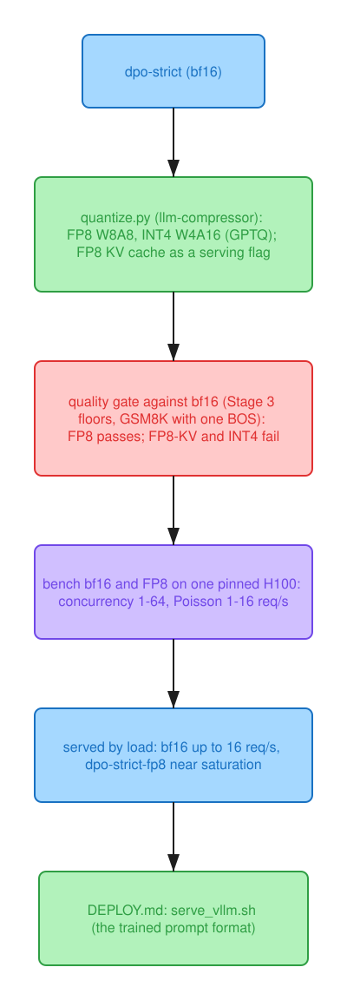

# Stage 6: serving

Colours: blue, checkpoints; orange, data; green, steps; purple, measurements; red, the rules
and gates that decided; gray, external models, controls and ablations.

`stage5-final` = `dpo-strict`, served by vLLM 0.29 on one H100 80GB HBM3 in three precisions, with
a quality gate registered before any quantized checkpoint existed (`notes/decisions.md`,
2026-10-09). The deployment reference, with the serve commands, the request contract and the
memory budget, is [`DEPLOY.md`](../DEPLOY.md).

- **FP8 (W8A8) passes the gate; FP8 with an FP8 KV cache and INT4 (W4A16, GPTQ) don't.**
  - **FP8:** every gated line sits inside its Stage 3 floor. The answer-token log-probability
    doesn't move (+0.000 / −0.007 nats), GSM8K −0.2, perplexity +0.33%.
  - **FP8 + FP8 KV:** fails on one line, strict closed-book on the seen half (−4.2 against a
    3.5-pt floor: 7 items of 167), with its log-probabilities well inside.
  - **INT4:** fails broadly, not only on identifiers as expected. Answer-token log-probability
    −0.42 / −0.31 nats (about twice the floor), GSM8K −6.1, identifiers −7.8.
  - **Served by load** ([`DEPLOY.md`](../DEPLOY.md); user decision after the open-loop read):
    - **bf16 up to the measured 16 req/s of open arrivals:** faster first token (21-40 against
      39-76 ms p50), and at 16 req/s E2EL p99 1,298 against 1,399 ms and goodput 98.8% against
      95.6%.
    - **FP8 near saturation or when the KV cache binds.**
    - **Unmeasured:** where between 16 req/s and saturation the crossover lies.
- **What FP8 buys on one H100:**
  - Decode at one request is 32% faster: 6.90 → 4.70 ms per token, both above the bandwidth floor
    (4.75 / 2.5 ms).
  - At 64 concurrent requests: 22% more requests per second and 40% lower ITL.
  - At 32 concurrent requests, where both serve the most requests inside the SLO (TTFT ≤ 500 ms,
    TPOT ≤ 25 ms), goodput is 12% higher (31.5 vs 28.1 req/s).
- **What FP8 costs, which the sources didn't predict:** time to first token roughly doubles at low
  load (17.9 → 35.2 ms p50 at one request).
  - It is a near-constant 10-20 ms per request whatever the prompt length: the signature of a
    per-request cost in the prefill path, not of bandwidth.
  - **Hypothesis, untested:** the dynamic per-token activation quantization adds kernels that cost
    the same for short and long prompts.
  - **Ruled out:** the slow GEMM paths vLLM's FP8 docs name, since DeepGEMM isn't importable in the
    image and vLLM already selected the CUTLASS kernel.
  - It vanishes into queueing by 64 requests.
- **Two of the stage's predictions failed:**
  - **Prefix caching was predicted to cut grounded TTFT by half or more.** A retrieval deployment
    that reuses one context across 4 questions raised the hit rate from 6% to 75% but cut FP8's
    grounded TTFT by 29% (p50, 8 concurrent requests).
    - Only the part of TTFT that grows with the prompt can be cached. At one request that part is
      62% of grounded TTFT on bf16 (28.7 of 46.1 ms) but 40% on FP8 (22.4 of 56.6 ms).
    - The rest is a fixed per-request cost (scheduling, the first decode step, and FP8's extra
      prefill time above), which the cache can't touch. The question suffix and queueing at 8
      requests take the measured gain under FP8's 40% ceiling.
    - On bf16 the prediction was within reach; it was measured on FP8.
  - **INT4 was predicted to lose a point or two on identifiers.** It failed broadly (GSM8K −6.1,
    answer-token log-probability about twice the floor).
    - **Hypothesis:** GPTQ was calibrated on 512 domain records only, a narrow distribution for a
      4-bit model, and general reasoning paid for it.
- **Cost:**
  - At their goodput maximum (32 concurrent requests), one H100 costs $0.035 per 1,000 requests
    with FP8 and $0.039 with bf16, against $0.127 for the same tokens through Mistral Small 4's
    API.
  - The GPU is cheaper only above 8.7 sustained requests/s; Small 4 self-hosted needs at least four
    H100s.
  - The tuned 8B's case is the customer's facts on one GPU (Stage 3: the CPT arm against the base
    arm). On general capability, Small 4 (119B MoE) is the likelier winner; that isn't measured
    here.
- **Not measured:** the FP8-KV, INT4 and speculative-decoding bench rows and FP8-KV's GSM8K line.
  Modal stopped the workspace at its spend limit mid-run (`notes/decisions.md`, Stage 6 outcome).
- **The served path is the trained one:** the prompt ids from `/v1/chat/completions` equal the
  trainer's in every variant (one BOS, no system prompt, answers ending on `</s>`).
  - Greedy serving isn't bit-reproducible across server starts on different hosts: one of 20 smoke
    items diverged at a 0.125-nat near-tie in one start and was identical in the other.
  - Also found on the way: the frozen lm-eval flags have sent no BOS since Stage 0 (deltas
    unaffected).

Up to 16 requests/s of Poisson arrivals neither variant saturates (throughput follows the offered
load; the concurrency sweep saturates near 44 req/s for bf16 and 53 for FP8). FP8's slower prefill
shows in the tail: TTFT p99 93 against 57 ms at 1 req/s, 143 against 116 at 16.

<!-- stage6-tables:start -->
## Quality gate (pre-registered): change against bf16, next to the Stage 3 floor

| line | bf16 | FP8 − bf16 | FP8 + FP8 KV − bf16 | INT4 W4A16 − bf16 | floor |
|---|---|---|---|---|---|
| qa_strict unseen | 0.110 | -1.3 | +0.6 | -2.6 | 2.6 pt |
| qa_strict seen | 0.305 | -1.2 | **-4.2** | -3.0 | 3.5 pt |
| gold_lp answer tokens, unseen (nats) | -6.274 | +0.000 | -0.055 | **-0.424** | 0.210 |
| gold_lp answer tokens, seen (nats) | -4.811 | -0.007 | -0.056 | **-0.307** | 0.173 |
| gold_lp end token, unseen (nats) | -0.421 | -0.020 | -0.029 | **+0.059** | 0.048 |
| gold_lp end token, seen (nats) | -0.319 | -0.004 | -0.008 | +0.015 | 0.074 |
| grounded_acc | 0.926 | -1.8 | +0.9 | -2.8 | 2.8 pt |
| cite_valid | 1.000 | +0.0 | +0.0 | +0.0 | 1.85 pt |
| halluc_rate | 0.040 | +1.3 | +2.6 | +0.0 | 3.9 pt |
| false_abstain | 0.000 | +0.0 | +0.0 | +0.0 | 0.9 pt |
| GSM8K (all 1,319, add_bos_token) | 0.809 | -0.2 |  | **-6.1** | 2.2 pt |
| qa_strict identifiers (reported) | 0.188 | -1.6 | -1.6 | **-7.8** | 5 pt |
| answers ending on </s> (eos job) | 1.00 | 1.00 | 1.00 | 1.00 | >= 0.95 |
| vLLM val-slice perplexity (reported) | 6.894 | +0.33% | +0.58% | +3.53% |  |
| **verdict** |  | **ships** | **fails** | **fails** |  |

A variant ships if every gated line is within its floor (bold: beyond it) and the eos job ends >= 95% of answers on </s> (notes/decisions.md, 2026-10-09). The floor is the sft-from-cpt seed gap or the SE, whichever is larger: a cost under it is invisible to every other comparison here, which is what ships means, not that it costs nothing. GSM8K is the gate's own run (all 1,319, 5-shot, add_bos_token=True, bf16 rerun under the same flags), not the table's frozen-flag row.

## Serving memory (vLLM's own accounting at start-up)

| variant | GPU | weights (vLLM, GiB) | KV cache (GiB) | KV cache tokens | 8,192-token sequences: vLLM / Step 0 estimate |
|---|---|---|---|---|---|
| bf16 | NVIDIA H100 80GB HBM3 (driver 610.57.04, vLLM 0.29.0) | 15.94 | 52.75 | 406,688 | 49.6 / 44 |
| FP8 | NVIDIA H100 80GB HBM3 (driver 610.57.04, vLLM 0.29.0) | 9.01 | 60.61 | 467,296 | 57.0 / 50 |
| FP8 + FP8 KV | NVIDIA H100 80GB HBM3 (driver 610.57.04, vLLM 0.29.0) | 9.01 | 60.61 | 934,608 | 114.1 / 100 |

## Latency and throughput vs concurrency (`unique`: 360 eval requests, 60 / 30 / 10)

| variant | concurrency | TTFT p50 / p99 (ms) | ITL p50 / p99 (ms) | E2EL p50 / p99 (ms) | req/s | output tok/s | goodput share | run pair spread |
|---|---|---|---|---|---|---|---|---|
| bf16 | 1 | 17.9 / 54.0 | 6.90 / 7.80 | 71 / 964 | 4.78 | 130 | 100% | 0% |
| bf16 | 8 | 44.9 / 224.1 | 7.83 / 36.74 | 111 / 1,512 | 23.88 | 655 | 100% | 1% |
| bf16 | 32 | 87.9 / 638.4 | 10.90 / 88.83 | 286 / 3,058 | 40.28 | 1,096 | 70% | 0% |
| bf16 | 64 | 213.4 / 952.5 | 17.54 / 197.57 | 635 / 5,411 | 43.67 | 1,189 | 24% | 0% |
| FP8 | 1 | 35.2 / 59.9 | 4.70 / 5.63 | 71 / 804 | 5.94 | 164 | 100% | 0% |
| FP8 | 8 | 79.8 / 214.6 | 5.30 / 49.55 | 149 / 1,688 | 21.20 | 580 | 99% | 2% |
| FP8 | 32 | 128.3 / 478.6 | 7.66 / 59.36 | 290 / 3,172 | 40.75 | 1,117 | 77% | 4% |
| FP8 | 64 | 222.5 / 717.2 | 10.53 / 127.30 | 575 / 4,434 | 53.08 | 1,461 | 30% | 1% |

Means of two runs per config, prefix cache reset before each; goodput share = requests with TTFT <= 500 ms and TPOT <= 25 ms. ITL at concurrency 1 under the decode floor (weight bytes / 3.35 TB/s: bf16 4.75, FP8 2.5, INT4 1.5 ms) would mean the run wasn't on an H100.

## Latency under load (Poisson arrivals, `unique`)

| variant | offered req/s | achieved req/s | TTFT p50 / p99 (ms) | E2EL p99 (ms) | goodput share |
|---|---|---|---|---|---|
| bf16 | 1 | 1.00 | 21.1 / 57.3 | 1,028 | 100% |
| bf16 | 4 | 4.00 | 25.7 / 67.8 | 1,031 | 100% |
| bf16 | 16 | 15.42 | 40.1 / 116.4 | 1,298 | 99% |
| FP8 | 1 | 1.00 | 39.0 / 92.9 | 857 | 100% |
| FP8 | 4 | 4.00 | 55.7 / 107.9 | 795 | 100% |
| FP8 | 16 | 15.65 | 75.8 / 143.3 | 1,399 | 96% |

## Prefix caching: shared retrieval context (FP8, concurrency 8)

| run | TTFT p50 (ms) | TTFT p99 (ms) | prefix-cache hit rate | E2EL p50 (ms) |
|---|---|---|---|---|
| grounded, passages as evaluated (none shared) | 62.4 | 257.4 | 6% | 633 |
| grounded, 4 questions per shared context (rag) | 44.6 | 256.4 | 75% | 523 |

Same 108 questions in the same order; rag prompts are ~9% longer (gold passages run long), which counts against rag. TTFT is the comparison; output lengths differ.

## Cost

| variant | gate | best concurrency | goodput (req/s) | $ / 1k requests (1 H100) | API $ / 1k requests (Small 4 prices) | break-even sustained req/s |
|---|---|---|---|---|---|---|
| bf16 | reference | 32 | 28.1 | 0.0390 | 0.1266 | 8.7 |
| FP8 | ships | 32 | 31.5 | 0.0348 | 0.1267 | 8.7 |

One H100 at $3.95/h (Modal's H100 SXM5 list price, $0.001097/s, checked 2026-10-09); Small 4's API at $0.15 / $0.6 per million input / output tokens and its self-hosting minimum of 4 H100s ($15.80/h before any request), both from Mistral's Small 4 announcement. Tokens per request are the bench mix's measured means. The break-even is the sustained load above which the GPU is cheaper than the API; below it, an idle GPU costs the same per hour.
<!-- stage6-tables:end -->

## Stages 2-5: latency columns (single samples, GPU not recorded)

These rows came from `serve/bench_latency.py` (64 streamed requests per concurrency level, 256
output tokens max), one sample each. The GPU wasn't recorded, and Modal may run an "H100" request
on an H200, so they support one claim only: SFT fixed stopping (1,753 ms to ~150 ms end to end is
not a bandwidth effect). Stage 6's tables above are the serving numbers.
- **Paths:** `base-8b` and `instruct-8b` run Mistral's native vLLM path. The rest run the HF path
  with the YaRN fix.
- **New columns from Stage 3:** stop before cap and mean output tokens, at one request.
- **Prompts:** the SFT rows' prompt sample differs slightly from earlier rows'. Prompts are drawn
  from the eval tasks, which lost three items in v3.

<!-- serving-table:start -->
| run | TTFT p50 (ms) | ITL p50 (ms) | E2E p50 (ms) | stop before cap | mean output tokens | tok/s @1 | tok/s @8 | tok/s @32 |
|---|---|---|---|---|---|---|---|---|
| base-8b | 17.7 | 6.6 | 187 |  |  | 143 | 875 | 1,922 |
| instruct-8b | 17.7 | 6.6 | 320 |  |  | 139 | 677 | 1,144 |
| base-8b-hf | 15.3 | 6.6 | 180 |  |  | 145 | 896 | 1,967 |
| cpt-8b | 16.5 | 6.9 | 1,753 |  |  | 141 | 922 | 2,166 |
| sft-from-cpt | 17.8 | 6.8 | 159 | 100% | 23 | 122 | 297 | 783 |
| sft-from-base | 18.4 | 6.8 | 154 | 100% | 24 | 127 | 509 | 829 |
| sft-from-cpt-seed1 | 16.2 | 6.9 | 153 | 100% | 24 | 127 | 563 | 788 |
| sft-from-base-seed1 | 17.6 | 6.8 | 147 | 100% | 23 | 126 | 558 | 816 |
| dpo | 17.3 | 6.8 | 140 | 100% | 22 | 125 | 496 | 784 |
<!-- serving-table:end -->

- **The one claim these rows support: SFT fixed stopping.** `cpt-8b` runs every request to the
  256-token cap, where the base stops after ~28 tokens, hence its 1,753 ms end to end.
  - **Cause:** the corpus holds one EOS per whole manual, 234 in 19.4M tokens. Section-level units
    would likely have avoided it (item 6 of
    [What I would do differently](stage2.md#what-i-would-do-differently)).
  - **Fix, confirmed by Stage 3:** after SFT every request stops before the cap (mean 23 output
    tokens), and end to end at one request is ~150 ms against 1,753 ms. A tenfold change in tokens
    generated is not a hardware effect, whatever GPU ran the rows.
- **Not read from these rows any more:** path parity, throughput differences between checkpoints,
  and single cells (the 297 tok/s one). Each is one unrecorded-GPU sample.

## What I'd do next

**From Stage 6:**
1. **Measure the crossover:** open-loop 24 and 32 req/s for bf16 and FP8, where the default
   switches from one to the other.
2. **Locate FP8's per-request prefill cost** (+10-20 ms at low load): one closed-book request on
   bf16 and FP8 under vLLM's torch profiler, and FP8 with `--enforce-eager`, three server starts at
   concurrency 1. The docs' FP8 switches (`VLLM_USE_DEEP_GEMM=0`, the CUTLASS backend) are already
   the state of these runs.
3. **INT4 again, calibrated wider:** domain records mixed with the general replay slice, or AWQ,
   through the same gate.
4. **A TTFT breakdown before promising cache gains:** the fixed and prompt-length parts per variant
   (as above) set the ceiling a prefix cache can reach.
5. **Log per-item GSM8K outcomes**, so a comparison like BOS on and off (1,067 of 1,319 both
   ways) can be read paired.
